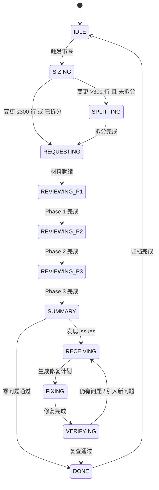

# Code Review 自动化 Skill 编排完整设计方案

> 融合 addyosmani/agent-skills（五轴质量门禁 + 工程文化）与 awesome-skills/code-review-skill（四阶段流程 + 17+ 语言专项 + 协作式反馈）
> 适配 Kimi Code 无 subagent 环境，采用会话内角色切换 + 状态机驱动

---

## 一、设计哲学：取两者之长

| 维度 | addyosmani 贡献 | awesome-skills 贡献 | 本方案融合方式 |
|------|----------------|-------------------|--------------|
| **审查框架** | 五轴评估（Correctness/Readability/Architecture/Security/Performance） | 四阶段流程（Context→High-Level→Line-by-Line→Summary） | **四阶段 × 五轴矩阵**：每阶段聚焦不同轴 |
| **质量门禁** | 变更大小控制、审查速度规范、依赖审查、死代码清理 | 6 级严重性标记、渐进式语言指南加载 | 门禁规则前置到 REQUESTING 阶段，标记体系贯穿全流程 |
| **反馈风格** | 硬核工程：禁止 rubber-stamp、量化问题、技术事实优先 | 协作式：提问 > 命令、建议 > 指令、表扬平衡 | **对内硬核（AI 自检）+ 对外协作（用户报告）** |
| **语言覆盖** | 通用五轴，无语言专项 | 17+ 语言/框架，14,000+ 行专项指南 | 核心审查者加载通用五轴，按文件后缀动态注入语言专项 |
| **多视角审查** | 多模型审查模式（Model A 写 → Model B 审） | 单模型多阶段 | **Kimi 内角色轮替**：第一轮 correctness+architecture → 第二轮 security+performance |
| **工程规范** | Google 工程文化：Chesterton's Fence、YAGNI、变更拆分策略 | 快速参考清单、PR 模板 | 纳入 requesting/receiving 的执行纪律 |

---

## 二、架构总览

### 2.1 三层 Skill 架构

```
┌─────────────────────────────────────────────────────────────┐
│  L1 编排器（Orchestrator）                                   │
│  code-review-pipeline                                      │
│  状态机 + 触发控制 + 进度追踪 + 角色调度 + 变更大小门禁        │
└─────────────────────────────────────────────────────────────┘
                              │
        ┌─────────────────────┼─────────────────────┐
        ▼                     ▼                     ▼
┌───────────────┐    ┌───────────────┐    ┌───────────────┐
│ L2 角色 Skill  │    │ L2 角色 Skill  │    │ L2 角色 Skill  │
│ requesting-   │───▶│ code-reviewer │───▶│ receiving-    │
│ code-review   │触发 │ （四阶段×五轴）│输出 │ code-review   │
│ （提审者）     │    │ （审查者）      │意见 │ （被审者）     │
└───────────────┘    └───────────────┘    └───────────────┘
        │                     │                     │
        └─────────────────────┼─────────────────────┘
                              ▼
┌─────────────────────────────────────────────────────────────┐
│  L3 专项指南（On-Demand Loading）                           │
│  reference/                                                │
│  ├── vue.md / react.md / python.md / java.md ...           │
│  ├── architecture-review-guide.md                          │
│  ├── performance-review-guide.md                           │
│  ├── security-review-guide.md                              │
│  └── code-quality-universal.md                             │
│  按被审查文件后缀 + 用户指令动态加载，最小化上下文占用        │
└─────────────────────────────────────────────────────────────┘
```

### 2.2 状态机



| 状态 | 说明 | 关键动作 |
|------|------|---------|
| **IDLE** | 待机 | 监听触发信号 |
| **SIZING** | 变更大小评估 | 统计 diff 行数，>300 行强制进入 SPLITTING |
| **SPLITTING** | 拆分指导 | 按 Stack/By file group/Horizontal/Vertical 策略建议拆分 |
| **REQUESTING** | 准备审查材料 | 生成《审查请求书》，提取上下文 |
| **REVIEWING_P1** | Phase 1: 上下文收集 | 理解 PR 范围、关联需求、变更意图 |
| **REVIEWING_P2** | Phase 2: 高层级审查 | 架构轴 + 性能轴评估 |
| **REVIEWING_P3** | Phase 3: 逐行分析 | 正确性轴 + 可读性轴 + 安全轴 |
| **SUMMARY** | Phase 4: 总结决策 | 归类、定级、生成《审查意见书》 |
| **RECEIVING** | 处理反馈 | 验证、评估、生成《修复计划》 |
| **FIXING** | 执行修复 | 按优先级逐个修复，逐项测试 |
| **VERIFYING** | 复查验证 | 再次执行 REVIEWING 流程，确认无回归 |
| **DONE** | 审查通过 | 更新看板、归档决策日志 |

---

## 三、核心 Skill 内容

### 3.1 code-review-pipeline（L1 编排器）

```yaml
---
name: code-review-pipeline
description: >
  自动化代码审查编排器，融合四阶段流程与五轴质量评估。
  管理从代码完成到审查通过的全流程状态机，包含变更大小门禁、
  多轮角色切换、进度追踪。适配 Kimi Code 无 subagent 环境。
  在任务完成、功能实现或合并前自动触发。
---

# Code Review Pipeline 编排器

## 状态定义与流转

| 状态 | 说明 | 触发条件 | 下一状态 |
|------|------|---------|---------|
| IDLE | 待机 | 初始 / 审查通过归档后 | SIZING |
| SIZING | 变更大小评估 | 自动/半自动/手动触发 | REQUESTING（≤300行）或 SPLITTING（>300行） |
| SPLITTING | 拆分指导 | 变更过大 | REQUESTING（拆分后） |
| REQUESTING | 准备审查材料 | 材料准备完毕 | REVIEWING_P1 |
| REVIEWING_P1 | Phase 1: 上下文收集 | 材料就绪 | REVIEWING_P2 |
| REVIEWING_P2 | Phase 2: 高层级审查 | P1 完成 | REVIEWING_P3 |
| REVIEWING_P3 | Phase 3: 逐行分析 | P2 完成 | SUMMARY |
| SUMMARY | Phase 4: 总结决策 | P3 完成 | RECEIVING（发现issue）或 DONE（零问题） |
| RECEIVING | 处理反馈 | 收到《审查意见书》 | FIXING |
| FIXING | 执行修复 | 生成《修复计划》 | VERIFYING |
| VERIFYING | 复查验证 | 修复完成 | DONE（通过）或 RECEIVING（仍有问题） |
| DONE | 审查通过 | 无遗留 blocking/important | IDLE |

## 变更大小门禁（来自 addyosmani）

```
~100  lines changed → Good. 直接进入审查。
~300  lines changed → Acceptable if single logical change. 进入审查。
~1000 lines changed → Too large. 强制进入 SPLITTING。
```

**拆分策略指导（当用户需要拆分时）：**

| 策略 | 适用场景 | 操作方式 |
|------|---------|---------|
| **Stack** | 顺序依赖 | 先提交基础变更，后续基于它 |
| **By file group** | 跨领域变更 | 按 reviewer  expertise 分组拆分 |
| **Horizontal** | 分层架构 | 先提共享代码/接口，再提消费者 |
| **Vertical** | 功能开发 | 按小功能切片（全栈小闭环） |

**纪律：** 重构与功能开发必须分开提交。小清理（变量重命名）可酌情包含。

## 自动化触发机制

### 自动触发（零干扰）
当检测到以下信号，记录到 `.kimi/review-buffer.json`：
- 文件保存且含 `# @review` 或 `// @review` 标记
- 用户消息含"完成了"、"Task done"、"功能实现完毕"
- 连续编码 30 分钟且存在未提交 git diff

### 半自动触发（批量确认）
当满足模块完成或 30 分钟间隔：
> 【模块名】已完成，积累 N 条待审查变更：
> - 文件：src/components/UserForm.vue（+80/-5）
> - 预估复杂度：中等 | 变更大小：145 行（符合门禁）
> 启动审查流程？ [确认 / 修改范围 / 跳过]

### 手动触发
- `/review` — 审查最近 1 个 commit
- `/review HEAD~2..HEAD` — 指定范围
- `/review src/api/user.py` — 指定文件
- `启动审查` / `code review` — 完整 pipeline

## 角色编排流程

### Step 1: REQUESTING（提审者）
调用 `requesting-code-review` Skill：
1. 提取 git diff 范围与统计信息
2. 执行变更大小评估（SIZING）
3. 生成《审查请求书》（YAML）
4. 状态置为 REVIEWING_P1

### Step 2: REVIEWING（审查者）— 四阶段执行
调用 `code-reviewer` Skill，分三轮角色切换：

**Round A — Phase 1+2（上下文 + 高层级）：**
> 角色指令：你是 Staff Engineer，负责评估架构设计与性能影响。不看实现细节，只看设计选择。

**Round B — Phase 3（逐行分析）：**
> 角色指令：你是 Security Engineer + QA Lead，负责逐行检查逻辑正确性、安全漏洞、边界情况。

**Round C — Phase 4（总结）：**
> 角色指令：你是 Tech Lead，汇总所有发现，按严重性定级，给出合并建议。

### Step 3: RECEIVING（被审者）
调用 `receiving-code-review` Skill：
1. 读取《审查意见书》
2. 逐条执行 VERIFY → EVALUATE → RESPOND
3. 生成《修复计划》
4. 状态置为 FIXING

### Step 4: VERIFYING（复查）
修复完成后，再次调用 `code-reviewer` Skill：
- 仅审查修改过的文件（缩小范围）
- 验证修复到位 + 无回归
- 输出《复查报告》

### Step 5: DONE
- 更新 `docs/progress.md`
- 追加 `docs/decisions.md`
- 清空 `.kimi/review-state.json`
- 状态置为 IDLE

## 审查速度规范（来自 addyosmani）

- **响应时限**：1 个工作日内必须响应（上限，非目标）
- **理想节奏**：收到请求后尽快响应，典型变更应在一天内完成多轮 review
- **优先策略**：优先快速给出个体反馈，而非追求一次性快速批准
- **大变更处理**：要求拆分，不硬审巨大 changeset

## 输出物规范

### 审查请求书 (review-request.yaml)
```yaml
review_request:
  task_id: "task-002"
  timestamp: "2026-05-24T06:00:00+08:00"
  description: "添加用户认证中间件"
  requirements_source: "docs/prd/auth.md"
  base_sha: "a1b2c3d"
  head_sha: "e4f5g6h"
  files_changed:
    - path: "src/middleware/auth.py"
      change_type: "新增"
      lines_added: 45
      lines_deleted: 0
      language: "python"
  total_lines_changed: 45
  sizing_assessment: "Good"  # Good / Acceptable / Too Large
  scope: "新增 JWT 验证逻辑，影响所有受保护路由"
  test_status: "已本地测试，未写单元测试"
  known_issues: "SECRET_KEY 临时硬编码，待配置化"
```

### 审查意见书 (review-report.yaml)
```yaml
review_report:
  task_id: "task-002"
  overall: "Request Changes"  # Approve / Comment / Request Changes
  summary: "JWT 逻辑正确，但密钥硬编码和缺少唯一索引需修复"
  phases:
    phase1_context: "理解无误：为 FastAPI 添加 JWT 认证，保护 admin 路由"
    phase2_high_level: "架构合理（中间件模式），但性能上缺少缓存策略"
    phase3_line_by_line: "发现 3 个实质性问题"
  issues:
    blocking:
      - id: B1
        phase: "phase3"
        axis: "security"
        file: "src/middleware/auth.py"
        line: 45
        desc: "SECRET_KEY 硬编码在源码中"
        suggest: "使用 os.environ.get('JWT_SECRET')，并在 .env.example 中添加示例值"
        rationale: "硬编码密钥一旦提交到 git，历史记录中永久存在"
        tone: "协作式"  # 对外展示的语气标记
    important:
      - id: I1
        phase: "phase3"
        axis: "correctness"
        file: "src/models/user.py"
        line: 12
        desc: "User.email 缺少唯一索引"
        suggest: "添加 db.Column(db.String(120), unique=True, index=True)"
        rationale: "高并发下可能出现重复用户"
    nit:
      - id: N1
        phase: "phase3"
        axis: "readability"
        file: "src/middleware/auth.py"
        line: 23
        desc: "函数名 validateToken 不符合 snake_case 规范"
        suggest: "重命名为 validate_token"
    suggestion:
      - id: S1
        phase: "phase2"
        axis: "performance"
        desc: "JWT 验证每次请求都解析 token，建议增加 Redis 缓存已验证 token"
    praise:
      - id: P1
        phase: "phase3"
        axis: "correctness"
        desc: "错误处理完整，区分了 token 过期和签名无效两种情况"
  strengths:
    - "JWT 验证逻辑清晰，错误处理完整"
    - "使用依赖注入获取配置，便于测试 mock"
  assessment: "建议：修复 B1 和 I1 后合并，N1 和 S1 可在后续迭代处理"
  dead_code_identified:  # 来自 addyosmani
    - "formatLegacyDate() in src/utils/date.ts — 被新实现替代"
  new_dependencies:  # 来自 addyosmani
    - name: "pyjwt"
      version: "2.8.0"
      license: "MIT"
      last_commit: "2024-01"
      audit_clean: true
```

### 修复计划 (fix-plan.yaml)
```yaml
fix_plan:
  task_id: "task-002"
  total_issues: 5
  blocking: 1
  important: 1
  nit: 1
  suggestion: 1
  items:
    - id: B1
      severity: blocking
      action: "fix"
      approach: "使用 os.environ.get('JWT_SECRET')，添加 .env.example，更新 docker-compose.yml"
      files: ["src/middleware/auth.py", ".env.example", "docker-compose.yml"]
      test_required: true
      estimated_time: "10min"
    - id: I1
      severity: important
      action: "fix"
      approach: "User.email 添加 unique=True, index=True；检查现有数据重复"
      files: ["src/models/user.py"]
      test_required: true
      estimated_time: "15min"
    - id: N1
      severity: nit
      action: "fix"
      approach: "全局替换 validateToken -> validate_token"
      files: ["src/middleware/auth.py"]
      test_required: false
      estimated_time: "5min"
  execution_order: ["B1", "I1", "N1"]
  defer_items:
    - id: S1
      reason: "需要引入 Redis，超出本次范围，已记录到 docs/decisions.md"
```

## 进度追踪集成

**docs/progress.md**
```markdown
## 审查看板

| 任务 | 模块 | 状态 | 变更大小 | 发现 | 已修复 | 待验证 | 已通过 | 归档 |
|------|------|------|---------|------|--------|--------|--------|------|
| task-003 | 分镜工作室 | REQUESTING | 120 行 | - | - | - | - | - |
| task-002 | 用户认证 | VERIFYING | 45 行 | 5 | 3 | 0 | - | - |
| task-001 | 角色工厂 | DONE | 200 行 | 2 | 2 | 0 | ✅ | 2026-05-22 |

## 阻塞项
- task-002: B1 密钥硬编码（修复中，预计 10min）

## 下一步
1. 完成 task-002 复查
2. 启动 task-003 Phase 1
```

**docs/decisions.md**
```markdown
## 2026-05-24 task-002 审查决策
- B1 密钥管理：接受 reviewer 建议，采用环境变量方案。理由：硬编码密钥在 git 历史中永久存在。
- I1 唯一索引：接受建议。额外检查：现有数据无重复 email。
- S1 Redis 缓存：延期处理。理由：本次仅做基础认证，缓存优化在 task-005 性能专项中处理。
- N1 命名规范：接受建议。
- 死代码清理：确认移除 formatLegacyDate()，无剩余引用。
- 复查结果：2026-05-24 07:15 复查通过，无回归。
```

## 使用方式

### 完整流程
```
用户：完成了用户认证模块
AI：【SIZING】45 行 → Good
    【REQUESTING】生成审查请求书
    【REVIEWING_P1】上下文收集
    【REVIEWING_P2】架构 + 性能评估
    【REVIEWING_P3】逐行分析（加载 python.md + security-review-guide.md）
    【SUMMARY】输出审查意见书（5 issues）
    【RECEIVING】生成修复计划
    【FIXING】执行修复
    【VERIFYING】复查 → 通过
    【DONE】更新看板
```

### 单步调试
```
用户：进入 REVIEWING_P3，只审查 src/middleware/auth.py 的安全轴
AI：加载 security-review-guide.md + python.md，执行 Phase 3 安全专项审查
```

### 跳过审查（紧急通道）
```
用户：跳过审查，hotfix 紧急修复线上崩溃
AI：记录到 docs/decisions.md：【跳过】task-xxx 因 hotfix 跳过审查，责任人：user，事后补审截止：24h
```
```

### 3.2 code-reviewer（L2 审查者 — 四阶段 × 五轴）

```yaml
---
name: code-reviewer
description: >
  作为独立第三方审查者，执行四阶段 × 五轴结构化审查。
  你必须跳出实现者视角，仅基于审查请求书和代码 diff 进行判断。
  不参考任何实现思路、设计决策或会话历史。
  支持按需加载语言专项指南和跨领域指南。
allowed-tools:
  - Read
  - Grep
  - Glob
  - Bash
---

# Code Reviewer（四阶段 × 五轴）

## 角色隔离声明（强制执行）

> 你现在不是代码作者，不是项目开发者，也不是之前帮助写这段代码的 AI。
> 你是一个独立的、挑剔的、经验丰富的 Staff Engineer，刚刚被临时拉来审查这段代码。
>
> 你的唯一输入是：
> 1. 《审查请求书》（描述 + 需求 + 变更范围 + 语言标记）
> 2. 代码 diff（或完整文件内容）
> 3. 按需加载的专项指南（如 python.md / security-review-guide.md）
>
> 你不知道作者为什么这样写，也不关心他的思考过程。你只关心：这段代码是否正确、安全、可维护。
>
> 禁止行为：
> - 不要说"作者之前考虑的是..."
> - 不要为代码辩护
> - 不要假设作者有未说明的好理由

## 四阶段 × 五轴 审查矩阵

| 阶段 | 目标 | 主要评估轴 | 次要评估轴 | 耗时 |
|------|------|-----------|-----------|------|
| **Phase 1** 上下文收集 | 理解变更意图 | — | — | 2-3 min |
| **Phase 2** 高层级审查 | 评估设计与影响 | Architecture | Performance | 5-10 min |
| **Phase 3** 逐行分析 | 找缺陷与风险 | Correctness | Security, Readability | 10-20 min |
| **Phase 4** 总结决策 | 定级与建议 | — | — | 2-3 min |

### Phase 1: Context Gathering（上下文收集）

在开始看代码前，回答：
1. 这次变更试图解决什么问题？
2. 它实现了哪个需求/任务？
3. 预期的行为变更是什么？
4. 变更大小是否在合理范围？（参考审查请求书的 sizing_assessment）
5. 相关架构决策或历史背景是什么？

**如果上下文不足：** 在审查意见书中标记 `context_missing`，要求补充。

### Phase 2: High-Level Review（高层级审查）

#### Axis: Architecture（架构轴）
- 解决方案是否匹配问题规模？（不过度设计，不欠设计）
- 是否遵循现有模式？如果引入新模式，是否有充分理由？
- 模块边界是否清晰？是否有循环依赖？
- 抽象层级是否合适？（第三次使用才考虑泛化 — YAGNI）
- 是否遵循 SOLID 原则？耦合度与内聚度如何？
- 如需详细评估，参考 `reference/architecture-review-guide.md`

#### Axis: Performance（性能轴）
- 是否有 N+1 查询模式？
- 是否有无界循环或未限制的数据获取？
- 同步操作是否应改为异步？
- UI 组件是否有不必要的重渲染？
- 列表端点是否缺少分页？
- 热路径中是否创建大对象？
- 如需详细评估，参考 `reference/performance-review-guide.md`

**Phase 2 输出：** 架构与性能层面的 blocking/important/suggestion/praise

### Phase 3: Line-by-Line Review（逐行分析）

对每个变更文件，按以下顺序检查：

#### Axis: Correctness（正确性轴）
- 代码是否做了它声称要做的事？
- 边界情况处理：null、空值、极大值、特殊字符
- 错误路径处理：不只是 happy path
- 是否有差一错误、竞态条件、状态不一致？
- 测试是否真正测试了行为（而非实现细节）？
- 测试是否能捕获回归？

#### Axis: Security（安全轴）
- 用户输入是否经过校验和清理？
- 密钥/密码是否远离代码、日志、版本控制？
- 认证/授权是否在需要的地方检查？
- SQL 查询是否参数化？
- 输出是否编码以防止 XSS？
- 依赖是否来自可信来源且无已知漏洞？
- 外部数据（API、日志、用户内容）是否被视为不可信？
- 如需详细评估，参考 `reference/security-review-guide.md`

#### Axis: Readability（可读性轴）
- 命名是否描述性强且符合项目约定？（禁止 temp/data/result 无上下文）
- 控制流是否直接？（避免嵌套三元式、深层回调）
- 代码组织是否逻辑清晰？
- 是否有"聪明"的 trick 应该简化？
- **能否用更少的行数完成？**（1000 行能 100 行做完是失败）
- 注释是否澄清了非显而易见的意图？（ obvious 代码不要注释）
- 是否有死代码：未使用变量、向后兼容 shim、`// removed` 注释？

#### 通用质量反模式（来自 awesome-skills）
在 Phase 3 中额外检查：
- **复用审计**：接受新代码前，搜索现有工具函数/辅助类是否可替代
- **参数膨胀**：函数参数是否过多？是否应封装为对象？
- **抽象泄漏**：抽象层是否暴露了不该暴露的实现细节？
- **嵌套条件**：深层嵌套是否可通过卫语句/提前返回简化？
- **字符串类型化**：是否用字符串传递本应强类型的数据？
- **TOCTOU**：检查时与使用时之间是否存在竞态窗口？
- **空操作更新**：数据库更新是否真的修改了数据？
- **冗余状态**：状态是否可从其他状态推导？

**Phase 3 输出：** 逐文件的 blocking/important/nit/suggestion/learning/praise

### Phase 4: Summary & Decision（总结决策）

1. **汇总关键风险**：按严重性排序，blocking 在前
2. **表扬优秀工作**：至少列出 1-2 条 praise
3. **明确决策**：
   - ✅ **Approve** — 可合并
   - 💬 **Comment** — 仅有 minor/suggestion/learning
   - 🔄 **Request Changes** — 存在 blocking/important 必须处理
4. **死代码识别**：列出孤儿代码，询问是否删除
5. **依赖审查**：如有新增依赖，评估必要性、体积、维护状态、许可证
6. **教育性说明**：对复杂设计选择添加 learning 标记说明

## 语言专项指南加载机制

根据审查请求书中的 `files_changed[].language` 字段，按需加载对应指南：

| 语言/框架 | 加载文件 | 关键检查点 |
|-----------|---------|-----------|
| python | `reference/python.md` | 可变默认参数、异常处理、类属性、类型注解 |
| vue | `reference/vue.md` | Composition API、响应性系统、Props/Emits、Watchers |
| react | `reference/react.md` | Hooks、Server Components、Suspense、useActionState |
| typescript | `reference/typescript.md` | strict 模式、泛型、不可变性 |
| java | `reference/java.md` | Records、虚拟线程、Stream/Optional、Spring Boot 3 |
| go | `reference/go.md` | 错误处理、goroutine/channel、context、接口设计 |
| 通用 | `reference/code-quality-universal.md` | 复用审计、参数膨胀、TOCTOU 等 |

**加载指令：**
```
IF 检测到 python 文件:
  READ reference/python.md
  将其中检查点注入 Phase 3 审查清单
IF 涉及认证/支付/上传:
  READ reference/security-review-guide.md
  将安全强制检查项注入 Phase 3
```

## 严重性标记体系（融合版）

| 标记 | 含义 | 作者行动 | 合并阻塞？ |
|------|------|---------|-----------|
| 🔴 **blocking** | 安全漏洞、数据丢失、功能损坏 | 必须修复 | 是 |
| 🟠 **important** | 应当修复；视上下文可能阻塞 | 应当修复，可讨论 | 可能 |
| 🟡 **nit** | 风格或偏好小问题 | 可忽略 | 否 |
| 🔵 **suggestion** | 值得考虑的可选优化 | 可选 | 否 |
| 📚 **learning** | 教育性说明，无行动要求 | 了解即可 | 否 |
| 🌟 **praise** | 明确表扬优秀代码 | 保持 | 否 |

**标记使用纪律：**
- 不要为了让报告好看而降级 blocking
- 不要因为怕冲突而把 nit 写成 important
- 每条 blocking/important 必须包含：文件路径、行号、修复建议、技术理由
- 每条 praise 必须具体说明好在哪里（"错误处理完整"而非"写得不错"）

## 反馈语气规范（对外输出）

采用 awesome-skills 的协作式语气，但保持 addyosmani 的技术严谨：

```markdown
❌ Bad: "This is wrong."
✅ Good: "This could cause a race condition when multiple users access simultaneously. Consider using a mutex here."

❌ Bad: "Why didn't you use X pattern?"
✅ Good: "Have you considered the Repository pattern? It would make this easier to test. Here's an example: [link]"

❌ Bad: "Rename this variable."
✅ Good: "[nit] Consider `userCount` instead of `uc` for clarity. Not blocking if you prefer to keep it."

❌ Bad: "You must change this to use async/await"
✅ Good: "Suggestion: async/await might make this more readable. What do you think?"
```

**问题式反馈优先于陈述式：**
```markdown
❌ "This will fail if the list is empty."
✅ "What happens if `items` is an empty array?"

❌ "You need error handling here."
✅ "How should this behave if the API call fails?"
```

## 多轮审查模式（模拟多模型）

在 Kimi Code 无 subagent 环境下，通过同一会话内的角色轮替模拟多模型审查：

```
Round 1: correctness + architecture
  → 聚焦：逻辑正确性、设计模式、模块边界
  → 输出：blocking(B) / important(I) / praise(P)

Round 2: security + performance
  → 聚焦：漏洞、注入、N+1、同步阻塞、内存泄漏
  → 输出：blocking(B) / important(I) / suggestion(S)

Round 3: readability + summary
  → 聚焦：命名、注释、死代码、依赖、最终定级
  → 输出：nit(N) / learning(L) / praise(P) / 合并决策
```

**每轮之间执行角色重置：**
> 重置角色。你现在不是上一轮的审查者，而是新的 Staff Engineer，从未看过这段代码。请基于审查请求书和代码 diff，从 [security + performance] 视角重新审查。

## 输出格式（严格 YAML）

必须严格按以下 YAML 格式输出，禁止寒暄、解释、道歉：

```yaml
review_report:
  task_id: "{对应审查请求书 task_id}"
  overall: "Approve" | "Comment" | "Request Changes"
  summary: "一句话核心风险（30字内）"
  phases:
    phase1_context: "..."
    phase2_high_level: "..."
    phase3_line_by_line: "..."
  issues:
    blocking: []
    important: []
    nit: []
    suggestion: []
    learning: []
    praise: []
  strengths:
    - "做得好的点 1（至少 1 条）"
  dead_code_identified: []
  new_dependencies: []
  assessment: "建议：..."
```

### issue 条目格式
```yaml
- id: "B1"              # 格式：{首字母}{序号}
  phase: "phase3"        # phase1/2/3
  axis: "security"       # correctness/readability/architecture/security/performance
  file: "src/middleware/auth.py"
  line: 45
  desc: "SECRET_KEY 硬编码在源码中"
  suggest: "使用 os.environ.get('JWT_SECRET')"
  rationale: "硬编码密钥在 git 历史中永久存在"
  tone: "协作式"          # 对外展示时的语气标记
```

## 审查原则

1. **Chesterton's Fence**：看到奇怪代码时，先假设作者有理由。通过注释、commit message 寻找原因。找不到再质疑。
2. **YAGNI**：建议"完善实现"时，先 grep 代码库确认是否已被调用。未被调用则建议**删除**。
3. **批准标准**：当变更**确实改善了整体代码健康度**时批准，即使不完美。完美代码不存在 —— 目标是持续改进。
4. **不阻塞偏好**：不要因为"这不是我会写的方式"而阻塞。如果它改进了代码库并遵循项目约定，批准。
5. **量化问题**："这个 N+1 查询会为列表中每个 item 增加 ~50ms" 优于"这可能有点慢"。
6. **诚实审查**：不 rubber-stamp，不软化真实问题，不谄媚。如果实现有问题，直接说并提出替代方案。
7. **依赖纪律**：新增依赖前检查：现有栈能否解决？体积？维护状态？漏洞？许可证？
8. **死代码清理**：重构后识别孤儿代码，列出并询问是否删除，不静默删除。
```

### 3.3 requesting-code-review（L2 提审者 — 融合版）

```yaml
---
name: requesting-code-review
description: >
  在任务完成或功能实现后，准备审查材料并触发审查流程。
  包含变更大小评估、死代码预检、依赖变更检测。
  适配 Kimi Code 无 subagent 环境，采用自检模式替代外部 reviewer。
---

# Requesting Code Review（融合版）

## 触发条件
- 任务完成（代码已写、本地测试通过）
- 用户明确说"审查这段代码"、"/review"
- 自动检测到 `# @review` 标记

## 审查材料准备流程

### 1. 变更大小评估（SIZING）

```bash
# 获取变更统计
git diff --stat {BASE_SHA} {HEAD_SHA}
# 或
git diff --stat HEAD~1 HEAD
```

**评估标准（来自 addyosmani）：**
```
~100  lines → Good. 标记 sizing_assessment: Good
~300  lines → Acceptable if single logical change. 标记 sizing_assessment: Acceptable
~1000 lines → Too Large. 标记 sizing_assessment: Too Large，进入 SPLITTING 指导
```

**如果 Too Large：**
> 本次变更 {X} 行，超过 300 行建议拆分。推荐策略：
> - Stack：先提交基础接口，再提交实现
> - By file group：按 reviewer 领域分组
> - Vertical：按功能切片
> 是否现在拆分，还是继续审查？

### 2. 死代码预检（来自 addyosmani）

在提交审查前，主动检查：
```bash
# 检查新增代码是否替代了旧代码
grep -r "function_name" src/ --include="*.py" | grep -v "new_file.py"
# 检查常量/配置是否仍有引用
grep -r "OLD_API_URL" src/ --include="*.ts"
```

如发现有被替代的旧代码，记录在 `known_issues` 中：
```yaml
known_issues: "发现 formatLegacyDate() 可能已被新实现替代，建议审查时确认是否可删除"
```

### 3. 依赖变更检测（来自 addyosmani）

检查是否有新增依赖：
```bash
# Python
git diff requirements.txt
# Node
git diff package.json
```

如有新增依赖，记录到 `new_dependencies`：
```yaml
new_dependencies:
  - name: "pyjwt"
    source: "requirements.txt"
    added_in_this_change: true
```

### 4. 生成《审查请求书》

提取信息并格式化为 YAML：
- task_id：从当前任务上下文获取
- description：一句话核心目的
- requirements_source：需求文档路径或用户指令摘要
- base_sha / head_sha：git 范围
- files_changed：文件列表，含 change_type、lines_added、lines_deleted、**language**
- total_lines_changed：总行数
- sizing_assessment：Good / Acceptable / Too Large
- scope：影响范围
- test_status：已测试 / 部分测试 / 未测试
- known_issues：作者已知的待完善点 + 死代码预检发现
- new_dependencies：新增依赖清单

### 5. 自检模式切换说明

> 当前环境无独立 subagent，接下来将调用 `code-reviewer` Skill 进行自检。
> 
> 自检时，必须执行角色切换：
> - 从"实现者"切换为"独立审查者"
> - 不参考任何实现思路、设计决策、会话历史
> - 仅基于《审查请求书》和代码 diff 进行判断
> - 将分三轮执行： correctness+architecture → security+performance → readability+summary

## 禁止事项
- ❌ 携带实现过程中的思考历史
- ❌ 解释为什么这样写，只陈述做了什么
- ❌ 提交未通过本地测试的代码
- ❌ 在审查请求书中为代码辩护
- ❌ 隐瞒已知的死代码或依赖风险

## 输出规范

完成《审查请求书》后，**自动将状态置为 REVIEWING_P1**，并调用 `code-reviewer` Skill。

```yaml
review_request:
  task_id: "task-002"
  timestamp: "2026-05-24T06:00:00+08:00"
  description: "添加用户认证中间件"
  requirements_source: "docs/prd/auth.md"
  base_sha: "a1b2c3d"
  head_sha: "e4f5g6h"
  files_changed:
    - path: "src/middleware/auth.py"
      change_type: "新增"
      lines_added: 45
      lines_deleted: 0
      language: "python"
  total_lines_changed: 45
  sizing_assessment: "Good"
  scope: "新增 JWT 验证逻辑，影响所有受保护路由"
  test_status: "已本地测试，未写单元测试"
  known_issues: "SECRET_KEY 临时硬编码，待配置化"
  new_dependencies: []
```
```

### 3.4 receiving-code-review（L2 被审者 — 融合版）

```yaml
---
name: receiving-code-review
description: >
  收到审查意见后，技术严谨地处理反馈。
  融合 obra 的硬核验证纪律与 awesome-skills 的协作式响应规范。
  支持状态回写、修复计划生成、与 code-reviewer 复查联动。
---

# Receiving Code Review（融合版）

## 输入
《审查意见书》（来自 code-reviewer 自检或外部 reviewer）

## 处理流程

### Step 1: 分类与澄清（阻塞性步骤）

读取所有 issue，按严重性分组处理：

| 严重性 | 处理策略 | 下一步 |
|--------|---------|--------|
| 🔴 blocking | 必须理解 + 必须修复 | 加入 fix_plan |
| 🟠 important | 理解无误后修复；有异议可讨论 | 加入 fix_plan 或 pushback_list |
| 🟡 nit | 可忽略；如同意则顺手修复 | 加入 fix_plan（低优先级）或忽略 |
| 🔵 suggestion | 值得考虑，非强制 | 加入 defer_list 或 fix_plan |
| 📚 learning | 了解即可 | 记录到知识库 |
| 🌟 praise | 无需行动 | 记录到 progress.md  strengths |

**澄清规则（来自 obra）：**
```
IF 任何 item 不理解:
  STOP — 不要实施任何修复
  ASK 澄清

WHY: Items 可能相互关联。部分理解 = 错误实现。
```

**澄清示例（协作式语气，来自 awesome-skills）：**
```
Reviewer: "Fix items 1-6"
你理解 1,2,3,6，不理解 4,5

❌ 错误：先实现 1,2,3,6，稍后问 4,5
✅ 正确："理解 items 1,2,3,6。需要澄清 4 和 5 后再实施：
  - item 4：你指的是修改 A 函数还是 B 函数？
  - item 5：这里的'优化'是指性能还是可读性？"
```

### Step 2: 生成《修复计划》

按优先级排序，生成结构化修复计划：

```yaml
fix_plan:
  task_id: "{对应 review_request.task_id}"
  total_issues: 5
  blocking: 1
  important: 1
  nit: 1
  suggestion: 1
  items:
    - id: "B1"
      severity: blocking
      action: "fix"          # fix | pushback | defer
      approach: "{具体修复方案}"
      files: ["src/middleware/auth.py"]
      test_required: true
      estimated_time: "10min"
    - id: "S1"
      severity: suggestion
      action: "defer"
      defer_reason: "需要引入 Redis，超出本次范围"
      follow_up_task: "task-005"
  execution_order: ["B1", "I1", "N1"]
```

**执行纪律（来自 obra + addyosmani）：**
- 一次只改一项，改完测完再改下一项
- 如果修复引入新 issue，立即停止，重新进入 REVIEWING
- 不接受 "I'll fix it later" — 经验证明 deferred cleanup 很少发生
- 每项修复后运行相关测试

### Step 3: 处理死代码清理（来自 addyosmani）

如果审查意见书包含 `dead_code_identified`：
1. 逐一验证是否确实无引用
2. 询问用户："以下死代码已确认无引用，是否删除：{list}？"
3. 用户确认后删除，不静默删除不确定的代码

### Step 4: 处理依赖审查（来自 addyosmani）

如果审查意见书包含 `new_dependencies` 问题：
1. 检查现有栈是否能解决同样需求
2. 检查依赖体积、维护状态、漏洞、许可证
3. 如建议移除依赖，给出替代方案

### Step 5: 状态回写与复查触发

修复完成后，pipeline 自动：
1. 将状态置为 VERIFYING
2. 再次调用 `code-reviewer` Skill 复查（仅审查修改过的文件）
3. 输出《复查报告》

## 与 obra 原版的差异

| 原版 obra | 融合版 |
|----------|--------|
| 面向人类 reviewer 的响应礼仪 | 面向 AI 自检 + 结构化 pipeline |
| 禁止表演式认同（保留） | 保留：禁止"Great point!"、"You're absolutely right!" |
| 无固定输出格式 | 增加 fix_plan YAML 结构化输出 |
| 无状态概念 | 增加 execution_order 优先级排序 |
| 人工判断下一步 | 增加状态回写指令（自动触发 VERIFYING） |
| 无进度追踪 | 集成 docs/progress.md 和 docs/decisions.md |
| 无死代码/依赖处理 | 增加 addyosmani 的死代码清理和依赖审查流程 |

## 禁止响应（保留 obra 核心规则）

**NEVER：**
- "You're absolutely right!"（表演式认同）
- "Great point!" / "Excellent feedback!"（表演式）
- "Let me implement that now"（未验证就实施）
- "Thanks for catching that!"（感谢用语）
- "I'll clean it up later"（延期清理 — 来自 addyosmani）

**INSTEAD：**
- 陈述技术事实："Fixed. 将 SECRET_KEY 移至环境变量。"
- 有理有据反驳："This suggestion breaks backward compat because..."
- 直接展示代码：修改后的 diff 就是最好的回应
- 需要澄清时：具体提问
- 对 suggestion："Defer to task-005: 需要引入 Redis，超出本次范围。"

## 处理外部 Reviewer 反馈

如果审查意见来自外部（非自检）：
1. 检查：是否适合 THIS 代码库？
2. 检查：是否破坏现有功能？
3. 检查：与当前架构决策是否冲突？
4. 如果冲突：先与你的 human partner（用户）确认，不擅自决定
5. 如果外部 reviewer 错误：用技术推理反驳，引用工作测试/代码证明
```

---

## 四、语言专项指南设计（L3 层）

### 4.1 加载机制

核心 SKILL.md 仅 ~200 行，语言指南按需加载：

```
IF files_changed 包含 *.py:
  READ reference/python.md
  将 Python 特定检查点注入 Phase 3 清单

IF files_changed 包含 *.vue:
  READ reference/vue.md
  将 Vue 3 特定检查点注入 Phase 3 清单

IF scope 涉及认证/支付/上传/隐私:
  READ reference/security-review-guide.md
  将安全强制检查项注入 Phase 3 清单

IF total_lines_changed > 200 或涉及数据库/缓存:
  READ reference/performance-review-guide.md
  将性能检查项注入 Phase 2 清单
```

### 4.2 指南内容规范（以 python.md 为例）

```markdown
# Python 专项审查指南

## Phase 3 特定检查点

### 正确性
- [ ] 可变默认参数：`def foo(bar=[])` → 必须使用 `def foo(bar=None)`
- [ ] 异常处理：是否捕获了具体异常而非裸 `except:`？
- [ ] 类属性 vs 实例属性：是否在 `__init__` 外定义了可变类属性？
- [ ] 字典迭代：是否在迭代时修改了字典？

### 可读性
- [ ] 是否遵循 PEP 8？（命名、空行、导入顺序）
- [ ] 类型注解：函数参数和返回值是否有类型提示？
- [ ] f-string 优先：格式化是否使用了 f-string 而非 % 或 .format？

### 架构
- [ ] 是否使用了 dataclasses / Pydantic 替代裸 dict？
- [ ] 异步代码：async/await 使用是否一致？是否在 async 函数中阻塞？

### 安全
- [ ] SQL 注入：是否使用了参数化查询？
- [ ] 反序列化：是否使用了 pickle 处理不可信数据？
- [ ] 路径遍历：文件路径是否经过 sanitize？

### 性能
- [ ] 列表推导 vs 循环：简单转换是否使用了列表推导？
- [ ] 生成器：大数据集是否使用了 yield 而非返回完整列表？
- [ ] 字符串拼接：循环中是否使用了 `+=` 拼接字符串？（应使用 join）
```

### 4.3 已规划的指南清单

| 指南文件 | 覆盖范围 | 预估行数 |
|---------|---------|---------|
| `reference/python.md` | Python 3.10+ / FastAPI / Pydantic | ~800 |
| `reference/vue.md` | Vue 3.5 / Composition API / TypeScript | ~900 |
| `reference/typescript.md` | TS 5.0+ / strict mode / 泛型 | ~500 |
| `reference/java.md` | Java 17/21 / Spring Boot 3 | ~800 |
| `reference/go.md` | Go 1.22+ / gin / gorm | ~900 |
| `reference/security-review-guide.md` | 全语言通用安全 | ~600 |
| `reference/performance-review-guide.md` | 全语言通用性能 | ~700 |
| `reference/architecture-review-guide.md` | SOLID / 反模式 / 耦合度 | ~500 |
| `reference/code-quality-universal.md` | 复用审计 / 参数膨胀 / TOCTOU | ~400 |

---

## 五、触发机制实现

### 5.1 标记系统

在代码文件中嵌入审查触发标记：

```python
# @review
# @review-scope: auth-module
# @review-priority: important
# @review-focus: security,performance
def verify_token(token: str) -> dict:
    ...
```

标记说明：
- `@review`：强制触发审查
- `@review-scope`：模块名，用于批量分组
- `@review-priority`：预期优先级（important/blocking）
- `@review-focus`：要求重点审查的轴（security/performance/architecture）

### 5.2 批量确认界面

```
【检测到 2 个模块待审查】

模块 A：用户认证（auth-module）
- 文件：src/middleware/auth.py (+45/-0)
- 语言：python
- 变更大小：45 行 ✅ Good
- 标记焦点：security, performance

模块 B：角色工厂接口（role-factory）
- 文件：src/components/RoleForm.vue (+80/-5), src/api/role.ts (+40/-0)
- 语言：vue, typescript
- 变更大小：125 行 ✅ Good

启动审查流程？ [全部审查 / 只审 A / 只审 B / 跳过]
```

### 5.3 手动触发指令集

| 指令 | 行为 |
|------|------|
| `/review` | 审查最近 1 个 commit，完整 pipeline |
| `/review HEAD~2..HEAD` | 审查指定 commit 范围 |
| `/review src/api/user.py` | 审查指定文件 |
| `/review --focus security` | 仅执行 security 轴审查 |
| `/review --phase 3` | 仅执行 Phase 3 逐行分析 |
| `启动审查流程` | 同 `/review` |
| `进入 SPLITTING` | 仅执行变更大小评估与拆分建议 |
| `进入 VERIFYING` | 仅执行复查（修复后） |

---

## 六、进度追踪与归档

### 6.1 docs/progress.md（审查看板）

```markdown
# 项目进度看板

## 审查状态

| 任务 ID | 模块 | 状态 | 变更大小 | 发现 | 已修复 | 待验证 | 已通过 | 归档日期 |
|---------|------|------|---------|------|--------|--------|--------|----------|
| task-003 | 分镜工作室 | REQUESTING | 120 行 | - | - | - | - | - |
| task-002 | 用户认证 | VERIFYING | 45 行 | 5 | 3 | 0 | - | - |
| task-001 | 角色工厂 | DONE | 200 行 | 2 | 2 | 0 | ✅ | 2026-05-22 |

## 本周统计
- 审查通过：2
- 平均发现问题：3.5
- 平均修复时间：25min
- blocking 问题：1（已修复）

## 阻塞项
- task-002: B1 密钥硬编码（修复中，预计 10min）

## 下一步
1. 完成 task-002 复查
2. 启动 task-003 Phase 1
```

### 6.2 docs/decisions.md（决策日志）

```markdown
# 技术决策日志

## 2026-05-24 task-002 审查决策
- **B1 密钥管理**：接受 reviewer 建议，采用环境变量方案。
  - 理由：硬编码密钥在 git 历史中永久存在，不可接受。
  - 实施：os.environ.get('JWT_SECRET') + .env.example + docker-compose 注入
- **I1 唯一索引**：接受建议。
  - 额外验证：现有生产数据无重复 email，可直接迁移。
- **S1 Redis 缓存**：延期至 task-005。
  - 理由：本次仅基础认证，缓存优化属性能专项。
- **N1 命名规范**：接受建议。全局替换 validateToken → validate_token。
- **死代码清理**：确认移除 formatLegacyDate()，grep 确认无剩余引用。
- **依赖审查**：pyjwt 2.8.0（MIT），audit 通过，保留。
- **复查结果**：2026-05-24 07:15 复查通过，无回归。

## 2026-05-22 task-001 审查决策
- ...
```

### 6.3 .kimi/review-state.json（会话状态）

```json
{
  "current_state": "VERIFYING",
  "current_task": "task-002",
  "pipeline_version": "1.0",
  "review_request": {
    "task_id": "task-002",
    "head_sha": "e4f5g6h",
    "sizing_assessment": "Good",
    "languages": ["python"]
  },
  "review_report": {
    "overall": "Request Changes",
    "issues_count": { "blocking": 1, "important": 1, "nit": 1, "suggestion": 1, "praise": 1 },
    "phases_completed": ["phase1", "phase2", "phase3", "summary"]
  },
  "fix_plan": {
    "total": 5,
    "completed": 3,
    "remaining": 0,
    "execution_order": ["B1", "I1", "N1"]
  },
  "history": [
    { "from": "IDLE", "to": "SIZING", "time": "06:00", "trigger": "auto" },
    { "from": "SIZING", "to": "REQUESTING", "time": "06:01", "note": "45 lines, Good" },
    { "from": "REQUESTING", "to": "REVIEWING_P1", "time": "06:02" },
    { "from": "REVIEWING_P3", "to": "SUMMARY", "time": "06:15" },
    { "from": "SUMMARY", "to": "RECEIVING", "time": "06:16" },
    { "from": "RECEIVING", "to": "FIXING", "time": "06:20" },
    { "from": "FIXING", "to": "VERIFYING", "time": "07:10" }
  ]
}
```

---

## 七、与 skill-arsenal 整合

### 7.1 分类归属

```
skill-arsenal/
├── categories/
│   └── development-lifecycle/
│       └── quality-assurance/
│           ├── code-review-pipeline/           # L1 编排器
│           ├── requesting-code-review/         # L2 提审者
│           ├── code-reviewer/                # L2 审查者
│           ├── receiving-code-review/          # L2 被审者
│           └── reference/                      # L3 专项指南
│               ├── python.md
│               ├── vue.md
│               ├── typescript.md
│               ├── security-review-guide.md
│               ├── performance-review-guide.md
│               ├── architecture-review-guide.md
│               └── code-quality-universal.md
```

### 7.2 项目定制层（L3 扩展）

**reelforge-review-rules/SKILL.md：**
```yaml
---
name: reelforge-review-rules
description: reelforge 项目特定的代码审查规范覆盖层
---

# Reelforge 审查规范

## 前端（Vue 3.5 + TypeScript）
- 强制 Composition API，Options API 需说明理由
- 组件名 PascalCase，文件同名
- Pinia store 必须含 setup 函数和单元测试
- Props 必须定义接口，禁止 any
- 加载 reference/vue.md + reference/typescript.md

## 后端（Python + FastAPI）
- Pydantic 模型必须含 Field 描述和示例值
- 路由函数必须含 response_model
- 数据库操作必须使用异步 session
- 上传文件必须校验 MIME 和大小限制
- 加载 reference/python.md

## 覆盖方式
本 Skill 被 code-review-pipeline 调用时，作为 L3 规范注入 code-reviewer 的审查清单，优先级高于通用规则。
```

### 7.3 使用流程（以 reelforge 为例）

```
用户：完成了角色工厂的 API 接口

AI（pipeline 自动触发）：
1. 【SIZING】提取 src/api/role.py, src/models/role.py 的 diff
   → 125 行，Good，进入 REQUESTING
2. 【REQUESTING】生成审查请求书
   → 标记语言：python
   → 加载 reference/python.md
3. 【REVIEWING_P1】上下文收集
   → 理解：为角色工厂添加 CRUD 接口
4. 【REVIEWING_P2】高层级审查
   → 架构：RESTful 设计合理，但缺少分页
   → 性能：列表查询无 limit
5. 【REVIEWING_P3】逐行分析（加载 python.md + security-review-guide.md）
   → 正确性：PUT 接口未处理 404
   → 安全：文件上传未限制大小
   → 可读性：函数名 getAllRoles 应为 get_all_roles
6. 【SUMMARY】输出审查意见书
   → B1: 文件上传无大小限制
   → I1: 列表接口无分页
   → N1: 命名不规范
   → S1: 建议增加缓存
   → P1: Pydantic 模型设计清晰
7. 【RECEIVING】生成 fix_plan
8. 【FIXING】执行修复
9. 【VERIFYING】复查
10. 【DONE】更新看板
```

---

## 八、实施路线图

| 阶段 | 任务 | 产出 | 时间 |
|------|------|------|------|
| **P0** | 创建 4 个核心 Skill 文件 | `.kimi/skills/*/SKILL.md` | 2h |
| **P0** | 创建 2 个通用参考指南 | `reference/security-review-guide.md` + `code-quality-universal.md` | 1h |
| **P0** | 验证角色切换有效性 | 在测试项目跑通一次完整四阶段流程 | 30min |
| **P1** | 创建项目语言指南 | `reference/python.md` + `reference/vue.md` | 2h |
| **P1** | 创建项目定制层 | `reelforge-review-rules/SKILL.md` | 30min |
| **P1** | 设计进度追踪模板 | `docs/progress.md` + `docs/decisions.md` 初始结构 | 20min |
| **P2** | 优化触发机制 | 实现 `# @review` 标记识别、批量确认界面 | 1h |
| **P2** | 与 skill-arsenal 主仓库整合 | 提交 PR，补充 README 使用说明 | 1h |
| **P3** | 扩展更多语言指南 | `reference/java.md` / `reference/go.md` 等 | 按需 |

---

## 九、关键设计决策汇总

| 决策点 | 选择 | 理由 |
|--------|------|------|
| 审查框架 | 四阶段 × 五轴矩阵 | 既有流程结构（awesome-skills），又有评估维度（addyosmani） |
| 严重性标记 | 6 级（blocking/important/nit/suggestion/learning/praise） | 融合两家：blocking 来自 awesome-skills，important 来自 addyosmani 无前缀，praise 来自 awesome-skills |
| 无 subagent 怎么办 | 会话内角色轮替（三轮） | 模拟 addyosmani 的多模型审查模式 |
| 审查者是否知道作者思路 | 严格隔离 | 防止"为代码辩护"，确保客观性（obra + addyosmani） |
| 反馈语气 | 对内硬核 + 对外协作 | AI 自检时用 obra 的硬核纪律，对外报告用 awesome-skills 的协作式 |
| 变更大小控制 | 300 行门禁 + 拆分策略 | 来自 addyosmani，减少审查负担 |
| 语言指南加载 | 按需渐进式 | 来自 awesome-skills，最小化上下文窗口占用 |
| 是否允许跳过审查 | 允许，但强制记录 | hotfix 需要紧急通道，但必须留下决策痕迹（addyosmani） |
| 修复顺序 | blocking > important > nit > suggestion | 阻塞性问题优先，避免在 nit 上浪费时间 |
| 输出格式 | 严格 YAML | 便于后续自动化解析、归档、统计 |
| 进度追踪 | Markdown 表格 + JSON 状态 | 人类可读 + 机器可读 |
| 死代码处理 | 审查时识别，修复时清理 | 来自 addyosmani，保持代码库健康 |
| 依赖审查 | 新增依赖时 5 问检查 | 来自 addyosmani，每个依赖都是负债 |
| 批准标准 | "改善整体健康度即可批准" | 来自 addyosmani，不追求完美，追求持续改进 |
