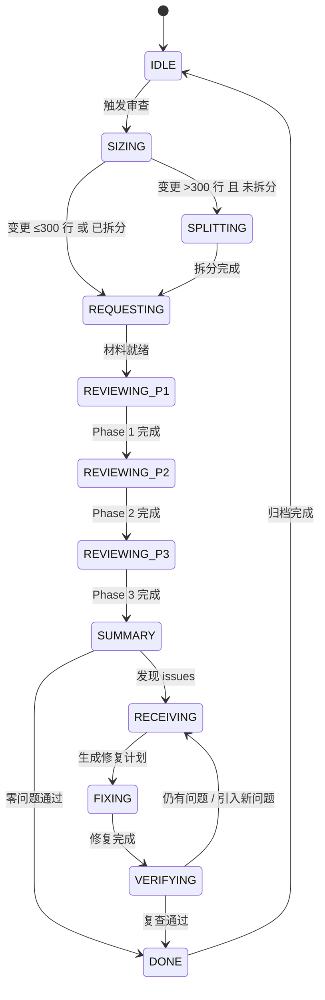

# Code Review Skills 完整设计方案

> 本文档描述 skill-arsenal 中 code review 技能族的整体架构、设计哲学和产出物规范。
> 融合 addyosmani/agent-skills（五轴质量门禁 + 工程文化）与 awesome-skills/code-review-skill（四阶段流程 + 协作式反馈）。
> 适配 Kimi Code 无 subagent 环境，采用会话内角色切换 + 状态机驱动。

---

## 一、设计哲学：取两者之长

| 维度 | addyosmani 贡献 | awesome-skills 贡献 | 本方案融合方式 |
|------|----------------|-------------------|--------------|
| **审查框架** | 五轴评估（Correctness/Readability/Architecture/Security/Performance） | 四阶段流程（Context→High-Level→Line-by-Line→Summary） | **四阶段 × 五轴矩阵**：每阶段聚焦不同轴 |
| **质量门禁** | 变更大小控制、审查速度规范、依赖审查、死代码清理 | 6 级严重性标记、渐进式语言指南加载 | 门禁规则前置到 REQUESTING 阶段，标记体系贯穿全流程 |
| **反馈风格** | 硬核工程：禁止 rubber-stamp、量化问题、技术事实优先 | 协作式：提问 > 命令、建议 > 指令、表扬平衡 | **对内硬核（AI 自检）+ 对外协作（用户报告）** |
| **语言覆盖** | 通用五轴，无语言专项 | 17+ 语言/框架，14,000+ 行专项指南 | 核心审查者加载通用五轴，按文件后缀动态注入语言专项 |
| **多视角审查** | 多模型审查模式（Model A 写 → Model B 审） | 单模型多阶段 | **Kimi 内角色轮替**：第一轮 correctness+architecture → 第二轮 security+performance |
| **工程规范** | Google 工程文化：Chesterton's Fence、YAGNI、变更拆分策略 | 快速参考清单、PR 模板 | 纳入 requesting/receiving 的执行纪律 |

---

## 二、架构总览

### 2.1 三层 Skill 架构

```
┌─────────────────────────────────────────────────────────────┐
│  L1 编排器（Orchestrator）                                   │
│  code-review-pipeline                                      │
│  状态机 + 触发控制 + 进度追踪 + 角色调度 + 变更大小门禁        │
└─────────────────────────────────────────────────────────────┘
                              │
        ┌─────────────────────┼─────────────────────┐
        ▼                     ▼                     ▼
┌───────────────┐    ┌───────────────┐    ┌───────────────┐
│ L2 角色 Skill  │    │ L2 角色 Skill  │    │ L2 角色 Skill  │
│ requesting-   │───▶│ code-reviewer │───▶│ receiving-    │
│ code-review   │触发 │ （四阶段×五轴）│输出 │ code-review   │
│ （提审者）     │    │ （审查者）      │意见 │ （被审者）     │
└───────────────┘    └───────────────┘    └───────────────┘
        │                     │                     │
        └─────────────────────┼─────────────────────┘
                              ▼
┌─────────────────────────────────────────────────────────────┐
│  L3 专项指南（On-Demand Loading）                           │
│  reference/                                                │
│  ├── vue.md / react.md / python.md / java.md ...           │
│  ├── architecture-review-guide.md                          │
│  ├── performance-review-guide.md                           │
│  ├── security-review-guide.md                              │
│  └── code-quality-universal.md                             │
│  按被审查文件后缀 + 用户指令动态加载，最小化上下文占用        │
└─────────────────────────────────────────────────────────────┘
```

### 2.2 状态机



| 状态 | 说明 | 关键动作 |
|------|------|---------|
| **IDLE** | 待机 | 监听触发信号 |
| **SIZING** | 变更大小评估 | 统计 diff 行数，>300 行强制进入 SPLITTING |
| **SPLITTING** | 拆分指导 | 按 Stack/By file group/Horizontal/Vertical 策略建议拆分 |
| **REQUESTING** | 准备审查材料 | 生成《审查请求书》，提取上下文 |
| **REVIEWING_P1** | Phase 1: 上下文收集 | 理解 PR 范围、关联需求、变更意图 |
| **REVIEWING_P2** | Phase 2: 高层级审查 | 架构轴 + 性能轴评估 |
| **REVIEWING_P3** | Phase 3: 逐行分析 | 正确性轴 + 可读性轴 + 安全轴 |
| **SUMMARY** | Phase 4: 总结决策 | 归类、定级、生成《审查意见书》 |
| **RECEIVING** | 处理反馈 | 验证、评估、生成《修复计划》 |
| **FIXING** | 执行修复 | 按优先级逐个修复，逐项测试 |
| **VERIFYING** | 复查验证 | 再次执行 REVIEWING 流程，确认无回归 |
| **DONE** | 审查通过 | 更新看板、归档决策日志 |

---

## 三、核心 Skill 内容

### 3.1 code-review-pipeline（L1 编排器）

路径：`skills/sdlc/code-review-pipeline/SKILL.md`

负责：
- 状态机定义与流转控制
- 变更大小门禁（100/300/1000 行三级）
- 触发机制（自动/半自动/手动）
- 角色编排流程（Step 1-5）
- 输出物规范（审查请求书/意见书/修复计划 YAML）
- 进度追踪集成（docs/progress.md + docs/decisions.md）

### 3.2 code-reviewer（L2 审查者 — 四阶段 × 五轴）

路径：`skills/sdlc/code-reviewer/SKILL.md`

负责：
- 角色隔离声明（强制执行）
- 四阶段 × 五轴审查矩阵
- 语言专项指南加载机制
- 6 级严重性标记体系
- 反馈语气规范（协作式）
- 多轮审查模式（三轮角色轮替模拟多模型）
- 严格 YAML 输出格式

**Reference 指南（L3）：**
- `reference/security-review-guide.md` — 全语言通用安全审查清单
- `reference/performance-review-guide.md` — 数据库/算法/内存/并发/前端性能
- `reference/architecture-review-guide.md` — SOLID、耦合内聚、分层、API 设计
- `reference/code-quality-universal.md` — 复用审计、参数膨胀、TOCTOU、魔法数字等

### 3.3 requesting-code-review（L2 提审者 — 融合版 V2.0）

路径：`skills/sdlc/requesting-code-review/SKILL.md`

负责：
- 变更大小评估（SIZING）
- 死代码预检
- 依赖变更检测
- 变更描述规范
- 生成《审查请求书》（YAML）
- 自检模式切换说明

向后兼容：同目录保留 `code-reviewer.md` 作为可选的 subagent 模板。

### 3.4 receiving-code-review（L2 被审者 — 融合版）

路径：`skills/sdlc/receiving-code-review/SKILL.md`

负责：
- 分类与澄清（阻塞性步骤：不理解就停）
- 生成《修复计划》（YAML）
- 死代码清理确认流程
- 依赖审查处理
- 状态回写与复查触发
- 禁止表演式认同

---

## 四、语言专项指南设计（L3 层）

### 4.1 加载机制

核心 SKILL.md 仅 ~200 行，语言指南按需加载：

```
IF files_changed 包含 *.py:
  READ reference/python.md
  将 Python 特定检查点注入 Phase 3 审查清单

IF files_changed 包含 *.vue:
  READ reference/vue.md
  将 Vue 3 特定检查点注入 Phase 3 审查清单

IF scope 涉及认证/支付/上传/隐私:
  READ reference/security-review-guide.md
  将安全强制检查项注入 Phase 3

IF total_lines_changed > 200 或涉及数据库/缓存:
  READ reference/performance-review-guide.md
  将性能检查项注入 Phase 2
```

### 4.2 已实现的通用指南

| 指南文件 | 覆盖范围 | 行数 |
|---------|---------|------|
| `reference/security-review-guide.md` | 输入验证、认证授权、注入防护、XSS、敏感数据、依赖审计、业务逻辑安全 | ~130 |
| `reference/performance-review-guide.md` | 数据库、算法、内存、并发、前端、网络、基础设施 | ~110 |
| `reference/architecture-review-guide.md` | SOLID、耦合内聚、抽象、数据流、扩展性、分层、API 设计 | ~120 |
| `reference/code-quality-universal.md` | 复用审计、参数膨胀、抽象泄漏、嵌套条件、字符串类型化、TOCTOU、空操作更新、冗余状态、魔法数字、注释、错误处理、测试 | ~130 |

### 4.3 预留的语言/框架专项指南

| 指南文件 | 覆盖范围 | 状态 |
|---------|---------|------|
| `reference/python.md` | Python 3.10+ / FastAPI / Pydantic | 待实现 |
| `reference/vue.md` | Vue 3.5 / Composition API / TypeScript | 待实现 |
| `reference/typescript.md` | TS 5.0+ / strict mode / 泛型 | 待实现 |
| `reference/java.md` | Java 17/21 / Spring Boot 3 | 待实现 |
| `reference/go.md` | Go 1.22+ / gin / gorm | 待实现 |

---

## 五、触发机制实现

### 5.1 标记系统

在代码文件中嵌入审查触发标记：

```python
# @review
# @review-scope: auth-module
# @review-priority: important
# @review-focus: security,performance
def verify_token(token: str) -> dict:
    ...
```

标记说明：
- `@review`：强制触发审查
- `@review-scope`：模块名，用于批量分组
- `@review-priority`：预期优先级（important/blocking）
- `@review-focus`：要求重点审查的轴（security/performance/architecture）

### 5.2 手动触发指令集

| 指令 | 行为 |
|------|------|
| `/review` | 审查最近 1 个 commit，完整 pipeline |
| `/review HEAD~2..HEAD` | 审查指定 commit 范围 |
| `/review src/api/user.py` | 审查指定文件 |
| `/review --focus security` | 仅执行 security 轴审查 |
| `/review --phase 3` | 仅执行 Phase 3 逐行分析 |
| `启动审查流程` | 同 `/review` |
| `进入 SPLITTING` | 仅执行变更大小评估与拆分建议 |
| `进入 VERIFYING` | 仅执行复查（修复后） |

---

## 六、进度追踪与归档

### 6.1 docs/progress.md（审查看板）

```markdown
## 审查看板

| 任务 | 模块 | 状态 | 变更大小 | 发现 | 已修复 | 待验证 | 已通过 | 归档 |
|------|------|------|---------|------|--------|--------|--------|------|
| task-003 | 分镜工作室 | REQUESTING | 120 行 | - | - | - | - | - |
| task-002 | 用户认证 | VERIFYING | 45 行 | 5 | 3 | 0 | - | - |
| task-001 | 角色工厂 | DONE | 200 行 | 2 | 2 | 0 | ✅ | 2026-05-22 |
```

### 6.2 docs/decisions.md（决策日志）

```markdown
## 2026-05-24 task-002 审查决策
- B1 密钥管理：接受 reviewer 建议，采用环境变量方案。理由：硬编码密钥在 git 历史中永久存在。
- I1 唯一索引：接受建议。额外检查：现有数据无重复 email。
- S1 Redis 缓存：延期处理。理由：本次仅做基础认证，缓存优化在 task-005 性能专项中处理。
- 复查结果：2026-05-24 07:15 复查通过，无回归。
```

### 6.3 .kimi/review-state.json（会话状态）

```json
{
  "current_state": "VERIFYING",
  "current_task": "task-002",
  "pipeline_version": "1.0",
  "review_request": { ... },
  "review_report": { ... },
  "fix_plan": { ... },
  "history": [ ... ]
}
```

---

## 七、与 skill-arsenal 整合

### 7.1 分类归属

```
skill-arsenal/
├── skills/sdlc/
│   ├── code-review-pipeline/           # L1 编排器
│   ├── requesting-code-review/         # L2 提审者
│   ├── code-reviewer/                  # L2 审查者
│   │   └── reference/
│   │       ├── security-review-guide.md
│   │       ├── performance-review-guide.md
│   │       ├── architecture-review-guide.md
│   │       └── code-quality-universal.md
│   └── receiving-code-review/          # L2 被审者
```

### 7.2 使用流程示例

```
用户：完成了用户认证模块

AI（pipeline 自动触发）：
1. 【SIZING】提取 src/middleware/auth.py, src/models/user.py 的 diff
   → 125 行，Good，进入 REQUESTING
2. 【REQUESTING】生成审查请求书
   → 标记语言：python
   → 加载 reference/python.md（预留）
3. 【REVIEWING_P1】上下文收集
   → 理解：为 FastAPI 添加 JWT 认证，保护 admin 路由
4. 【REVIEWING_P2】高层级审查
   → 架构：RESTful 设计合理，但缺少分页
   → 性能：列表查询无 limit
5. 【REVIEWING_P3】逐行分析（加载 security-review-guide.md + code-quality-universal.md）
   → 正确性：PUT 接口未处理 404
   → 安全：SECRET_KEY 硬编码
   → 可读性：函数名 validateToken 应为 validate_token
6. 【SUMMARY】输出审查意见书
   → B1: 密钥硬编码
   → I1: 列表接口无分页
   → N1: 命名不规范
   → S1: 建议增加缓存
   → P1: 错误处理完整
7. 【RECEIVING】生成 fix_plan
8. 【FIXING】执行修复
9. 【VERIFYING】复查
10. 【DONE】更新看板
```

---

## 八、与参考仓库的差异与增强

### 8.1 vs addyosmani/agent-skills

| 维度 | addyosmani 原版 | 本方案增强 |
|------|----------------|-----------|
| 审查流程 | 五轴评估，无固定阶段 | 增加四阶段流程，每阶段聚焦特定轴 |
| 输出格式 | 自由文本 | 严格 YAML，便于自动化解析 |
| 多模型审查 | 依赖外部 subagent | 会话内三轮角色轮替模拟 |
| 状态管理 | 无 | 完整状态机 + 进度追踪 |
| 修复闭环 | 无 | receiving-code-review + VERIFYING 复查 |

### 8.2 vs awesome-skills/code-review-skill

| 维度 | awesome-skills 原版 | 本方案增强 |
|------|-------------------|-----------|
| 适用平台 | Claude Code | 扩展为 Kimi / Claude / Cursor / Codex / Gemini 通用 |
| 架构设计 | 四阶段流程 | 增加五轴评估矩阵 + 架构审查指南 |
| 工程文化 | 协作式语气 | 增加 obra 硬核验证纪律 + addyosmani 工程规范 |
| 状态管理 | 无 | 完整 pipeline 状态机 |
| 进度追踪 | 无 | docs/progress.md + decisions.md 集成 |

---

## 九、关键设计决策汇总

| 决策点 | 选择 | 理由 |
|--------|------|------|
| 审查框架 | 四阶段 × 五轴矩阵 | 既有流程结构，又有评估维度 |
| 严重性标记 | 6 级（blocking/important/nit/suggestion/learning/praise） | 融合两家优势 |
| 无 subagent 怎么办 | 会话内角色轮替（三轮） | 模拟多模型审查模式 |
| 审查者是否知道作者思路 | 严格隔离 | 防止"为代码辩护"，确保客观性 |
| 反馈语气 | 对内硬核 + 对外协作 | AI 自检时用硬核纪律，对外报告用协作式 |
| 变更大小控制 | 300 行门禁 + 拆分策略 | 减少审查负担 |
| 语言指南加载 | 按需渐进式 | 最小化上下文窗口占用 |
| 是否允许跳过审查 | 允许，但强制记录 | hotfix 需要紧急通道，但必须留下决策痕迹 |
| 修复顺序 | blocking > important > nit > suggestion | 阻塞性问题优先 |
| 输出格式 | 严格 YAML | 便于后续自动化解析、归档、统计 |
| 进度追踪 | Markdown 表格 + JSON 状态 | 人类可读 + 机器可读 |
| 死代码处理 | 审查时识别，修复时清理 | 保持代码库健康 |
| 依赖审查 | 新增依赖时 5 问检查 | 每个依赖都是负债 |
| 批准标准 | "改善整体健康度即可批准" | 不追求完美，追求持续改进 |

---

## 十、实施状态

| 阶段 | 任务 | 状态 |
|------|------|------|
| P0 | 创建 4 个核心 Skill 文件 | ✅ 已完成 |
| P0 | 创建 4 个通用参考指南 | ✅ 已完成 |
| P1 | 创建项目语言指南（python.md / vue.md 等） | ⏳ 预留 |
| P1 | 设计进度追踪模板 | ✅ 已集成到 pipeline |
| P2 | 优化触发机制（`# @review` 标记识别） | ⏳ 预留 |
| P2 | 与 skill-arsenal 主仓库整合 | ✅ 已更新 index.json |
| P3 | 扩展更多语言指南 | ⏳ 按需 |
