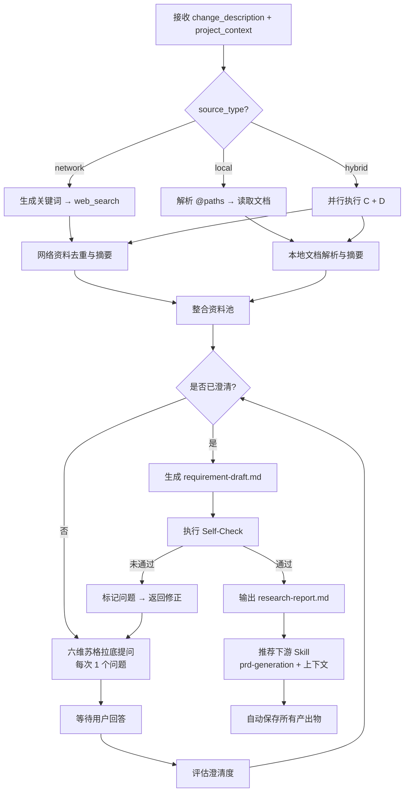

# Brainstorming Skill 设计方案

> **文档版本**：V2.0
> **Skill 版本**：2.0.0
> **阶段定位**：OpenSpec 阶段 1（需求探索与澄清）
> **更新日期**：2026-05-05

---

## 一、概述

Brainstorming 是软件全生命周期（SDLC）阶段 1 的**需求探索编排器**。它接收变更提案后，自动收集多源资料，通过苏格拉底式多轮提问澄清需求，最终输出结构化需求摘要并衔接下游的 `prd-generation` Skill。

本设计将 Superpowers 原生的通用 brainstorming 升级为兼容 OpenSpec + Superpowers 双体系的阶段入口 Skill，实现感知多维化、提问结构化、验收自动化、衔接契约化。

---

## 二、设计原则

1. **资料先行**：零资料禁止提问，禁止基于无依据的假设进行推断。
2. **HARD-GATE**：需求未澄清（澄清度 < 0.8）且用户未书面确认前，不得进入下游 Skill。
3. **渐进式披露**：核心流程收敛在 `SKILL.md`（< 500 行），深度知识按需加载 `references/`。
4. **一次一问**：每轮仅向用户提出 1 个问题，降低认知负荷。
5. **本地优先**：网络资料与本地文档冲突时，以本地文档（项目 truth source）为准。

---

## 三、功能架构

Brainstorming 采用四层架构模型：

```
┌─────────────────────────────────────────────────────────────┐
│                      协作层 (Collaboration)                  │
│         下游衔接 (prd-generation) / 视觉伴侣                  │
├─────────────────────────────────────────────────────────────┤
│                      认知层 (Cognitive)                      │
│    六维提问引擎 / 澄清度评估 / 意图漂移检测 / 自检查验          │
├─────────────────────────────────────────────────────────────┤
│                      执行层 (Execution)                      │
│         结构化摘要生成 / 资料融合去重 / 输出物持久化           │
├─────────────────────────────────────────────────────────────┤
│                      感知层 (Perception)                     │
│         网络搜索 (web_search) / 本地文档读取 (@路径)          │
└─────────────────────────────────────────────────────────────┘
```

### 3.1 感知层：多源资料收集

| 数据源 | 触发条件 | 处理方式 | 输出 |
|--------|----------|----------|------|
| **网络** | `source_type=network` 或 `hybrid` | 自动生成关键词 → `web_search` → Top-5 摘要 | 网络资料摘要（含相关度、可信度） |
| **本地** | `source_type=local` 或 `hybrid` | 解析 `@路径` → 读取文件 → 提取关键段落 | 本地文档摘要（含引用位置） |
| **混合** | 默认 | 并行网络 + 本地 → 合并资料池 → 交叉验证 | 统一资料池（含冲突标记） |

**交叉验证规则**：
- 冲突检测：对比网络资料与本地文档的结论
- 优先级：`local_first`（本地为 truth source）
- 冲突处理：向用户追加提问确认，不得擅自裁决

### 3.2 认知层：结构化提问与评估

**六维提问框架**：

| 维度 | 目标 | 典型问题 |
|------|------|----------|
| 用户价值 | 确认需求必要性 | "解决谁的什么问题？不做的代价？" |
| 边界范围 | 防止范围蔓延 | "哪些明确不在本次范围内？" |
| 业务规则 | 挖掘隐性规则 | "并发触发时的优先级？异常回退策略？" |
| 数据假设 | 铺垫详细设计 | "核心实体字段？现有数据源？" |
| 竞品差异 | 明确竞争定位 | "与竞品相比，差异化点是什么？" |
| 集成依赖 | 识别技术约束 | "是否对接现有模块？接口契约是否存在？" |

**意图漂移检测**：
- 每轮结束后，对比本轮回答与原始变更描述的语义一致性
- 漂移信号：引入全新模块、改变目标用户、转换核心目标
- 处理：向用户确认是范围扩大、方向调整还是澄清深化

**澄清度评分**：
- 0.0-0.4：极度模糊，无法生成摘要
- 0.4-0.7：部分清晰，存在关键未确认项
- 0.7-0.8：基本清晰，少量细节待补充
- 0.8-1.0：充分澄清，可进入下游

### 3.3 执行层：自动化处理与预分析

**资料融合**：
1. 去重：同一来源仅保留一次
2. 分类：技术方案 / 竞品分析 / 用户反馈 / 项目历史
3. 可信度标注：高（官方/内部）/ 中（知名博客/开源）/ 低（论坛/未验证）

**结构化摘要生成**：
- 触发条件：澄清度 ≥ 0.8 或达到最大轮次（5 轮）
- 输出：`requirement-draft.md`，包含核心问题、边界范围、业务假设、模块初分、风险点、待确认项

**自检查验 (Self-Check)**：
- 内容一致性：摘要与资料池、用户回答无矛盾
- 内容完整性：6 个提问维度均有覆盖
- 无内部矛盾：用户回答间无逻辑冲突
- 范围可控：聚焦单一变更，无过度蔓延

### 3.4 协作层：下游衔接与异常处理

**下游衔接契约**：
- 标准路径：brainstorming → `prd-generation`
- 增强路径：当市场格局不确定时，brainstorming → `competitive-analysis mode=positioning` → `prd-generation`
- 分支路径：若技术债务高（架构模式变更、技术栈冲突、核心模型改动），建议先触发 `high-level-design`
- 禁止路径：未生成 PRD 前不得衔接 `writing-plans` 或 `executing-plans`

**传递包 (Handover Package)**：
- 必需：`requirement-draft.md`、`research-report.md`、`brainstorming-log.md`、澄清度评分、`red_flags`
- 推荐：`market-positioning.md`（若已执行 `competitive-analysis mode=positioning`）
- 可选：知识图谱标签、预检结论、推荐策略

---

## 四、输入输出定义

### 4.1 输入 (Input)

| 输入项 | 类型 | 必填 | 来源 |
|--------|------|------|------|
| `change_description` | string | 是 | 用户输入或 `/opsx:propose` |
| `project_context` | object | 是 | `openspec/config.yaml` |
| `source_type` | enum | 否 | 默认 `hybrid`（network / local / hybrid） |
| `local_paths` | string[] | 条件 | `source_type` 为 local/hybrid 时提供 |
| `search_queries` | string[] | 否 | 用户自定义关键词（无则 Skill 自动生成） |
| `session_history` | object[] | 否 | 多轮问答历史 |

### 4.2 输出 (Output)

| 输出文件 | 保存路径 | 说明 |
|----------|----------|------|
| `brainstorming-log.md` | `openspec/changes/{变更名}/brainstorming/` | 完整问答日志 |
| `research-report.md` | 同上 | 资料收集报告 |
| `requirement-draft.md` | 同上 | 结构化需求摘要 |
| `next-skill-recommendation` | 内嵌于日志 | 固定推荐 `prd-generation` |

---

## 五、处理流程



### 详细步骤

**S1: 意图解析**
- 从变更描述提取核心意图、目标用户、预期价值
- 输出：核心意图卡片

**S2: 资料收集**
- 根据 `source_type` 分支执行
- 网络侧：生成 1-3 个关键词，调用 `web_search`，取 Top-5
- 本地侧：解析 `@路径`，读取 `.md` / `.txt` / `.yaml` / `.json`
- 混合侧：并行执行，交叉验证冲突
- 输出：原始资料包 → 资料池

**S3: 首轮提问**
- 基于资料池 + 变更描述，从 6 维度生成 3-5 个核心追问
- 每次只问 1 个问题，优先使用选择题
- 输出：提问列表

**S4: 多轮迭代**
- 记录用户回答，识别矛盾/遗漏
- 每轮评估澄清度
- 若发现意图漂移，立即向用户确认
- 输出：问答日志

**S5: 结构化摘要**
- 整理为核心问题、边界范围、业务假设、模块初分、风险点、待确认项
- 输出：`requirement-draft.md`

**S6: 自检查验**
- 一致性、完整性、无矛盾、范围可控
- 未通过则返回修正
- 输出：校验报告

**S7: 保存与衔接**
- 保存全部产出物到 `openspec/changes/{变更名}/brainstorming/`
- 向 `prd-generation` 传递 Handover Package
- 输出：衔接指令

---

## 六、配置说明

Brainstorming 的配置内嵌于 `openspec/config.yaml` 的 `artifact_specs` 段，Skill 本身无独立配置文件。

```yaml
# openspec/config.yaml 相关段
artifact_specs:
  high-level-requirements:
    # 由 brainstorming 输出的 requirement-draft.md 作为输入
    parent_dependency: "brainstorming"
    
rules:
  auto_save:
    enabled: true
    base_path: "openspec/changes/{变更名}/brainstorming/"
    
  self_check:
    enabled: true
    check_items:
      - content_consistency
      - content_completeness
      - cross_reference_valid
      - no_internal_conflict
```

---

## 七、异常处理

| 异常场景 | 处理策略 |
|----------|----------|
| `web_search` 无结果 | 扩大关键词（同义词/英文扩展）→ 仍无则标记 `[网络] 无相关资料`，依赖本地资料继续 |
| 本地 `@路径` 文件不存在 | 提示用户确认路径 → 跳过该文件 → 记录到 `brainstorming-log.md` |
| 用户回答与之前矛盾 | Self-Check 拦截 → 高亮矛盾点 → 要求用户确认以哪个为准 |
| 多轮后澄清度仍 < 0.8 | 输出当前最佳摘要 → 标记 `[风险] 需求未完全澄清` → 允许进入下游但附加风险提示 |
| 网络与本地资料冲突 | 按 `local_first` 处理 → 向用户追加提问确认 |

---

## 八、关键设计决策

| 决策点 | 选择 | 理由 |
|--------|------|------|
| 最大提问轮次 | 5 轮 | 平衡深度探索与用户体验，避免无限循环 |
| 最小提问轮次 | 2 轮 | 确保基本覆盖，防止草率通过 |
| 澄清度阈值 | 0.8 | 允许合理细化，拦截方向性偏移 |
| 资料冲突优先级 | local_first | 本地文档是项目 truth source，网络资料仅作参考 |
| 输出路径 | `openspec/changes/{变更名}/brainstorming/` | 与 OpenSpec 变更管理体系对齐 |
| 下游强制衔接 | `prd-generation` | 阶段 1 的产出必须是结构化需求，而非直接设计或编码 |

---

## 九、扩展路线图

| 版本 | 目标 | 内容 |
|------|------|------|
| V2.2 (当前) | 市场定位增强 | 下游衔接增加 `competitive-analysis mode=positioning` 分支，传递包增加 `market-positioning.md` |
| V2.1 | 感知增强 | 多格式本地文档解析（PDF/Word/图片 OCR） |
| V2.0 | 基础重构 | OpenSpec 对齐、六维提问、三源收集、下游契约 |
| V2.1 | 感知增强 | 多格式本地文档解析（PDF/Word/图片 OCR） |
| V2.2 | 认知增强 | 自适应提问策略（首次探索/迭代增强/紧急修复/技术预研） |
| V2.3 | 知识增强 | 基于 `openspec/changes/archive/` 的历史变更关联 |
| V3.0 | 协作增强 | 多维度并行探索（用户/技术/业务）与结果合并 |
