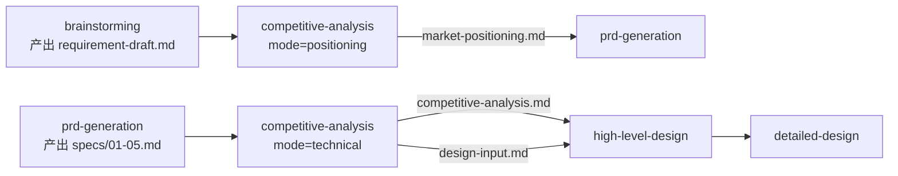
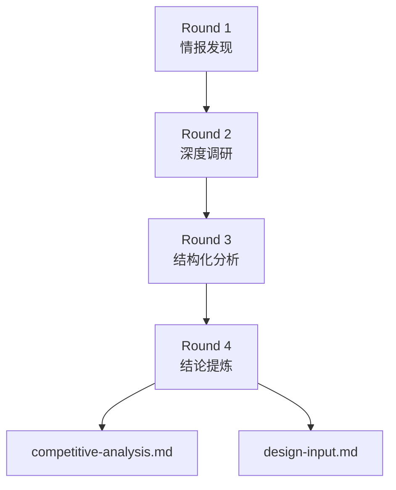

# Competitive Analysis Skill 设计文档

> 本文档面向 Skill 作者、维护者与架构师，说明 `competitive-analysis` 的设计意图、开源借鉴、架构决策与质量门控机制。

---

## 一、设计目标与定位

### 1.1 解决什么问题

在软件项目的**需求阶段和设计阶段**，技术团队经常面临以下困境：

- 技术选型缺乏外部参照，最终变成"领导拍脑袋"或"团队熟悉什么用什么"
- 竞品功能看似相似，但背后的数据模型、集成深度、护城河完全不同
- 开源项目调研停留在 Star 数和 README，没有结构化对比
- 竞品分析的结论无法直接转化为设计输入，分析和设计之间存在断层

`competitive-analysis` Skill 的核心目标：**将竞品分析从"感性了解"升级为"结构化证据驱动的需求/设计输入"**。支持双模式：`positioning`（市场定位，服务需求阶段）与 `technical`（技术深度对比，服务设计阶段）。

### 1.2 与上下游的关系

| 模式 | 关系 | 说明 |
|------|------|------|
| `positioning` | 上游 | 依赖 `brainstorming` 产出的需求草案 |
| `positioning` | 下游 | 为 `prd-generation` 提供市场定位与差异化输入 |
| `technical` | 上游 | 依赖 `prd-generation` 已冻结的概要需求，明确功能模块边界 |
| `technical` | 下游 | 为 `high-level-design` 提供技术选型约束、架构模式参考、接口设计约束、数据模型参考 |
| `technical` | 并行 | 可与 `high-level-design` 并行启动，但 `high-level-design` 评审前必须确认 `design-input.md` 已生成 |

### 1.3 设计哲学

1. **情报驱动**：自动采集（网络搜索 + 本地文档）→ 结构化分析 → 证据分级输出
2. **框架赋能**：复用顶级战略分析框架（7 Powers、Aggregation Theory、JTBD、Wardley Mapping），但聚焦软件架构维度
3. **下游可消费**：不仅输出" readable report "，还输出" machine-readable design input "，实现分析→设计的无缝衔接
4. **证据优先**：所有结论必须标注证据层级（T1-T6）和置信度（H/M/L），禁止无证据声明

---

## 二、开源借鉴分析

本 Skill 的设计深度参考了两个开源项目：

| 维度 | deer-flow/github-deep-research | pm-skills-arsenal/competitive-market-analysis |
|------|-------------------------------|-----------------------------------------------|
| 定位 | GitHub 仓库深度研究 | 商业竞品/市场结构分析（PM 级战略咨询） |
| 核心产出 | `research_{topic}_{YYYYMMDD}.md` | Competitive War Map（竞争战图） |
| 分析框架 | 4 轮递进式研究 | 9 大战略框架（7 Powers、Aggregation Theory、Christensen、JTBD、Wardley、Blue Ocean 等） |
| 证据体系 | 5 级来源优先级 + 置信度 H/M/L | 6 级证据分层（T1-T6）+ 置信度 H/M/L |
| 质量保障 | 三角验证 + 冲突记录 | 9 种失败模式检测 + 对抗性自我批判 + 质量梯度 |
| 工具链 | `github_api.py` + `web_search` + `web_fetch` | 纯结构化推理框架 |

### 2.1 直接复用的能力

**来自 deer-flow：**
- **4 轮递进研究工作流**：作为竞品信息收集的"情报层"，避免一次性塞满上下文
- **来源优先级 + 置信度评分**：直接移植到证据分级体系
- **强制内联引用格式 `[citation:Title](URL)`**：作为报告引用规范
- **Mermaid 图表**：用于架构图、流程图、时间线

**来自 pm-skills：**
- **7 Powers、Aggregation Theory、JTBD、Wardley Mapping**：选取与软件竞品分析相关的框架作为分析维度
- **O→I→R→C→W 级联推荐格式**：作为"技术选型建议"的输出模板
- **竞争集合分层（Primary/Secondary/Non-obvious）**：用于定义直接竞品/间接竞品/范式威胁
- **9 种失败模式检测清单**：作为质量门控的专项检查项
- **对抗性自我批判**：强制识别 ≥3 个真实弱点

### 2.2 改造与融合

两个开源 Skill 均无法直接满足软件竞品分析的需求，主要差距：

| 差距 | 改造方案 |
|------|----------|
| 缺乏"数据模型"和"功能流程"维度 | 在传统商业分析基础上，强制增加软件架构专用的两个技术维度 |
| deer-flow 缺乏商业战略框架 | 以 pm-skills 的框架体系为骨架，deer-flow 为情报血肉 |
| pm-skills 无自动搜索能力 | 为其增加 `web_search` + `web_fetch` 调用能力 |
| 分析和设计之间存在断层 | 增加 `design-input.md`，结构化输出技术选型约束、架构模式、接口模式建议 |
| 中文适配 | 全中文输出（框架名称保留英文但附中文解释），中文标点规范 |

---

## 三、核心设计决策

### 3.1 为什么采用"四维模型"

传统竞品分析聚焦"功能对比"和"定价策略"，对软件架构设计帮助有限。本 Skill 定义了**软件竞品专用四维模型**：

| 维度 | 分析子项 | 对设计的价值 |
|------|----------|------------|
| 角色数据模型设计 | 核心实体、字段规范、实体关系、权限模型、数据流转 | 直接影响数据库设计和 API 契约 |
| 核心功能流程 | 主链路流程、状态机、关键交互节点、异常处理、多角色协作流 | 直接影响服务划分和接口设计 |
| 技术选型 | 前端/后端/数据库/基础设施/AI 模型/部署架构 | 直接影响技术栈决策 |
| 集成方式 | API 风格、协议、扩展机制、插件生态、第三方集成深度 | 直接影响接口设计和集成策略 |

### 3.2 为什么采用"双文件输出"

| 文件 | 受众 | 用途 |
|------|------|------|
| `competitive-analysis.md` | 人 | 完整可读的分析报告，供评审会和决策使用 |
| `design-input.md` | `high-level-design` Skill | 结构化设计输入，供下游自动消费 |

如果不拆分，一个可读性强的报告会让 AI 难以提取结构化约束；一个纯结构化的表格又让人难以快速理解结论。双轨制兼顾了两种需求。

### 3.3 为什么保留 6 个战略框架

pm-skills 原方案有 9 个框架，但并非每个问题都需要全部应用。本 Skill 采用**框架路由**机制：

- 根据 `question_type` 选择 3-4 个主框架
- 其余框架明确标注"Skipped — [原因]"
- 避免框架堆砌（Failure Mode FM-1）

保留的 6 个框架与软件分析的映射关系：

| 框架 | 软件分析场景 | 为什么保留 |
|------|-------------|-----------|
| 7 Powers | 技术护城河评估 | 判断竞品的技术壁垒是否可逾越 |
| Aggregation Theory | 平台化/集成分析 | 判断竞品是否通过平台化 commoditize 本领域 |
| JTBD | 功能流程与数据模型对比 | 从"用户雇佣产品完成什么任务"角度重新框定竞争 |
| Wardley Mapping | 技术选型演进定位 | 避免在 commodity 层做 custom 投入 |
| Christensen 颠覆理论 | 威胁景观扫描 | 识别低端/新市场颠覆向量 |
| Blue Ocean | 差异化空间寻找 | 避免同质化竞争 |

---

## 四、4 轮递进工作流详解

### Round 1：情报发现（Discovery）

**目标**：快速建立竞品全景图，识别竞争集合。

**动作**：
- 3-5 次 `web_search`，搜索 `"{领域} 竞品"`、`"{领域} 开源"`、`"{功能} vs"`
- 读取本地参考文档（`@openspec/changes/{变更名}/specs/`）提取功能模块列表
- 分类竞品：Primary（直接替代，3-5 个）、Secondary（相邻扩展，3-6 个）、Non-obvious/H3（范式威胁，2-3 个）

**输出**：竞品清单 + 初步分类 + 搜索摘要（保存到 `.raw/search-round-1.md`）

### Round 2：深度调研（Deep Investigation）

**目标**：提取每个竞品的技术细节。

**动作**：
- 5-10 次 `web_search` + `web_fetch`
- 对 GitHub 项目：分析仓库结构、技术栈（languages）、README、核心模块树
- 提取：数据模型线索、API 文档、架构博客、技术选型公告

**输出**：每个竞品的技术档案（保存到 `.raw/search-round-2.md`）

### Round 3：结构化分析（Structured Analysis）

**目标**：应用战略框架，按四维模型填充对比数据。

**动作**：
- 根据 `question_type` 选择 3-4 个主框架
- 生成对比表格和 Mermaid 图表
- 所有关键声明标注 `(TX)` 证据层级

**输出**：填充完成的分析框架表格

### Round 4：结论提炼（Synthesis）

**目标**：生成最终报告和设计输入。

**动作**：
- 撰写 Executive Summary（最后写，放在最前）
- 生成 `competitive-analysis.md`（完整报告）
- 生成 `design-input.md`（结构化设计输入）
- 执行对抗性自我批判（≥3 个弱点）
- 质量门控检查

**输出**：`competitive-analysis.md` + `design-input.md`

---

## 五、证据与置信度体系

### 5.1 证据层级（T1-T6）

直接复用 pm-skills 的证据分级，但增加软件分析场景示例：

| 层级 | 类型 | 软件分析示例 | 强度 |
|------|------|-------------|------|
| T1 | 直接行为数据 | GitHub 代码、官方 API 文档、实测性能数据、SEC 财报 | 最强 |
| T2 | 一手研究 | 对竞品的结构化测试、接口探测、部署实测 | 强 |
| T3 | 专家分析 | Stratechery、a16z、Martin Fowler 博客、学术论文 | 中强 |
| T4 | 行业报告 | Gartner、IDC、Forrester、GitHub Octoverse | 中等 |
| T5 | 高管声明 | 竞品发布会、PR 稿、官方博客公告 | 弱 |
| T6 | 推测 | 社交媒体评论、开发者论坛猜测、第一性原理推理 | 最弱 |

### 5.2 置信度（H/M/L）

| 置信度 | 标准 | 行动建议 |
|--------|------|----------|
| H (>70%) | 多源交叉验证，或 T1/T2 直接证据 | 可据以行动 |
| M (40-70%) | 方向可能，但证据混合或单一来源 | 需验证后再 committing resources |
| L (<40%) | 假设，缺乏直接证据 | 勿直接行动，标记为待验证假设 |

### 5.3 引用规范

- 每个表格单元格、每个关键声明必须有 `(TX)` 标注
- 内联引用格式：`[citation:Title](URL)`
- 超过 6 个月的来源标记 `[POTENTIALLY STALE]`
- 仅基于 T4-T6 的关键结论标记 `[EVIDENCE-LIMITED]`

---

## 六、输出格式规范

### 6.1 competitive-analysis.md 章节结构

| # | 章节 | 说明 | 必含 |
|---|------|------|------|
| - | Metadata Block | 日期、置信度、分析范围、证据版本 | 是 |
| - | Executive Summary | ≤5 句，VP 可独立决策 | 是 |
| - | 阅读指南 + 符号表 | 按时间/角色分层阅读指引 | 是 |
| 1 | 竞争集合 | Primary / Secondary / Non-obvious | 是 |
| 2 | 角色数据模型设计对比 | 实体对比表 + ER 图（Mermaid） | 是 |
| 3 | 核心功能流程对比 | 流程图 + 功能矩阵 | 是 |
| 4 | 技术选型对比 | 技术栈对比表 + Wardley Map | 是 |
| 5 | 集成方式对比 | API 对比表 + 生态矩阵 | 是 |
| 6 | 7 Powers 热图 | 🟢🟡🔴 评分 + (TX) 证据 | 是 |
| 7 | 切换成本分解 | 7 类成本 1-10 分 + 进度条 | 是 |
| 8 | 颠覆向量与威胁景观 | Christensen 测试 + H1/H2/H3 三视野 | 是 |
| 9 | 战略建议 | O→I→R→C→W 级联格式 | 是 |
| 10 | 假设登记册 | 假设、支撑框架、置信度、推翻条件 | 是 |
| 11 | 对抗性自我批判 | ≥3 个真实弱点 | 是 |
| 12 | 来源 | 按证据层级分类，带日期 | 是 |

### 6.2 design-input.md 章节结构

| 章节 | 内容 | 消费者 |
|------|------|--------|
| 技术选型约束 | 组件、竞品主流方案、推荐方案、理由、置信度 | `high-level-design` 的 `02-tech-stack.md` |
| 架构模式参考 | 模式、来源竞品、适用性、风险 | `high-level-design` 的 `01-system-architecture.md` |
| 接口设计约束 | API 风格、协议、标准建议 | `high-level-design` 的 `04-interface-contracts.md` |
| 数据模型参考 | 实体、竞品设计、本方案决策 | `high-level-design` 的 `03-data-architecture.md` |
| 差异化空间 | Blue Ocean ERRC（Eliminate/Reduce/Raise/Create） | `high-level-design` 的战略建议 |
| 风险提示 | 风险、来源、观测指标 | 全阶段风险登记 |

---

## 七、质量门控与失败模式

### 7.1 内置检查清单

在生成最终输出前，必须执行以下自检：

| 检查项 | 通过标准 | 失败处理 |
|--------|----------|----------|
| 证据完整性 | 每个关键声明有 ≥T2 证据，表格每个单元格有 (TX) 标注 | 标记 `[EVIDENCE-LIMITED]`，提示补充搜索 |
| 框架适用性 | 已根据 question_type 选择 3-4 个主框架，无关框架明确标注"跳过" | 拒绝输出，要求重新路由框架 |
| 维度覆盖度 | 4 个维度（数据模型/功能流程/技术选型/集成方式）均有内容 | 缺失维度标记 `[PENDING]` |
| 下游可消费性 | `design-input.md` 包含技术选型约束、架构模式、接口约束、数据模型参考 | 缺失则补充 |
| 对抗性批判 | ≥3 个真实弱点，每个链接到 Watch Indicator | 不足则强制补充 |
| 来源时效性 | >6 个月的来源标记 `[POTENTIALLY STALE]` | 自动提示验证 |

### 7.2 失败模式检测（Failure Modes）

复用 pm-skills 的失败模式，选取与软件竞品分析最相关的 6 项：

| 代码 | 失败模式 | 检测信号 | 修复动作 |
|------|----------|----------|----------|
| FM-1 | 框架堆砌 | 每个框架仅 2-3 句，删除后不影响建议 | 减少框架数量，深化核心框架 |
| FM-2 | 功能对比陷阱 | 输出仅为功能矩阵，无结构分析 | 强制先输出 7 Powers 再输出功能矩阵 |
| FM-3 | 现时短视 | 仅分析 H1，无 H2/H3 | 强制输出三视野威胁景观 |
| FM-4 | 来源洗钱 | 无内联证据标签或全为 T6 | 拒绝输出，要求补充 T1-T3 |
| FM-5 | 同质化竞争假设 | 所有竞品按同一维度比较 | 应用不对称竞争分析 |
| FM-8 | 错误问题分析 | 核心问题是内部激活而非外部竞争 | Context Fitness Check 拦截 |

---

## 八、与 high-level-design 的衔接协议

### 8.1 数据契约

`design-input.md` 是 `competitive-analysis` 和 `high-level-design` 之间的数据契约。其格式必须满足：

1. **结构化表格为主**：避免长段落，确保 `high-level-design` 能直接提取约束
2. **每个建议包含置信度**：让 `high-level-design` 知道哪些约束是硬性的，哪些是参考性的
3. **明确标注来源竞品**：让 `high-level-design` 在需要时能追溯原始分析

### 8.2 消费示例

`high-level-design` 读取 `design-input.md` 后，应将其内容映射到对应章节：

| design-input.md 章节 | high-level-design 章节 | 映射方式 |
|---------------------|------------------------|----------|
| 技术选型约束 | `02-tech-stack.md` | 直接引用为选型理由 |
| 架构模式参考 | `01-system-architecture.md` | 作为模式候选输入 |
| 接口设计约束 | `04-interface-contracts.md` | 作为接口风格约束 |
| 数据模型参考 | `03-data-architecture.md` | 作为 ER 设计参考 |
| 差异化空间 | 战略建议 | 作为差异化设计输入 |
| 风险提示 | 全局风险登记 | 作为架构风险输入 |

---

## 九、变更日志

| 版本 | 日期 | 变更内容 |
|------|------|----------|
| v2.0.0 | 2026-05-07 | 重构为双模式。新增 `positioning` 市场定位模式（输出 `market-positioning.md`）与 `technical` 技术深度模式（输出 `competitive-analysis.md` + `design-input.md`）。明确两次触发时机与上下游差异。 |
| v1.0.0 | 2026-05-07 | 初始版本。融合 deer-flow 情报采集能力与 pm-skills 战略分析框架，适配 OpenSpec 体系，输出 competitive-analysis.md + design-input.md。 |
