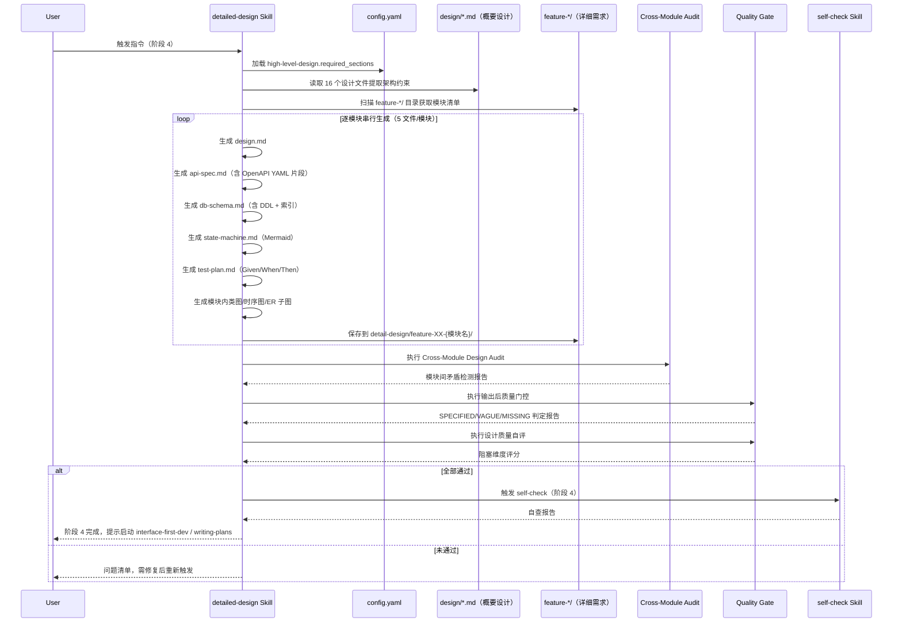

# detailed-design Skill 设计规格书

> 本文档面向 Skill 维护者与开发者，说明 `detailed-design` 的内部机制、逐模块生成流水线、质量门控体系、开源复用分析及与上下游 Skill 的衔接协议。

---

## 一、Skill 元信息

| 属性 | 内容 |
|------|------|
| Skill ID | `detailed-design` |
| 中文名 | 详细设计生成器 |
| 所属阶段 | SDLC 阶段 4（详细设计阶段） |
| 核心职责 | 基于已冻结的概要设计和详细需求，按模块逐一生成可编码的技术细节 |
| 设计原则 | 架构约束继承、逐模块独立、自动化生成、测试前置、模糊语言零容忍 |
| 开源借鉴 | spellbook `reviewing-design-docs` / `reviewing-impl-plans` / `design-exploration`；CodeArchDoc；developer-kit |
| 版本 | v1.0.0 |

---

## 二、目录结构

```
skills/sdlc/detailed-design/
├── SKILL.md                    # Skill 入口定义（核心指令 + 触发场景 + 处理逻辑）
└── meta.json                   # 扩展元数据（版本、标签、兼容平台）
```

### 文件职责

| 文件 | 职责 | 加载时机 |
|------|------|----------|
| `SKILL.md` | Frontmatter（name + description）+ 核心处理逻辑 + 质量门控 + Gotchas | 匹配成功后加载 |
| `meta.json` | 扩展元数据：pattern=generator、tags、platforms | 外部检索工具使用 |

> 本 Skill 采用**极简目录结构**，深度知识（Mermaid 模板、DDL 类型映射表、OpenAPI 片段示例）通过 Skill 内部推理生成，不依赖外部 reference 文件。

---

## 三、核心定位与功能要求

### 3.1 核心定位

`detailed-design` 是**概要设计到编码实现之间的技术桥梁**。它将 `high-level-design` 中定义的架构约束（技术栈、安全策略、性能指标、全局状态机）逐模块落地为可编码的技术细节。

一句话记忆：概要设计决定"房子有几层、用什么材料"；详细设计决定"每块砖怎么砌"。

### 3.2 功能要求矩阵

| 维度 | 要求 |
|------|------|
| 核心定位 | 按模块输出详细设计文档，将概要设计的架构约束落地为可编码的技术细节 |
| 模块化处理 | 基于详细需求中的模块拆分（`specs/feature-XX-{模块名}/`），在 `detail-design/feature-XX-{模块名}/` 逐模块独立输出 |
| 设计深度 | 覆盖数据模型、接口定义、状态机、测试策略四个技术维度 |
| 一致性约束 | 必须遵循概要设计的架构约束，与详细需求的功能点一一对应 |
| 自动化生成 | 自动生成 DDL 语句、索引建议、OpenAPI/Swagger 格式接口、状态机 Mermaid 图 |
| 模块间矛盾检测 | 自动检测两个模块对同一数据表的字段定义冲突、接口不兼容等问题 |
| 增量更新 | 支持需求变更后的局部重生成（仅更新受影响模块） |

---

## 四、输入与输出

### 4.1 输入数据

| 输入来源 | 文件路径 | 具体内容 |
|----------|----------|----------|
| 概要设计 | `openspec/changes/{变更名}/design/*.md`（16 个文件） | 系统架构、技术选型、数据架构、部署架构、全局状态机 |
| 详细需求 | `openspec/changes/{变更名}/specs/feature-*/spec.md` | 功能规格与验收标准 |
| 详细需求 | `openspec/changes/{变更名}/specs/feature-*/io-table.md` | 输入输出字段表 |
| 详细需求 | `openspec/changes/{变更名}/specs/feature-*/logic.md` | 业务逻辑与模块状态机 |
| 详细需求 | `openspec/changes/{变更名}/specs/feature-*/prototype.md` | 页面原型文字化布局 |
| 竞品分析 | `openspec/changes/{变更名}/design/competitive-analysis.md` | 技术选型参考 |
| 配置 | `openspec/config.yaml` | `high-level-design.required_sections` 作为输出模板约束 |

### 4.2 输出数据

每个模块独立目录下生成 5 个文件：

| 产出物 | 内容说明 | 保存路径 |
|--------|----------|----------|
| `design.md` | 模块内部架构、组件划分、类/函数设计、算法逻辑 | `detail-design/feature-XX-{模块名}/` |
| `api-spec.md` | 模块对外暴露的接口定义（含请求/响应字段、错误码、权限） | `detail-design/feature-XX-{模块名}/` |
| `db-schema.md` | 数据表结构、DDL 语句、索引建议、缓存策略、连接池配置 | `detail-design/feature-XX-{模块名}/` |
| `state-machine.md` | 模块内部状态流转图（Mermaid）、状态转换条件、异常分支 | `detail-design/feature-XX-{模块名}/` |
| `test-plan.md` | 单元测试用例设计、集成测试场景、边界条件覆盖、Mock 策略 | `detail-design/feature-XX-{模块名}/` |

### 4.3 跨模块公共技术能力（`shared/`）

被 ≥2 个 feature 共用的数据表、接口、算法/组件不放在任何单个模块目录内，统一提取到 `detail-design/shared/`：

| 产出物 | 内容说明 | 保存路径 |
|--------|----------|----------|
| `_design-index.md` | 全局模块索引，记录各模块状态、设计版本、追溯关系、变更历史 | `detail-design/` |
| `shared/_index.md` | 公共能力目录索引，列出所有公共表/接口/组件及其被引用模块清单 | `detail-design/shared/` |
| `shared/db-schema.md` | 公共数据表 DDL（用户表、权限表、配置表、日志表等） | `detail-design/shared/` |
| `shared/api-spec.md` | 公共接口定义（通用查询、文件上传、认证鉴权、全局搜索等） | `detail-design/shared/` |
| `shared/design.md` | 公共算法、公共组件、基类、工具类设计 | `detail-design/shared/` |

**公共内容判定标准**：
1. 被 ≥2 个 feature 的模块设计直接依赖
2. 不属于任何一个 feature 的独立业务边界
3. 若某表/接口/组件仅被一个 feature 使用，放在该 feature 目录下，不进入 `shared/`

**模块级文件与公共内容的边界**：
- `feature-*/db-schema.md`：**只定义本模块独占的表**，对公共表通过"依赖公共表"章节引用 `shared/db-schema.md`
- `feature-*/api-spec.md`：**只定义本模块对外暴露的接口**，对公共接口通过"依赖公共接口"章节引用 `shared/api-spec.md`
- `feature-*/design.md`：**只定义本模块独占的类/函数/算法**，对公共组件通过"依赖公共组件"章节引用 `shared/design.md`
- 禁止在模块目录内重复定义公共表/接口/组件（Cross-Module Audit 会检测并标记 Error）

---

## 五、处理流程详解

### 5.1 执行时序



### 5.2 Step 1：约束加载与模块识别

1. **配置加载**：读取 `config.yaml` 的 `high-level-design.required_sections`，作为详细设计的输出模板约束
2. **模块识别**：自动解析 `03-functional-structure.md` 或扫描 `specs/feature-*/` 目录获取模块清单
3. **约束提取**：读取 `design/*.md` 提取技术栈、安全策略、性能指标、全局状态机

> **Constitution 约束传导（借鉴 developer-kit）**：概要设计中的技术栈、安全约束、CWE 映射视为不可偏离的"架构 DNA"。详细设计阶段任何偏离均视为 BLOCKER。

### 5.3 Step 2：逐模块生成（串行）

对每个模块独立生成 5 个文件，确保上下文不丢失：

**design.md** — 模块内部架构与组件设计
- 模块内部分层（Controller / Service / Repository / Domain）
- 类/函数设计（签名、职责、依赖关系）
- 核心算法逻辑（伪代码或流程图）
- 模块依赖图（Mermaid `graph TD`）
- **公共组件引用**：若依赖 `shared/design.md` 中的公共算法/基类/工具类，在"依赖公共组件"章节列出组件名、引用路径、使用场景。禁止在模块目录内重复定义公共组件

**api-spec.md** — 接口定义
- RESTful / gRPC / MCP / 消息队列端点清单
- 请求/响应字段表（字段名、类型、必填、约束、示例）
- 错误码定义（HTTP 状态码 + 业务错误码 + 错误消息模板）
- 权限与鉴权要求、幂等策略与限流配置
- 输出标准 OpenAPI 3.1 YAML 片段
- **公共接口引用**：若调用 `shared/api-spec.md` 中的公共接口（如通用文件上传、全局搜索），在"依赖公共接口"章节列出接口名、引用路径、调用场景。模块级 `api-spec.md` 只定义**本模块对外暴露**的接口，禁止将公共接口重复收录到模块目录

**db-schema.md** — 数据表结构
- **本模块独占表**：DDL 语句（CREATE TABLE / INDEX / CONSTRAINT）、索引策略、缓存 Key 设计、连接池配置建议
- **公共表引用**：若使用 `shared/db-schema.md` 中的公共表（如用户表、权限表），在"依赖公共表"章节列出表名、引用路径（`../shared/db-schema.md#表名`）、使用方式（读/写/关联查询）、本模块对该表的扩展字段（如有）
- **禁止重复定义**：公共表的完整 DDL 必须且只能存在于 `shared/db-schema.md` 中，模块级 `db-schema.md` 禁止重复书写公共表的 CREATE TABLE 语句

**state-machine.md** — 模块内部状态机
- 将全局状态机拆解到模块内部状态流转
- Mermaid `stateDiagram-v2` 语法
- 每个状态转换标注：触发条件、校验规则、异常分支
- 与全局状态机的映射关系

**test-plan.md** — 测试策略
- 单元测试用例（Given/When/Then 格式）
- 集成测试场景（模块间交互、外部服务 Mock 策略）
- 边界条件覆盖（空值、越界、并发、超时）
- 与详细需求验收标准（AC）的追溯关系

### 5.4 Step 3：架构视图生成（借鉴 CodeArchDoc）

为每个模块自动生成 Mermaid 图表：
- 模块内类图/组件图（`classDiagram`）
- 核心流程时序图（`sequenceDiagram`）
- ER 子图（仅本模块涉及的实体关系）

图表必须与文本描述严格一致，禁止矛盾。

### 5.5 Step 4：模块间矛盾检测（借鉴 reviewing-impl-plans）

所有模块生成完毕后执行 Cross-Module Design Audit：

**模块间矛盾检测**：
- 同名字段在不同模块的 `db-schema.md` 中类型/约束是否一致
- 接口 request/response 中同一数据结构的字段是否兼容
- 状态枚举值是否冲突
- 两个模块对同一数据表的写权限是否冲突
- 模块间接口的 request/response/error 格式是否显式定义

**模块与公共内容一致性检测**：
- 模块 `db-schema.md` 中是否存在与 `shared/db-schema.md` 同名的表定义（重复定义 = Error）
- 各模块对同一公共表的"扩展字段"定义是否矛盾（如模块 A 说用户表有 `avatar_url`，模块 B 说没有 = Error）
- 模块 `api-spec.md` 中是否存在与 `shared/api-spec.md` 同名的接口定义（重复定义 = Error）
- 模块 `design.md` 中是否存在与 `shared/design.md` 同名的组件/算法定义（重复定义 = Error）

Error 数量 > 0 时阻塞进入下游阶段。

### 5.6 Step 5：输出后质量门控（借鉴 reviewing-design-docs）

对生成的 5 文件执行"能否不猜就编码"审查：
- 对每个规格项判定 **SPECIFIED / VAGUE / MISSING**
- 检测模糊语言："标准方案"、"按需"、"TBD"、"as needed"
- 检测 magic number、未标注单位的数值
- 接口必须包含完整的 request/response/error 格式
- 数据库设计必须包含完整的 DDL + 索引 + 约束

判定规则：
- MISSING → 🔴 BLOCKER
- VAGUE 数量 ≥ 3 → 🟡 WARNING
- 所有核心接口 SPECIFIED → ✅ 通过

### 5.7 Step 6：设计质量自评（借鉴 design-exploration）

自主执行等效 `/design-assessment`：
- 评分维度：完备性、清晰度、准确性、可测试性、可扩展性
- 阻塞维度（完备性、清晰度、准确性）< 3 分时暂停并报告缺口
- 无 CRITICAL 或 HIGH 发现项方可进入下游

### 5.8 Step 7：保存与触发下游

按模块保存后：
1. 调用 `self-check` skill 执行阶段 4 详细设计自查
2. 调用 `progress-tracker` 更新阶段 4 为"已完成"
3. 提示用户可并行启动 `interface-first-dev` 或 `writing-plans`

---

## 六、质量门控设计

### 6.1 三级门控体系

```
┌─────────────────────────────────────────────────────────────┐
│                    detailed-design 质量门控                   │
├─────────────────────────────────────────────────────────────┤
│  Gate A: 模块间矛盾检测（Cross-Module Audit）                │
│  ├── 同名字段类型一致性                                      │
│  ├── 接口数据结构兼容性                                      │
│  └── 状态枚举冲突检测                                        │
├─────────────────────────────────────────────────────────────┤
│  Gate B: 规格充分性审查（reviewing-design-docs 逻辑）         │
│  ├── SPECIFIED / VAGUE / MISSING 判定                        │
│  ├── 模糊语言检测                                            │
│  └── 接口完整性验证                                          │
├─────────────────────────────────────────────────────────────┤
│  Gate C: 设计质量自评（design-exploration 逻辑）              │
│  ├── 阻塞维度评分（完备性/清晰度/准确性）                     │
│  ├── CRITICAL/HIGH 发现项检查                                │
│  └── 与全局状态机兼容性复核                                  │
└─────────────────────────────────────────────────────────────┘
```

### 6.2 与 self-check 的衔接

`detailed-design` 内置的前三级门控完成后，必须触发 `self-check` 执行阶段 4 的详细设计文档质量检查（V2.3 新增）：

1. 规格充分性判定（SPECIFIED/VAGUE/MISSING）
2. 数据库与数据架构一致性
3. API 与接口契约一致性
4. 状态机与全局状态机兼容性
5. 类设计覆盖功能点
6. 测试计划追溯完整性
7. 模块间接口契约审计

---

## 七、开源素材复用分析

### 7.1 复用映射表

| 开源项目 | 核心机制 | 在 detailed-design 中的角色 | 复用方式 |
|----------|----------|----------------------------|----------|
| spellbook / reviewing-design-docs | SPECIFIED/VAGUE/MISSING 判定；模糊语言检测；"能否不猜就编码"审查 | **输出后 Gate B 质量门控** | 嵌入 Step 5，对 api-spec.md / db-schema.md 执行规格充分性审查 |
| spellbook / reviewing-impl-plans | 并行工作流接口契约审计；request/response/error 格式显式定义检查 | **Cross-Module Design Audit** | 嵌入 Step 4，检测模块间数据类型不兼容、接口契约缺失 |
| spellbook / design-exploration | Synthesis/Interactive 双模式；/design-assessment 质量评估；阻塞维度评分 | **设计质量自评 Gate C** | 嵌入 Step 6，生成后自评，阻塞维度 < 3 分时暂停 |
| CodeArchDoc | 结构提取 → AI 生成 → 组装流水线；Smart Diff 增量更新 | **架构视图生成 + 增量更新** | 借鉴其流水线生成 Mermaid 图表；借鉴 Smart Diff 实现局部重生成 |
| developer-kit | Constitution（架构 DNA）；技术栈/安全约束/CWE 映射向下传导 | **约束加载 Step 1** | 将 config.yaml + design/*.md 视为 Constitution，详细设计阶段不可偏离 |

### 7.2 需自建的核心能力

| 能力 | 原因 | 实现方式 |
|------|------|----------|
| 模块级 5 文件自动生成 | 开源社区无"从需求+概要设计生成详细设计"的专项 Skill | 以 high-level-design 16 文件 + feature-*/spec.md 为输入，按模块模板批量生成 |
| DDL + 索引 + 缓存策略生成 | 无开源 Skill 覆盖数据库物理设计 | 读取 io-table.md 字段定义 → 生成 DDL → 根据查询模式推断索引 → 输出缓存 Key 设计与连接池配置 |
| OpenAPI/Swagger 格式接口定义 | 开源 Skill 仅审查不生成 | 在 api-spec.md 中强制使用结构化表格模板，Skill 内部维护轻量转换逻辑输出标准 OpenAPI YAML |

---

## 八、关联 Skill 衔接设计

### 8.1 上游依赖

| 上游 Skill | 产出物 | 衔接规则 |
|---|---|---|
| `high-level-design` | `design/*.md` | **硬性前置**：Gate 2 签字后方可启动；技术选型、安全策略、全局状态机作为 Constitution 向下传导 |
| `detailed-requirements` | `feature-*/spec.md` 等 | **硬性前置**：Gate 2.5 签字后方可启动；功能点、AC、io-table、logic 作为逐模块生成的核心输入 |
| `human` | `human-decisions.md` | **硬性前置**：校验 Gate 2 / Gate 2.5 签字状态 |
| `competitive-analysis` | `competitive-analysis.md` | 建议参考：技术选型溯源依据 |

### 8.2 下游消费

| 下游 Skill | 消费文档 | 衔接规则 |
|---|---|---|
| `interface-first-dev` | `api-spec.md` + `db-schema.md` | 读取结构化接口表格和 DDL，生成标准 OpenAPI 3.1 / Swagger 契约 |
| `writing-plans` | `design.md` + `api-spec.md` + `db-schema.md` | 基于模块设计编写实现计划（plan.md） |
| `task-breakdown` | `design.md` + `api-spec.md` + `state-machine.md` | 按设计文档拆解为 ≤30 分钟粒度的 tasks.md |
| `executing-plans` | `design.md` + `api-spec.md` + `test-plan.md` | 编码与 TDD 依据 |
| `unit-test` | `test-plan.md` | 补全单测与覆盖率验证（≥70%） |

### 8.3 横向协作

| 横向 Skill | 协作方式 |
|---|---|
| `self-check` | 生成后触发阶段 4 详细设计文档质量检查 |
| `progress-tracker` | 更新阶段 4 状态为"已完成" |

---

## 九、增量更新机制

借鉴 CodeArchDoc 的 Smart Diff 机制，支持需求变更后的局部重生成：

1. **变更检测**：对比变更前后的 `spec.md` / `io-table.md`，识别受影响模块
2. **局部重生成**：仅重新生成受影响模块的 5 个文件
3. **冻结保护**：未受影响模块保持原设计冻结状态，禁止连带修改
4. **重新审计**：重生成后重新执行 Cross-Module Audit 和质量门控

---

## 十、约束红线与 Gotchas

| 红线 | 说明 | 违反后果 |
|------|------|----------|
| Gate 阻断 | Gate 2 或 Gate 2.5 未签字时禁止启动 | Skill 拒绝执行 |
| 架构约束不可偏离 | 技术栈、安全策略必须与概要设计一致 | BLOCKER |
| 字段级细节拦截 | 概要设计只定义影响 ≥2 模块的决策，详细设计只定义模块内部细节 | 越位内容需退回修正 |
| 状态机映射 | 模块状态机必须与全局状态机兼容 | 冲突 → BLOCKER |
| DDL 选型一致 | db-schema 必须与概要设计选定的数据库类型一致 | 生成 PostgreSQL 语法但选型为 MySQL → BLOCKER |
| 接口 URI 动词红线 | api-spec.md 禁止动词 URI | 必须修正为资源导向路径 |
| 模糊语言零容忍 | 禁止 "TBD" / "standard approach" / "as needed" | 标记 VAGUE，≥3 个 → WARNING |
| 模块间矛盾不可忽略 | Cross-Module Audit Error > 0 | 阻塞进入下游 |
| 禁止架构变更 | 详细设计阶段不可修正概要设计缺陷 | 暂停并反馈用户走变更流程 |
| 设计锁定原则 | 评审通过后冻结 | 后续变更需重新执行 detailed-design |

---

## 十一、版本记录

| 版本 | 日期 | 变更内容 |
|------|------|----------|
| v1.0.0 | 2026-05-12 | 初始版本。融合 spellbook 审查逻辑、CodeArchDoc 图表生成、developer-kit Constitution 约束传导，实现按模块 5 文件自动生成。 |
