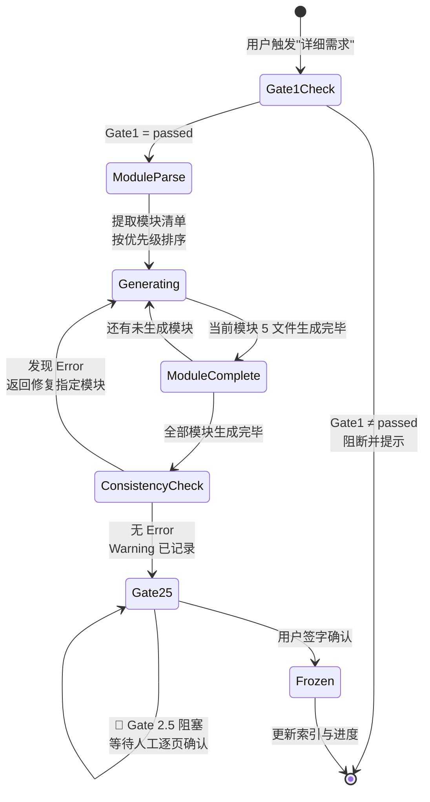
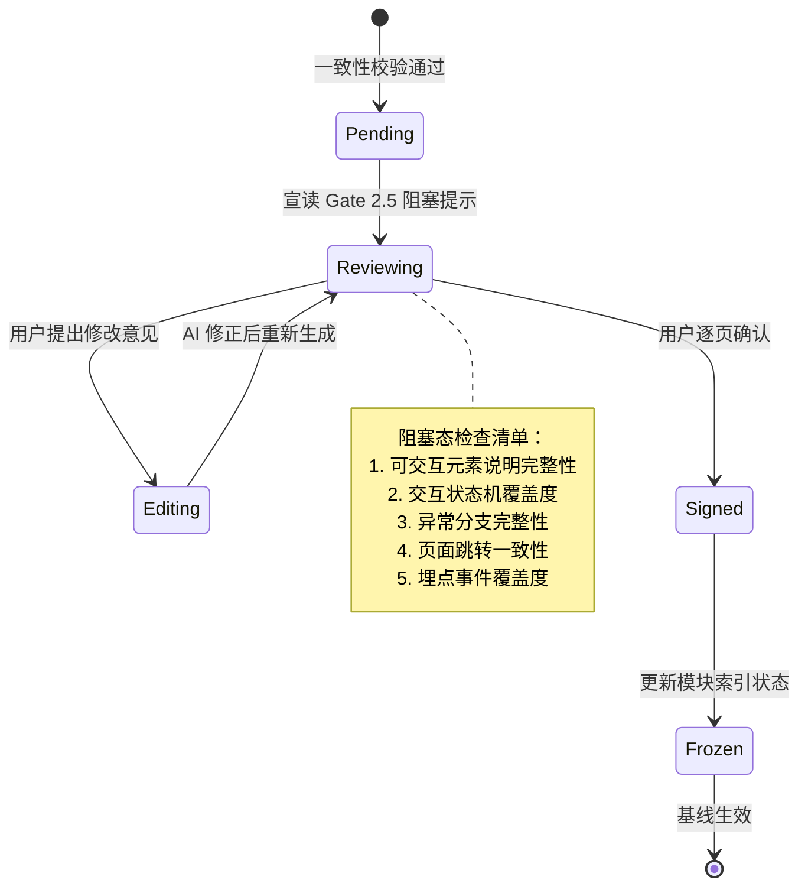

# Detailed Requirements 详细需求生成器 — 设计文档

> **Skill ID**：`detailed-requirements`  
> **版本**：V2.1  
> **设计目标**：基于已冻结的概要需求基线，将模块清单逐层拆解为标准化、可验证、可消费的模块级详细规格，并通过人工冻结闸门确保交互规格质量  
> **更新日期**：2026-05-08

---

## 目录

1. [设计目标](#1-设计目标)
2. [核心概念](#2-核心概念)
3. [架构设计（IPO）](#3-架构设计ipo)
4. [状态机与数据模型](#4-状态机与数据模型)
5. [集成方案](#5-集成方案)
6. [文件格式规范](#6-文件格式规范)
7. [安全与审计](#7-安全与审计)
8. [后期演进方向](#8-后期演进方向)

---

## 1. 设计目标

### 1.1 核心目标

| 目标维度 | 具体定义 | 成功指标 |
|---------|---------|---------|
| **基线继承性** | 100% 基于已冻结的 PRD-000 五文件生成，不得擅自引入概要阶段未定义的新实体或 Scope | 模块 spec 中追溯至上游需求的覆盖率 ≥ 95% |
| **模块标准化** | 每个模块输出统一的 5 文件规格，消除「不同模块文档风格不一致」的问题 | 所有模块文件结构一致性 = 100% |
| **交互规格精确性** | 按钮级交互状态机覆盖所有可交互元素，消除「开发凭感觉实现交互」的灰色地带 | 可交互元素交互规格覆盖率 ≥ 98% |
| **跨模块一致性** | 字段、状态、接口、交互规格在多模块间保持零冲突 | Error 等级冲突数 = 0（冻结前） |
| **人工可控性** | Gate 2.5 引入原型冻结阻塞点，AI 不得自动确认交互规格 | 100% 交互规格需人工逐页确认 |

### 1.2 设计原则

1. **串行生成，逐模块深度**：禁止并行批量生成，防止上下文丢失、编号混乱和模块间状态污染。
2. **WHAT 而非 HOW**：详细需求只描述「系统应该做什么」，不写代码、不写 SQL、不定义 API 端点、不画类图。
3. **上游基线只读**：`03-functional-structure.md` 中的模块清单是硬性输入，不得擅自合并、拆分或重命名模块。
4. **交互规格原子化**：每个可交互元素必须定义完整的七维状态机（触发方式、前置条件、立即反馈、成功结果、失败结果、异常分支、埋点事件）。
5. **冲突即阻塞**：模块间一致性校验发现 Error 等级冲突时，必须修复后方可进入下游设计阶段。

---

## 2. 核心概念

### 2.1 五文件模块规格（Module Spec Suite）

每个功能模块必须输出以下 5 个标准文件：

| 文件 | 核心职责 | 关键内容 | 下游消费方 |
|------|---------|---------|-----------|
| `spec.md` | 需求追溯与范围界定 | 上游需求追溯、功能 IN/OUT、验收标准（AC Taxonomy）、假设注册表 | 测试、项目管理 |
| `prototype.md` | 原型结构定义 | 页面/入口清单、文字化布局结构、交互流程、Mermaid 页面跳转图 | UI/UX 设计、前端开发 |
| `io-table.md` | 数据契约定义 | 用户输入/系统输入/页面回显/接口响应字段表、数据类型、约束、数据流转图 | 后端开发、接口设计 |
| `logic.md` | 业务逻辑定义 | 核心业务流程 Mermaid、业务规则映射、状态机（stateDiagram-v2）、异常处理 | 后端开发、架构师 |
| `interaction-spec.md` | 交互状态机定义（V2.1 新增） | 按钮级交互状态机：触发方式、前置条件、立即反馈、成功/失败结果、异常分支、埋点事件 | 前端开发、产品经理、数据分析师 |

### 2.2 按钮级交互状态机（V2.1 新增）

interaction-spec.md 的核心数据结构：

```typescript
interface InteractionSpec {
  page: string;           // 页面路径，如 "/login"
  element: string;        // 元素标识，如 "#btn-submit"
  elementType: "button" | "input" | "select" | "link" | "toggle";
  
  trigger: "click" | "hover" | "focus" | "submit" | "drag";
  
  preconditions: {
    userState?: string;   // 如 "已登录 / 未登录"
    permission?: string;  // 如 "admin"
    dataCondition?: string; // 如 "表单校验通过"
  };
  
  immediateFeedback: {
    type: "loading" | "disabled" | "toast" | "none";
    description: string;  // 如 "按钮置灰禁用，显示 loading spinner"
  };
  
  successResult: {
    action: "navigate" | "updateData" | "closeModal" | "showMessage";
    target?: string;      // 如 "/dashboard"
    sideEffects?: string[];
  };
  
  failureResult: {
    errorLocation: string; // 如 "密码框下方"
    errorCopy: string;     // 如 "用户名或密码错误"
    retryMechanism: string; // 如 "保留用户名，清空密码，允许重试"
  };
  
  exceptionBranches: {
    networkDown: string;
    permissionDenied: string;
    emptyData: string;
    timeout: string;       // 如 "5s 超时 → 显示重试按钮"
  };
  
  trackingEvent: {
    eventName: string;     // 如 "login_submit"
    triggerTiming: string; // 如 "点击提交时"
    parameters: Record<string, string>; // 如 { source: "web", timestamp: "ISO8601" }
  };
}
```

**设计约束**：
- 每个页面必须列出**所有**可交互元素，遗漏视为规格不完整
- 禁止只写"点击提交按钮"而无状态机细节
- 即使模块无前端页面（如纯后台服务），也必须显式声明「本模块无用户交互界面，交互规格 N/A」

### 2.3 验收标准分类（AC Taxonomy）

每个模块的 `spec.md` 必须覆盖 5 类验收标准：

| 类型 | 缩写 | 定义 | 强制规则 |
|------|------|------|---------|
| Behavioral | B | 正向功能行为 | 必须覆盖所有核心用户场景 |
| Non-behavioral | NB | 性能、安全、可用性等非功能要求 | 必须与 05-non-functional.md 对齐 |
| Negative | N | 系统明确不支持的行为 | **必须 ≥ 1 条**，防止需求蔓延 |
| Edge case | E | 边界条件和异常输入 | **必须 ≥ 1 条** |
| Dependency | D | 外部依赖条件 | 如「用户服务 API v2 必须可用」 |

质量分规则：
- 核心 Definition of Done（DoD）AC 质量分 = 3（最高）
- 所有 AC 质量分 ≥ 2
- 需求描述强制使用 Given/When/Then 格式

### 2.4 模块间一致性校验（Cross-Module Consistency Check）

```
校验维度（6 维）：
├── 字段一致性
│   └── 同名字段在不同模块 io-table 中类型/约束/默认值是否一致
├── 状态枚举一致性
│   └── 同一业务实体状态值在多个模块 logic.md 中是否冲突
├── 接口依赖闭环
│   └── 模块 A 依赖模块 B 的接口，模块 B 的 io-table/logic 是否定义该接口
├── 业务规则冲突
│   └── 同一规则在不同模块 logic.md 中逻辑是否矛盾
├── 需求覆盖完整性
│   └── 02-requirements-list.md 中的需求是否被所有模块 spec.md 覆盖
└── 交互规格冲突（V2.1 新增）
    └── 同一页面元素在不同模块 interaction-spec.md 中定义矛盾

错误等级：
- Error：必须修复，阻塞进入下游
- Warning：需确认，不阻塞但需记录
```

### 2.5 Gate 2.5 原型冻结（V2.1 新增）

全部模块生成且一致性校验通过后，系统自动进入 **🚪 Gate 2.5 阻塞状态**。此机制针对「按钮级状态机遗漏是上线后用户体验不一致的主因」这一痛点，强制要求人工逐页确认交互规格。

---

## 3. 架构设计（IPO）

### 3.1 输入层（Input）

| 输入源 | 类型 | 必/选 | 说明 |
|--------|------|-------|------|
| `03-functional-structure.md` | 上游文档 | **硬性前置** | 模块清单、模块名、优先级、目录映射 |
| `01-product-overview.md` | 上游文档 | 必选 | 产品全景、JTBD、北极星指标 |
| `02-requirements-list.md` | 上游文档 | 必选 | 需求清单、用户故事、术语表 |
| `04-business-rules.md` | 上游文档 | 必选 | 全局业务规则、RBAC、状态机 |
| `05-non-functional.md` | 上游文档 | 必选 | NFR 约束、技术栈、里程碑 |
| **🚪 Gate 1 签字状态** | 状态标记 | **硬性前置** | `human-decisions.md` 中 Gate1 = `passed`，未通过禁止启动 |
| `market-positioning.md` | 上游文档 | 可选 | 竞品差异化结论，用于校验需求一致性 |

**前置守卫条件**：

```
if Gate1.status != "passed":
    阻断执行，提示用户"请先完成 prd-generation 并确认 Gate 1 冻结"
    return

if 03-functional-structure.md 不存在:
    阻断执行，提示用户"缺少模块清单，请先执行 prd-generation"
    return
```

### 3.2 处理层（Process）

```
┌─────────────────────────────────────────────────────────────┐
│                         处理引擎                              │
├─────────────────────────────────────────────────────────────┤
│  Phase 1: 模块识别                                            │
│    ├── 读取 03-functional-structure.md                        │
│    ├── 按 ## 标题层级提取模块列表                              │
│    ├── 编号映射：feature-{NN}-{kebab-case-name}               │
│    └── 优先级排序：P0 → P1 → P2                               │
│                          ↓                                   │
│  Phase 2: 逐模块生成（串行）                                  │
│    ├── 为当前模块创建 feature-XX-{模块}/ 目录                  │
│    ├── 生成 _index.md（模块索引）                             │
│    ├── 生成 spec.md（需求追溯 + AC Taxonomy）                 │
│    ├── 生成 prototype.md（文字化原型 + 页面跳转图）            │
│    ├── 生成 io-table.md（字段契约 + 数据流转）                │
│    ├── 生成 logic.md（业务流程 + 状态机）                     │
│    └── 生成 interaction-spec.md（按钮级交互状态机）           │
│    └── [循环至下一个模块]                                     │
│                          ↓                                   │
│  Phase 3: 模块间一致性校验                                    │
│    ├── 字段一致性扫描                                         │
│    ├── 状态枚举一致性扫描                                     │
│    ├── 接口依赖闭环检查                                       │
│    ├── 业务规则冲突检测                                       │
│    ├── 需求覆盖完整性检查                                     │
│    └── 交互规格冲突检测（V2.1 新增）                          │
│    └── 生成 _consistency-report.md                            │
│    └── if Error > 0: 阻断，返回修复                           │
│                          ↓                                   │
│  Phase 4: 🚪 Gate 2.5 原型冻结（V2.1 新增）                   │
│    ├── 自动宣读阻塞提示                                       │
│    ├── 等待人工逐页确认                                       │
│    └── 签字后：更新 _modules-index.md → "原型已冻结"          │
└─────────────────────────────────────────────────────────────┘
```

### 3.3 输出层（Output）

| 输出物 | 路径 | 格式 | 消费方 |
|--------|------|------|--------|
| 模块规格文件 × 5 | `openspec/changes/{变更名}/specs/feature-XX-{模块}/` | Markdown + Mermaid | high-level-design、前端/后端开发、测试 |
| 模块索引 | `_modules-index.md` | Markdown | 项目管理、进度跟踪 |
| 一致性校验报告 | `_consistency-report.md` | Markdown | 架构师、QA |
| 进度更新 | `progress.md` | Markdown | progress-tracker |
| 决策记录 | `human-decisions.md` | Markdown | human Skill |

---

## 4. 状态机与数据模型

### 4.1 模块生成状态机



**状态转移规则**：

| 当前状态 | 触发事件 | 下一状态 | 守卫条件 |
|---------|---------|---------|---------|
| Gate1Check | 用户触发 | ModuleParse | `human-decisions.md` 中 `Gate1.status == "passed"` |
| Gate1Check | Gate1 未通过 | [*] | 阻断，输出提示 |
| ModuleParse | 解析完成 | Generating | 模块清单非空且格式合法 |
| Generating | 单模块完成 | ModuleComplete | 5 个文件均已写入 |
| ModuleComplete | 还有模块 | Generating | 未生成模块数 > 0 |
| ModuleComplete | 全部完成 | ConsistencyCheck | 未生成模块数 = 0 |
| ConsistencyCheck | Error > 0 | Generating | 需修复的模块列表已生成 |
| ConsistencyCheck | Error = 0 | Gate25 | Warning 已写入报告 |
| Gate25 | 用户确认 | Frozen | 用户回复确认或 `/skill:human gate=Gate2.5 action=sign-off` |
| Frozen | 基线锁定 | [*] | `_modules-index.md` 已更新，progress-tracker 已同步 |

### 4.2 Gate 2.5 冻结状态机（V2.1 新增）



### 4.3 数据模型

#### 4.3.1 模块目录结构模型

```
openspec/changes/{变更名}/specs/
├── feature-XX-{模块A}/
│   ├── _index.md              # 模块级索引
│   ├── spec.md                # 需求追溯 + AC
│   ├── prototype.md           # 原型结构
│   ├── io-table.md            # 数据契约
│   ├── logic.md               # 业务逻辑 + 状态机
│   └── interaction-spec.md    # 交互状态机（V2.1 新增）
├── feature-XX-{模块B}/
│   └── ...
├── _modules-index.md          # 全局模块索引
└── _consistency-report.md     # 一致性校验报告
```

#### 4.3.2 全局模块索引数据模型

```typescript
interface ModulesIndex {
  version: string;           // "2.1.0"
  lastUpdated: string;       // ISO8601
  source: string;            // "03-functional-structure.md"
  modules: ModuleEntry[];
}

interface ModuleEntry {
  featureId: string;         // "feature-01"
  moduleName: string;        // "剧本工坊"
  kebabName: string;         // "script-workshop"
  directory: string;         // "feature-01-script-workshop/"
  priority: "P0" | "P1" | "P2";
  status: "待编写" | "进行中" | "规格已生成" | "原型已冻结" | "已交付";
  upstreamRequirements: string[]; // 追溯的 US-XXX 列表
  acCount: number;           // 验收标准数量
  interactionCount: number;  // 交互元素数量（V2.1）
  errorCount: number;        // 一致性校验 Error 数
  warningCount: number;      // 一致性校验 Warning 数
}
```

#### 4.3.3 一致性校验报告数据模型

```typescript
interface ConsistencyReport {
  version: string;
  generatedAt: string;
  summary: {
    totalModules: number;
    totalErrors: number;
    totalWarnings: number;
    status: "PASS" | "BLOCKED"; // BLOCKED if Error > 0
  };
  checks: CheckResult[];
}

interface CheckResult {
  dimension: "field" | "state" | "interface" | "rule" | "coverage" | "interaction";
  severity: "Error" | "Warning";
  description: string;
  affectedModules: string[];  // ["feature-01", "feature-03"]
  suggestion: string;
}
```

#### 4.3.4 交互规格冲突检测模型（V2.1 新增）

```typescript
interface InteractionConflict {
  type: "interaction-conflict";
  severity: "Error";
  element: string;           // 如 "#btn-submit"
  page: string;              // 如 "/login"
  conflictingModules: string[]; // 定义矛盾的模块列表
  conflictDetails: {
    moduleA: string;
    definitionA: InteractionSpec;
    moduleB: string;
    definitionB: InteractionSpec;
    diffFields: string[];    // 如 ["trigger", "successResult.action"]
  };
}
```

---

## 5. 集成方案

### 5.1 数据流图

```
[prd-generation] ──→ 产出 PRD-000 五文件
    ↓
    ├── Gate 1 签字（human Skill）
    ↓
[detailed-requirements] ──→ 读取 03-functional-structure.md
    ├── 按模块生成 feature-XX-{模块}/
    ├── 执行一致性校验
    ├── 产出 _modules-index.md + _consistency-report.md
    ↓
    ├──→ [high-level-design] 读取各模块 logic.md + io-table.md
    ├──→ [self-check] 读取全部模块文件执行最终校验
    └──→ [human] Gate 2.5 签字记录
              ↓
    [progress-tracker] 贯穿全程，更新 progress.md
```

### 5.2 上游接口契约

| 上游 Skill | 输入文件 | 关键字段 | 容错策略 |
|-----------|----------|---------|---------|
| `prd-generation` | `03-functional-structure.md` | 模块清单（`##` 标题层级）、模块名、优先级 | 若模块清单为空或格式异常，阻断并提示用户重新执行 prd-generation |
| `prd-generation` | `02-requirements-list.md` | US-XXX 用户故事、P0/P1/P2 分级 | 若需求未被模块覆盖，标记 Warning |
| `human` | `human-decisions.md` | `Gate1.status` | 必须为 `passed`，否则阻断 |

### 5.3 下游接口契约

| 下游 Skill | 输入文件 | 关键依赖 | 接口稳定性 |
|-----------|----------|---------|-----------|
| `high-level-design` | `feature-XX-*/logic.md` | 业务规则、状态机、异常处理 | 冻结后只读 |
| `high-level-design` | `feature-XX-*/io-table.md` | 字段契约、接口依赖 | 冻结后只读 |
| `self-check` | 全部模块文件 | 完整性、一致性、可追溯性 | 每次变更后重新执行 |
| `human` | `feature-XX-*/interaction-spec.md` | Gate 2.5 签字确认 | 双向交互 |

### 5.4 贯穿式协作接口

| 协作 Skill | 协作时机 | 数据交换 | 方向 |
|-----------|---------|---------|------|
| `progress-tracker` | 每模块生成后 + Gate 2.5 后 | 阶段状态更新（阶段 2.5 → 已完成） | 单向写入 progress.md |
| `self-check` | Gate 2.5 冻结后 | 全部模块文件 → 自查报告 | 单向调用 |
| `human` | Gate 2.5 签字时 | 用户决策 → `human-decisions.md` | 双向 |

---

## 6. 文件格式规范

### 6.1 模块内五文件规范

| 文件名 | 必需 Frontmatter | 章节结构（H2） | Mermaid 图表 |
|--------|-----------------|--------------|-------------|
| `_index.md` | `version`、`status`、`last_updated`、`upstream_prd` | 模块概述、文件清单、变更日志 | 无 |
| `spec.md` | 同上 | 需求追溯、功能范围（IN/OUT）、验收标准、假设注册表 | 无 |
| `prototype.md` | 同上 | 页面清单、布局结构、交互流程、页面跳转图 | 页面跳转图（graph LR） |
| `io-table.md` | 同上 | 输入字段表、输出字段表、系统字段表、数据流转 | 数据流转图（可选） |
| `logic.md` | 同上 | 业务流程、业务规则映射、状态机、异常处理 | 流程图 + 状态机（stateDiagram-v2） |
| `interaction-spec.md` | 同上（V2.1 新增） | 页面列表、元素级交互状态机、页面跳转图 | 页面跳转图（graph LR） |

### 6.2 interaction-spec.md 强制格式（V2.1 新增）

每个可交互元素必须按以下表格输出：

```markdown
### 元素：{元素名}（{选择器}）

| 属性 | 说明 |
|------|------|
| 触发方式 | click / hover / focus / submit / 拖拽 |
| 前置条件 | {用户状态} + {权限} + {数据条件} |
| 立即反馈 | {loading/禁用/toast/无} |
| 成功结果 | {页面跳转/数据更新/弹窗关闭} |
| 失败结果 | {错误位置} + {文案} + {重试机制} |
| 异常分支 | 网络中断 → {处理}；权限不足 → {处理}；数据为空 → {处理}；超时 → {处理} |
| 埋点事件 | `{事件名}`，携带参数：{key: value} |
```

### 6.3 验收标准（AC）格式规范

```markdown
| # | 类型 | 标准描述 | 质量分 |
|---|------|----------|:------:|
| AC-1 | Behavioral | Given ... When ... Then ... | 3 |
| AC-2 | Non-behavioral | ... | 3 |
| AC-3 | Negative | 系统明确不支持 ... | 3 |
| AC-4 | Edge case | 当 ... | 2 |
| AC-5 | Dependency | ... 必须可用 | 3 |
```

强制规则：
- Negative ≥ 1 条
- Edge case ≥ 1 条
- 核心 DoD AC 质量分 = 3
- 全部 AC 质量分 ≥ 2

### 6.4 模块命名约束

```
03-functional-structure.md 中的模块名
    ↓ 必须保持一致
feature-XX-{kebab-case-name}/ 目录名
    ↓ 必须保持一致
detailed-requirements 生成的目录名

编号规则：
- P0 模块：feature-01 ~ feature-09
- P1 模块：feature-10 ~ feature-19
- P2 模块：feature-20+
```

---

## 7. 安全与审计

### 7.1 Gate 2.5 阻塞机制的安全设计

| 安全属性 | 实现方式 |
|---------|---------|
| **不可绕过性** | AI 明确禁止在未经人工逐页确认的情况下自动通过 Gate 2.5；用户需显式回复确认或执行 `/skill:human gate=Gate2.5 action=sign-off` |
| **检查清单引导** | 阻塞提示中包含 5 项逐页检查清单，降低用户「闭眼确认」的概率 |
| **状态持久化** | 签字后 `_modules-index.md` 中模块状态更新为「原型已冻结」，可供外部工具审计 |
| **变更追溯** | 若冻结后需修改交互规格，必须通过 `human` Skill 记录决策，并重新进入 Phase 3 一致性校验 |

### 7.2 一致性校验的 Error 等级安全策略

```
Error 等级定义（不可降级）：
├── 字段一致性 Error：同名字段类型冲突可能导致数据序列化失败
├── 状态枚举一致性 Error：状态值冲突可能导致业务逻辑死锁
├── 接口依赖闭环 Error：未定义的接口调用可能导致运行时异常
└── 交互规格冲突 Error（V2.1 新增）：同一元素在不同模块中定义矛盾，导致前端实现不一致

阻断规则：
- Error 数量 > 0 → 硬性阻断，禁止进入 high-level-design
- Warning 数量 > 0 → 允许通过，但需写入 _consistency-report.md 并提示用户
```

### 7.3 防需求蔓延机制

| 机制 | 实现 |
|------|------|
| **Negative AC** | 每条模块必须包含 ≥1 条 Negative 验收标准，明确声明「系统不做 X」 |
| **上游追溯** | 每条 AC 必须追溯至 `02-requirements-list.md` 的 US-XXX，无追溯来源的 AC 需用户确认是否为新增需求 |
| **基线变更审计** | 若详细阶段发现需要新增实体或 Scope，必须回溯修改 PRD-000 并升版，不得直接在详细规格中引入 |

### 7.4 内容红线审计

```
禁止内容（自动检测并阻断）：
- ❌ 代码片段、伪代码、SQL
- ❌ API 端点规格（如 GET /api/v1/users）
- ❌ 数据库表结构、类图
- ❌ 技术栈决策（如"使用 Redis 做缓存"）

允许内容：
- ✅ "系统应支持用户按时间范围筛选订单"
- ✅ "筛选结果应在 2 秒内返回"
- ✅ "无结果时显示空状态页面"
```

---

## 8. 后期演进方向

### 8.1 短期（V2.2 ~ V2.3）

1. **交互规格可视化预览**：将 interaction-spec.md 中的状态机自动转换为简单的交互流程图（Mermaid 或 ASCII），降低人工逐页审查的认知负荷。
2. **AC 自动生成测试骨架**：基于 spec.md 中的 Given/When/Then 格式，自动生成行为驱动开发（BDD）测试用例模板。
3. **模块拆分智能校验**：若发现某模块的 interaction-spec.md 中可交互元素数量超过阈值（如 50+），提示用户该模块可能粒度过大，建议拆分。

### 8.2 中期（V2.5 ~ V3.0）

1. **需求-设计-测试追溯链**：建立 US-XXX → AC → 测试用例 → 代码提交的完整追溯链，支持影响分析。
2. **交互规格与 UI 设计稿对齐**：支持用户上传 Figma/Sketch 链接，AI 自动比对 interaction-spec.md 与设计稿的交互一致性。
3. **动态一致性监控**：详细需求冻结后，若上游 PRD-000 升版，自动检测哪些模块文件受影响并标记「需重新评审」。

### 8.3 长期（V3.0+）

1. **自然语言转交互规格**：用户用自然语言描述交互流程，AI 自动转化为结构化的 interaction-spec.md 表格。
2. **多模态交互规格**：支持语音、手势、键盘快捷键等非点击类交互的状态机定义。
3. **行业标准库集成**：内置电商、SaaS、金融等行业的标准交互模式库（如「标准登录流程」「标准购物车流程」），支持一键引用并自动填充 interaction-spec.md。

---

## 附录 A：参考文档

| 文档 | 路径 | 说明 |
|------|------|------|
| Skill 主入口 | `skills/sdlc/detailed-requirements/SKILL.md` | AI 执行时的核心指令 |
| 元数据 | `skills/sdlc/detailed-requirements/meta.json` | 版本、标签、平台兼容 |
| 使用手册 | `docs/skill-usage/detailed-requirements-使用手册.md` | 面向终端用户的使用指南 |
| prd-generation 设计文档 | `docs/skill-design/prd-generation-设计文档.md` | 上游 Skill 接口定义 |

---

## 附录 B：变更日志

| 版本 | 日期 | 变更 |
|------|------|------|
| V2.1 | 2026-05-08 | 新增 `interaction-spec.md`（按钮级交互状态机）；新增交互规格冲突校验（Error 等级）；新增 🚪 Gate 2.5 原型冻结阻塞提示；强化串行生成与模块边界约束。 |
| V1.1 | 2026-05-07 | 初始版本。基于 prd-generation 五文件，按模块串行生成 spec/prototype/io-table/logic 四文件；执行模块间一致性校验（字段/状态/接口/规则/覆盖）。 |
