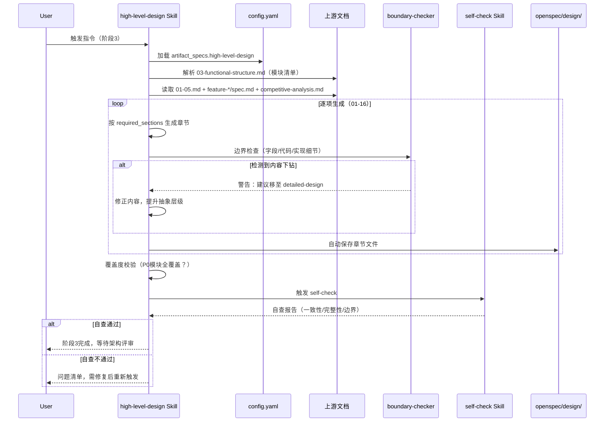

# high-level-design Skill 设计规格书

> 本文档面向 Skill 维护者与开发者，说明 `high-level-design` 的内部机制、章节模板、边界规则与开源复用分析。

---

## 一、Skill 元信息

| 属性 | 内容 |
|------|------|
| Skill ID | `high-level-design` |
| 中文名 | 概要设计生成器 |
| 所属阶段 | SDLC 阶段 3（设计阶段） |
| 核心职责 | 基于已冻结 PRD 和详细需求，正向生成系统概要设计文档 |
| 设计原则 | 正向设计、严格边界（影响≥2模块）、配置驱动、图表自治 |
| 开源借鉴 | `openclaw-master-skills/architecture-blueprint-generator` |
| 版本 | v1.0.0 |

---

## 二、目录结构

```
skills/sdlc/high-level-design/
├── SKILL.md                    # Skill 入口定义（核心指令 + 触发场景）
├── meta.json                   # 扩展元数据（版本、标签、兼容平台）
└── references/
    ├── REFERENCE.md            # 16 个章节的详细写作指南与模板
    └── boundary-rules.md       # 边界红线与阶段门控规则
```

### 文件职责

| 文件 | 职责 | 加载时机 |
|------|------|----------|
| `SKILL.md` | Frontmatter（name + description）+ 核心处理逻辑 + Gotchas | 匹配成功后加载 |
| `references/REFERENCE.md` | 各章节的详细模板、Mermaid 示例、开源借鉴说明 | 执行时按需加载 |
| `references/boundary-rules.md` | must_be_here / must_not_be_here 清单、变更影响判定、设计锁定原则 | 边界自检时按需加载 |

---

## 三、核心处理逻辑

### 3.1 执行时序



### 3.2 七步工作流

| 步骤 | 动作 | 关键产出 |
|------|------|----------|
| Step 1 | 配置加载与校验 | 确认 required_sections、DETAIL_LEVEL、开关变量 |
| Step 2 | 上游文档解析 | 模块清单、P0范围、NFR指标、竞品结论、功能点汇总 |
| Step 3 | 逐项生成 | 16 个章节 Markdown + Mermaid 图表 |
| Step 4 | 边界自检 | 内容下钻警告清单（若有） |
| Step 5 | 覆盖度校验 | 模块覆盖度、技术选型溯源、需求追溯报告 |
| Step 6 | 自动保存 | `openspec/changes/{变更名}/design/*.md` |
| Step 7 | 触发 self-check | 结构化自查报告 |

---

## 四、配置变量体系

### 4.1 静态配置（config.yaml）

```yaml
high-level-design:
  target_reader: "技术负责人、架构师、项目经理、跨团队TL"
  core_questions:
    - "系统拆成几块？"
    - "数据怎么走？"
    - "用什么技术栈？"
  required_sections:
    - system_architecture
    - tech_stack
    - data_architecture
    - interface_contracts
    - module_responsibilities
    - state_machine_global
    - sequence_diagrams
    - algorithm_selection
    - security_design
    - performance_design
    - exception_handling_global
    - deployment_architecture
    - test_strategy
    - extensibility_design
    - decision_records
    - governance_rules
  format: "Markdown + Mermaid 图表"
```

### 4.2 运行时配置

| 配置项 | 类型 | 默认值 | 说明 |
|--------|------|--------|------|
| `DETAIL_LEVEL` | enum | `Detailed` | `High-level` / `Detailed` / `Comprehensive` |
| `INCLUDES_DECISION_RECORDS` | bool | `true` | 是否输出 ADR |
| `FOCUS_ON_EXTENSIBILITY` | bool | `true` | 是否重点分析扩展性 |
| `DIAGRAM_STANDARD` | enum | `Mermaid` | `Mermaid` / `C4-Model` |
| `INCLUDES_GOVERNANCE` | bool | `true` | 是否输出架构治理规则 |

### 4.3 边界红线规则

```yaml
boundary_rules:
  must_be_here:                    # 必须在概要设计层
    - "新增/删除微服务或模块"
    - "更换技术栈（语言、框架、数据库类型、AI模型基座）"
    - "调整核心数据流（如同步改异步队列）"
    - "修改全局状态机（如状态数变更）"
    - "变更认证/授权方案"
    - "数据库选型变更"
  must_not_be_here:                # 禁止出现在概要设计
    - "接口字段级校验规则"
    - "物理表字段/索引/DDL"
    - "算法流程和参数调优"
    - "单接口异常码和补偿事务"
    - "类图和函数签名"
    - "模块内部调用链"
    - "单测用例和Mock策略"
```

### 4.4 设计锁定原则

```yaml
lock_rules:
  freeze_after_review: true
  change_requires: "架构评审会重新评审"
  forbidden_before_review:
    - detailed-design
    - task-breakdown
    - implementation
```

---

## 五、输入规范

### 5.1 上游 Skill 产出（必须全部就绪）

| 输入来源 | 文件路径 | 用途 | 必填 |
|----------|----------|------|------|
| 产品概述 | `openspec/changes/{变更名}/specs/01-product-overview.md` | 产品背景、用户、价值 | ✅ |
| 需求清单 | `openspec/changes/{变更名}/specs/02-requirements-list.md` | P0/P1/P2 功能范围 | ✅ |
| 功能结构 | `openspec/changes/{变更名}/specs/03-functional-structure.md` | 核心输入 — 模块列表，决定架构拆分 | ✅ |
| 全局业务规则 | `openspec/changes/{变更名}/specs/04-business-rules.md` | 约束架构设计 | ✅ |
| 非功能需求 | `openspec/changes/{变更名}/specs/05-non-functional.md` | 性能/安全/可靠性指标 | ✅ |
| 详细需求 | `openspec/changes/{变更名}/specs/feature-*/spec.md` | 各模块功能细节，确保架构覆盖 | ✅ |
| 竞品分析报告 | `openspec/changes/{变更名}/design/competitive-analysis.md` | 完整竞品分析，供人工评审 | ⚠️ 强烈推荐 |
| 设计输入 | `openspec/changes/{变更名}/design/design-input.md` | 结构化技术选型约束，供 `high-level-design` 自动消费 | ⚠️ 强烈推荐 |

### 5.2 配置输入

`openspec/config.yaml` 中的 `artifact_specs.high-level-design` 定义。

---

## 六、输出规范

### 6.1 产出物清单（16 个文件）

| # | 文件名 | 内容边界 | 图表要求 | 开源借鉴 |
|---|--------|----------|----------|----------|
| 01 | `01-system-architecture.md` | 分层/服务划分、部署拓扑 | Mermaid 架构图（C4分层） | C4-Model 思想 |
| 02 | `02-tech-stack.md` | 选型及理由、备选排除 | 无 | ADR 溯源 |
| 03 | `03-data-architecture.md` | 逻辑ER、数据流、存储策略 | Mermaid ER图 + 数据流图 | 开源第6章 |
| 04 | `04-interface-contracts.md` | 模块间通信模式、数据契约 | Mermaid 组件交互图 | 开源第8章 |
| 05 | `05-module-responsibilities.md` | 每个模块输入/输出/职责/依赖 | 表格 | 开源第4章 |
| 06 | `06-state-machine-global.md` | 跨模块核心实体状态 | Mermaid 状态图 | - |
| 07 | `07-sequence-diagrams.md` | 跨模块关键流程 | Mermaid 时序图 | - |
| 08 | `08-algorithm-selection.md` | AI模型基座、选型理由、IO维度 | 无 | - |
| 09 | `09-security-design.md` | 认证授权、加密、网络隔离 | 无 | 开源第7章（安全） |
| 10 | `10-performance-design.md` | QPS、缓存策略、异步化 | 无 | 开源第7章（性能） |
| 11 | `11-exception-handling-global.md` | 异常分类、降级、熔断、重试 | 无 | 开源第7章（韧性） |
| 12 | `12-deployment-architecture.md` | 容器化、K8s、CI/CD | Mermaid 部署拓扑 | 开源第12章 |
| 13 | `13-test-strategy.md` | 测试金字塔、分层、覆盖率 | 无 | 开源第11章 |
| 14 | `14-extensibility-design.md` | 功能添加/修改/集成模式 | 无 | 开源第13章 |
| 15 | `15-decision-records.md` | 关键决策正向论证 | 无 | 开源第15章 |
| 16 | `16-governance-rules.md` | 一致性维护、自动化检查 | 无 | 开源第16章 |

### 6.2 保存路径

```
openspec/changes/{变更名}/design/
├── 01-system-architecture.md
├── 02-tech-stack.md
├── ...
└── 16-governance-rules.md
```

### 6.3 下游 Skill 消费

| 下游 Skill | 消费文档 | 衔接规则 |
|------------|----------|----------|
| `detailed-design` | `design/*.md` | 概要设计评审通过后，按模块逐一下钻 |
| `task-breakdown` | `design/*.md` + `detail-design/feature-*/design.md` | 基于架构分层拆解任务 |

---

## 七、边界检查清单（生成时自测）

每生成一个章节后，扫描以下内容：

| 检测项 | 触发词/模式 | 处理方式 |
|--------|-------------|----------|
| SQL/DDL | `CREATE TABLE`、`ALTER`、`INDEX` | 标记内容下钻 |
| 字段类型 | `varchar`、`int`、`JSONB`、`TEXT` | 标记内容下钻 |
| 编程语言关键字 | `class`、`def`、`function`、`interface` | 标记内容下钻 |
| 框架注解 | `@RequestBody`、`@Entity`、`@Component` | 标记内容下钻 |
| 具体异常码 | `ERR_`、`CODE_`、`E1001` | 标记内容下钻 |
| 算法参数 | `temperature`、`top_p`、`max_tokens` | 标记内容下钻 |
| 模块内部调用链 | `Controller`、`Service`、`DAO`、`Repository` | 标记内容下钻 |
| 测试断言 | `assert`、`expect`、`mock`、`patch` | 标记内容下钻 |
| 缓存具体配置 | `TTL=`、`expire=`、`key=` | 标记内容下钻 |

若命中 ≥1 项，标记为**内容下钻**警告，必须提升抽象层级后重新输出。

---

## 八、自查检查清单（self-check 内置）

| 检查项 | 检查内容 | 严重等级 |
|--------|----------|----------|
| 架构覆盖度 | 是否覆盖 `03-functional-structure.md` 中所有 P0 模块 | 🔴 阻塞 |
| 技术选型溯源 | 每个技术选型是否在 `competitive-analysis.md` 中有结论支撑 | 🔴 阻塞 |
| 需求追溯 | 每个全局状态/接口契约是否追溯到需求清单中的业务规则 | 🟡 警告 |
| 边界合规性 | 是否包含字段级定义、代码片段、类图、DDL、算法参数 | 🔴 阻塞 |
| 内容一致性 | 与概要需求、详细需求、竞品分析无矛盾 | 🔴 阻塞 |
| 内容完整性 | 是否覆盖 `config.yaml` 中 `required_sections` 所有章节 | 🟡 警告 |
| 交叉引用有效性 | 文档间 `@引用` 是否可解析 | 🟡 警告 |
| 图表完整性 | 是否生成必需的 Mermaid 图表（架构/ER/时序/部署） | 🟡 警告 |
| ADR 完整性 | 若 `INCLUDES_DECISION_RECORDS=true`，是否覆盖关键决策 | 🟢 提示 |

---

## 九、开源复用分析

### 9.1 根本差异：正向设计 vs 逆向分析

| 维度 | `architecture-blueprint-generator`（开源） | `high-level-design`（本方案） |
|------|-------------------------------------------|------------------------------|
| 输入 | 现有代码库（文件、配置、依赖） | 概要需求 + 详细需求 + 竞品分析 |
| 方向 | 逆向（代码 → 文档） | 正向（需求 → 设计） |
| 目标读者 | 维护者、新加入开发者、架构审计 | 技术负责人、架构师、项目经理 |
| 时机 | 项目运行中/维护期/交接期 | 项目启动前/设计阶段 |
| 核心问题 | "现有系统是怎么组织的？" | "新系统应该怎么组织？" |
| 技术栈 | 必须已知/可检测 | 需要选型论证 |
| ADR | 逆向推导已有决策 | 正向论证待做决策 |

### 9.2 内容章节对比矩阵

| 章节 | 开源 Skill | 本方案 HLD | 差异分析 |
|------|-----------|-----------|----------|
| 架构检测 | ✅ 自动扫描代码 | ❌ 无（新系统无代码可扫） | 不可复用 |
| 架构总览 | ✅ 解释现有架构 | ✅ 定义目标架构 | 理念相通，可借鉴表述方式 |
| 可视化图表 | ✅ C4/UML/Flow/Component | ✅ Mermaid 架构/ER/时序 | 图表策略可借鉴 |
| 核心组件 | ✅ 逆向分析组件职责 | ✅ 正向定义模块职责 | 组件职责描述模板可复用 |
| 分层与依赖 | ✅ 检测实际分层和违规 | ✅ 定义目标分层规则 | 分层描述方式可借鉴 |
| 数据架构 | ✅ 领域模型、实体关系 | ✅ 逻辑模型、数据流 | 高度重合，可直接复用 |
| 横切关注点 | ✅ 安全/错误/日志/验证/配置 | ✅ 安全设计 + 全局异常 | 横切关注点清单可复用 |
| 服务通信 | ✅ 服务边界、协议、版本 | ✅ 接口契约（模块间） | 通信模式描述可借鉴 |
| 技术专属模式 | ✅ .NET/Java/React 等 | ❌ 无（留给详细设计） | 部分可借鉴，但方向不同 |
| 实现模式 | ✅ 接口/服务/仓库/控制器模板 | ❌ 禁止出现 | 不可复用，与本方案边界冲突 |
| 测试架构 | ✅ 测试策略、边界、Mock | ✅ 测试策略（金字塔） | 策略层可复用，细节层不取 |
| 部署架构 | ✅ 拓扑、容器化、云集成 | ✅ 部署拓扑、CI/CD | 高度重合，可直接复用 |
| 扩展演进 | ✅ 功能添加/修改/集成模式 | ❌ 原无，已新增 | 可借鉴扩展性分析框架 |
| 代码示例 | ✅ 提取代码 | ❌ 禁止 | 不可复用 |
| ADR | ✅ 逆向推导 | ❌ 原无，已新增 | 可借鉴 ADR 模板，但改为正向论证 |
| 架构治理 | ✅ 一致性维护、自动化检查 | ❌ 原无，已新增 | 可借鉴治理思路 |
| 新开发蓝图 | ✅ 开发指南、模板、陷阱 | ❌ 原无，已新增 | 可借鉴"常见陷阱"清单 |

### 9.3 复用映射速查表

| 你想在 HLD 中解决... | 借鉴开源 Skill 的... | 改造要点 |
|----------------------|---------------------|----------|
| 横切关注点不遗漏 | 第 7 章 Cross-Cutting Concerns | 从"提取实现"改为"规划策略" |
| 扩展性设计没思路 | 第 13 章 Extension Patterns | 从"分析现有"改为"预留扩展点" |
| 技术选型论证不规范 | 第 15 章 ADR 模板 | 从"逆向推导"改为"正向论证" |
| 架构落地后难维护 | 第 16 章 Governance | 从"检测现状"改为"预设规则" |
| 团队常犯架构错误 | 第 17 章 Common Pitfalls | 直接复用陷阱清单，作为设计约束 |
| 图表专业性不足 | 第 3 章 Visualization | 引入 C4 分层思想到 Mermaid |

---

## 十、风险与规避

| 风险 | 规避方法 |
|------|----------|
| AI 将详细设计内容混入概要设计 | boundary-checker 自动拦截 + self-check 二次校验 |
| 技术选型缺乏竞品支撑 | 强制关联 `competitive-analysis.md`，无溯源则警告 |
| 模块遗漏（未覆盖 P0） | 覆盖度校验：`03-functional-structure.md` 模块清单逐一核对 |
| 状态机与详细需求冲突 | 全局状态机必须与 `feature-*/spec.md` 中的状态描述兼容 |
| 图表与实际架构不符 | 图表从文本架构描述自动生成，确保一致性 |
| 决策记录流于形式 | ADR 必须包含"备选方案及排除原因"，否则视为不完整 |
| 过早进入详细设计 | 设计锁定原则：评审通过前禁止 `detailed-design` |

---

## 十一、变更日志

| 版本 | 日期 | 变更内容 |
|------|------|----------|
| v1.0.0 | 2026-05-07 | 初始版本。融合 docs/highlevel.txt 功能规格与开源 architecture-blueprint-generator 的横切关注点、扩展性框架、ADR 模板、治理思路。定义 16 章节输出体系与严格边界红线。 |
