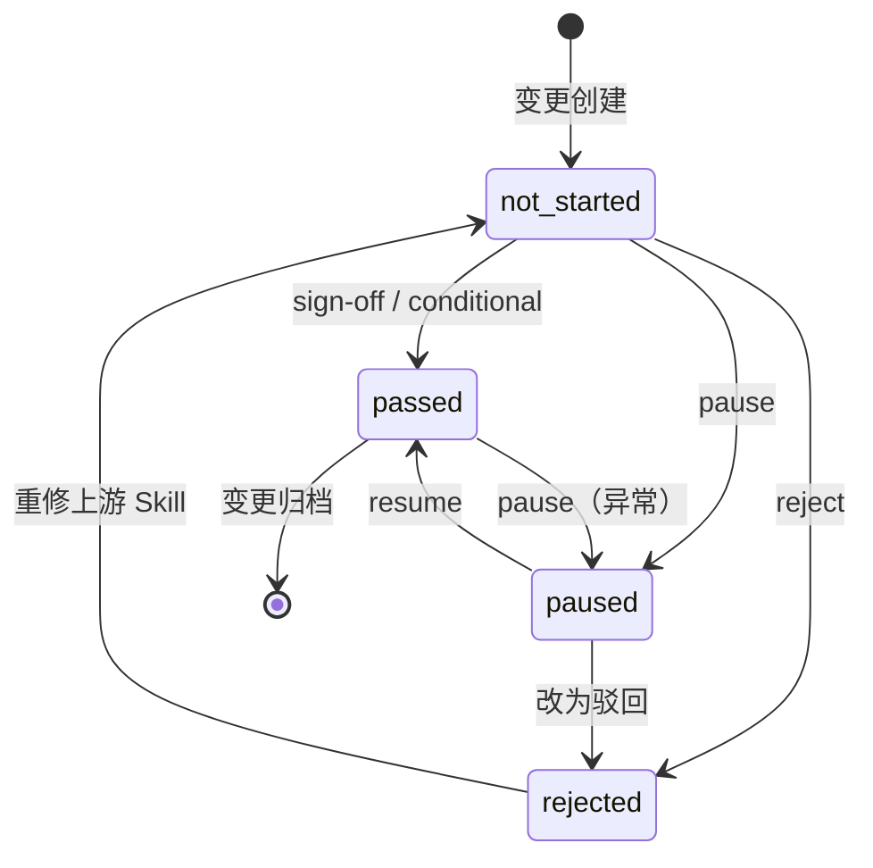

# human Skill 设计文档

> 人工决策审计层 —— 四道人工闸门的统一载体
>
> 版本 V1.0 | 2026-05-08
>
> 本文档面向 Skill 开发者与工具链设计者，阐述 human Skill 的架构设计、数据模型、状态机与集成方案。

---

## 目录

- [一、设计目标](#一设计目标)
- [二、核心概念](#二核心概念)
  - [2.1 四道人工闸门](#21-四道人工闸门)
  - [2.2 决策类型状态机](#22-决策类型状态机)
  - [2.3 语义化命名体系](#23-语义化命名体系)
- [三、架构设计](#三架构设计)
  - [3.1 系统架构](#31-系统架构)
  - [3.2 输入-处理-输出（IPO）](#32-输入-处理-输出ipo)
  - [3.3 数据模型](#33-数据模型)
- [四、状态机设计](#四状态机设计)
  - [4.1 Gate 生命周期状态机](#41-gate-生命周期状态机)
  - [4.2 自动推断逻辑](#42-自动推断逻辑)
- [五、集成方案](#五集成方案)
  - [5.1 与 progress-tracker 的联动](#51-与-progress-tracker-的联动)
  - [5.2 与上游 Skill 的衔接](#52-与上游-skill-的衔接)
  - [5.3 与下游 Skill 的衔接](#53-与下游-skill-的衔接)
- [六、文件格式规范](#六文件格式规范)
  - [6.1 human-decisions.md](#61-human-decisionsmd)
  - [6.2 sign-off/*.md](#62-sign-offmd)
- [七、安全与审计](#七安全与审计)
- [八、后期演进方向](#八后期演进方向)

---

## 一、设计目标

### 1.1 背景问题

原工具链中人工参与分散在各 Skill 的确认节点，存在以下问题：
- **确认点分散**：每个 Skill 各自提示用户确认，无统一入口
- **状态不可查**：用户无法快速了解当前变更已通过哪些评审、还差哪些
- **决策无记录**：人工确认只是对话中的一句"好的"，无审计追溯能力
- **数字编号难记**：`Gate1` / `Gate2.5` / `Gate2` / `Gate3` 的编号体系不直观

### 1.2 设计目标

| 目标 | 说明 |
|------|------|
| **统一载体** | 四道闸门的唯一入口，所有人工决策通过本 Skill 记录 |
| **语义化交互** | 支持自然语言和阶段名，用户无需记忆数字编号 |
| **自动推断** | 不指定 Gate 时，根据当前进度自动判断应确认的闸门 |
| **审计追溯** | 每次决策生成结构化记录，支持历史查询与责任追溯 |
| **状态联动** | 与 progress-tracker 双向同步，确保 SSOT 一致性 |

---

## 二、核心概念

### 2.1 四道人工闸门

| 内部编号 | 语义化名称 | 触发时机 | 上游产出物 | 下游 Skill |
|----------|-----------|----------|-----------|-----------|
| Gate 1 | `req` / `requirements` / `需求冻结` | `prd-generation` 完成 | `specs/01-05.md` | `detailed-requirements` |
| Gate 2.5 | `proto` / `prototype` / `原型冻结` | `detailed-requirements` 完成 | `feature-*/interaction-spec.md` | `high-level-design` |
| Gate 2 | `design` / `设计冻结` | `high-level-design` 完成 | `design/*.md` + `rollback-plan.md` | `detailed-design` |
| Gate 3 | `release` / `uat` / `发布冻结` | `uat-verification` + `code-review` 通过 | `uat-report.md` + `code-review-report.md` | `release-management` |

> **别名等价原则**：所有语义化名称在 Skill 内部统一映射为 `Gate1/2.5/2/3`。`req` = `requirements` = `需求冻结` = `Gate1`。

### 2.2 决策类型状态机



**状态说明**：
- `not_started`：该 Gate 尚未有任何决策记录
- `passed`：`sign-off` 或 `conditional` 后的通过状态
- `rejected`：`reject` 后的驳回状态，锁定当前阶段
- `paused`：`pause` 后的暂停状态，阻塞所有下游

**关键规则**：
- `conditional` 在状态机层面等同于 `passed`，但会附加遗留问题标记
- `hotfix` 不经过完整状态机，直接追加决策记录
- 多人协作时，同一 Gate 可能有多条决策记录，以最新一条为准

### 2.3 语义化命名体系

为解决数字编号难记的问题，设计三层命名体系：

| 层级 | 用途 | 示例 |
|------|------|------|
| **L1：自然语言** | 用户最自然的表达方式 | "需求评审通过了"、"原型确认了" |
| **L2：语义化缩写** | 简洁的英文/中文阶段名 | `req`、`proto`、`design`、`release` |
| **L3：内部编号** | 系统内部唯一标识 | `Gate1`、`Gate2.5`、`Gate2`、`Gate3` |

**解析优先级**：自然语言 → 语义化缩写 → 内部编号 → 自动推断

---

## 三、架构设计

### 3.1 系统架构

```text
┌─────────────────────────────────────────────────────────────┐
│                         用户输入层                           │
│  ┌─────────────┐  ┌─────────────┐  ┌─────────────────────┐  │
│  │ 自然语言    │  │ 语义化命名  │  │ 显式参数            │  │
│  │ "需求通过"  │  │ gate=req    │  │ gate=Gate1          │  │
│  └──────┬──────┘  └──────┬──────┘  └──────────┬──────────┘  │
└─────────┼────────────────┼────────────────────┼─────────────┘
          │                │                    │
          ▼                ▼                    ▼
┌─────────────────────────────────────────────────────────────┐
│                      意图识别引擎                            │
│  ┌──────────────────────────────────────────────────────┐   │
│  │  Step 1: 关键词提取与匹配                             │   │
│  │  - 自然语言关键词映射表（需求/原型/设计/发布）        │   │
│  │  - 语义化别名映射表（req/proto/design/release）       │   │
│  │  - action 推断（通过→sign-off，但→conditional）       │   │
│  └──────────────────────────────────────────────────────┘   │
│                          │                                  │
│                          ▼                                  │
│  ┌──────────────────────────────────────────────────────┐   │
│  │  Step 2: Gate 解析                                    │   │
│  │  - 若识别到具体 Gate → 进入前置检查                   │   │
│  │  - 若未识别 → 尝试 auto 推断                          │   │
│  │  - 若 auto 失败 → 返回澄清询问                        │   │
│  └──────────────────────────────────────────────────────┘   │
└─────────────────────────────────────────────────────────────┘
          │
          ▼
┌─────────────────────────────────────────────────────────────┐
│                      核心业务逻辑                            │
│  ┌──────────────┐  ┌──────────────┐  ┌──────────────────┐   │
│  │ 前置状态检查  │→│ 决策记录写入  │→│ 状态联动更新      │   │
│  │              │  │              │  │                  │   │
│  │ • 前置 Gate  │  │ • human-     │  │ • progress.md    │   │
│  │   是否通过   │  │   decisions  │  │   human_status   │   │
│  │ • 当前 Gate  │  │ • sign-off/  │  │ • 下游 Skill     │   │
│  │   是否已签   │  │   签字文件   │  │   解锁提示       │   │
│  └──────────────┘  └──────────────┘  └──────────────────┘   │
└─────────────────────────────────────────────────────────────┘
          │
          ▼
┌─────────────────────────────────────────────────────────────┐
│                       输出层                                 │
│  ┌──────────────┐  ┌──────────────┐  ┌──────────────────┐   │
│  │ 操作结果反馈  │  │ 状态查询报告  │  │ 历史决策追溯      │   │
│  │ （成功/驳回/  │  │ （当前进度/   │  │ （完整决策链/     │   │
│  │  条件通过）   │  │  下一步建议）  │  │  统计摘要）       │   │
│  └──────────────┘  └──────────────┘  └──────────────────┘   │
└─────────────────────────────────────────────────────────────┘
```

### 3.2 输入-处理-输出（IPO）

#### 输入（Input）

| 输入项 | 来源 | 格式 | 说明 |
|--------|------|------|------|
| 用户指令 | 对话输入 | 自然语言 / 参数 | "需求通过了" 或 `gate=req action=sign-off` |
| `human-decisions.md` | 本地文件 | Markdown + YAML | 当前变更的历史决策记录 |
| `progress.md` | 本地文件 | Markdown + YAML | `human_status` 字段，提供当前 Gate 状态 |
| `config.yaml` | 本地文件 | YAML | 阶段定义，用于生成下一步建议 |

#### 处理（Process）

| 处理单元 | 输入 | 输出 | 说明 |
|----------|------|------|------|
| 意图识别引擎 | 用户指令 | 解析后的 Gate + action + 参数 | 三层解析：自然语言 → 语义化 → 内部编号 |
| 前置状态检查器 | 目标 Gate + `human_status` | 通过 / 阻塞原因 | 校验前置 Gate 是否已通过 |
| 决策记录生成器 | Gate + action + 参数 | Markdown 记录块 | 生成 DECISION-{NNN} 记录 |
| 签字文件生成器 | Gate + action + 参数 | `sign-off/*.md` | 生成独立签字确认单 |
| 状态同步器 | 新决策记录 | 更新后的 `human_status` | 同步到 progress-tracker |

#### 输出（Output）

| 输出项 | 消费方 | 说明 |
|--------|--------|------|
| `human-decisions.md` | `opsx:archive`、人工查询 | 审计日志 |
| `sign-off/*.md` | `opsx:archive`、合规审查 | 签字确认单 |
| 状态查询报告 | 用户、其他 Skill | 当前进度与下一步建议 |
| 阻塞提示 | 用户、下游 Skill | 前置 Gate 未通过的拦截信息 |

### 3.3 数据模型

#### human-decisions.md 数据模型

```yaml
---
change: {变更名}
project: {项目名}
generated_by: human skill
version: "1.0"
last_updated: {ISO8601}
---

# 人工决策审计日志

## 变更信息
- **变更名称**：{变更名}
- **项目**：{项目名}
- **当前状态**：{正常推进 / 有条件通过 / 阻塞 / 已归档}
- **总决策数**：{N}
- **通过数**：{N}
- **有条件通过数**：{N}
- **驳回数**：{N}
- **暂停数**：{N}

## 决策记录

### DECISION-{NNN}

| 属性 | 值 |
|------|-----|
| 内部编号 | Gate{X} |
| 语义名称 | {req/proto/design/release} |
| 决策类型 | {sign-off / conditional / reject / pause / resume / hotfix} |
| 结论 | {passed / failed} |
| 决策人 | {用户 ID} |
| 时间 | {YYYY-MM-DD HH:MM:SS} |
| 关联产出物 | {文件路径列表} |
| 遗留问题 | {issues 或 N/A} |
| 驳回原因 | {reason 或 N/A} |
| 签字文件 | `sign-off/{XX}.md` |
```

#### progress.md human_status 字段

```yaml
human_status:
  gate1:
    status: {not_started / passed / rejected / paused}
    decision_id: DECISION-{NNN}
    signed_by: {用户}
    signed_at: {ISO8601}
    issues: {遗留问题或 null}
  gate2_5:
    status: {...}
    ...
  gate2:
    status: {...}
    ...
  gate3:
    status: {...}
    ...
```

---

## 四、状态机设计

### 4.1 Gate 生命周期状态机

每个 Gate 独立维护自己的状态机：

```
                    ┌─────────────┐
         sign-off   │             │   reject
    ┌──────────────►│   passed    │◄──────────────┐
    │               │             │               │
    │               └──────┬──────┘               │
    │                      │ pause                │
    │                      ▼                      │
    │               ┌─────────────┐               │
    │    resume     │             │   reject      │
    └───────────────┤   paused    │───────────────┘
                    │             │
                    └──────┬──────┘
                           │ resume（从 rejected）
                    ┌──────▼──────┐
         reject     │             │   sign-off
    ┌──────────────►│  rejected   │◄──────────────┐
    │               │             │               │
    │               └─────────────┘               │
    │                                             │
    │               ┌─────────────┐               │
    └───────────────┤ not_started │◄──────────────┘
         重修完成   │             │   覆盖签字
                    └─────────────┘
```

**状态转移规则**：

| 当前状态 | 允许的操作 | 新状态 | 说明 |
|----------|-----------|--------|------|
| `not_started` | `sign-off` / `conditional` | `passed` | 首次通过 |
| `not_started` | `reject` | `rejected` | 首次驳回 |
| `not_started` | `pause` | `paused` | 首次暂停 |
| `passed` | `pause` | `paused` | 通过后暂停（罕见） |
| `passed` | `sign-off`（覆盖） | `passed` | 重新签字 |
| `rejected` | `sign-off` / `conditional` | `passed` | 修复后通过 |
| `rejected` | `pause` | `paused` | 驳回后暂停 |
| `paused` | `resume` | `passed` / `not_started` | 恢复 |
| `paused` | `reject` | `rejected` | 暂停期间改驳回 |

### 4.2 自动推断逻辑

当用户未指定 `gate` 时，执行以下推断：

```
读取 human_status
  │
  ▼
按顺序检查 Gate 1 → Gate 2.5 → Gate 2 → Gate 3
  │
  ▼
找到第一个 status != "passed" 的 Gate
  │
  ├── 找到 → 返回该 Gate 作为目标
  │
  └── 未找到 → 返回 "所有闸门已通过"
```

**边界情况处理**：

| 场景 | 处理 |
|------|------|
| 当前 Gate 为 `paused` | 返回该 Gate，提示"当前处于暂停状态，可执行 resume 或 reject" |
| 当前 Gate 为 `rejected` | 返回该 Gate，提示"当前处于驳回状态，需重修上游 Skill 后重新 sign-off" |
| 所有 Gate 通过 | 返回提示"当前变更所有闸门已通过，可进行归档或发起 hotfix" |
| 变更尚未创建 | 返回错误"请先创建变更提案" |

---

## 五、集成方案

### 5.1 与 progress-tracker 的联动

**单向写入、双向读取**架构：

```
┌──────────┐     写入决策记录      ┌─────────────────┐
│  human   │ ───────────────────► │  human-decisions │
│  Skill   │                      │     .md          │
└────┬─────┘                      └────────┬────────┘
     │                                      │
     │ 更新 human_status                    │ 读取历史
     │                                      │
     ▼                                      ▼
┌─────────────────┐                ┌─────────────────┐
│  progress.md    │◄───────────────│  human Skill    │
│  human_status   │   读取状态      │  status/history │
└─────────────────┘                └─────────────────┘
```

**写入时机**：human Skill 完成决策记录后，立即更新 `progress.md` 的 `human_status`。

**读取时机**：
- 自动推断时读取 `human_status` 确定目标 Gate
- 状态查询时读取 `human_status` 生成进度报告
- 前置检查时读取 `human_status` 校验依赖

### 5.2 与上游 Skill 的衔接

| 上游 Skill | 衔接方式 | 说明 |
|-----------|----------|------|
| `prd-generation` | SKILL.md 内嵌阻塞提示 | 输出 5 个 spec 后，自动宣读 Gate 1 确认提示 |
| `detailed-requirements` | SKILL.md 内嵌阻塞提示 | 输出全部模块后，自动宣读 Gate 2.5 确认提示 |
| `high-level-design` | SKILL.md 内嵌阻塞提示 | 输出架构文档后，自动宣读 Gate 2 确认提示 |
| `uat-verification` | SKILL.md 内嵌阻塞提示 | UAT 通过后，自动宣读 Gate 3 确认提示 |

**衔接协议**：上游 Skill 只负责"宣读阻塞提示"，不负责校验。真正的校验由 human Skill 和 progress-tracker 完成。

### 5.3 与下游 Skill 的衔接

| 下游 Skill | 衔接方式 | 校验规则 |
|-----------|----------|----------|
| `detailed-requirements` | 启动前检查 | `human_status.gate1 == passed` |
| `high-level-design` | 启动前检查 | `human_status.gate1 == passed`（Gate 2.5 不阻塞） |
| `detailed-design` | 启动前检查 | `human_status.gate2 == passed` |
| `release-management` | 启动前检查 | `human_status.gate3 == passed` |
| `opsx:archive` | 归档时纳入 | 将 `sign-off/` 和 `human-decisions.md` 复制到 `archive/` |

---

## 六、文件格式规范

### 6.1 human-decisions.md

**位置**：`openspec/changes/{变更名}/human-decisions.md`

**格式**：YAML Frontmatter + Markdown Body

```markdown
---
change: reelforge-v1.2-角色工厂重构
project: reelforge
generated_by: human skill
version: "1.0"
last_updated: 2026-05-08T18:00:00+08:00
---

# 人工决策审计日志

## 变更信息
- **变更名称**：reelforge-v1.2-角色工厂重构
- **项目**：reelforge
- **当前状态**：正常推进
- **总决策数**：3
- **通过数**：2
- **有条件通过数**：1
- **驳回数**：0
- **暂停数**：0

## 决策记录

### DECISION-001 | 需求冻结（req）| sign-off | 2026-05-06 14:32:00

| 属性 | 值 |
|------|-----|
| 内部编号 | Gate1 |
| 语义名称 | req |
| 决策类型 | sign-off |
| 结论 | passed |
| 决策人 | user-a |
| 时间 | 2026-05-06 14:32:00 |
| 关联产出物 | specs/01-product-overview.md, specs/02-requirements-list.md, specs/03-functional-structure.md, specs/04-business-rules.md, specs/05-non-functional.md |
| 遗留问题 | N/A |
| 签字文件 | sign-off/01-requirements.md |
```

### 6.2 sign-off/*.md

**位置**：`openspec/changes/{变更名}/sign-off/`

**命名规则**：

| Gate | 文件名 |
|------|--------|
| Gate 1 | `01-requirements.md` |
| Gate 2.5 | `02.5-prototype.md` |
| Gate 2 | `02-design.md` |
| Gate 3 | `03-release.md` |

**格式**：

```markdown
---
gate: Gate2
gate_alias: design
gate_name: 设计冻结
change: reelforge-v1.2-角色工厂重构
decision: sign-off
result: passed
decision_by: user-a
decision_at: 2026-05-08T11:00:00+08:00
---

# 设计冻结 签字确认单

## 变更信息
- **变更名称**：reelforge-v1.2-角色工厂重构
- **Gate**：设计冻结（Gate2）

## 评审结论

**决策类型**：sign-off
**总体结论**：通过

## 评审范围

- `design/01-system-architecture.md`
- `design/02-tech-stack.md`
- `design/03-data-architecture.md`
- `design/04-interface-contracts.md`
- `design/05-module-responsibilities.md`
- `design/06-state-machine-global.md`
- `design/07-sequence-diagrams.md`
- `design/08-algorithm-selection.md`
- `design/09-security-design.md`
- `design/10-performance-design.md`
- `design/11-exception-handling-global.md`
- `design/12-deployment-architecture.md`
- `design/13-test-strategy.md`
- `design/14-operations-architecture.md`
- `design/15-rollback-plan.md`

## 遗留问题

N/A

## 决策人签字

- **签字人**：user-a
- **签字时间**：2026-05-08 11:00:00
- **签字声明**：本人已阅读并确认上述产出物符合当前阶段质量要求，同意进入下一阶段。
```

---

## 七、安全与审计

### 7.1 防篡改机制

| 机制 | 说明 |
|------|------|
| 追加而非覆盖 | `human-decisions.md` 采用追加模式，旧记录永久保留 |
| 时间戳不可改 | 所有记录包含 ISO8601 时间戳，由系统生成 |
| 签字文件独立 | 每个 Gate 的签字文件独立存储，便于单独审计 |
| 变更追踪 | `decision_id`（DECISION-{NNN}）支持精确引用 |

### 7.2 多人协作冲突处理

| 场景 | 处理 |
|------|------|
| A sign-off 后 B reject | 以 B 的 reject 为准，但 A 的记录保留在日志中 |
| 同时操作 | 以写入时间戳较晚的为准 |
| 覆盖确认 | 覆盖已有 passed 记录时，需用户显式确认"是否覆盖" |

### 7.3 合规性

- `human-decisions.md` 和 `sign-off/*.md` 纳入 `opsx:archive` 归档范围
- 支持按变更名、按决策人、按时间范围查询
- 未来可扩展为不可篡改的哈希链（可选）

---

## 八、后期演进方向

| 阶段 | 目标 | 说明 |
|------|------|------|
| **V1.1** | 多项目支持 | 支持跨变更查询决策统计（如"本月有多少变更被驳回"） |
| **V1.2** | 通知集成 | 与飞书/钉钉/Slack 集成，决策时自动通知相关人员 |
| **V1.3** | 决策模板 | 为每个 Gate 提供检查清单模板，用户逐项勾选后自动生成 issues |
| **V2.0** | 区块链存证 | 将 `human-decisions.md` 的哈希写入区块链，实现不可篡改审计 |

---

*本文档随 human Skill 迭代持续更新。修改 Skill 行为后应同步更新本文档、SKILL.md 和 meta.json。*
