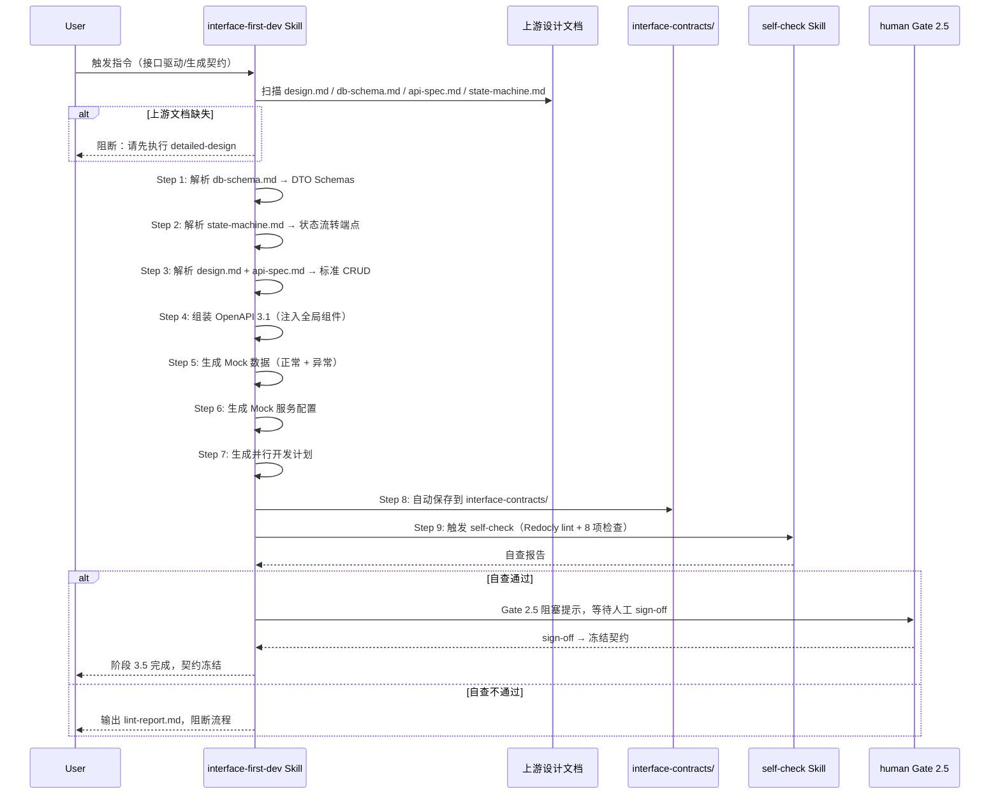
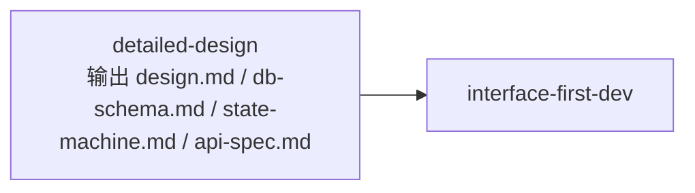
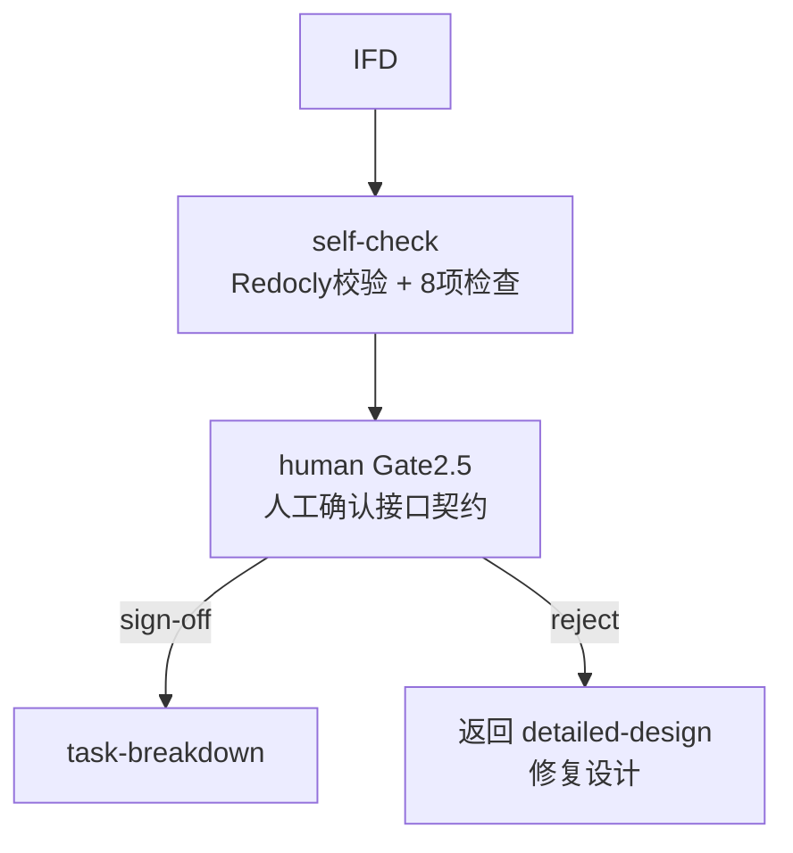

# interface-first-dev Skill 设计规格书

> 本文档面向 Skill 维护者与开发者，说明 `interface-first-dev` 的内部机制、输入解析器、约束规范、开源复用分析与边界规则。

---

## 一、Skill 元信息

| 属性 | 内容 |
|------|------|
| Skill ID | `interface-first-dev` |
| 中文名 | 接口驱动开发 |
| 所属阶段 | SDLC 阶段 3.5（接口冻结阶段） |
| 核心职责 | 基于详细设计文档自动推导 OpenAPI 3.1 接口契约、Mock 数据、Mock 服务配置及前后端并行开发计划 |
| 设计原则 | 文档推导自动化、契约冻结、前后端并行、规范内嵌 |
| 开源借鉴 | `Jeffallan/claude-skills/api-designer`（REST 约束、RFC 7807、分页模型、输出检查清单） |
| 版本 | v1.0.0 |

---

## 二、目录结构

```
skills/sdlc/interface-first-dev/
├── SKILL.md              # Skill 入口定义（核心指令 + 触发场景 + 处理流程）
└── meta.json             # 扩展元数据（版本、标签、兼容平台）
```

### 文件职责

| 文件 | 职责 | 加载时机 |
|------|------|----------|
| `SKILL.md` | Frontmatter（name + description）+ 10 步处理逻辑 + 约束规范 + Gotchas | 匹配成功后加载 |
| `meta.json` | 版本、pattern（generator）、tags、platforms | 外部检索工具使用 |

**无独立 references/ 目录的原因**：`interface-first-dev` 的定位是"从设计文档自动推导契约"，不需要从零交互式创建 API。因此 REST 规范、错误处理、OpenAPI 模板等参考内容直接内嵌到 `SKILL.md` 的生成规则中，作为 AI 自动填充模板的一部分，减少文件引用链深度。

---

## 三、核心处理逻辑

### 3.1 执行时序



### 3.2 十步工作流

| 步骤 | 动作 | 关键产出 |
|------|------|----------|
| Step 0 | 扫描上游文档 | 确认 design.md、db-schema.md、api-spec.md 就绪 |
| Step 1 | 解析 db-schema.md | DTO Schemas（PascalCase，请求/响应分离） |
| Step 2 | 解析 state-machine.md | PATCH 状态流转端点 + 409 Conflict 响应 |
| Step 3 | 解析 design.md + api-spec.md | 标准 CRUD 端点集（列表/创建/详情/更新/删除） |
| Step 4 | 组装 OpenAPI 3.1 | 注入 CursorPage、Problem、标准响应、BearerAuth |
| Step 5 | 生成 Mock 数据 | mock-data.json（按 operationId 分组，正常+异常） |
| Step 6 | 生成 Mock 服务配置 | mock-server-config.md（Prism / JSON Server） |
| Step 7 | 生成并行开发计划 | parallel-dev-plan.md（DAG + 前后端边界 + 联调时间） |
| Step 8 | 自动保存 | interface-contracts/ 目录下 4 个文件 |
| Step 9 | 触发 self-check | Redocly lint + 8 项检查清单 |

---

## 四、输入解析器设计（核心差异化）

### 4.1 从 db-schema.md 推导 DTO Schema

解析规则（结构化读取，零交互问答）：

| DB 类型 | OpenAPI 映射 | 约束映射 |
|---------|--------------|----------|
| `VARCHAR(n)` / `STRING` | `type: string`, `maxLength: n` | `minLength: 0` |
| `INT` | `type: integer`, `format: int32` | `minimum`/`maximum` 从 CHECK 提取 |
| `BIGINT` | `type: integer`, `format: int64` | - |
| `DECIMAL(p,s)` | `type: number` | - |
| `BOOLEAN` / `TINYINT(1)` | `type: boolean` | - |
| `DATETIME` / `TIMESTAMP` | `type: string`, `format: date-time` | - |
| `JSON` | `type: object` | - |
| `ENUM(...)` | `type: string`, `enum: [...]` | - |

元数据规则：
- 主键字段 → `readOnly: true`
- `created_at` / `updated_at` → `readOnly: true`
- `NOT NULL` → 加入 `required` 数组
- `UNIQUE` → `description` 中标注
- `CHECK (age > 0)` → `minimum: 1`
- `DEFAULT 'pending'` → `default: 'pending'`
- 外键字段 → 转换为 `$ref: '#/components/schemas/{关联表名}'`

命名规则：
- 表名 `orders` → Schema `Order`（PascalCase，单数）
- 请求/响应分离：`CreateOrderRequest`（无 id）和 `OrderResponse`（完整字段）

### 4.2 从 state-machine.md 推导状态流转端点

解析规则：
1. 提取状态定义列表：`状态A`、`状态B`、`状态C`
2. 提取流转事件：`事件X：状态A → 状态B（条件：...）`
3. 生成端点：`PATCH /{resources}/{id}/status` 或 `PATCH /{resources}/{id}/{event}`
4. Request Body 包含 `status` 枚举字段 + 条件字段
5. Response 返回完整资源对象（新状态）
6. `operationId` 格式：`transition{Resource}{TargetStatus}`，如 `transitionOrderToPaid`
7. 每个状态流转事件必须声明 `409 Conflict` 响应

降级策略：若状态机含复杂嵌套条件，输出最保守的通用 `PATCH /{resource}/{id}` 设计，并在 `parallel-dev-plan.md` 中标注"需人工细化状态流转条件"。

### 4.3 从 design.md 推导资源 URI

解析规则：
1. 提取 `## 模块划分` 中的模块名，如 `角色工厂`、`剧本工坊`
2. 映射为 REST 资源名（中文→英文，如 `角色工厂` → `/characters`）
3. 模块下的实体列表映射为子资源，如 `/characters/{id}/outfits`
4. 若 `design.md` 中明确标注"聚合根"，则该实体为一级资源；其余为子资源

### 4.4 从 api-spec.md 提取接口意图

解析规则：
- 若 `api-spec.md` 中已有接口初稿（URL、Method、参数说明），以其为基准
- 补全 Schema 引用、参数定义、错误响应
- 修正动词 URI（如 `/getOrder` → `/orders/{id}`）
- 补充缺失的标准端点（如只有 POST/GET，缺 PUT/PATCH/DELETE 时提示）

---

## 五、OpenAPI 3.1 全局组件模板

### 5.1 基础骨架

```yaml
openapi: "3.1.0"
info:
  title: "{项目名} API"
  version: "1.0.0"
  description: "{变更描述}"
servers:
  - url: /api/v1
    description: 本地开发
  - url: https://staging.example.com/api/v1
    description: 预发布环境
```

### 5.2 必须注入的全局组件

| 组件 | 类型 | 来源/借鉴 |
|------|------|----------|
| `CursorPage` | Schema | `api-designer` 标准分页模型 |
| `Problem` | Schema | RFC 7807 Problem Details（`api-designer`） |
| `BadRequest` | Response | 400 错误，引用 Problem |
| `Unauthorized` | Response | 401 错误，引用 Problem |
| `NotFound` | Response | 404 错误，引用 Problem |
| `TooManyRequests` | Response | 429 错误，引用 Problem，含 `Retry-After` header |
| `Conflict` | Response | 409 错误，引用 Problem（状态流转专用） |
| `BearerAuth` | SecurityScheme | 若 `05-non-functional.md` 要求 JWT |

### 5.3 RFC 7807 Problem Details 规范

```yaml
Problem:
  type: object
  required: [type, title, status]
  properties:
    type: { type: string, format: uri, example: "https://api.example.com/errors/validation-error" }
    title: { type: string }
    status: { type: integer }
    detail: { type: string }
    instance: { type: string, format: uri }
```

规则：
- 错误响应 `Content-Type` 必须为 `application/problem+json`
- `type` 必须是稳定、可文档化的 URI（非通用字符串）
- `detail` 必须人类可读且可行动
- 字段级校验失败时扩展 `errors[]` 数组

---

## 六、输出规范

### 6.1 产出物清单（4 个文件）

| # | 文件名 | 内容边界 | 格式 |
|---|--------|----------|------|
| 1 | `openapi.yaml` | 完整 OpenAPI 3.1 规范：paths、schemas、responses、securitySchemes | YAML |
| 2 | `mock-data.json` | 按 operationId 分组的示例数据（正常 + 异常路径） | JSON |
| 3 | `mock-server-config.md` | Mock 环境搭建指南：路由规则、启动命令、CORS、延迟模拟 | Markdown |
| 4 | `parallel-dev-plan.md` | 前后端分批次开发计划：接口依赖 DAG、任务边界、联调时间点 | Markdown |

### 6.2 保存路径

```
interface-contracts/
├── openapi.yaml
├── mock-data.json
├── mock-server-config.md
└── parallel-dev-plan.md
```

### 6.3 下游 Skill 消费

| 下游 Skill | 消费文档 | 衔接规则 |
|------------|----------|----------|
| `task-breakdown` | `parallel-dev-plan.md` + `openapi.yaml` | 基于"后端任务边界"按接口维度拆解任务，任务描述引用 operationId |
| `executing-plans` | `openapi.yaml` | 按契约实现接口 |

---

## 七、约束规范（借鉴 api-designer）

### 7.1 MUST DO

| # | 约束 | 验证方式 |
|---|------|----------|
| 1 | 遵循 REST 原则：资源导向、正确使用 HTTP 方法 | 检查 paths 中无动词 URI |
| 2 | 命名一致：字段 camelCase，URI kebab-case | 全局统一扫描 |
| 3 | 完整 OpenAPI 3.1：每个端点含 operationId、summary、tags | 检查必填字段 |
| 4 | 错误响应符合 RFC 7807，统一使用 application/problem+json | 检查 responses Content-Type |
| 5 | 所有集合端点实现分页 | 检查 GET 集合端点含 cursor/limit 或 page/size |
| 6 | 文档化认证与授权方式 | 检查 securitySchemes + security 存在 |
| 7 | 每个端点至少一个请求示例和一个响应示例 | 检查 examples 字段 |
| 8 | 状态流转端点包含 409 Conflict 响应 | 检查 PATCH 状态端点 |
| 9 | 基线 API 版本必须为 /api/v1 | 检查 servers.url |

### 7.2 MUST NOT DO

| # | 约束 | 处理方式 |
|---|------|----------|
| 1 | URI 中不使用动词 | 自动修正为资源导向路径 |
| 2 | 不返回不一致的响应结构 | 检查全局响应包装一致性 |
| 3 | 不跳过错误码文档 | 检查每个端点声明所有 4xx/5xx |
| 4 | 不忽视 HTTP 状态码语义 | 201 创建、204 删除、200 查询 |
| 5 | 不在 API 表面暴露实现细节 | 禁止数据库表名、框架内部类名 |
| 6 | 不设计无版本控制策略的 API | 强制 /api/v1 基线 |
| 7 | 不在 DTO 中混用 ORM 注解 | 纯传输对象 |
| 8 | 不自动生成生产环境发布命令 | AI 只生成文档，不执行上线 |

---

## 八、输出检查清单（与 self-check 联动）

| # | 检查项 | 验证方式 | 阻断性 |
|---|--------|----------|:------:|
| 1 | 资源模型和关系表已生成 | `components/schemas` 数量 ≥ 实体表数量 | 是 |
| 2 | 端点规范完整 | 每个端点含 URI + Method + operationId | 是 |
| 3 | OpenAPI 3.1 YAML 语法正确 | `npx @redocly/cli lint` 无 error | 是 |
| 4 | 认证与授权流程已声明 | `securitySchemes` 和 `security` 存在 | 否 |
| 5 | 错误响应目录完整 | 含 BadRequest/Unauthorized/NotFound/TooManyRequests/Conflict | 是 |
| 6 | 分页和过滤模式已应用 | 所有 GET 集合端点含分页参数 | 是 |
| 7 | Mock 数据覆盖正常 + 异常路径 | 每个 operationId ≥ 2 组示例 | 否 |
| 8 | 并行开发计划含前后端边界 | 含前端任务、后端任务、联调时间点 | 否 |

---

## 九、与上下游 Skill 衔接

### 9.1 上游输入（detailed-design）



衔接规则：`interface-first-dev` 必须在 `detailed-design` 完成后执行，不可跳过。若上游文档缺失 `db-schema.md`，则阻断并提示"请先执行 detailed-design 完成数据库设计"。

### 9.2 下游输出（task-breakdown）


衔接规则：`task-breakdown` 必须读取 `interface-contracts/parallel-dev-plan.md` 中的"后端任务边界"作为任务拆解输入之一。每个接口实现作为一个独立任务单元，任务描述中必须引用 `openapi.yaml` 中的 `operationId`。

### 9.3 横向衔接（human + self-check）



与 `human` 衔接：生成的接口契约应在 Gate 2（设计冻结闸）之后、编码之前由人工确认。确认后作为不可随意变更的基准。

与 `self-check` 衔接：`interface-first-dev` 执行完毕后自动触发 `self-check` 接口契约，校验不通过则阻断流程，不进入 `human` 阶段。

---

## 十、开源复用分析

### 10.1 根本差异：交互式创建 vs 文档自动推导

| 维度 | `api-designer`（开源） | `interface-first-dev`（本方案） |
|------|------------------------|--------------------------------|
| 输入 | 交互式问答（AskUserQuestion） | 自动读取上游 Markdown 设计文档 |
| 方向 | 从零创建 / 扩展现有 spec | 从详细设计自动推导契约 |
| 目标读者 | API 设计师、独立开发者 | 前后端团队、项目经理 |
| 时机 | 任何需要设计 API 时 | detailed-design 完成后、编码前 |
| 核心问题 | "这个 API 应该怎么设计？" | "根据已有设计，接口契约是什么？" |
| Mock | 启动 Prism Mock 服务器测试 | 生成 Mock 数据和配置，支持前端先行 |
| 并行开发 | 不涉及 | 输出 parallel-dev-plan.md，明确前后端边界 |

### 10.2 复用映射速查表

| 你想在 interface-first-dev 中解决... | 借鉴开源 Skill 的... | 改造要点 |
|--------------------------------------|---------------------|----------|
| REST 约束规范 | `api-designer` Constraints（MUST DO / MUST NOT DO） | 直接迁移到 SKILL.md 的约束章节 |
| OpenAPI 3.1 标准模板 | `api-designer` Templates | 从"copy-paste starter"改为 AI 自动填充模板 |
| RFC 7807 Problem Details 错误响应 | `api-designer` Templates | 直接复用为 `components/schemas/Problem` |
| 标准分页模型 CursorPage | `api-designer` Templates | 直接复用为全局 Schema |
| 输出检查清单（8 项） | `api-designer` Output Checklist | 与 self-check 联动 |
| Redocly 校验命令 | `api-designer` Step 4 | 改造为 self-check 自动步骤 |
| Prism Mock 启动命令 | `api-designer` Step 5 | 写入 mock-server-config.md |
| 安全方案模板（BearerAuth） | `api-designer` Templates | 根据非功能性需求自动填充 |
| 资源建模优先原则 | `api-designer` Core Workflow Step 2 | 改造为"从 db-schema.md 自动推导" |

### 10.3 不借鉴的部分

| api-designer 能力 | 不借鉴原因 | interface-first-dev 替代方案 |
|-------------------|-----------|------------------------------|
| 交互式问答（AskUserQuestion） | 与"自动推导"定位冲突 | 改为自动读取上游设计文档 |
| 从零创建 spec（Mode A） | 需要人工逐步回答 | 本 Skill 只接受已有详细设计作为输入 |
| 扩展现有 spec（Mode B） | 属于迭代场景，非首次接口定义 | 由 openapi Skill 处理，本 Skill 仅支持简单追加模式 |
| 从 spec 生成代码（Mode C） | 超出接口定义边界 | 由 executing-plans 或 openapi Skill 处理 |

---

## 十一、风险与规避

| 风险 | 规避方法 |
|------|----------|
| AI 凭空生成接口，无设计依据 | 硬性前置：db-schema.md / design.md 缺失时直接阻断 |
| db-schema.md 表格格式不标准 | 降级为启发式解析，输出警告并要求人工复核 |
| 状态机复杂嵌套导致端点设计歧义 | 输出最保守的通用 PATCH 设计，标注"需人工细化" |
| 上游 api-spec.md 含动词 URI | 自动修正为资源导向路径，不可原样照搬 |
| OpenAPI YAML 语法错误 | Redocly lint 自动校验，error 阻断流程 |
| Mock 数据生成不完整 | 缺失字段填充占位值，标注 TODO |
| 契约冻结后随意变更 | Gate 2.5 sign-off 机制，变更需走变更流程 |
| 前后端团队对契约理解不一致 | parallel-dev-plan.md 明确任务边界，Mock 服务供前端先行验证 |

---

## 十二、变更日志

| 版本 | 日期 | 变更内容 |
|------|------|----------|
| v1.0.0 | 2026-05-10 | 初始版本。基于 docs-internal/interface.md 功能规格、api-designer 开源 REST 约束与模板、api-contract-generator 和 openapi-architect-code-generator 参考，设计文档推导自动化的接口驱动开发 Skill。定义 10 步处理流程、3 个输入解析器、4 项产出物、8 项检查清单。 |
