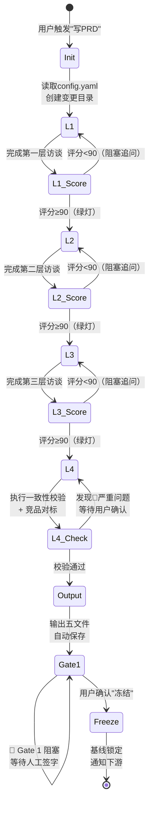
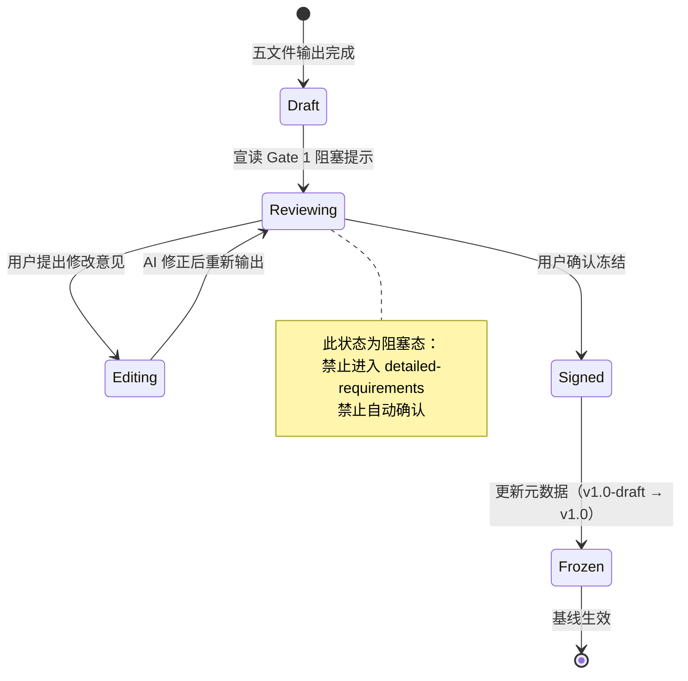

# PRD-000 概要需求生成器 — 设计文档

> **Skill ID**：`prd-generation`  
> **版本**：V2.1  
> **设计目标**：构建「不可推翻的需求基线引擎」，通过四层递进式阻塞对话与人工冻结闸门，确保概要需求在进入详细设计前达到可交付质量  
> **更新日期**：2026-05-08

---

## 目录

1. [设计目标](#1-设计目标)
2. [核心概念](#2-核心概念)
3. [架构设计（IPO）](#3-架构设计ipo)
4. [状态机与数据模型](#4-状态机与数据模型)
5. [集成方案](#5-集成方案)
6. [文件格式规范](#6-文件格式规范)
7. [安全与审计](#7-安全与审计)
8. [后期演进方向](#8-后期演进方向)

---

## 1. 设计目标

### 1.1 核心目标

| 目标维度 | 具体定义 | 成功指标 |
|---------|---------|---------|
| **基线不可推翻性** | Scope、NFR、核心实体一经冻结，下游详细需求不得擅自修改 | 冻结后下游返工率 ≤ 5% |
| **信息完整性** | 通过四层递进式对话，确保每层信息饱和度 ≥ 90% 方可进入下一层 | 每层评分绿灯率 ≥ 90 分 |
| **逻辑自洽性** | 输出前强制执行内部一致性校验 + 竞品对标，捕获矛盾与遗漏 | Layer 4 校验问题发现率 ≥ 30%（相对未校验基线） |
| **人工可控性** | Gate 1 引入人工冻结阻塞点，AI 不得自动确认基线 | 100% 基线变更需人工签字 |
| **下游可消费性** | 五文件输出直接映射 OpenSpec 目录结构，供 detailed-requirements、high-level-design 等 Skill 直接读取 | 下游 Skill 零配置即可解析 |

### 1.2 设计原则

1. **渐进式披露（Progressive Disclosure）**：AI 只读取当前层所需信息，不提前暴露后续层内容，降低用户认知负荷。
2. **零假设原则（Zero-Assumption）**：每个结论必须经用户确认，AI 不擅自推断或修正需求。
3. **阻塞式质量门（Gated Quality）**：评分 < 90 分或存在未解决 🔴 严重问题时，流程硬性阻塞，不可绕过。
4. **双轨元数据**：`SKILL.md` Frontmatter 仅保留 `name` + `description`（兼容 Kimi Code 白名单），扩展元数据存放于 `meta.json`。

---

## 2. 核心概念

### 2.1 四层递进式对话（Layer 1→2→3→4）

| 层级 | 名称 | 核心问题 | 输出物 | 阻塞阈值 |
|------|------|---------|--------|---------|
| Layer 1 | 问题界定（Problem Framing） | 为什么做？为谁做？ | 问题框架摘要（痛点、用户画像、JTBD、竞品基准） | < 90 分阻塞 |
| Layer 2 | 方案界定（Solution Framing） | 做什么？不做什么？由哪些模块构成？ | Component Inventory、In/Out-Scope、核心实体定义 | < 90 分阻塞 |
| Layer 3 | 成功标准（Success Criteria） | 如何量化成功？ | 北极星指标、全局 NFR、里程碑 Phase 1/2/3 | < 90 分阻塞 |
| Layer 4 | 一致性校验与竞品对标（Validation） | 有没有矛盾？方案是否落后？ | 校验摘要、待决策项、风险提示 | 存在 🔴 阻塞 |

### 2.2 红绿灯评分机制

评分算法采用多维度加权模型（详见 `references/completeness-scoring.md`）：

```
Layer_Score = Σ(Dimension_i × Weight_i)  (i = 1..5)

维度（Layer 1 示例）：
- D1: 痛点清晰度（Weight: 20%）
- D2: 目标用户明确度（Weight: 20%）
- D3: 价值主张可验证性（Weight: 20%）
- D4: 竞品信息完整度（Weight: 20%）
- D5: JTBD 覆盖度（Weight: 20%）

判定规则：
- 🟢 绿灯：Score ≥ 90
- 🟡 黄灯：70 ≤ Score < 90（需补充 1-3 项）
- 🔴 红灯：Score < 70（大规模返工）
```

### 2.3 JTBD 框架（Jobs-to-be-Done）

将传统「功能清单」转化为「用户雇佣产品完成的工作」：

```
格式：When [场景], I want to [动机], so I can [预期结果]

示例：
When 独立制片人拿到剧本后，
I want to 在 48 小时内看到带分镜的预览片，
so I can 快速向投资方展示概念并争取立项。
```

JTBD 作为 `01-product-overview.md` 的核心输入，防止「技术上正确但用户不需要」的解决方案。

### 2.4 原子声明分解（Atomic Claim Decomposition）

将 PRD 中的每个关键声明拆分为可验证的原子命题，确保在五文件中均有支撑：

```
原始声明："系统支持 10 万并发用户，响应时间 < 200ms"
├── 原子命题 1："10 万并发" → 需在 05-non-functional.md 中有容量规划与扩容策略
├── 原子命题 2："< 200ms" → 需在 05 中有性能指标 + 04 中有 SLA 定义
└── 若任一命题无支撑 → 标记 🔴 严重问题
```

### 2.5 Gate 1 人工冻结（V2.1 新增）

五文件输出完成后，系统自动进入 **🚪 Gate 1 阻塞状态**，AI 宣读冻结提示并等待人工签字。该机制引入「人类在环（Human-in-the-Loop）」控制点，确保 AI 不会在未经人类审阅的情况下自动锁定基线。

---

## 3. 架构设计（IPO）

### 3.1 输入层（Input）

| 输入源 | 类型 | 必/选 | 说明 |
|--------|------|-------|------|
| `openspec/config.yaml` | 配置文件 | 必选 | 读取 `artifact_specs.high-level-requirements` 的 `required_sections` 作为输出模板 |
| `openspec/changes/{变更名}/proposal.md` | 上游文档 | 必选 | 变更提案，提供初始上下文 |
| `openspec/changes/{变更名}/brainstorming/market-positioning.md` | 上游文档 | 推荐 | `competitive-analysis` positioning 模式产出，Layer 1/4 优先引用 |
| 用户本地资料（`@路径`） | 外部文档 | 可选 | 业务文档、竞品分析、数据报表 |
| 产品 URL | 外部链接 | 可选 | 供 `web_search` / `web_open_url` 进行页面功能审计 |
| 用户对话输入 | 实时流 | 必选 | 每层访谈的用户回复 |

### 3.2 处理层（Process）

```
┌─────────────────────────────────────────────────────────────┐
│                         处理引擎                              │
├─────────────────────────────────────────────────────────────┤
│  Step 0: 初始化                                               │
│    ├── 校验 config.yaml                                       │
│    ├── 创建/确认 specs/ 目录                                  │
│    └── 加载上游文档与本地资料                                 │
│                          ↓                                   │
│  Step 1-3: 三层递进访谈                                       │
│    ├── 激活提问集（questioning-guide.md）                     │
│    ├── 逐题访谈（一次一问）                                   │
│    ├── JTBD 转化 / Component Inventory 提取                   │
│    ├── 红绿灯评分（completeness-scoring.md）                  │
│    └── 阻塞/通过判定                                          │
│                          ↓                                   │
│  Step 4: 一致性校验（强制）                                   │
│    ├── 内部一致性校验（consistency-checklist.md）             │
│    │   ├── Scope 自洽性                                       │
│    │   ├── 实体-模块一致性                                    │
│    │   ├── NFR-技术一致性                                     │
│    │   ├── 角色-权限一致性                                    │
│    │   ├── 依赖与约束一致性                                   │
│    │   └── 术语行为一致性                                     │
│    ├── 竞品对标校验                                           │
│    │   ├── 功能完整性对标                                     │
│    │   ├── 技术方案先进性校验                                 │
│    │   └── 行业标准与合规                                     │
│    ├── 原子声明分解验证                                       │
│    └── 问题分级（🔴/🟡/🟢）                                   │
│                          ↓                                   │
│  Step 5.0: 章节对齐校验（输出前强制检查）                      │
│    ├── 读取 config.yaml required_sections                     │
│    ├── 语义等价映射检查                                       │
│    └── 空内容阻塞判定                                         │
│                          ↓                                   │
│  Step 5: 输出与冻结                                           │
│    ├── 五文件生成                                             │
│    ├── 自动保存                                               │
│    ├── 🚪 Gate 1 阻塞提示宣读                                 │
│    ├── 等待人工签字                                           │
│    └── 基线冻结操作（元数据更新 + 下游通知）                  │
└─────────────────────────────────────────────────────────────┘
```

### 3.3 输出层（Output）

| 输出物 | 路径 | 格式 | 消费方 |
|--------|------|------|--------|
| 五文件概要需求 | `openspec/changes/{变更名}/specs/01~05-*.md` | Markdown + Mermaid | detailed-requirements, high-level-design, self-check |
| 进度更新 | `openspec/changes/{变更名}/progress.md` | Markdown | progress-tracker |
| 决策记录 | `openspec/changes/{变更名}/human-decisions.md` | Markdown | human Skill |
| 自查报告 | 对话输出 | Markdown | self-check |

---

## 4. 状态机与数据模型

### 4.1 四层访谈状态机



**状态转移规则**：

| 当前状态 | 触发事件 | 下一状态 | 守卫条件 |
|---------|---------|---------|---------|
| Init | 用户触发 | L1 | config.yaml 存在且有效 |
| L1 | 访谈完成 | L1_Score | 所有问题已回答 |
| L1_Score | 评分 < 90 | L1 | 存在缺失项 |
| L1_Score | 评分 ≥ 90 | L2 | 无缺失项 |
| L2 | 访谈完成 | L2_Score | Component Inventory 已输出 |
| L2_Score | 评分 < 90 | L2 | 存在缺失项 |
| L2_Score | 评分 ≥ 90 | L3 | 无缺失项 |
| L3 | 访谈完成 | L3_Score | NFR 与里程碑已定义 |
| L3_Score | 评分 < 90 | L3 | 存在缺失项 |
| L3_Score | 评分 ≥ 90 | L4 | 无缺失项 |
| L4 | 校验完成 | L4_Check | consistency-checklist.md 已执行 |
| L4_Check | 存在 🔴 | L4 | 未解决的严重问题 > 0 |
| L4_Check | 无 🔴 | Output | 所有严重问题已解决或经用户确认接受风险 |
| Output | 文件生成 | Gate1 | 五文件已写入磁盘 |
| Gate1 | 用户确认 | Freeze | 用户回复"确认冻结"或 `/skill:human gate=Gate1 action=sign-off` |
| Freeze | 基线锁定 | [*] | 五文件元数据已更新，progress-tracker 已同步 |

### 4.2 Gate 1 冻结状态机（V2.1 新增）



**冻结后元数据变更规则**：

| 字段 | 冻结前 | 冻结后 | 变更触发条件 |
|------|--------|--------|-------------|
| 版本 | `PRD-000 v1.0-draft` | `PRD-000 v1.0` | 人工签字确认 |
| 状态 | `待用户确认基线后冻结` | `已冻结（基线）` | 人工签字确认 |
| last_updated | 原日期 | 当前日期 | 人工签字确认 |

### 4.3 数据模型

#### 4.3.1 五文件逻辑结构 → 物理映射

```
PRD-000（逻辑 13 章）
├── 第 1 章 文档控制 ──────────────→ 全部文件头部
├── 第 2 章 项目背景与目标 ─────────→ 01-product-overview.md
├── 第 3 章 竞品与差异化分析 ───────→ 01-product-overview.md
├── 第 4 章 系统范围（Scope）───────→ 02-requirements-list.md
├── 第 5 章 用户画像与角色矩阵 ─────→ 02-requirements-list.md + 04-business-rules.md
├── 第 6 章 系统功能架构图 ─────────→ 03-functional-structure.md
├── 第 7 章 核心业务流程 ───────────→ 04-business-rules.md
├── 第 8 章 全局 NFR ──────────────→ 05-non-functional.md
├── 第 9 章 概要数据模型 ───────────→ 03-functional-structure.md
├── 第 10 章 系统集成与约束 ────────→ 05-non-functional.md
├── 第 11 章 里程碑与优先级 ────────→ 05-non-functional.md
├── 第 12 章 风险提示与待决策项 ─────→ 05-non-functional.md
└── 第 13 章 详细 PRD 清单 ─────────→ 03-functional-structure.md（末尾附加）
```

#### 4.3.2 模块目录映射模型

```typescript
interface ModuleMapping {
  prdId: string;           // "PRD-001"
  moduleName: string;      // "剧本工坊"
  kebabName: string;       // "script-workshop"
  directory: string;       // "feature-01-script-workshop/"
  priority: "P0" | "P1" | "P2";
  status: "待编写" | "进行中" | "已完成";
}

// 约束规则
// 1. directory 必须 = `feature-${NN}-${kebabName}/`
// 2. kebabName 必须与 03-functional-structure.md 中的模块名一致
// 3. NN 优先级映射：P0 → 01-09, P1 → 10-19, P2 → 20+
```

#### 4.3.3 用户故事 ID 编码模型

```
US-{模块编号}-{序号}

示例：
- US-001-003：PRD-001 模块的第 3 条用户故事
- US-COM-001：跨模块通用故事（COM = Common）

约束：
- 每个 P0 级故事必须附带二元验收标准（通过/失败）
- 验收标准格式：Given [前置条件] When [动作] Then [结果]
```

---

## 5. 集成方案

### 5.1 数据流图

```
[用户输入]
    ↓
[brainstorming] ──→ [requirement-analysis]
    ↓                      ↓
[proposal.md] ←──────────┘
    ↓
[competitive-analysis mode=positioning] ──→ market-positioning.md
    ↓
[prd-generation] ──→ 产出 5 文件到 specs/
    ↓
    ├──→ [competitive-analysis mode=technical] 读取 01 第 3 章
    ├──→ [high-level-design]    读取 04/05
    ├──→ [detailed-requirements] 读取 03 模块清单
    └──→ [self-check]          读取全部 5 文件
              ↓
    [progress-tracker] 贯穿全程，更新 progress.md
    [human] Gate 1 签字记录 → human-decisions.md
```

### 5.2 上游接口契约

| 上游 Skill | 输入文件 | 关键字段/内容 | 容错策略 |
|-----------|----------|--------------|---------|
| `brainstorming` | `proposal.md` | 变更名、业务背景、初步结论 | 若不存在，提示用户创建变更提案 |
| `competitive-analysis` (positioning) | `brainstorming/market-positioning.md` | 竞争集合、JTBD 对比、Blue Ocean、战略建议 | 若不存在，Layer 1/4 降级为 `web_search` |
| `requirement-analysis` | `proposal.md` | 结构化需求输入 | 若无结构化输入，使用用户自然语言 |

### 5.3 下游接口契约

| 下游 Skill | 输入文件 | 关键依赖 | 接口稳定性 |
|-----------|----------|---------|-----------|
| `competitive-analysis` (technical) | `01-product-overview.md` 第 3 章 | 竞品对标表、技术方案对比 | 冻结后只读 |
| `high-level-design` | `04-business-rules.md` + `05-non-functional.md` | 业务规则、NFR、技术约束 | 冻结后只读 |
| `detailed-requirements` | `03-functional-structure.md` 第 5 章 | 详细 PRD 清单、模块→目录映射 | 冻结后只读；模块名不可变 |
| `self-check` | 全部 5 文件 | 完整性、一致性、可追溯性 | 每次变更后重新执行 |

### 5.4 贯穿式协作接口

| 协作 Skill | 协作时机 | 数据交换 | 方向 |
|-----------|---------|---------|------|
| `progress-tracker` | 每层完成后 | 阶段状态更新（阶段 2 → 已完成，阶段 2.5 → 可启动） | 单向写入 progress.md |
| `self-check` | Gate 1 冻结后 | 五文件内容 → 自查报告 | 单向调用，报告输出到对话 |
| `human` | Gate 1 签字时 | 用户决策 → `human-decisions.md` | 双向：AI 宣读 → 用户回复 → AI 记录 |

---

## 6. 文件格式规范

### 6.1 五文件物理规范

| 文件名 | 必需 Frontmatter | 章节结构（H2） | Mermaid 图表 |
|--------|-----------------|--------------|-------------|
| `01-product-overview.md` | `版本`、`状态`、`last_updated` | 项目背景、目标用户、核心价值、JTBD 列表、竞品对标 | 可选：竞品能力矩阵图 |
| `02-requirements-list.md` | 同上 | 需求清单（P0/P1/P2）、用户故事（US-XXX）、业务术语表、In/Out-Scope | 无 |
| `03-functional-structure.md` | 同上 | 功能架构图、Component Inventory、核心实体 ER 图、详细 PRD 清单 | 模块树图、ER 图 |
| `04-business-rules.md` | 同上 | 全局业务规则、RBAC 矩阵、核心业务流程、状态机 | 流程图（flowchart）、状态机（stateDiagram-v2） |
| `05-non-functional.md` | 同上 | 性能指标、安全要求、兼容性、技术栈约束、里程碑、风险提示、待决策项 | 可选：架构草图 |

### 6.2 模块命名约束

```
03-functional-structure.md 中的模块名
    ↓ 必须保持一致
feature-XX-{模块名}/ 目录名
    ↓ 必须保持一致
detailed-requirements Skill 的输出目录

格式要求：
- 必须使用 kebab-case（小写字母，连字符分隔）
- 示例："剧本工坊" → "script-workshop" → "feature-01-script-workshop/"
- 禁止：连续连字符 "--"、下划线 "_"、中文字符
```

### 6.3 章节对齐校验规则（Step 5.0）

```
输入：config.yaml::artifact_specs.high-level-requirements.required_sections[]
输入：system-outline-template.md::五文件映射表

算法：
1. 对每个 required_section：
   a. 查找映射表 → 确定目标物理文件
   b. 在目标文件中查找 H2 标题或明确章节
   c. 允许语义等价映射（如"核心问题"≈"项目背景与目标"）
   d. 若内容为空（空表/空列表/仅占位符）→ 标记 🔴 阻塞
   e. 若语义等价但未精确匹配字面 → 标记 🟡 提示

2. 若存在任何 🔴 → 禁止进入保存步骤
3. 所有 🟡 → 汇总写入 05-non-functional.md「待决策项」
```

---

## 7. 安全与审计

### 7.1 Gate 1 阻塞机制的安全设计

| 安全属性 | 实现方式 |
|---------|---------|
| **不可绕过性** | AI 明确禁止在未经人工确认的情况下自动确认冻结；用户需显式回复"确认冻结"或执行 `/skill:human gate=Gate1 action=sign-off` |
| **状态持久化** | 冻结前状态为 `draft`，冻结后为 `frozen`；元数据变更写入文件头部，可供外部工具审计 |
| **防误操作** | 冻结提示中包含明确的检查清单（Scope 覆盖、P0 可测试性、实体完整性），引导用户有意识地进行评审 |
| **变更追溯** | 若冻结后需变更，必须通过 `human` Skill 记录决策理由，升版至 v1.1+，并通知所有下游 Skill 重新校验 |

### 7.2 基线变更审计规则

```
触发条件：已冻结基线需要修改

审计流程：
1. 用户提出变更请求
2. AI 调用 human Skill 记录变更决策：
   - 变更内容
   - 变更原因
   - 影响范围（哪些下游文件需重新生成）
   - 决策人（用户确认）
3. 升版五文件版本号（v1.0 → v1.1）
4. 更新 last_updated
5. 通知下游 Skill：detailed-requirements、high-level-design 需重新校验
6. progress-tracker 回滚阶段 2.5 状态为"需重新评审"
```

### 7.3 防幻觉机制

| 风险点 | 缓解措施 |
|--------|---------|
| AI 生成虚假竞品信息 | 所有竞品数据需用户确认；`web_search` 结果标记为「待验证」 |
| AI 推断未声明的需求 | 零假设原则：未明确确认的需求不写入 PRD |
| AI 自动修正严重问题 | 禁止自动修改；列出问题清单等待用户确认 |
| 模块命名不一致 | 强制 kebab-case 校验；目录创建前二次确认 |

---

## 8. 后期演进方向

### 8.1 短期（V2.2 ~ V2.3）

1. **自动化竞品监控**：定期 `web_search` 检测竞品功能更新，在 Layer 4 中提示「竞品已发布新功能，当前 PRD 是否需调整」。
2. **NFR 行业基准库**：将「行业对标档位」从硬编码提示词升级为可配置基准库，支持按领域（SaaS、电商、金融等）自动匹配。
3. **模块拆分智能推荐**：基于 Component Inventory 和实体关系，AI 推荐最优模块拆分策略（减少后期模块间耦合）。

### 8.2 中期（V2.5 ~ V3.0）

1. **多语言 PRD 输出**：支持中英文双语五文件输出，服务出海团队。
2. **需求影响分析引擎**：冻结后变更时，自动计算影响范围并生成下游文件差异报告。
3. **与 detailed-requirements 的反馈闭环**：详细阶段发现的需求缺口，自动回溯并标记 PRD-000 对应章节为「建议升版」。

### 8.3 长期（V3.0+）

1. **MCP Server 化**：将验证算法（completeness-scoring、consistency-checklist）封装为 MCP Tool，供外部 IDE / CI 调用。
2. **需求-测试追溯自动化**：基于 US-XXX 编码，自动生成测试用例骨架并对接测试管理平台。
3. **LLM 评估基准**：建立 PRD 质量评估数据集，用于持续优化评分算法的准确性。

---

## 附录 A：参考文档

| 文档 | 路径 | 说明 |
|------|------|------|
| Skill 主入口 | `skills/sdlc/prd-generation/SKILL.md` | AI 执行时的核心指令 |
| 元数据 | `skills/sdlc/prd-generation/meta.json` | 版本、标签、平台兼容 |
| 红绿灯评分 | `skills/sdlc/prd-generation/references/completeness-scoring.md` | 评分算法与阻塞规则 |
| 一致性校验 | `skills/sdlc/prd-generation/references/consistency-checklist.md` | 校验清单与问题分级 |
| 提问策略 | `skills/sdlc/prd-generation/references/questioning-guide.md` | 三层递进提问 + JTBD |
| 输出模板 | `skills/sdlc/prd-generation/references/system-outline-template.md` | 五文件模板与 13 章映射 |
| JTBD 框架 | `skills/sdlc/prd-generation/references/jtbd-framework.md` | JTBD + 用户故事 + Component Inventory |
| 使用手册 | `docs/skill-usage/prd-generation-使用手册.md` | 面向终端用户的使用指南 |

---

## 附录 B：变更日志

| 版本 | 日期 | 变更 |
|------|------|------|
| V2.1 | 2026-05-08 | 增加 🚪 Gate 1 人工冻结阻塞机制；输出后自动宣读确认提示；强化基线冻结的不可推翻性；新增 Step 5.0 章节对齐校验。 |
| V2.0 | 2026-05-06 | 重构为 prd-generation。融合 abeejuice/johnnychauvet/cdeust 开源项目优势。输出改为 OpenSpec 五文件规范，增加 JTBD 框架、Component Inventory、原子声明分解验证。 |
| V1.1 | 2026-04-26 | 增加第四层"一致性校验与竞品对标"机制。 |
| V1.0 | 2026-04-20 | 初始版本（prd-system-outline）。三层递进式对话 + 红绿灯评分 + 单文件 PRD-000 输出。 |
