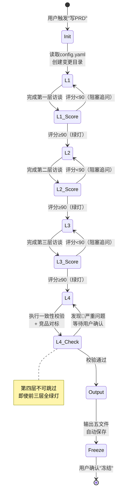

# PRD-000 概要需求生成器 — 设计文档

> **Skill ID**：`prd-generation`
> **版本**：v2.1.0
> **设计目标**：将 prd-system-outline 从"单文件 PRD 生成器"升级为"OpenSpec 集成的五文件需求基线引擎"
> **更新日期**：2026-05-07

---

## 目录

1. [设计目标与边界](#1-设计目标与边界)
2. [架构设计](#2-架构设计)
3. [核心流程详解](#3-核心流程详解)
4. [五文件输出规范](#4-五文件输出规范)
5. [开源项目融合设计](#5-开源项目融合设计)
6. [与 OpenSpec 的集成](#6-与-openspec-的集成)
7. [上下游协作接口](#7-上下游协作接口)
8. [设计决策记录](#8-设计决策记录)
9. [风险与限制](#9-风险与限制)

---

## 1. 设计目标与边界

### 1.1 设计目标

`prd-generation` 的核心目标是建立**不可推翻的需求基线**。在软件全生命周期中，概要需求阶段犯的错误成本最低、修正代价最小。本 Skill 通过以下机制确保基线质量：

- **四层递进式阻塞**：每层评分 < 90 分不得进入下一层，防止信息不全导致的下游返工
- **强制一致性校验**：输出前执行内部逻辑校验 + 竞品对标，捕获矛盾与遗漏
- **JTBD 框架**：从"用户为什么需要"出发，而非从"系统能做什么"出发
- **原子声明分解**：将 PRD 中的每个关键声明拆分为可验证的原子命题

### 1.2 能力边界

| 能力 | 范围 | 说明 |
|------|------|------|
| ✅ 需求基线生成 | 概要需求（PRD-000） | 输出五文件，覆盖背景、需求、功能结构、业务规则、NFR |
| ✅ 模块拆分规划 | `feature-XX-{模块}/` 目录映射 | 为 detailed-requirements 提供拆分输入 |
| ✅ 竞品资料收集 | 网络搜索 + 本地文档 | 主动调用 `web_search`，读取 `@路径` 本地文件 |
| ❌ 详细功能规格 | 单模块 PRD-001~PRD-00N | 应由 `prd-feature-detail` Skill 负责 |
| ❌ 技术设计文档 | SDD / 架构设计 | 应由 `technical-design-document-generator` 负责 |
| ❌ 代码生成 | 直接输出代码 | 不在本 Skill 范围内 |

---

## 2. 架构设计

### 2.1 渐进式披露（三级加载）

遵循项目统一的渐进式披露原则：

| 级别 | 内容 | 大小 | 加载时机 |
|------|------|------|---------|
| **Level 1** | Frontmatter（`name` + `description`） | ~50 tokens | Skill 匹配阶段 |
| **Level 2** | `SKILL.md` 正文 | ~3000 tokens（179 行） | 匹配成功后加载 |
| **Level 3** | `references/` 下的 5 个参考文件 | 无限制 | 执行时按需读取 |

### 2.2 四层状态机



### 2.3 关键设计原则

| 原则 | 实现方式 |
|------|----------|
| **一次只问一个问题** | 每层访谈逐题确认，降低用户认知负荷 |
| **零假设原则** | "Always asks before it assumes"，每个结论需用户确认 |
| **禁止自动修正** | 发现 🔴 严重问题时，列出清单等待用户确认，AI 不擅自修改 |
| **模板驱动** | 严格按 `config.yaml` 的 `required_sections` 输出，不遗漏、不扩展 |

---

## 3. 核心流程详解

### 3.1 Step 0: 初始化

**输入**：
- `openspec/config.yaml` → `artifact_specs.high-level-requirements`
- `openspec/changes/{变更名}/proposal.md`（变更提案）
- 用户提供的本地资料（`@路径`）
- brainstorming 会话上下文

**处理**：
1. 校验 `config.yaml` 是否存在，解析 `required_sections`
2. 校验变更目录是否存在，自动创建 `specs/` 子目录
3. 加载本地资料到上下文

**输出**：初始化摘要（变更名、目标读者、required_sections 列表）

### 3.2 Step 1-3: 三层递进访谈

每层遵循统一模式：

```
激活提问集 → 逐题访谈 → 输出摘要 → 红绿灯评分 → 阻塞/通过
```

**评分算法**（详见 `references/completeness-scoring.md`）：

| 层级 | 维度数 | 满分 | 绿灯阈值 | 阻塞规则 |
|------|--------|------|----------|----------|
| Layer 1 | 5 | 100 | ≥90 | 红灯/黄灯需补充后重评 |
| Layer 2 | 5 | 100 | ≥90 | 同上 |
| Layer 3 | 5 | 100 | ≥90 | 同上 |

**JTBD 融入**：在 Layer 1 收集答案后，将核心需求转化为 JTBD 格式，作为 01-product-overview.md 的输入。

**Component Inventory 融入**：在 Layer 2 模块识别阶段，同时输出组件级清单，作为 03-functional-structure.md 的输入。

### 3.3 Step 4: 一致性校验（强制）

**校验维度**（8 项内部 + 3 项竞品对标）：

```
内部一致性校验
├── Scope 自洽性（In/Out 重叠、边界依赖）
├── 实体-模块一致性（僵尸实体、关系冲突）
├── NFR-技术一致性（性能目标可行性）
├── 角色-权限一致性（权限闭环）
├── 依赖与约束一致性（外部依赖闭环）
└── 五文件一致性（模块命名、需求追溯、NFR 覆盖、实体跨文件）

竞品对标校验
├── 功能完整性对标（核心功能遗漏、差异化定位）
├── 技术方案先进性校验（架构时效性、性能方案合理性）
└── 行业标准与合规（合规基线、安全基线）
```

**原子声明分解**（cdeust 复用）：

将 PRD 中的关键声明拆分为原子命题，检查每个命题在五文件中是否有对应支撑：

```
原始声明："系统支持 10 万并发用户，响应时间 < 200ms"
├── 原子命题 1："10 万并发" → 需在 05-non-functional.md 中有容量规划
├── 原子命题 2："< 200ms" → 需在 05 中有性能指标 + 04 中有 SLA 定义
└── 若任一命题无支撑 → 标记 🔴 严重问题
```

### 3.4 Step 5: 输出与冻结

**五文件生成顺序**：

```
01-product-overview.md      → 基于 Layer 1 成果
02-requirements-list.md     → 基于 Layer 1+2 成果
03-functional-structure.md  → 基于 Layer 2 成果
04-business-rules.md        → 基于 Layer 2 成果
05-non-functional.md        → 基于 Layer 3+4 成果
```

**保存规则**：
- 路径：`openspec/changes/{变更名}/specs/`
- 自动创建目录：是
- 版本格式：`v{主版本}.{次版本}`
- 状态流：`草稿 → 已冻结`

---

## 4. 五文件输出规范

### 4.1 13 章逻辑结构 → 5 文件物理映射

| 逻辑章节 | 物理文件 | 核心内容 |
|----------|----------|----------|
| 1. 文档控制 | 全部 | 每文件头部重复版本信息 |
| 2. 项目背景与目标 | 01 | 痛点、北极星指标、JTBD |
| 3. 竞品与差异化分析 | 01 | 竞品对标表、技术方案对比 |
| 4. 系统范围（Scope）| 02 | In-Scope / Out-of-Scope、P0/P1/P2 |
| 5. 用户画像与角色矩阵 | 02/04 | 角色定义、RBAC 矩阵 |
| 6. 系统功能架构图 | 03 | 模块树、Component Inventory |
| 7. 核心业务流程 | 04 | Mermaid 流程图、状态机 |
| 8. 全局 NFR | 05 | 性能/并发/安全/兼容 |
| 9. 概要数据模型 | 03 | 核心实体、ER 图 |
| 10. 系统集成与约束 | 05 | 外部依赖、技术栈约束 |
| 11. 里程碑与优先级 | 05 | Phase 1/2/3、交付物 |
| 12. 风险提示与待决策项 | 05 | 校验摘要、已知风险 |
| 13. 详细 PRD 清单 | 03 | PRD-001~PRD-00N 映射 |

### 4.2 模块命名约束

```
03-functional-structure.md 中的模块名
    ↓ 必须保持一致
feature-XX-{模块名}/ 目录名
    ↓ 必须保持一致
detailed-requirements Skill 的输出目录
```

- 格式：kebab-case（小写字母，连字符分隔）
- 示例：`剧本工坊` → `script-workshop` → `feature-01-script-workshop/`
- 禁止：连续连字符 `--`、下划线 `_`、中文字符

### 4.3 用户故事 ID 编码

```
US-{模块编号}-{序号}
```

- 示例：`US-001-003` 表示 PRD-001 模块的第 3 条用户故事
- 跨模块通用故事：`US-COM-{序号}`
- 每个 P0 级故事必须附带二元验收标准（通过/失败）

---

## 5. 开源项目融合设计

### 5.1 融合总览

| 来源项目 | 核心贡献 | 融入位置 | 改造点 |
|----------|----------|----------|--------|
| **abeejuice/prd-skill** | 6 题访谈模板、URL 审计、逐题确认 | `questioning-guide.md` 快速模式 | 移除 Puppeteer MCP 依赖，改用 `web_search` + `web_open_url` |
| **johnnychauvet/prd-skill** | JTBD 框架、用户故事、Component Inventory、AI Build Summary | `jtbd-framework.md` + 五文件模板 | 输出目标从"AI 原型工具"改为"OpenSpec 规格 truth source" |
| **cdeust/ai-prd-generator-plugin** | 多文件拆分、原子声明分解、验证算法 | `completeness-scoring.md` + 校验层 | 移除 MCP Server 架构，提取逻辑为纯 Prompt 驱动 |

### 5.2 不可复用点的改造

| 开源项目特性 | 不可复用原因 | 改造方案 |
|-------------|-------------|----------|
| abeejuice 的 Puppeteer MCP | Kimi Code 不支持 MCP 协议 | 改用 `web_search` + `web_open_url` |
| abeejuice 的 `/gstack` 依赖 | Claude Code 的 Skill 栈生态 | 替换为 Kimi 的 `@路径` 引用 |
| cdeust 的 MCP Server 架构 | 7 tools 需要 MCP 协议 | 提取业务逻辑改造为纯 Prompt |
| cdeust 的许可证分层 | 免费版限制策略数和澄清轮数 | 完全开源复用，移除许可证检查 |
| johnnychauvet 的 AI 原型工具导向 | 面向 Cursor/v0/Lovable | 保留结构化思维，输出目标改为 OpenSpec |

---

## 6. 与 OpenSpec 的集成

### 6.1 目录映射

```
openspec/
└── changes/
    └── {变更名}/
        ├── proposal.md                 ← 上游输入（brainstorming / opsx:propose）
        ├── specs/
        │   ├── 01-product-overview.md      ← prd-generation 输出
        │   ├── 02-requirements-list.md     ← prd-generation 输出
        │   ├── 03-functional-structure.md  ← prd-generation 输出
        │   ├── 04-business-rules.md        ← prd-generation 输出
        │   ├── 05-non-functional.md        ← prd-generation 输出
        │   ├── PRD-001-{模块A}.md          ← detailed-requirements 输出
        │   ├── PRD-002-{模块B}.md          ← detailed-requirements 输出
        │   └── ...
        └── progress.md                 ← progress-tracker 维护
```

### 6.2 与 config.yaml 的联动

```yaml
# config.yaml 中 skill 关心的段落
artifact_specs:
  high-level-requirements:
    target_reader: "决策层、项目经理、架构师、业务方"
    core_questions: ["为什么做？", "给谁做？", "范围多大？"]
    required_sections:
      - product_overview      # → 01-product-overview.md
      - business_glossary      # → 02-requirements-list.md
      - functional_inventory   # → 03-functional-structure.md
      - requirements_list      # → 02-requirements-list.md
      - business_flow          # → 04-business-rules.md
      - prototype_sketch       # → 05-non-functional.md
      - non_functional         # → 05-non-functional.md
      - permission_matrix      # → 04-business-rules.md
    format: "Markdown + Mermaid 图表"
```

**设计原则**：`config.yaml` 是 truth source，`SKILL.md` 是执行引擎。Skill 必须按 `config.yaml` 的 `required_sections` 校验输出完整性。

---

## 7. 上下游协作接口

### 7.1 数据流图

```
[用户输入]
    ↓
[brainstorming] ──→ [requirement-analysis]
    ↓                      ↓
[proposal.md] ←──────────┘
    ↓
[competitive-analysis<br/>mode=positioning] ──→ market-positioning.md
    ↓
[prd-generation] ──→ 产出 5 文件到 specs/
    ↓
    ├──→ [competitive-analysis<br/>mode=technical] 读取 01 第 3 章（竞品分析）
    ├──→ [high-level-design]    读取 04/05（业务规则 + NFR）
    ├──→ [detailed-requirements] 读取 03 模块清单 → 拆分 PRD-001~PRD-00N
    └──→ [self-check]          读取全部 5 文件执行最终校验
              ↓
    [progress-tracker] 贯穿全程，更新 progress.md
```

### 7.2 接口契约

| 下游 Skill | 输入文件 | 关键依赖 |
|-----------|----------|----------|
| `competitive-analysis`（`positioning`） | `brainstorming/market-positioning.md` | 竞争集合、JTBD 对比、Blue Ocean、战略建议 |
| `competitive-analysis`（`technical`） | `01-product-overview.md` 第 3 章 | 竞品对标表、技术方案对比 |
| `high-level-design` | `04-business-rules.md` + `05-non-functional.md` | 业务规则、NFR、技术约束 |
| `detailed-requirements` | `03-functional-structure.md` 第 5 章 | 详细 PRD 清单、模块→目录映射 |
| `self-check` | 全部 5 文件 | 完整性、一致性、可追溯性 |

---

## 8. 设计决策记录

### ADR-001: 为什么从单文件改为五文件输出？

**背景**：prd-system-outline v1.x 输出单文件 PRD-000，在大型项目中存在以下问题：
- 文件过长（>300 行），AI 上下文加载效率低
- 下游 Skill 需要读取整个文件才能提取所需章节
- 多模块并行开发时，单文件导致合并冲突

**决策**：将 PRD-000 拆分为 5 个物理文件，13 章逻辑结构保持不变。

**权衡**：
- ✅ 下游 Skill 可按需读取特定文件，减少上下文消耗
- ✅ 支持多模块并行编写，避免文件冲突
- ✅ 与 cdeust 的 9 文件策略对齐，但简化为 5 文件降低复杂度
- ❌ 增加文件管理复杂度（需维护 5 个文件的版本一致性）

### ADR-002: 为什么引入 JTBD 框架？

**背景**：传统 PRD 从"功能清单"出发，容易导致"技术上正确但用户不需要"的解决方案。

**决策**：在 Layer 1 强制将核心需求转化为 JTBD 格式。

**依据**：johnnychauvet/prd-skill 的实践证明，JTBD 能为 AI 原型工具提供"情境上下文"，防止错误方案。本 Skill 将其扩展为需求基线的核心表达方式。

### ADR-003: 为什么保留第四层校验作为强制步骤？

**背景**：前三层评分均为绿灯时，用户倾向于直接输出 PRD，跳过校验。

**决策**：第四层校验不可跳过，即使前三层全绿灯也必须执行。

**依据**：cdeust 的 6 种验证算法研究表明，独立验证层能捕获 30% 以上的隐性逻辑矛盾。本 Skill 将其简化为"内部一致性 + 竞品对标"两步校验，降低复杂度但保留核心价值。

### ADR-004: 为什么采用 kebab-case 模块命名？

**背景**：模块名需要同时满足 Markdown 可读性、目录名合法性和 AI 解析一致性。

**决策**：模块名统一使用 kebab-case，直接映射到 `feature-XX-{模块}/` 目录。

**依据**：
- 项目命名规范已要求 kebab-case
- 中文字符在目录名和 URL 中易引发编码问题
- 连字符在 Markdown 表格和代码块中渲染稳定

---

## 9. 风险与限制

### 9.1 已知风险

| 风险 | 影响 | 缓解措施 |
|------|------|----------|
| 用户跳过阻塞追问 | 信息不全，下游返工成本增加 | 明确告知评分机制和阻塞原因，降低跳过意愿 |
| 竞品信息过时 | 对标结论失效 | `web_search` 主动检索最新信息，但依赖搜索引擎时效性 |
| AI 幻觉生成虚假竞品 | 误导决策 | 要求用户确认 AI 提供的竞品信息，不直接使用未经确认的竞品数据 |
| 模块命名后期变更 | 下游目录引用失效 | 冻结规则明确禁止修改，如需修改必须升版并重新评审 |

### 9.2 平台限制

| 平台 | 限制 | 应对方案 |
|------|------|----------|
| **Kimi Code** | Frontmatter 严格白名单（仅 name + description） | 元数据全部放入 `meta.json`，`SKILL.md` frontmatter 保持极简 |
| **Kimi Code** | 不支持 MCP 协议 | 移除 abeejuice 的 Puppeteer MCP 依赖，改用标准工具调用 |
| **Claude Code** | Skill 间依赖通过 `/skill:xxx` 调用 | 安装时保留 `grill-me` 快速模式作为备选 |
| **Cursor** | 通过 `.mdc` 规则文件加载 | 使用 `convert.py` 转换，将 references 内容内联到 `.mdc` |

---

## 附录 A：参考文档

| 文档 | 路径 | 说明 |
|------|------|------|
| Skill 主入口 | `skills/sdlc/prd-generation/SKILL.md` | AI 执行时的核心指令 |
| 元数据 | `skills/sdlc/prd-generation/meta.json` | 版本、标签、平台兼容 |
| 红绿灯评分 | `skills/sdlc/prd-generation/references/completeness-scoring.md` | 评分算法与阻塞规则 |
| 一致性校验 | `skills/sdlc/prd-generation/references/consistency-checklist.md` | 校验清单与问题分级 |
| 提问策略 | `skills/sdlc/prd-generation/references/questioning-guide.md` | 三层递进提问 + JTBD |
| 输出模板 | `skills/sdlc/prd-generation/references/system-outline-template.md` | 五文件模板与 13 章映射 |
| JTBD 框架 | `skills/sdlc/prd-generation/references/jtbd-framework.md` | JTBD + 用户故事 + Component Inventory |
| 使用手册 | `docs/skill-usage/prd-generation-usage.md` | 面向终端用户的使用指南 |
| 设计规格 | `docs/prd.txt` | 原始设计需求与竞品调研 |

---

## 附录 B：变更日志

| 版本 | 日期 | 变更 |
|------|------|------|
| 2.1.0 | 2026-05-07 | 增加对 `market-positioning.md` 的引用支持。Layer 1 和 Layer 4 优先读取 brainstorming 阶段产出的市场定位报告，避免重复搜索。 |
| 2.0.0 | 2026-05-06 | 重构为 prd-generation。融合 abeejuice/johnnychauvet/cdeust 开源项目优势。输出改为 OpenSpec 五文件规范，增加 JTBD 框架、Component Inventory、原子声明分解验证、主动 web_search 资料收集。 |
| 1.1.0 | 2026-04-26 | 增加第四层"一致性校验与竞品对标"机制；新增 `consistency-checklist.md`；强化技术方案先进性检查；增加用户确认模板。 |
| 1.0.0 | 2026-04-20 | 初始版本（prd-system-outline）。三层递进式对话 + 红绿灯评分 + 单文件 PRD-000 输出。 |
