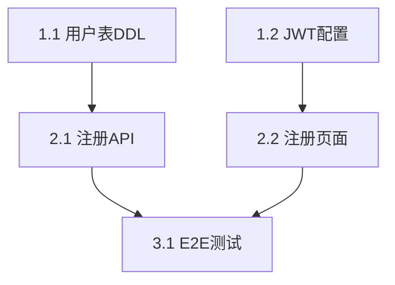

# Task Breakdown Skill 设计规格书

> 本文档面向 Skill 实现者与维护者，描述 `task-breakdown` 的完整技术架构、任务拆解流水线、与上下游的集成协议。
>
> 版本: 1.0.0

---

## 1. 功能定位

| 维度 | 说明 |
|------|------|
| **核心职责** | 将设计文档按 ≤30 分钟/任务粒度拆解为 Phase 组织的可执行开发任务清单 |
| **所处阶段** | 开发阶段（设计完成后 → 编码前） |
| **上游输入** | detailed-design、interface-first-dev、writing-plans（plan.md） |
| **下游输出** | executing-plans（消费 tasks.md） |
| **设计模式** | `pipeline`（多步骤流水线） |
| **开源对标** | agent-skills `planning-and-task-breakdown`（垂直切片、任务分级）、spellbook `develop` Phase 3.4.5（执行模式决策） |

---

## 2. 总体架构

```
┌─────────────────────────────────────────────────────────────┐
│                  task-breakdown Skill                        │
├─────────────────────────────────────────────────────────────┤
│  触发方式：design 评审通过后 / 用户指令"拆任务"               │
│  执行模式：内联执行，输出 tasks.md（持久化文件）              │
│  架构模式：主控 Agent 执行拆解流水线                          │
│  核心约束：≤30分钟/任务、≤5文件/任务、禁止XL、垂直切片优先    │
└─────────────────────────────────────────────────────────────┘
```

### 2.1 核心原则

1. **垂直切片优先**：按功能路径端到端拆分，禁止按技术层横向拆分
2. **粒度上限刚性**：任何任务超过 30 分钟或 5 个文件必须再拆
3. **标签明确化**：每个任务必须标注 `[前端]`/`[后端]`/`[AI模型]`/`[配置]`/`[测试]`
4. **验收可验证**：验收标准必须包含明确命令或可观察行为
5. **依赖无环**：任务间依赖必须构成 DAG，发现循环依赖则暂停

---

## 3. 处理逻辑

### 3.1 主控流程

```
Step 1: 读取设计文档 + 接口契约 + plan.md（如存在）
    ↓
Step 2: 垂直切片识别（按端到端功能路径拆分）
    ↓
Step 3: 任务分级（XS/S/M/L/XL，M≈30分钟为上限）
    ↓
Step 4: 标签标注（前端/后端/AI模型/配置/测试）
    ↓
Step 5: 依赖构建（数据流 + 接口调用 + 前后端耦合）
    ↓
Step 6: Phase 组织（拓扑排序，无依赖任务同 Phase）
    ↓
Step 7: 验收标准生成（可验证完成条件）
    ↓
Step 8: 自检（Anti-Rationalization Gate）
    ├── 通过 → Step 9
    └── 不通过 → 返回 Step 2 修复
    ↓
Step 9: 执行模式建议（delegated / sub_orchestrators / work_items）
    ↓
Step 10: 保存 tasks.md + Mermaid DAG + 风险清单
```

### 3.2 详细步骤

#### Step 1: 文档解析

读取以下文档：
- `feature-*/design.md` 或 `design/*.md`
- `feature-*/api-spec.md` 或 `interface-contracts/openapi.yaml`
- `parallel-dev-plan.md`（如存在）
- `openspec/changes/{变更名}/plan.md`（writing-plans 输出，如存在）

提取：模块列表、接口定义、数据模型、状态机、技术约束。

#### Step 2: 垂直切片

**正确示例**：
- "用户注册"功能 = 用户表 DDL + 注册 API + 注册页面 UI + 表单校验（拆为 4 个任务）

**错误示例（横向拆分）**：
- "先写所有 DAO，再写所有 Service，最后写所有 Controller"

每个切片应交付端到端可验证的功能增量。

#### Step 3: 任务分级

| 等级 | 预估时长 | 触及文件数 | 处理规则 |
|------|----------|------------|----------|
| XS | ≤10 分钟 | 1 个 | 可合并到同一切片的相邻任务 |
| S | ~15 分钟 | 1-2 个 | 标准任务 |
| M | ~30 分钟 | 2-3 个 | 标准任务，粒度上限 |
| L | ~45 分钟 | 3-5 个 | **必须再拆**为多个 M |
| XL | >45 分钟 或 >5 文件 | 5+ 个 | **强制再拆，禁止存在** |

#### Step 4: 标签标注

- `[前端]` —— UI 组件、页面、样式、前端状态管理
- `[后端]` —— API 实现、业务逻辑、数据访问层
- `[AI模型]` —— 模型调用、Prompt 工程、Embedding、RAG 链路
- `[配置]` —— 环境变量、CI/CD、基础设施、迁移脚本
- `[测试]` —— 单测、集成测试、E2E 测试、测试数据构造

多标签任务标注主责方在前。

#### Step 5: 依赖构建

识别三类依赖：
- **数据依赖**：DDL → ORM 模型 → Repository → Service
- **接口依赖**：接口契约 → Mock → 后端实现 → 前端联调
- **配置依赖**：环境配置 → 服务启动 → 功能验证

输出 Mermaid DAG：`graph TD` 语法。

#### Step 6: Phase 组织

| Phase | 名称 | 典型标签 | 说明 |
|-------|------|----------|------|
| Phase 1 | 基础设施与契约 | `[配置]`、`[后端]` | DB、配置、接口契约冻结、Mock |
| Phase 2 | 核心功能（垂直切片） | `[后端]`、`[前端]`、`[AI模型]` | 各功能端到端实现 |
| Phase 3 | 集成与联调 | `[测试]`、`[前端]`、`[后端]` | E2E 测试、接口联调、验收 |

并行规则：
- 同 Phase 内无依赖任务可并行
- 跨 Phase 必须顺序执行
- 前后端轨道在接口契约冻结后可并行

#### Step 7: 验收标准

每个任务附加：
- 可验证命令（如 `pytest tests/unit/...`）
- 或可观察行为（如"手动验证：输入非法邮箱提示错误"）
- 依赖列表
- 触及文件列表
- 接口引用（如 `@interface-contracts/openapi.yaml#L45-80`）

#### Step 8: 自检（Anti-Rationalization Gate）

五项机械检查：
1. **覆盖度**：设计文档每个模块/接口/状态机均有对应任务
2. **无 XL**：所有任务时长 ≤ 30 分钟，文件 ≤ 5 个
3. **依赖无环**：DAG 拓扑排序成功
4. **标签完整**：每个任务至少一个标签
5. **验收可验证**：验收标准含明确验证命令或行为

任一失败 → 返回 Step 2 修复。

#### Step 9: 执行模式建议

| 条件 | 建议模式 | 说明 |
|------|----------|------|
| < 15 任务，单轨道 | `delegated` | 单会话直接执行 |
| ≥ 15 任务 或 ≥ 2 轨道 | `sub_orchestrators` | 分层调度 |
| ≥ 25 任务 或 跨会话 | `work_items` | 拆分为多个会话 |

写入 tasks.md 头部元数据。

---

## 4. 输入输出规格

### 4.1 输入

| 输入项 | 类型 | 来源 | 说明 |
|--------|------|------|------|
| 设计文档 | Markdown | `feature-*/design.md` / `design/*.md` | 模块边界、技术约束 |
| 接口契约 | YAML/Markdown | `interface-contracts/openapi.yaml` / `api-spec.md` | 接口列表作为拆分边界 |
| 并行计划 | Markdown | `parallel-dev-plan.md`（可选） | 前后端并行策略 |
| 实现计划 | Markdown | `openspec/changes/{变更名}/plan.md`（可选） | writing-plans 输出 |
| 配置项 | YAML | `openspec/config.yaml` | `task_breakdown.*` |

### 4.2 输出

| 输出项 | 类型 | 路径 | 说明 |
|--------|------|------|------|
| tasks.md | Markdown | `openspec/changes/{变更名}/tasks.md` | 主产物：Phase 组织的任务清单 |
| 依赖图 | Mermaid | 嵌入 tasks.md | DAG 可视化 |
| 风险清单 | Markdown 表格 | 嵌入 tasks.md | 风险 / 影响 / 缓解措施 |
| 进度更新 | 信号 | 传递 progress-tracker | tasks.md 已生成 |

---

## 5. tasks.md 模板

```markdown
# Tasks for {change-name}

> 生成时间: {timestamp}
> 执行模式建议: {delegated | sub_orchestrators | work_items}
> 总任务数: {N} | Phase 数: {M} | 预估总时长: {H} 小时

## Phase 1: 基础设施与契约
- [ ] 1.1 [后端] 创建用户表 DDL + 索引
  - 验收: `pytest tests/unit/db/test_user_schema.py` 通过
  - 依赖: None
  - 文件: `src/db/migrations/001_user.sql`, `src/models/user.py`
  - 标签: [后端] [配置]

## Phase 2: 核心功能（垂直切片）
- [ ] 2.1 [后端] 实现用户注册 API（含参数校验）
  - 验收: `pytest tests/unit/api/test_register.py` 通过，覆盖率 ≥ 70%
  - 依赖: 1.1
  - 文件: `src/api/users.py`, `src/services/user_service.py`
  - 接口: `POST /api/v1/users`（参见 @interface-contracts/openapi.yaml#L45-80）

## Phase 3: 集成与联调
- [ ] 3.1 [测试] 端到端注册流程集成测试
  - 验收: `pytest tests/integration/test_register_e2e.py` 通过
  - 依赖: 2.1, 2.2

## 任务依赖图



## 风险与阻碍

| 风险 | 影响 | 缓解措施 |
|------|------|----------|
| {风险描述} | 高/中/低 | {措施} |

## 变更日志

- {timestamp} 初始生成
```

---

## 6. 配置项

```yaml
# openspec/config.yaml
task_breakdown:
  max_duration_minutes: 30          # 单个任务最大时长
  max_files_per_task: 5             # 单个任务最大触及文件数
  tags:
    - 前端
    - 后端
    - AI模型
    - 配置
    - 测试
  phase_rules:
    - name: "基础设施"
      order: 1
      contains_tags: [配置, 后端]
    - name: "核心功能"
      order: 2
      contains_tags: [前端, 后端, AI模型]
    - name: "集成测试"
      order: 3
      contains_tags: [测试]
  execution_mode_thresholds:
    delegated: 15                   # <15 任务：直接执行
    sub_orchestrators: 15           # ≥15 任务或 ≥2 轨道：子调度器
    work_items: 25                  # ≥25 任务：跨会话拆分
  auto_save:
    base_path: "openspec/changes/{change_name}/"
    filename: "tasks.md"
```

---

## 7. 与上下游衔接

| 衔接点 | 动作 |
|--------|------|
| 上游: writing-plans | 读取 plan.md 作为拆解输入；plan.md 末尾"转换建议"直接指导 Phase 划分 |
| 上游: detailed-design | 读取 feature-*/design.md 中的模块边界、技术约束 |
| 上游: interface-first-dev | 读取 openapi.yaml 获取接口列表，作为任务拆分的天然边界 |
| 下游: executing-plans | tasks.md 的 checkbox 语法即为执行状态机；executing-plans 直接解析并勾选 |
| 横向: progress-tracker | 生成后立即更新进度：tasks.md 已生成，共 N 个 Phase，M 个任务 |

---

## 8. Anti-Rationalization Framework

LLM 执行拆解时易产生"跳过检查"的合理化借口：

| 模式 | 信号短语 | 反制措施 |
|------|----------|----------|
| Scope Minimization | "这个模块很简单"、"就改个字段" | 运行分级 heuristics：文件数 × 接口数决定，不用 prose |
| Time Pressure | "时间紧，先跳过拆解直接写" | 10 分钟拆解省 2 小时返工；不拆解禁止进入 executing-plans |
| Similarity Shortcut | "跟上次功能一样" | 相似 ≠ 相同；接口契约必须重新核对 |
| Phase Collapse | "plan 和 breakdown 一起做了吧" | writing-plans 与 task-breakdown 是不同质量门控，禁止合并 |
| Self-Review Substitution | "我自己检查过了，不用跑 checklist" | 自检清单是机械扫描，必须逐条确认 |

---

## 9. 开源复用分析

### 9.1 能力映射

| task-breakdown 能力 | 可对标的开源 Skill | 复用度 | 差距分析 |
|---------------------|-------------------|--------|----------|
| 垂直切片 | agent-skills `planning-and-task-breakdown` | ✅ 高 | 直接复用思想，增加前后端标签体系 |
| 任务分级 XS/S/M/L/XL | agent-skills `planning-and-task-breakdown` | ✅ 高 | 直接复用，M 映射到 ≤30 分钟 |
| Checkpoint 机制 | agent-skills `planning-and-task-breakdown` | ⚠️ 部分 | 原先是每 2-3 Task 检查点，本方案改为 Phase + Batch 检查点 |
| 执行模式决策 | spellbook `develop` Phase 3.4.5 | ⚠️ 部分 | 复用 15+/25+ 阈值逻辑，作为输出建议而非调度决策 |
| 复杂度升级 | spellbook `develop` | ⚠️ 部分 | 拆解中发现更复杂依赖时触发升级 |

### 9.2 需自建的能力

| 能力 | 说明 | 实现建议 |
|------|------|----------|
| Phase 自动组织 | 按拓扑排序 + 标签规则归并 | DAG 拓扑排序 → 按 `phase_rules` 映射 |
| 标签标注规范 | 为每个任务自动判定责任域 | 基于文件路径/技术栈关键词匹配 |
| 验收标准生成 | 为每个任务生成可验证条件 | 基于接口契约自动生成 pytest 命令 |
| 自检 Gate | 五项机械检查 | 每项为独立验证函数，任一失败返回修复 |

---

## 10. 风险与规避

| 风险 | 规避方法 |
|------|----------|
| 任务粒度难以控制 | 硬性约束：>30 分钟或 >5 文件必须再拆，无例外 |
| 循环依赖未被发现 | DAG 拓扑排序失败时暂停并反馈用户 |
| 验收标准模糊 | 强制要求包含命令或可观察行为，禁止"代码正确"等描述 |
| 前后端任务不同步 | 垂直切片优先 + 接口契约作为硬边界 |
| 设计变更后 tasks.md 过期 | tasks.md 原则上不手动 patch，设计变更需重新执行 task-breakdown |

---

## 11. 附录：与 writing-plans / executing-plans 协作图

```
detailed-design + interface-first-dev
         ↓
   【writing-plans】→ plan.md（模块级计划）
         ↓
   【task-breakdown】→ tasks.md（≤30分钟/任务）
         ↓
   【executing-plans】→ 代码 + 自测 + 自动勾选
```
