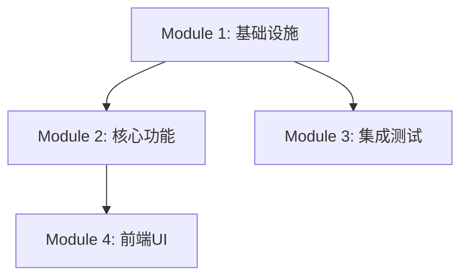
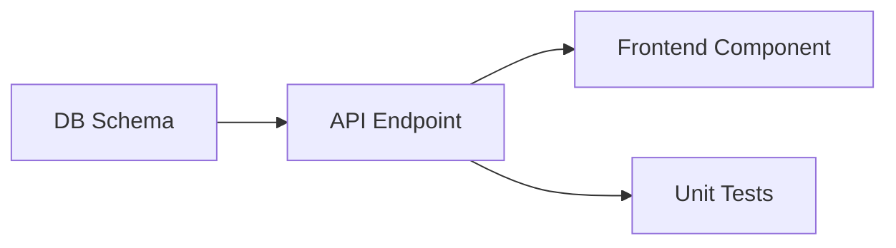

# Writing Plans Skill 设计规格书

> 本文档面向 Skill 实现者与维护者，描述 `writing-plans` 的完整技术架构、计划生成流水线、Self-Review 机制及与外部系统的集成协议。
>
> 版本: 2.0.0（从 Superpowers 原生改造）

---

## 1. 功能定位

| 维度 | 说明 |
|------|------|
| **核心职责** | 将设计文档转化为设计文档级别的实现计划（plan.md），含模块实现顺序、技术路线、验收标准 |
| **所处阶段** | 开发阶段（设计完成后 → 任务拆解前） |
| **上游输入** | brainstorming、detailed-design、interface-first-dev |
| **下游输出** | task-breakdown（plan.md → tasks.md） |
| **设计模式** | `generator`（结构化内容生成器） |
| **开源对标** | Superpowers `writing-plans`（No Placeholders、Self-Review 三检）、spellbook `develop` Phase 3（plan review subagent、执行模式决策） |

---

## 2. 总体架构

```
┌─────────────────────────────────────────────────────────────┐
│                   writing-plans Skill                        │
├─────────────────────────────────────────────────────────────┤
│  触发方式：design 完成后 / 用户指令"写计划"                   │
│  执行模式：内联执行，输出 plan.md（持久化文件）               │
│  架构模式：主控 Agent 执行计划生成流水线                      │
│  核心约束：No Placeholders、Self-Review 四检、设计一致性      │
└─────────────────────────────────────────────────────────────┘
```

### 2.1 改造前后对比

| 维度 | Superpowers 原生 | 本方案改造后 |
|------|------------------|-------------|
| 计划粒度 | 2-5 分钟 micro-step（代码级） | 模块级实现计划（设计文档级） |
| 输出范围 | 纯代码实现计划 | 设计文档级别计划（含架构决策、技术路线、风险缓解） |
| 与 OpenSpec 集成 | `docs/superpowers/plans/` | `openspec/changes/{变更名}/plan.md` |
| 与 task-breakdown 关系 | 无独立 task-breakdown，plan 直接含 micro-steps | plan 作为 task-breakdown 的输入，增加自动转换提示 |
| Self-Review | Spec coverage / Placeholder scan / Type consistency | 同上，增加 **Design Alignment**（与上游设计文档一致性） |

---

## 3. 处理逻辑

### 3.1 主控流程

```
Step 1: 读取设计文档 + 接口契约 + 竞争分析（如存在）
    ↓
Step 2: 识别模块与子系统
    ↓
Step 3: 按模块生成实现策略（实现顺序、关键算法、依赖注入点、测试策略）
    ↓
Step 4: 确定技术路线与关键算法选型
    ↓
Step 5: 生成任务依赖关系图（Mermaid DAG）
    ↓
Step 6: 编写验收标准清单
    ↓
Step 7: Self-Review 四检
    ├── 通过 → Step 8
    └── 不通过 → 修复 → 重新执行 Step 7
    ↓
Step 8: 保存 plan.md
    ↓
Step 9: 输出 plan → task 转换建议
    ↓
Step 10: 提示用户下一步执行 task-breakdown
```

### 3.2 详细步骤

#### Step 1: 文档解析

读取：
- `design/*.md` 或 `feature-*/design.md`
- `feature-*/api-spec.md` 或 `interface-contracts/openapi.yaml`
- `competitive-analysis.md`（如存在）
- `openspec/config.yaml`（获取 `writing_plans.required_sections`）

提取：架构决策、技术栈、模块边界、接口列表。

#### Step 2: 模块识别

识别独立子系统，判断是否需要拆分为多个 plan：
- 多子系统时建议拆分为独立 plan（每个子系统一个 plan.md）
- 每个 plan 应能独立产出可工作、可测试的软件

#### Step 3: 实现策略

为每个模块确定：
- **实现顺序**：数据模型 → API → 业务逻辑 → 前端集成
- **关键算法**：核心计算逻辑、状态机实现、缓存策略
- **依赖注入点**：模块间接口调用位置
- **测试策略**：单元测试重点、集成测试范围

遵循 **Simplicity First**：优先选择最简单可行的实现路径。

#### Step 4: 技术路线

输出 Tech Stack 章节：
- 前端框架及版本
- 后端框架及版本
- 数据库类型及版本
- 关键库及版本

#### Step 5: 依赖图

生成 Mermaid DAG，展示模块间数据流与调用关系：


#### Step 6: 验收标准

为每个模块定义可验证完成条件：
- 数据模型与 db-schema.md 一致
- API 响应格式与 openapi.yaml 一致
- 单元测试覆盖率 ≥ 70%
- 状态机覆盖所有分支

#### Step 7: Self-Review 四检

| 检查项 | 说明 | 失败处理 |
|--------|------|----------|
| **Spec Coverage** | 每个设计点都有对应计划项 | 补充遗漏任务 |
| **Placeholder Scan** | 全文搜索 "TBD"/"TODO"/"appropriate" 等 | 发现即修复 |
| **Type Consistency** | 跨模块类型/签名一致 | 统一命名 |
| **Design Alignment** | plan 与 design.md / api-spec.md 无矛盾 | 修正不一致 |

#### Step 8-10: 保存与交接

- 保存到 `openspec/changes/{变更名}/plan.md`
- 末尾追加「Plan → Task 转换建议」
- 提示用户："下一步 REQUIRED: 运行 `/skill:task-breakdown`"

---

## 4. 输入输出规格

### 4.1 输入

| 输入项 | 类型 | 来源 | 说明 |
|--------|------|------|------|
| 设计文档 | Markdown | `design/*.md`、`feature-*/design.md` | 核心输入 |
| 接口契约 | YAML/Markdown | `interface-contracts/openapi.yaml`、`api-spec.md` | 验证接口完整性 |
| 竞争分析 | Markdown | `competitive-analysis.md`（可选） | 技术选型参考 |
| 配置项 | YAML | `openspec/config.yaml` | `writing_plans.*` |

### 4.2 输出

| 输出项 | 类型 | 路径 | 说明 |
|--------|------|------|------|
| plan.md | Markdown | `openspec/changes/{变更名}/plan.md` | 主产物：详细实现计划 |
| 依赖图 | Mermaid | 嵌入 plan.md | 模块间 DAG |
| 验收标准清单 | Markdown 表格 | 嵌入 plan.md | 各模块完成条件 |
| 转换建议 | Markdown | 嵌入 plan.md | 为 task-breakdown 提供输入 |

---

## 5. plan.md 模板

```markdown
# {Feature Name} Implementation Plan

> **For agentic workers:** 下一步 REQUIRED SUB-SKILL: `/skill:task-breakdown` 将此计划转换为可执行任务。
> **生成时间:** {timestamp}
> **变更名:** {change_name}

## Goal
一句话描述本计划构建的内容。

## Architecture
2-3 句话描述实现路径与技术选型依据。

## Tech Stack
- 前端: {框架} {版本}
- 后端: {框架} {版本}
- 数据库: {类型}
- 关键库: {列表}

---

## Module 1: {模块A}

### 实现顺序
1. 数据模型定义（DDL + ORM 模型）
2. API 接口实现（含参数校验）
3. 业务逻辑层（状态机实现）
4. 前端页面集成

### 关键决策
- **决策1:** 使用 {方案A} 而非 {方案B}，原因: {rationale}
- **决策2:** 缓存策略选择 {策略}，原因: {rationale}

### 依赖关系


### 验收标准
- [ ] 数据模型与 db-schema.md 完全一致
- [ ] API 响应格式与 openapi.yaml 一致
- [ ] 单元测试覆盖率 ≥ 70%
- [ ] 状态机覆盖所有分支（参见 state-machine.md）

### 风险与缓解
| 风险 | 影响 | 缓解 |
|------|------|------|
| {风险描述} | 高/中/低 | {措施} |

## 任务依赖总图


## Plan → Task 转换建议

- 预估任务数: {N} 个（建议 {delegated} 模式）
- 建议 Phase 数: {M} 个
- 关键路径: {模块X} → {模块Y}（不可并行）
- 可并行轨道: 前端轨道 + 后端轨道（需接口契约先行）
```

---

## 6. 配置项

```yaml
# openspec/config.yaml
writing_plans:
  required_sections:
    - Goal
    - Architecture
    - Tech Stack
    - Module Breakdown
    - Key Decisions
    - Dependency Graph
    - Acceptance Criteria
    - Risks and Mitigations
  auto_mermaid: true              # 自动生成依赖图
  no_placeholders: true           # 禁止占位符
  self_review:
    - spec_coverage
    - placeholder_scan
    - type_consistency
    - design_alignment           # 新增：与上游设计文档一致性
  auto_save:
    base_path: "openspec/changes/{change_name}/"
    filename: "plan.md"
  handoff:
    next_skill: "task-breakdown"
    auto_suggest_execution_mode: true
```

---

## 7. No Placeholders 规则（零容忍）

计划中禁止出现以下 plan failure 模式：

| 模式 | 示例 | 正确做法 |
|------|------|----------|
| 占位符 | "TBD"、"TODO"、"implement later" | 必须填写实际内容 |
| 模糊描述 | "Add appropriate error handling" | 写出具体异常类型和处理逻辑 |
| 无代码测试 | "Write tests for the above" | 提供实际测试代码块 |
| 跨任务引用 | "Similar to Task 3" | 重复展开，工程师可能乱序阅读 |
| 无示例 | "Implement the service layer" | 提供文件路径 + 代码结构 |
| 未定义引用 | 引用 `clearFullLayers()` 但之前定义的是 `clearLayers()` | 类型一致性检查必须捕获 |

---

## 8. 与上下游衔接

| 衔接点 | 动作 |
|--------|------|
| 上游: detailed-design | 读取 design/*.md、feature-*/design.md 作为核心输入 |
| 上游: interface-first-dev | 读取 openapi.yaml 验证接口契约完整性 |
| 下游: task-breakdown | plan.md 作为 task-breakdown 的核心输入；末尾"转换建议"直接指导拆解 |
| 横向: self-check | Self-Review 阶段调用 self-check 进行设计一致性校验 |

---

## 9. 开源复用分析

### 9.1 能力映射

| writing-plans 能力 | 可对标的开源 Skill | 复用度 | 差距分析 |
|---------------------|-------------------|--------|----------|
| No Placeholders | Superpowers `writing-plans` | ✅ 高 | 直接吸收 |
| 精确 Task 结构 | Superpowers `writing-plans` | ✅ 高 | 直接复用：Files + Steps + 代码块 + 命令 + 预期输出 |
| Self-Review 三检 | Superpowers `writing-plans` | ✅ 高 | 直接复用，新增 Design Alignment |
| Plan review subagent | spellbook `develop` Phase 3.2 | ⚠️ 部分 | 可借鉴 reviewing-impl-plans 机制，作为可选增强 |
| 执行模式决策 | spellbook `develop` Phase 3.4.5 | ⚠️ 部分 | 复用 15+/25+ 阈值，作为输出建议而非调度决策 |

### 9.2 改造要点

| 改造项 | 原因 | 实现方式 |
|--------|------|----------|
| 粒度从 micro-step → 模块级 | 本方案有独立的 task-breakdown 负责微观拆解 | SKILL.md 中明确说明 plan 是设计文档级，micro-step 由下游处理 |
| 增加与 OpenSpec 集成 | 项目采用 OpenSpec 目录结构 | 输出路径改为 `openspec/changes/{变更名}/plan.md` |
| 增加 plan → task 转换建议 | 明确衔接 writing-plans 与 task-breakdown | 在 plan.md 末尾固定输出「转换建议」章节 |
| 增加 Design Alignment | 防止 plan 与上游 design 脱节 | Self-Review 第四检：核对 plan 与 design.md / api-spec 一致性 |

---

## 10. 风险与规避

| 风险 | 规避方法 |
|------|----------|
| plan 写得太粗导致执行偏差 | No Placeholders 规则 + 精确文件路径 + 完整代码块 |
| plan 与 design 不一致 | Self-Review 第四检 Design Alignment |
| 多子系统混杂在一个 plan | Scope Check：建议拆分为独立 plan |
| plan 直接当作执行蓝图 | 明确提示下一步必须执行 task-breakdown |
| 技术选型理由不足 | 关键决策章节必须写明 rationale |

---

## 11. 附录：与 task-breakdown / executing-plans 协作图

```
detailed-design + interface-first-dev
         ↓
   【writing-plans】→ plan.md（模块级计划）
         ↓（plan.md 末尾含转换建议）
   【task-breakdown】→ tasks.md（≤30分钟/任务）
         ↓
   【executing-plans】→ 代码 + 自测 + 自动勾选
```

**协作规则**：
- writing-plans 产出 plan.md 后，必须经 Self-Review 通过才能进入 task-breakdown
- plan.md 末尾的「转换建议」直接指导 task-breakdown 的 Phase 划分和任务数估算
- task-breakdown 产出 tasks.md 后，executing-plans 按 Batch 消费
