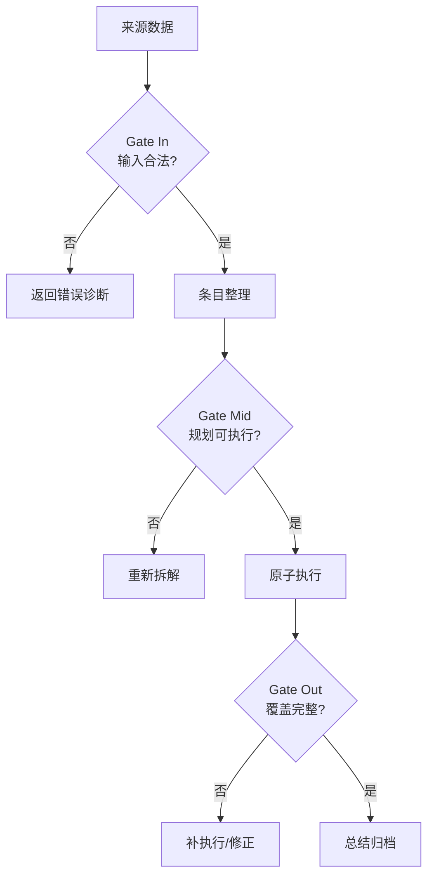

# Skill 执行规范框架

> 本文档定义 Skill 被调用后的统一执行生命周期。所有 `generator`、`reviewer`、`pipeline` 模式的 Skill 应遵循本框架，确保输入可追溯、输出可验证、过程可归档。
>
> 与 `docs/skill-development-guide.md` 的关系：开发指南解决"**怎么写** Skill"，本文档解决"**Skill 怎么执行**"。

---

## 目录

1. [元模型（YAML 定义）](#元模型yaml-定义)
2. [五阶段详解](#五阶段详解)
3. [三层检查点](#三层检查点)
4. [与现有 Skill 的映射](#与现有-skill-的映射)
5. [模式特化指南](#模式特化指南)

---

## 元模型（YAML 定义）

```yaml
skill_execution:
  phases:
    - input_analysis      # 1. 分析来源数据
    - task_decomposition  # 2. 整理条目
    - atomic_execution    # 3. 执行
    - coverage_validation # 4. 检查是否覆盖来源
    - retrospective       # 5. 总结问题
  checkpoints:
    - gate_in:   "输入合法性检查"
    - gate_mid:  "执行一致性检查"
    - gate_out:  "输出完整性检查"
```

---

## 五阶段详解

### 阶段 1：输入分析（Input Analysis）

**目标**：确保理解来源数据的边界、格式、隐含约束，不做假设性执行。

| 检查项 | 规范动作 | 交付物 |
|--------|----------|--------|
| **Schema 校验** | 验证输入是否符合 skill 定义的 `input_schema`（字段类型、必填项、枚举值） | 校验报告 |
| **上下文加载** | 读取 `@memory`、`.kimi/skills` 中的前置依赖 skill 输出、项目规范（`AGENTS.md`） | 上下文摘要 |
| **来源识别** | 区分：用户直接输入 / 上游 skill 传递 / 外部 API 拉取 | 来源溯源表 |
| **异常拦截** | 输入为空、格式错误、超出处理容量时，立即终止并返回结构化错误，不进入执行 | 错误诊断 |

**关键原则**："Garbage in, Garbage out" 的阻断 —— 输入不合格时，skill 应拒绝执行而非勉强处理。

---

### 阶段 2：条目整理（Task Decomposition）

**目标**：将模糊需求拆分为可验证的原子任务清单。

| 检查项 | 规范动作 | 交付物 |
|--------|----------|--------|
| **需求拆解** | 将用户意图拆分为 `task_list`，每个任务含：ID、描述、输入切片、预期输出、依赖关系 | `tasks.md` 或 YAML |
| **优先级排序** | 标记阻塞任务（Blocker）与可并行任务，构建 DAG | Mermaid 图或依赖矩阵 |
| **范围冻结** | 明确**不做**什么，防止执行蔓延（Scope Creep） | 范围声明 |
| **资源评估** | 预估 token 消耗、文件读写次数、外部调用次数 | 资源预算 |

**关键原则**："先规划，后动手" —— 条目未整理完成前，不生成任何实质性输出。

---

### 阶段 3：原子执行（Atomic Execution）

**目标**：按任务清单逐项执行，保持状态可追溯。

| 检查项 | 规范动作 | 交付物 |
|--------|----------|--------|
| **单任务隔离** | 每个原子任务独立执行，失败不影响其他任务（或明确级联回退策略） | 执行日志 |
| **状态机管理** | 任务状态：`pending → running → success / failed / skipped` | 状态看板 |
| **中间产物留存** | 关键中间结果写入临时缓冲区（如 `@docs/sessions/auto-save-draft.md`） | 中间文件 |
| **异常处理** | 失败时记录：错误类型、输入快照、堆栈/上下文、重试策略 | 错误记录 |

**关键原则**："可中断、可恢复" —— 执行到一半被用户打断时，下次能从 checkpoint 继续。

---

### 阶段 4：覆盖验证（Coverage Validation）

**目标**：输出必须完整覆盖来源需求，无遗漏、无偏差、无幻觉。

| 检查项 | 规范动作 | 交付物 |
|--------|----------|--------|
| **条目回溯** | 对照阶段 2 的 `task_list`，逐条勾选验证 | 覆盖矩阵（来源 → 输出映射） |
| **一致性校验** | 输出与输入是否存在矛盾（如数字总和不对、命名不一致） | 一致性报告 |
| **边界测试** | 验证极端情况：空输入、超长输入、特殊字符、并发边界 | 边界测试结果 |
| **幻觉检测** | 对事实性内容，标注信息来源；无法溯源的内容标记为 `[待验证]` | 可信度标签 |

**关键原则**："输出必须可回溯到输入" —— 每一个结论都能指向来源数据中的依据。

> **特别说明**：本阶段是防止"脑暴 → PRD 遗漏条目"的核心防线。所有 `generator` 类 skill 在输出最终产物前，必须完成条目回溯；所有涉及外部资料引用的 skill，必须完成幻觉检测。

---

### 阶段 5：总结归档（Retrospective）

**目标**：沉淀经验，形成可复用的知识资产。

| 检查项 | 规范动作 | 交付物 |
|--------|----------|--------|
| **执行摘要** | 总结：做了什么、用了什么资源、产出什么、耗时多少 | `summary.md` |
| **问题沉淀** | 记录执行中遇到的阻塞、workaround、待优化点 | `issues.md` 或追加到 `docs/decisions.md` |
| **模式提取** | 如果该 skill 遇到新问题，判断是否需要更新 skill 本身的 prompt / 规则 | Skill 改进建议 |
| **归档存储** | 按项目定义的归档规则，写入 `docs/sessions/日期.md` | 会话归档 |

**关键原则**："一次执行，一次沉淀" —— 不总结的执行等于白做。

---

## 三层检查点

在执行流程中设置强制门禁，不通过则阻断。



| 门禁 | 检查内容 | 失败处理 |
|------|----------|----------|
| **Gate In** | 输入 schema、上下文完整性、权限 | 拒绝执行，返回结构化错误 |
| **Gate Mid** | 任务 DAG 无环、资源预算可接受、范围明确 | 打回重新规划 |
| **Gate Out** | 100% 条目覆盖、一致性校验通过、无未标记幻觉 | 打回补执行 |

### 检查点与现有门控的对应

| 本框架门禁 | 现有机制 | 说明 |
|-----------|----------|------|
| Gate In | `validate.py`（格式层面）<br>Skill 内置输入校验（业务层面） | 格式校验已自动化；业务逻辑层面的输入合法性需各 skill 自行实现 |
| Gate Mid | `brainstorming` 的"User approves design?"<br>`prd-generation` 的 Layer 1~3 评分 | 目前分散在各 skill 中，未统一命名 |
| Gate Out | `self-check` 的 BLOCKER 判定<br>`doc-quality-gate` 的自动修复 | 建议统一使用 `self-check` 作为 Gate Out 的标准收口 |

---

## 与现有 Skill 的映射

| 框架阶段 | 主要负责 Skill | 协作 Skill |
|----------|---------------|-----------|
| **阶段 1 输入分析** | `brainstorming`（探索上下文） | `requirement-analysis`（澄清输入） |
| **阶段 2 条目整理** | `writing-plans` | `task-breakdown`、`brainstorming` |
| **阶段 3 原子执行** | `executing-plans` | `test-driven-development`、`git-automation` |
| **阶段 4 覆盖验证** | `self-check` | `doc-quality-gate`、`prd-generation`（内置 Layer 4） |
| **阶段 5 总结归档** | `finish` | `progress-tracker` |

---

## 模式特化指南

不同设计模式（`pattern`）对五阶段的侧重不同：

| 模式 | 阶段 1 | 阶段 2 | 阶段 3 | 阶段 4 | 阶段 5 |
|------|--------|--------|--------|--------|--------|
| **tool-wrapper** | 必做：校验工具参数 | 轻量：无 | 必做：调用工具 | 必做：校验工具输出 | 可选 |
| **generator** | 必做：加载模板 + 上下文 | 必做：填充清单 | 必做：按模板生成 | **必做：条目回溯 + 幻觉检测** | 推荐 |
| **reviewer** | 必做：加载检查清单 | 必做：逐条拆解 | 必做：逐项审查 | 必做：汇总问题分级 | 推荐 |
| **inversion** | 必做：识别信息缺口 | 必做：问题 DAG | 必做：逐轮提问 | 必做：确认无遗漏后再生成 | 可选 |
| **pipeline** | 必做：加载阶段定义 | 必做：阶段 DAG | 必做：按序执行 | 必做：跨阶段一致性 | 推荐 |

> **强制要求**：`generator` 和 `pipeline` 模式必须显式实现阶段 4 的"条目回溯"和"幻觉检测"，并在 `SKILL.md` 的 `## Gotchas` 中声明未执行覆盖验证的后果。
