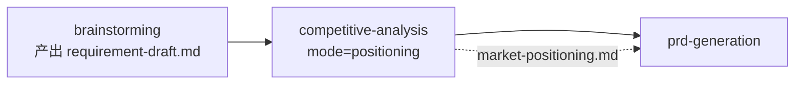
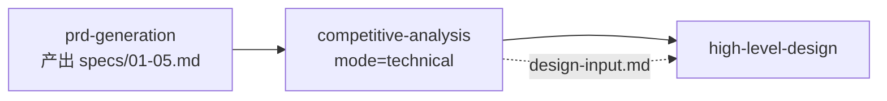

# Competitive Analysis（竞品分析）使用手册

> 本文档面向技术负责人、架构师和项目经理，说明如何触发和使用 `competitive-analysis` Skill 执行结构化竞品分析。本 Skill 支持**双模式**：`positioning`（市场定位，服务需求阶段）与 `technical`（技术深度对比，服务设计阶段）。

---

## 一、双模式速查

| 维度 | `positioning`（市场定位） | `technical`（技术深度） |
|------|--------------------------|------------------------|
| **触发时机** | Brainstorming 之后、PRD 之前 | 概要设计之前 |
| **核心问题** | 我们该不该做？做什么能差异化？ | 别人怎么做的？我们技术怎么选？ |
| **分析深度** | 市场格局、JTBD、Blue Ocean、战略建议 | 数据模型、技术架构、Wardley Map、集成方式 |
| **核心产出** | `market-positioning.md` | `competitive-analysis.md` + `design-input.md` |
| **下游消费者** | `prd-generation` | `high-level-design` |
| **技术细节** | ❌ 禁止输出 ER 图、Wardley Map、API 协议 | ✅ 必须输出四维技术对比 |

> **一句话原则**：需求未定 → 用 `positioning`；要画架构图了 → 用 `technical`。

---

## 二、Mode = positioning（市场定位模式）

### 2.1 前置条件



**必须就绪的文档**：

| 文档 | 路径 | 用途 |
|------|------|------|
| 需求草案 | `openspec/changes/{变更名}/brainstorming/requirement-draft.md` | **核心输入**：明确初步功能模块边界和分析范围 |

**可选参考**：

| 文档 | 路径 | 用途 |
|------|------|------|
| 已知竞品清单 | 用户手动提供 | 缩小搜索范围 |
| 本地技术约束 | `openspec/config.yaml` | 排除不符合团队技术栈的选项 |

### 2.2 何时触发

| 场景 | 建议 |
|------|------|
| 进入全新市场 | **必须触发**。了解竞争格局后再写 PRD |
| 产品定位不清晰 | **必须触发**。明确差异化空间 |
| 已有明确市场定位 | 可跳过。但需在 `prd-generation` Layer 1 中注明"市场格局已明确" |
| 纯内部工具，无外部竞争 | **不要触发** |

### 2.3 标准触发指令

```text
【阶段 1.5 市场定位 | Skill：competitive-analysis mode=positioning】

请执行市场定位竞品分析。

分析目标：{具体功能模块或市场领域}
已知竞品：{竞品A}, {竞品B}, {竞品C}
问题类型：market_entry | positioning

参考文档：
@openspec/changes/{变更名}/brainstorming/requirement-draft.md

输出要求：
- 生成 market-positioning.md
- 自动保存到 openspec/changes/{变更名}/brainstorming/
- 每个关键结论标注证据层级 (T1-T6) 和置信度 H/M/L
- 战略建议使用 O→I→R→C→W 格式
- 禁止输出技术架构深度内容（如 Wardley Map、ER 图、API 协议细节）
```

### 2.4 输出物清单

保存到 `openspec/changes/{变更名}/brainstorming/`：

| 章节 | 内容 | 关键检查点 |
|------|------|-----------|
| 竞争集合 | 直接/间接/范式威胁三层分类 | 是否遗漏了"现状维持"和"手动流程"？ |
| JTBD 对比矩阵 | 竞品 × 用户任务，标注满足度 | 是否从"用户雇佣产品完成什么任务"角度对比？ |
| Blue Ocean ERRC | 剔除-减少-提升-创造四象限 | 是否找到了非拥挤的差异化空间？ |
| 颠覆向量与威胁景观 | H1/H2/H3 三视野 | 是否只分析了眼前威胁？ |
| 战略建议 | O→I→R→C→W 级联 | 是否有可观测的 Watch Indicator？ |
| 假设登记册 | 假设、框架、置信度、推翻条件 | 是否诚实记录了不确定性？ |
| 对抗性自我批判 | ≥3 个真实弱点 | 是否足够坦诚？ |
| 来源 | 按 T1-T6 分类，带日期 | 来源是否可追溯到具体 URL？ |

> **格式要求**：结构化表格为主，避免长段落，确保 `prd-generation` 能直接提取约束。

---

## 三、Mode = technical（技术深度模式）

### 3.1 前置条件



**必须就绪的文档**：

| 文档 | 路径 | 用途 |
|------|------|------|
| 五文件概要需求 | `openspec/changes/{变更名}/specs/01-05.md` | **核心输入**：明确功能模块边界和分析范围 |

**可选参考**：

| 文档 | 路径 | 用途 |
|------|------|------|
| 已知竞品清单 | 用户手动提供 | 缩小搜索范围 |
| 内部技术约束 | `openspec/config.yaml` | 排除不符合团队技术栈的选项 |
| 市场定位报告 | `openspec/changes/{变更名}/brainstorming/market-positioning.md` | 避免重复分析市场格局，聚焦技术深度 |

> ⚠️ 如果**概要需求**缺失，Skill 会拒绝生成并要求先补全上游。

### 3.2 何时触发

| 场景 | 建议 |
|------|------|
| 技术选型不确定 | **必须触发**。尤其是涉及 AI 模型、数据库、前端框架等关键决策 |
| 进入全新市场 | **必须触发**。了解竞争格局后再做架构设计 |
| 已有明确技术栈且无竞品 | 可跳过。但需在 `high-level-design` 中注明"无外部竞品，选型基于内部约束" |
| 纯内部工具，无外部竞争 | **不要触发** |

### 3.3 标准触发指令

```text
【阶段 3 概要设计前 | Skill：competitive-analysis mode=technical】

请执行技术深度竞品分析。

分析目标：{具体功能模块或市场领域}
已知竞品：{竞品A}, {竞品B}, {竞品C}
问题类型：{market_entry | competitive_response | moat_assessment | positioning | build_buy_partner}

参考文档：
@openspec/changes/{变更名}/specs/01-product-overview.md
@openspec/changes/{变更名}/specs/02-requirements-list.md
@openspec/changes/{变更名}/brainstorming/market-positioning.md（如有）

请按以下维度分析：
1. 角色数据模型设计
2. 核心功能流程
3. 技术选型
4. 集成方式

输出要求：
- 生成 competitive-analysis.md 和 design-input.md
- 自动保存到 openspec/changes/{变更名}/design/
- 每个关键结论标注证据层级 (T1-T6) 和置信度 H/M/L
- 战略建议使用 O→I→R→C→W 格式
```

### 3.4 输出物清单

保存到 `openspec/changes/{变更名}/design/`：

#### 主报告：competitive-analysis.md

| 章节 | 内容 | 关键检查点 |
|------|------|-----------|
| 竞争集合 | 直接/间接/范式威胁三层分类 | 是否遗漏了"现状维持"和"手动流程"？ |
| 角色数据模型设计对比 | 实体、字段、关系、权限对比 | 是否有 Mermaid ER 图？ |
| 核心功能流程对比 | 主链路、状态机、异常处理 | 是否有流程图和功能矩阵？ |
| 技术选型对比 | 技术栈 + Wardley Map | 每个选型是否有证据标注？ |
| 集成方式对比 | API 风格、协议、生态 | 是否覆盖了关键第三方集成？ |
| 7 Powers 热图 | 🟢🟡🔴 评分 | 每个评分是否有 (TX) 证据？ |
| 切换成本分解 | 7 类成本 1-10 分 | 是否有进度条可视化？ |
| 颠覆向量与威胁景观 | H1/H2/H3 三视野 | 是否只分析了眼前威胁？ |
| 战略建议 | O→I→R→C→W 级联 | 是否有可观测的 Watch Indicator？ |
| 假设登记册 | 假设、框架、置信度、推翻条件 | 是否诚实记录了不确定性？ |
| 对抗性自我批判 | ≥3 个真实弱点 | 是否足够坦诚？ |
| 来源 | 按 T1-T6 分类，带日期 | 来源是否可追溯到具体 URL？ |

#### 设计输入：design-input.md

| 章节 | 内容 | 消费者 |
|------|------|--------|
| 技术选型约束 | 组件、主流方案、推荐方案、理由、置信度 | `high-level-design` |
| 架构模式参考 | 模式、来源竞品、适用性、风险 | `high-level-design` |
| 接口设计约束 | API 风格、协议、标准建议 | `high-level-design` |
| 数据模型参考 | 实体、竞品设计、本方案决策 | `high-level-design` |
| 差异化空间 | Blue Ocean ERRC | `high-level-design` |
| 风险提示 | 风险、来源、观测指标 | 全阶段 |

---

## 四、通用规范（两种模式均适用）

### 4.1 证据层级（T1-T6）

| 标注 | 含义 | 可信度 |
|------|------|--------|
| `(T1)` | 直接数据（代码、官方文档、实测） | 最高，可直接采信 |
| `(T2)` | 一手研究（结构化测试、访谈） | 高 |
| `(T3)` | 专家分析（知名博客、论文） | 中高 |
| `(T4)` | 行业报告（Gartner 等） | 中 |
| `(T5)` | 高管声明（PR 稿、发布会） | 低，仅为战略信号 |
| `(T6)` | 推测（社交媒体、猜测） | 最低，需验证 |

### 4.2 置信度（H/M/L）

| 标注 | 含义 | 行动建议 |
|------|------|----------|
| **H** | 高置信度（>70%） | 可直接作为设计依据 |
| **M** | 中置信度（40-70%） | 方向参考，需在详细设计阶段验证 |
| **L** | 低置信度（<40%） | 仅为假设，不应直接影响架构决策 |

### 4.3 特殊标记

| 标记 | 含义 | 处理方式 |
|------|------|----------|
| `[POTENTIALLY STALE]` | 来源超过 6 个月 | 要求验证数据是否仍有效 |
| `[EVIDENCE-LIMITED]` | 证据仅 T4-T6 | 要求补充 T1-T3 证据后再决策 |
| `[PENDING]` | 该维度分析缺失 | 要求补充分析或说明原因 |

### 4.4 竞争力评级（🟢🟡🔴）

| 符号 | 含义 |
|------|------|
| 🟢 | 强 — 成熟、持续积累、3 年以上才能复制 |
| 🟡 | 中 — 存在但初级、正在侵蚀或范围有限 |
| 🔴 | 弱/无 — 无实质竞争壁垒 |

---

## 五、边界红线速查

### 5.1 一句话原则

> **需要了解"市场格局和差异化空间"→ `positioning` 模式**
> **需要了解"别人技术怎么做的"→ `technical` 模式**
> **已经知道"别人怎么做的"→ 直接看结论，执行下游 Skill**

### 5.2 常见误用场景

| 如果你要求... | 实际应该... |
|---------------|-------------|
| "对比这几个功能点" | 直接要求 AI 生成功能矩阵，无需调用本 Skill |
| "分析我们内部系统的瓶颈" | 使用 `systematic-debugging` Skill，这不是竞争问题 |
| "帮我定价" | 本 Skill 包含定价作为 GTM 维度之一，但不以定价为唯一输出 |
| "做用户调研" | 使用 `requirement-analysis` 或 `discovery-research`，这是需求侧研究 |
| "需求阶段就输出技术架构图" | 禁止。`positioning` 模式不输出 Wardley Map、ER 图、API 协议细节 |

### 5.3 报告评审检查清单

审阅竞品分析报告时，逐条确认：

- [ ] 竞争集合是否包含"现状维持"和"手动流程"
- [ ] 每个表格单元格是否有 `(TX)` 标注
- [ ] 战略建议是否使用 O→I→R→C→W 格式
- [ ] 是否包含 ≥3 个对抗性自我批判的弱点
- [ ] 假设登记册是否诚实记录了不确定性
- [ ] `design-input.md` / `market-positioning.md` 是否使用结构化表格（非长段落）
- [ ] 所有 T5/T6 结论是否标记了 `[EVIDENCE-LIMITED]`
- [ ] `positioning` 模式是否意外输出了技术深度内容（如 Wardley Map、ER 图）

---

## 六、速查表

### 6.1 指令速查

| 你想做... | 发送的指令 |
|-----------|-----------|
| 执行市场定位分析 | `【阶段1.5】请使用 competitive-analysis skill mode=positioning` |
| 执行技术深度分析 | `【阶段3】请使用 competitive-analysis skill mode=technical` |
| 指定参考文档（positioning） | `@openspec/changes/{变更名}/brainstorming/requirement-draft.md` |
| 指定参考文档（technical） | `@openspec/changes/{变更名}/specs/` |
| 查看市场定位报告 | `@openspec/changes/{变更名}/brainstorming/market-positioning.md` |
| 查看技术深度报告 | `@openspec/changes/{变更名}/design/competitive-analysis.md` |
| 查看设计输入 | `@openspec/changes/{变更名}/design/design-input.md` |
| 触发自查 | `【自查】请使用 self-check skill` |
| 进入概要需求 | `检查点已通过，现在进入【阶段2：概要需求】` |
| 进入概要设计 | `检查点已通过，现在进入【阶段3：概要设计】` |

### 6.2 文件路径速查

| 类型 | 路径 |
|------|------|
| 输入（positioning） | `openspec/changes/{变更名}/brainstorming/requirement-draft.md` |
| 输出（positioning） | `openspec/changes/{变更名}/brainstorming/market-positioning.md` |
| 输入（technical） | `openspec/changes/{变更名}/specs/01-05.md` |
| 输出（technical 报告） | `openspec/changes/{变更名}/design/competitive-analysis.md` |
| 输出（technical 设计输入） | `openspec/changes/{变更名}/design/design-input.md` |
| 原始搜索摘要 | `openspec/changes/{变更名}/design/.raw/search-round-{N}.md` |

### 6.3 question_type 速查

| 类型 | 适用场景 |
|------|----------|
| `market_entry` | 进入新市场，需要了解格局和差异化空间 |
| `competitive_response` | 竞争对手有重大动作，需要制定应对策略 |
| `moat_assessment` | 评估自身或竞品的技术护城河 |
| `positioning` | 制定产品定位策略 |
| `build_buy_partner` | 决定自建、采购还是合作 |

### 6.4 严重等级速查

| 等级 | 含义 | 处理方式 |
|------|------|----------|
| 🔴 BLOCKER | 必须修复，否则禁止进入下一阶段 | 修复后重新执行 self-check |
| 🟡 WARNING | 建议修复，可进入下一阶段但需记录风险 | 记录风险，后续跟进 |
| 🟢 INFO | 优化建议，不影响流程 | 可选采纳 |

---

## 七、FAQ

**Q1：为什么需要两次竞品分析？**
> 两次分析的侧重点和目的不同。`positioning` 回答"做什么能赢"，服务需求定义；`technical` 回答"技术怎么选"，服务架构设计。如果合并为一次，要么需求阶段被技术细节带偏，要么设计阶段缺乏足够的技术对标深度。

**Q2：可以只做一次吗？**
> 可以。如果市场格局和技术选型都很明确，可直接跳过 `positioning` 或在 `technical` 中简要覆盖战略建议。但涉及新市场或技术选型不确定时，强烈建议分两次执行。

**Q3：`positioning` 的产出会被 `technical` 复用吗？**
> 会参考但不会直接复用。`technical` 模式在启动时会读取 `market-positioning.md`（如有），避免重复分析市场格局，直接聚焦技术深度。但 `technical` 仍需独立验证技术数据，因为市场定位报告中的技术信息可能已过时或不够深。

**Q4：报告中的证据层级不够高怎么办？**
> 如果关键结论只有 T4-T6 支撑，Skill 会自动标记 `[EVIDENCE-LIMITED]`。你有两个选择：
> 1. 要求 AI 补充搜索，寻找 T1-T3 证据
> 2. 接受该结论为假设，在后续阶段通过原型验证或实测获取 T1/T2 证据

**Q5：发现 AI 把某个竞品归类错了怎么办？**
> 在 Round 1（情报发现）阶段，AI 会呈现竞品分类草案。此时你可以直接纠正："X 不是直接竞品，而是范式威胁"或"请补充 Y 作为间接竞品"。越早纠正，后续分析越准确。

**Q6：`design-input.md` 会被 `high-level-design` 自动消费吗？**
> 是的。标准触发指令中，`high-level-design` 会自动引用 `@openspec/changes/{变更名}/design/design-input.md`。如果你手动执行 `high-level-design`，需要显式引用该文件。

**Q7：竞品分析可以重复执行吗？**
> 可以。市场格局变化、新竞品出现、或技术演进时，应重新执行。建议在报告 Metadata Block 中标注版本和日期，旧版本归档而非覆盖。

**Q8：为什么 `positioning` 模式禁止输出技术架构图？**
> 需求阶段过早输出技术架构图（如 Wardley Map、ER 图）会对后续设计形成锚定效应，导致架构师在已有"图"的约束下做选择，而非基于完整需求做最优设计。技术深度内容留给 `technical` 模式。

---

## 八、变更日志

| 版本 | 日期 | 变更内容 |
|------|------|----------|
| v2.0.0 | 2026-05-07 | 重构为双模式手册。新增 `positioning` 市场定位模式与 `technical` 技术深度模式，明确两次触发时机、输入输出差异和边界红线。 |
| v1.0.0 | 2026-05-07 | 初始版本。仅包含 `technical` 模式的完整操作手册。 |
