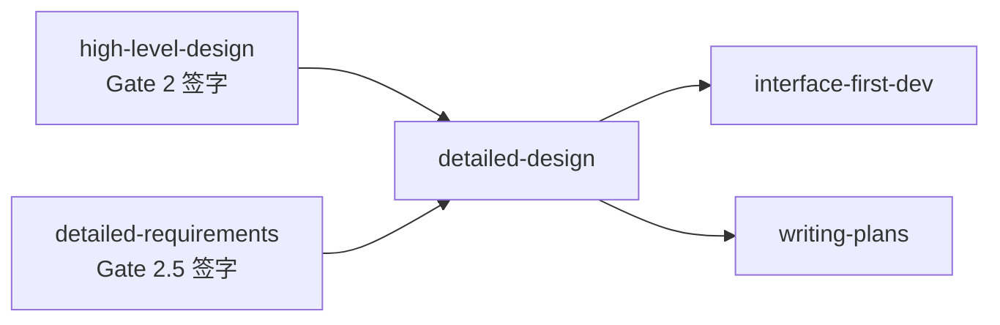

# Detailed Design（详细设计）使用手册

> 本文档面向技术负责人、架构师和开发工程师，说明如何触发和使用 `detailed-design` Skill 按模块生成可编码的技术细节。

---

## 一、什么是详细设计

详细设计（Detailed Design）回答四个核心问题：

- **模块内部怎么拆？** → 类/函数分层与职责
- **接口怎么定义？** → 请求/响应字段、错误码、权限
- **数据怎么存？** → 表结构、DDL、索引、缓存
- **状态怎么转？** → 模块内部状态机与异常分支

它位于**概要设计评审通过之后、接口驱动开发之前**，是编码实现的直接技术输入。

### 详细设计 vs 概要设计

| 维度 | 概要设计（HLD） | 详细设计（DD） |
|------|----------------|---------------|
| 影响范围 | ≥2 个模块 | 单个模块内部 |
| 典型内容 | 服务划分、接口契约、存储策略 | 类图、API Schema、DDL、算法流程 |
| 能否变更技术栈 | 可以，需架构评审 | **不可以**，必须遵循概要设计选型 |
| 输出时机 | 阶段 3 | 阶段 4 |
| 产出物 | 16 个 md 文件 | 每个模块 5 个文件 |

**一句话记忆**：概要设计决定"房子有几层、用什么材料"；详细设计决定"每块砖怎么砌"。

---

## 二、使用前置条件

### 2.1 必须完成的上下游工作



**必须就绪的文档**（阻塞性输入）：

| 文档 | 路径 | 用途 |
|------|------|------|
| 概要设计 16 文件 | `openspec/changes/{变更名}/design/*.md` | **核心约束**：技术栈、安全策略、全局状态机、数据架构 |
| 详细需求 5 文件 | `openspec/changes/{变更名}/specs/feature-*/` | **核心输入**：功能规格、io-table、logic、prototype |

**必须满足的门控**：

| 门控 | 状态要求 | 校验方式 |
|------|----------|----------|
| Gate 2 | `passed` | `human-decisions.md` 中 Gate2 为 `passed` |
| Gate 2.5 | `passed` | `human-decisions.md` 中 Gate2.5 为 `passed` |

> ⚠️ 如果 Gate 2 或 Gate 2.5 未签字，Skill 会拒绝生成并提示"请先完成上游评审"。

### 2.2 配置检查

确保 `openspec/config.yaml` 中包含以下内容：

```yaml
artifact_specs:
  high-level-design:
    required_sections:
      - system_architecture
      - tech_stack
      - data_architecture
      - interface_contracts
      - module_responsibilities
      - state_machine_global
      - sequence_diagrams
      - algorithm_selection
      - security_design
      - performance_design
      - exception_handling_global
      - deployment_architecture
      - test_strategy
      - extensibility_design
      - decision_records
      - governance_rules
```

---

## 三、触发方式

### 3.1 指令格式

| 方式 | 指令示例 |
|------|----------|
| 标准触发 | `/skill:detailed-design 按模块输出详细设计` |
| 带参考文档 | `/skill:detailed-design 参考 @openspec/changes/{变更名}/design/ 和 @openspec/changes/{变更名}/specs/feature-*/` |
| 指定模块 | `/skill:detailed-design 先生成 feature-01-user-auth 模块的详细设计` |

### 3.2 执行后自检

生成完毕后，建议立即触发 self-check：

```
/skill:self-check 详细设计
```

或：

```
【阶段 4 自查】请检查规格充分性（SPECIFIED/VAGUE/MISSING）、数据库与数据架构一致性、API 与接口契约一致性、状态机与全局状态机兼容性、类设计覆盖功能点、测试计划追溯完整性、模块间接口契约审计
```

---

## 四、输出说明

### 4.1 每个模块的 5 个文件

以 `feature-01-user-auth` 模块为例：

```
openspec/changes/{变更名}/specs/
├── feature-01-user-auth/
│   ├── design.md              # 模块内部架构与组件设计
│   ├── api-spec.md            # 接口定义（含 OpenAPI YAML）
│   ├── db-schema.md           # 数据表结构与 DDL
│   ├── state-machine.md       # 模块内部状态机
│   └── test-plan.md           # 测试策略与用例
├── feature-02-content-mgmt/
│   └── ...
└── ...
```

### 4.2 各文件内容速查

| 文件 | 核心内容 | 验收要点 |
|------|----------|----------|
| `design.md` | 模块分层、类/函数签名、算法逻辑、模块依赖图 | 是否覆盖 spec.md 所有功能点；是否与概要设计分层一致 |
| `api-spec.md` | 端点清单、请求/响应字段表、错误码、权限、OpenAPI 片段 | URI 是否资源导向；错误码是否完整；YAML 语法是否正确 |
| `db-schema.md` | DDL、索引策略、缓存 Key 设计、连接池配置 | 字段类型是否与技术选型匹配；是否含完整约束；无硬编码密码 |
| `state-machine.md` | Mermaid 状态图、转换条件、异常分支、全局映射 | 是否与全局状态机兼容；异常分支是否完整 |
| `test-plan.md` | Given/When/Then 单测、集成场景、边界覆盖、Mock 策略 | 是否追溯所有 AC；边界条件是否覆盖空值/越界/并发/超时 |

---

## 五、执行后自检

### 5.1 三级内置门控

detailed-design 生成过程中会自动执行三级门控：

1. **Cross-Module Audit**：检查模块间字段类型一致性、接口兼容性、状态枚举冲突
2. **规格充分性审查**：判定 SPECIFIED / VAGUE / MISSING，模糊语言零容忍
3. **设计质量自评**：阻塞维度（完备性、清晰度、准确性）评分，< 3 分暂停

### 5.2 self-check 阶段 4 检查清单

生成完毕后，**必须**运行 self-check 执行以下 7 项检查：

| # | 检查项 | 通过标准 |
|---|--------|----------|
| 1 | 规格充分性判定 | MISSING = 0，VAGUE < 3 |
| 2 | 数据库与数据架构一致性 | db-schema 与 `03-data-architecture.md` 一致 |
| 3 | API 与接口契约一致性 | api-spec 与 `04-interface-contracts.md` 一致 |
| 4 | 状态机与全局状态机兼容性 | 局部状态无冲突转换 |
| 5 | 类设计覆盖功能点 | design.md 覆盖 spec.md 所有功能点与 AC |
| 6 | 测试计划追溯完整性 | 每个测试用例追溯 ≥1 个 AC |
| 7 | 模块间接口契约审计 | 模块间接口 request/response/error 格式显式定义 |

### 5.3 常见 BLOCKER 与处理方式

| BLOCKER | 原因 | 处理方式 |
|---------|------|----------|
| MISSING ≥ 1 | 某项规格未定义 | 补充具体参数/格式/约束 |
| 状态机冲突 | 局部状态与全局状态不兼容 | 检查全局状态机定义，修正局部状态 |
| 功能点未覆盖 | design.md 缺少 spec.md 中的功能 | 补充对应类/函数设计 |
| 模块间接口不兼容 | feature-A 与 feature-B 数据类型冲突 | 统一数据类型定义，或走变更流程 |
| 技术栈偏离 | db-schema 语法与概要设计选型不符 | 修正为选型对应的数据库语法 |

---

## 六、与上下游 Skill 的衔接

### 6.1 上游衔接

- **high-level-design**：产出 `design/*.md`，必须在 Gate 2 签字后消费
- **detailed-requirements**：产出 `feature-*/spec.md` 等，必须在 Gate 2.5 签字后消费

### 6.2 下游衔接

详细设计完成后，可并行启动以下 Skill：

| 下游 Skill | 启动时机 | 作用 |
|---|---|---|
| `interface-first-dev` | detailed-design 完成后 | 基于 `api-spec.md` + `db-schema.md` 生成 OpenAPI 契约 |
| `writing-plans` | detailed-design 完成后 | 基于 `design.md` 编写实现计划 |
| `task-breakdown` | interface-first-dev 或 writing-plans 后 | 拆解为 ≤30 分钟粒度的 tasks.md |

> 建议先启动 `interface-first-dev` 冻结接口契约，再启动 `writing-plans` 编写实现计划，最后 `task-breakdown` 拆解任务。

---

## 七、常见问题

### Q1：可以跳过某些模块的详细设计吗？

**不可以**。每个 P0/P1 模块必须独立输出 5 个文件。若某模块确实无数据库/无状态机，仍需输出说明文件（如 "本模块无持久化存储，db-schema.md N/A"），不可省略。

### Q2：概要设计评审后发现缺陷，能在详细设计中修正吗？

**不可以**。详细设计阶段禁止修正概要设计缺陷。应暂停详细设计，反馈用户走架构变更流程（重新触发 `high-level-design`），待 Gate 2 重新签字后再继续。

### Q3：需求变更后需要重新生成所有模块吗？

**不需要**。detailed-design 支持增量更新：
1. 识别变更影响的模块（对比变更前后的 spec.md / io-table.md）
2. 仅重新生成受影响模块的 5 个文件
3. 未受影响模块保持冻结
4. 重新执行模块间审计

### Q4：api-spec.md 中的 OpenAPI 片段可以直接给 Swagger UI 使用吗？

**不可以直接复制使用**。`api-spec.md` 中的 OpenAPI 片段是按接口分散的 YAML 片段，需经 `interface-first-dev` Skill 组装为完整的 `openapi.yaml` 后方可使用。

### Q5：detailed-design 会生成实际的数据库迁移脚本吗？

**不会**。`db-schema.md` 中的 DDL 是设计参考，实际迁移脚本应在 `executing-plans` 阶段由开发者根据框架规范（如 Alembic、Flyway、Liquibase）生成。

---

## 八、使用示例

### 示例 1：标准触发（全部模块）

**用户输入**：

```
/skill:detailed-design 按模块输出详细设计。参考 @openspec/changes/v2.3-login-refactor/design/ 和 @openspec/changes/v2.3-login-refactor/specs/feature-*/
```

**Skill 行为**：
1. 读取 `design/*.md` 提取架构约束
2. 扫描 `specs/feature-*/` 获取模块清单（feature-01-user-auth, feature-02-content-mgmt ...）
3. 逐个模块生成 5 文件
4. 执行 Cross-Module Audit
5. 执行规格充分性审查
6. 执行设计质量自评
7. 保存所有文件
8. 触发 `self-check`
9. 提示用户可启动 `interface-first-dev`

### 示例 2：指定单模块生成

**用户输入**：

```
/skill:detailed-design 先生成 feature-01-user-auth 模块的详细设计
```

**Skill 行为**：
1. 仅生成 feature-01-user-auth 的 5 个文件
2. 保存到对应目录
3. 提示用户：单模块生成未执行 Cross-Module Audit，全部模块生成完毕后需重新审计

### 示例 3：增量更新

**用户输入**：

```
feature-02-content-mgmt 的 spec.md 已更新，请重新生成该模块的详细设计
```

**Skill 行为**：
1. 对比新旧 spec.md，识别变更范围
2. 仅重新生成 feature-02-content-mgmt 的 5 个文件
3. 重新执行全量 Cross-Module Audit（因该模块变更可能影响其他模块接口）
4. 更新未受影响模块保持原状
