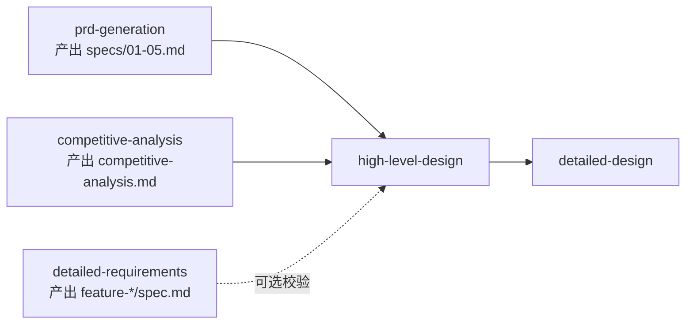

# High-Level Design（概要设计）使用手册

> 本文档面向技术负责人、架构师和项目经理，说明如何触发和使用 `high-level-design` Skill 生成系统概要设计文档。

---

## 一、什么是概要设计

概要设计（High-Level Design, HLD）回答三个核心问题：

- **系统拆成几块？** → 模块划分与职责
- **数据怎么走？** → 数据架构与流向
- **用什么技术栈？** → 技术选型与理由

它位于**需求冻结之后、详细设计之前**，是架构评审会锁定的关键文档。

### 概要设计 vs 详细设计

| 维度 | 概要设计（HLD） | 详细设计 |
|------|----------------|---------|
| 影响范围 | ≥2 个模块 | 单个模块内部 |
| 典型内容 | 服务划分、接口契约、存储策略 | 类图、API Schema、DDL、算法流程 |
| 能否变更技术栈 | 可以，需架构评审 | 不可以 |
| 输出时机 | 阶段 3 | 阶段 4 |

**一句话记忆**：概要设计决定"房子有几层、用什么材料"；详细设计决定"每块砖怎么砌"。

---

## 二、使用前置条件

### 2.1 必须完成的上下游工作



**必须就绪的文档**（阻塞性输入）：

| 文档 | 路径 | 用途 |
|------|------|------|
| 五文件概要需求 | `openspec/changes/{变更名}/specs/01-05.md` | **核心输入**：产品范围、模块清单、需求边界、非功能指标 |
| 竞品分析 | `openspec/changes/{变更名}/design/competitive-analysis.md` | **技术选型论证支撑** |

**建议参考的文档**（非阻塞，用于校验）：

| 文档 | 路径 | 用途 |
|------|------|------|
| 详细需求 | `openspec/changes/{变更名}/specs/feature-*/spec.md` | 模块功能细节，可用于校验概要设计是否遗漏 P0 功能点及状态机兼容性 |

> ⚠️ 如果**概要需求**或**竞品分析**缺失，Skill 会拒绝生成并要求先补全上游。若仅缺失详细需求，Skill 仍可基于概要需求生成架构，但会在覆盖度校验环节发出 WARNING，提示可能存在遗漏。

### 2.2 配置检查

确保 `openspec/config.yaml` 中包含以下内容：

```yaml
high-level-design:
  required_sections:
    - system_architecture
    - tech_stack
    - data_architecture
    - interface_contracts
    - module_responsibilities
    - state_machine_global
    - sequence_diagrams
    - algorithm_selection
    - security_design
    - performance_design
    - exception_handling_global
    - deployment_architecture
    - test_strategy
    - extensibility_design
    - decision_records
    - governance_rules
```

如需调整输出范围，修改 `required_sections` 即可。例如纯后端项目可移除 `algorithm_selection`。

---

## 三、触发指令

### 3.1 标准触发（推荐）

```text
【阶段 3 概要设计 | Skill：high-level-design】

生成 {项目名} 概要设计。

主要输入：
@openspec/changes/{变更名}/specs/

建议参考（如已产出）：
@openspec/changes/{变更名}/specs/feature-*/
@openspec/changes/{变更名}/design/competitive-analysis.md

配置：
DETAIL_LEVEL=Detailed
FOCUS_ON_EXTENSIBILITY=true
INCLUDES_DECISION_RECORDS=true

请按 config.yaml 中 artifact_specs.high-level-design.required_sections 逐项输出。
```

### 3.2 快速触发

```text
【阶段3】请使用 high-level-design skill
```

### 3.3 触发自查

全部章节生成后，执行：

```text
【阶段3 自查】请使用 self-check skill
```

### 3.4 进入下一阶段

自查通过且人工评审确认后：

```text
检查点已通过（概要设计架构评审完成，自查无严重问题）。
现在进入【阶段 4：详细设计】。
```

---

## 四、预期交互流程

| 轮次 | AI 行为 | 用户行为 |
|------|---------|----------|
| 1 | 读取配置和上游文档，确认模块清单和生成策略 | 确认模块清单无误 |
| 2 | 生成 `01-system-architecture.md` + `02-tech-stack.md` | 确认架构分层和技术选型 |
| 3 | 生成 `03-data-architecture.md` + `04-interface-contracts.md` | 确认数据逻辑和接口边界 |
| 4 | 生成 `05-module-responsibilities.md` + `06-state-machine-global.md` | 确认模块职责和全局状态 |
| 5 | 生成 `07-sequence-diagrams.md` + `08-algorithm-selection.md` | 确认核心流程和 AI 选型 |
| 6 | 生成 `09-13`（安全/性能/异常/部署/测试） | 确认非功能设计 |
| 7 | 生成 `14-16`（扩展性/ADR/治理） | 确认扩展预留和决策记录 |
| 8 | 触发 self-check，输出自查报告 | 确认无严重问题，进入架构评审 |

> 实际对话中，AI 可能将多个章节合并输出，用户也可随时喊停要求调整。

---

## 五、输出物清单

所有文件自动保存到 `openspec/changes/{变更名}/design/`：

### 必做章节（13 个）

| 文件 | 内容 | 关键检查点 |
|------|------|-----------|
| `01-system-architecture.md` | 系统分层、服务划分、部署拓扑 | 是否覆盖所有 P0 模块？ |
| `02-tech-stack.md` | 技术选型清单及理由 | 每个选型是否有竞品分析支撑？ |
| `03-data-architecture.md` | 逻辑 ER 图、数据流向、存储策略 | 是否写了字段类型/索引？（应无） |
| `04-interface-contracts.md` | 模块间通信模式、数据契约 | 是否写了请求 Schema？（应无） |
| `05-module-responsibilities.md` | 每个模块的输入、输出、职责、依赖 | 是否写了内部类图？（应无） |
| `06-state-machine-global.md` | 跨模块核心实体状态流转 | 是否写了单模块内部状态？（应无） |
| `07-sequence-diagrams.md` | 跨模块关键流程时序图 | 是否写了 Controller→Service 调用链？（应无） |
| `08-algorithm-selection.md` | AI 模型基座、选型理由、IO 维度 | 是否写了 Prompt 模板？（应无） |
| `09-security-design.md` | 认证授权、数据加密、网络隔离 | - |
| `10-performance-design.md` | QPS、缓存策略、异步化 | 是否写了缓存 Key？（应无） |
| `11-exception-handling-global.md` | 全局异常分类、降级、熔断、重试 | 是否写了单接口异常码？（应无） |
| `12-deployment-architecture.md` | 容器化/K8s/CI/CD 拓扑 | - |
| `13-test-strategy.md` | 测试金字塔、分层、覆盖率目标 | 是否写了单测用例？（应无） |

### 可选章节（3 个）

| 文件 | 内容 | 启用条件 |
|------|------|----------|
| `14-extensibility-design.md` | 功能添加/修改/集成预留扩展点 | `FOCUS_ON_EXTENSIBILITY=true` |
| `15-decision-records.md` | 关键架构决策记录（ADR） | `INCLUDES_DECISION_RECORDS=true` |
| `16-governance-rules.md` | 架构一致性维护规则 | `INCLUDES_GOVERNANCE=true` |

---

## 六、边界红线速查

### 6.1 一句话原则

> **影响 ≥2 个模块的决策 → 概要设计**
> **影响 ≤1 个模块的细节 → 详细设计**

### 6.2 常见下钻内容（禁止出现在概要设计）

| 如果你看到... | 它应该出现在... |
|---------------|-----------------|
| `varchar(64)`、`@NotNull`、`@RequestBody` | `detailed-design/api-spec.md` |
| `CREATE TABLE`、`INDEX`、`DDL` | `detailed-design/db-schema.md` |
| `class UserService { createUser(...) }` | `detailed-design/design.md` |
| `Controller → Service → Repository` | `detailed-design/design.md` |
| `temperature=0.7`、`max_tokens=4096` | `detailed-design/algorithm.md` |
| `ERR_001`、`TCC`、`Saga` | `detailed-design/exception-handling.md` |
| `assert`、`mock`、`patch` | `detailed-design/test-plan.md` |

### 6.3 常见陷阱检查清单

产出物评审时，逐条确认：

- [ ] 将接口字段校验写入了 `interface-contracts` → 应移至 `detailed-design/api-spec.md`
- [ ] 将数据库字段/索引写入了 `data-architecture` → 应移至 `detailed-design/db-schema.md`
- [ ] 将算法参数写入了 `algorithm-selection` → 应移至 `detailed-design/algorithm.md`
- [ ] 将单模块状态机写入了 `state-machine-global` → 应移至 `detailed-design/state-machine.md`
- [ ] 将类图/函数签名写入了任何章节 → 应移至 `detailed-design/design.md`

---

## 七、阶段切换门控

### 7.1 从阶段 3 → 阶段 4 的三重条件

1. ✅ **人工评审通过**：技术负责人确认架构合理性
2. ✅ **self-check 无 BLOCKER**：自动自查无阻塞问题
3. ✅ **用户明确确认**：发送切换指令"现在进入阶段 4"

### 7.2 红色禁令

以下行为在概要设计评审通过前**严格禁止**：

- ❌ 开始编写 `detailed-design`
- ❌ 开始编码实现
- ❌ 开始 `task-breakdown` 任务拆解
- ❌ 绕过 `self-check` 直接进入下一阶段

### 7.3 设计锁定

用户确认评审通过后，概要设计文档**冻结**。后续任何修改必须：

1. 说明变更原因和影响范围
2. 重新走架构评审会
3. 升版文档版本号
4. 同步更新下游 `detailed-design`

---

## 八、速查表

### 8.1 指令速查

| 你想做... | 发送的指令 |
|-----------|-----------|
| 生成概要设计 | `【阶段3】请使用 high-level-design skill` |
| 指定参考文档 | `@openspec/changes/{变更名}/specs/` |
| 查看配置要求 | `请按 config.yaml 中 artifact_specs.high-level-design.required_sections 输出` |
| 触发自查 | `【阶段3 自查】请使用 self-check skill` |
| 进入下一阶段 | `检查点已通过，现在进入【阶段4：详细设计】` |

### 8.2 文件路径速查

| 类型 | 路径 |
|------|------|
| 输入（概要需求） | `openspec/changes/{变更名}/specs/01-05.md` |
| 参考（详细需求） | `openspec/changes/{变更名}/specs/feature-*/spec.md` |
| 输入（竞品分析） | `openspec/changes/{变更名}/design/competitive-analysis.md` |
| 输出（概要设计） | `openspec/changes/{变更名}/design/01-16.md` |
| 配置 | `openspec/config.yaml` |

### 8.3 严重等级速查

| 等级 | 含义 | 处理方式 |
|------|------|----------|
| 🔴 BLOCKER | 必须修复，否则禁止进入下一阶段 | 修复后重新执行 self-check |
| 🟡 WARNING | 建议修复，可进入下一阶段但需记录风险 | 记录风险，后续跟进 |
| 🟢 INFO | 优化建议，不影响流程 | 可选采纳 |

---

## 九、FAQ

**Q1: 概要设计需要写多详细？**
> 刚好足够让技术团队理解"系统有几层、模块怎么分、数据怎么流、用什么技术"，但又不足够让程序员直接开始写代码。如果看到字段类型、类图、SQL，说明写得太细了。

**Q2: 技术选型没有竞品分析支撑怎么办？**
> Skill 会发出 WARNING。建议先执行 `competitive-analysis` Skill 生成竞品分析报告，或手动补充选型理由。

**Q3: 发现某个 P0 模块被遗漏了怎么办？**
> 这是 BLOCKER。Skill 会在覆盖度校验中标记。你需要检查 `03-functional-structure.md` 中的模块清单，要求 AI 补充该模块的架构设计。

**Q4: 概要设计评审通过后还能改吗？**
> 可以，但需要重新走架构评审会。评审通过后的文档是冻结基线，随意变更会导致下游详细设计全部返工。

**Q5: AI 项目必须输出 algorithm-selection 吗？**
> 是的。如果系统包含 AI/智能功能（如生成、推荐、识别），必须在概要设计阶段锁定模型基座，这会影响多个模块的接口设计和部署架构。

**Q6: 可以跳过 optional 章节吗？**
> 可以。在 `config.yaml` 的 `required_sections` 中移除 `extensibility_design`、`decision_records`、`governance_rules` 即可。

---

## 十、变更日志

| 版本 | 日期 | 变更内容 |
|------|------|----------|
| v1.0.0 | 2026-05-07 | 初始版本。面向终端用户的完整操作手册，含触发指令、交互流程、边界红线、速查表与 FAQ。 |
