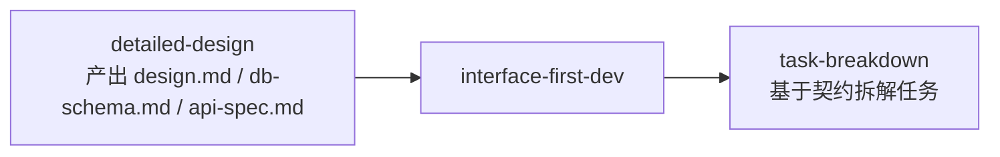

# Interface-First Development（接口驱动开发）使用手册

> 本文档面向技术负责人、前后端开发者和项目经理，说明如何触发和使用 `interface-first-dev` Skill 生成标准化接口契约、Mock 数据与前后端并行开发计划。

---

## 一、什么是接口驱动开发

接口驱动开发（Interface-First Development）是**编码之前先定义前后端接口契约**的工程实践。它回答三个核心问题：

- **前后端通信的契约是什么？** → OpenAPI 3.1 规范
- **前端如何在没有后端时开始开发？** → Mock 数据 + Mock 服务
- **前后端怎么并行不互相等？** → 并行开发计划 + 接口依赖 DAG

它位于**详细设计完成之后、编码实现之前**，是前后端团队对齐的关键闸口。

### 接口驱动 vs 详细设计

| 维度 | 接口驱动（interface-first-dev） | 详细设计（detailed-design） |
|------|-------------------------------|----------------------------|
| 影响范围 | 前后端通信边界 | 单个模块内部实现细节 |
| 典型内容 | OpenAPI 规范、Mock 数据、联调计划 | 类图、API Schema、DDL、算法流程 |
| 能否变更 URI | Gate 2.5 前可以，冻结后需走变更流程 | 编码前可以 |
| 输出时机 | 阶段 3.5 | 阶段 4 |

**一句话记忆**：详细设计决定"每块砖怎么砌"；接口驱动决定"砖与砖之间的接口怎么对"。

---

## 二、使用前置条件

### 2.1 必须完成的上下游工作



**必须就绪的文档**（阻塞性输入）：

| 文档 | 路径 | 用途 |
|------|------|------|
| 模块设计 | `design.md` | **核心输入**：模块职责、实体关系、资源边界 |
| 数据库 Schema | `db-schema.md` | **核心输入**：表结构、字段类型、主外键、枚举值 |
| 接口初稿 | `api-spec.md` | 接口意图（URL、Method、参数），作为生成基准 |
| 状态机（可选） | `state-machine.md` | 状态流转事件，生成 PATCH 端点 |
| 非功能需求 | `05-non-functional.md` | 认证方式、安全约束、性能要求 |

> ⚠️ 如果 `design.md` 或 `db-schema.md` 缺失，Skill 会直接阻断并提示"请先执行 detailed-design"。

### 2.2 已有契约时的扩展模式

若项目已有基线契约 `interface-contracts/openapi.yaml`，Skill 会自动进入**扩展模式**：
- 仅追加新模块端点
- 不覆盖现有路径和 Schema
- 保持已有契约的稳定性

---

## 三、触发指令

### 3.1 标准触发（推荐）

```text
【阶段 3.5 接口驱动 | Skill：interface-first-dev】

基于详细设计定义前后端接口契约。
生成：OpenAPI/Swagger + Mock数据 + 并行开发计划

主要输入：
@openspec/changes/{变更名}/design/design.md
@openspec/changes/{变更名}/design/db-schema.md
@openspec/changes/{变更名}/design/api-spec.md

可选输入（如有状态流转）：
@openspec/changes/{变更名}/design/state-machine.md

安全需求参考：
@openspec/changes/{变更名}/specs/05-non-functional.md
```

### 3.2 快速触发

```text
【阶段3.5】请使用 interface-first-dev skill
```

或简洁触发：

```text
/skill:interface-first-dev 基于详细设计定义前后端接口契约。
生成：OpenAPI/Swagger + Mock数据 + 并行开发计划
```

### 3.3 触发自查

接口契约生成后，执行：

```text
【阶段3.5 自查】请使用 self-check skill 检查接口契约
```

### 3.4 进入下一阶段

自查通过且人工确认（Gate 2.5 sign-off）后：

```text
检查点已通过（接口契约冻结，Gate 2.5 签字完成）。
现在进入【阶段 4：任务拆解】。
```

---

## 四、预期交互流程

| 轮次 | AI 行为 | 用户行为 |
|------|---------|----------|
| 1 | 扫描上游文档，确认 design.md / db-schema.md / api-spec.md 就绪 | 确认设计文档完整 |
| 2 | 解析 db-schema.md → 生成 DTO Schemas | 确认 Schema 命名和字段映射 |
| 3 | 解析 state-machine.md → 生成状态流转 PATCH 端点 | 确认状态流转 URI 和枚举值 |
| 4 | 解析 design.md + api-spec.md → 生成标准 CRUD 端点 | 确认资源 URI 设计 |
| 5 | 组装 OpenAPI 3.1，注入全局组件（CursorPage、Problem、BearerAuth） | 确认全局错误模型和分页 |
| 6 | 生成 mock-data.json（正常 + 异常路径） | 确认示例数据覆盖度 |
| 7 | 生成 mock-server-config.md | 确认 Mock 启动方案 |
| 8 | 生成 parallel-dev-plan.md（DAG + 前后端边界） | 确认联调时间和任务分配 |
| 9 | 自动保存到 interface-contracts/，触发 self-check | 等待自查报告 |
| 10 | Gate 2.5 阻塞提示 | 阅读 openapi.yaml 和 parallel-dev-plan.md，启动 Mock 验证，执行 sign-off |

> 实际对话中，AI 可能将多个步骤合并输出，用户也可随时喊停要求调整。

---

## 五、输出物清单

所有文件自动保存到 `interface-contracts/`：

### 必做产出物（4 个）

| 文件 | 内容 | 关键检查点 |
|------|------|-----------|
| `openapi.yaml` | 完整 OpenAPI 3.1 规范 | 是否所有 `$ref` 有效？是否有重复 operationId？ |
| `mock-data.json` | 按 operationId 分组的示例数据 | 每个接口是否有正常+异常两组示例？ |
| `mock-server-config.md` | Mock 环境搭建与启动指南 | 是否提供 Prism 一键启动命令？ |
| `parallel-dev-plan.md` | 前后端并行开发计划 | 是否明确联调时间和任务边界？ |

### 产出物结构示例

```
interface-contracts/
├── openapi.yaml              # OpenAPI 3.1 完整规范
│   ├── paths/                # REST 端点定义
│   ├── components/schemas/   # DTO、CursorPage、Problem
│   ├── components/responses/ # 标准错误响应
│   └── components/securitySchemes/  # BearerAuth
├── mock-data.json            # 示例数据
│   ├── listUsers.200         # GET 正常响应
│   ├── listUsers.400         # GET 异常响应
│   └── createUser.201        # POST 正常响应
├── mock-server-config.md     # Mock 服务指南
└── parallel-dev-plan.md      # 并行开发计划
    ├── 接口依赖 DAG
    ├── 前端任务边界（P0/P1/P2）
    ├── 后端任务边界（P0/P1/P2）
    └── 联调时间表
```

---

## 六、边界红线速查

### 6.1 一句话原则

> **编码开始前必须冻结接口契约**
> **冻结后的 openapi.yaml 是不可随意变更的基准**

### 6.2 常见违规内容（必须修正）

| 如果你看到... | 它应该... |
|---------------|-----------|
| `/getOrder/{id}`、`/createUser` | 修正为 `/orders/{id}`、`/users` |
| 错误响应结构不一致（有的用 `code/message`，有的用 `error`） | 统一使用 RFC 7807 `Problem` 结构 |
| 集合端点没有分页参数 | 补充 `cursor`/`limit` 或 `page`/`size` |
| `type` 是通用字符串如 `"error"` | 改为稳定 URI 如 `"https://api.example.com/errors/not-found"` |
| 数据库表名出现在 URI 中 | 修正为业务资源名（如 `t_user` → `/users`） |
| DTO 中包含 `@Entity`、`@Table` 等 ORM 注解 | 移除，DTO 是纯传输对象 |

### 6.3 评审检查清单

产出物评审时，逐条确认：

- [ ] `openapi.yaml` 中所有 `$ref` 指向存在的 Schema
- [ ] 无重复 `operationId`
- [ ] 所有 GET 集合端点含分页参数
- [ ] 错误响应统一引用 `Problem` Schema
- [ ] 状态流转 PATCH 端点含 `409 Conflict` 响应
- [ ] `mock-data.json` 中每个 operationId ≥ 2 组示例
- [ ] `parallel-dev-plan.md` 含明确的联调时间点
- [ ] 启动 Prism Mock 服务验证接口可达：`npx @stoplight/prism-cli mock interface-contracts/openapi.yaml`

---

## 七、阶段切换门控

### 7.1 从阶段 3.5 → 阶段 4 的三重条件

1. ✅ **self-check 无 BLOCKER**：自动自查无阻塞问题（8 项检查通过）
2. ✅ **人工确认接口契约**：阅读 openapi.yaml 和 parallel-dev-plan.md，确认 URI 和任务边界合理
3. ✅ **Mock 服务验证通过**：启动 Prism，确认前端可正常调用 Mock 接口
4. ✅ **用户明确确认**：发送切换指令"现在进入阶段 4"

### 7.2 Gate 2.5 阻塞提示

质量检查通过后，AI 会自动宣读：

```text
========================================
🚪 Gate 2.5: 接口冻结 —— 等待人工确认
========================================
产出物已保存至：interface-contracts/

请执行以下操作：
1. 阅读 openapi.yaml，确认 URI 设计符合前端路由规划
2. 阅读 parallel-dev-plan.md，确认前后端任务边界合理
3. 启动 Mock 服务验证：npx @stoplight/prism-cli mock interface-contracts/openapi.yaml
4. 确认无误后执行：/skill:human gate=Gate2.5 action=sign-off

⚠️ 未获得人工确认前，禁止进入 task-breakdown 阶段。
```

### 7.3 红色禁令

以下行为在接口契约冻结前**严格禁止**：

- ❌ 开始编码实现（后端接口或前端页面）
- ❌ 开始 `task-breakdown` 任务拆解
- ❌ 绕过 `self-check` 直接进入下一阶段
- ❌ 在 openapi.yaml 中随意增删端点（需在 Gate 2.5 前完成所有调整）

### 7.4 契约冻结后的变更

用户确认 sign-off 后，接口契约**冻结**。后续任何修改必须：

1. 说明变更原因和影响范围（影响哪些前端页面、哪些后端任务）
2. 重新执行 `interface-first-dev` 生成修订版契约
3. 重新走 self-check + Gate 2.5 确认
4. 同步更新下游 `task-breakdown` 中引用的 operationId

---

## 八、速查表

### 8.1 指令速查

| 你想做... | 发送的指令 |
|-----------|-----------|
| 生成接口契约 | `【阶段3.5】请使用 interface-first-dev skill` |
| 指定参考文档 | `@openspec/changes/{变更名}/design/db-schema.md` |
| 触发自查 | `【阶段3.5 自查】请使用 self-check skill` |
| 人工签字冻结 | `/skill:human gate=Gate2.5 action=sign-off` |
| 进入下一阶段 | `检查点已通过，现在进入【阶段4：任务拆解】` |

### 8.2 文件路径速查

| 类型 | 路径 |
|------|------|
| 输入（模块设计） | `openspec/changes/{变更名}/design/design.md` |
| 输入（数据库 Schema） | `openspec/changes/{变更名}/design/db-schema.md` |
| 输入（接口初稿） | `openspec/changes/{变更名}/design/api-spec.md` |
| 输入（状态机） | `openspec/changes/{变更名}/design/state-machine.md` |
| 输入（安全需求） | `openspec/changes/{变更名}/specs/05-non-functional.md` |
| 输出（接口契约） | `interface-contracts/openapi.yaml` |
| 输出（Mock 数据） | `interface-contracts/mock-data.json` |
| 输出（Mock 配置） | `interface-contracts/mock-server-config.md` |
| 输出（并行计划） | `interface-contracts/parallel-dev-plan.md` |

### 8.3 Mock 启动速查

| 方案 | 命令 | 适用场景 |
|------|------|----------|
| Prism（推荐） | `npx @stoplight/prism-cli mock interface-contracts/openapi.yaml -p 4010` | 需要完整 OpenAPI 路由和校验 |
| JSON Server | `npx json-server --watch interface-contracts/mock-data.json` | 简单 Mock，快速验证 |

### 8.4 严重等级速查

| 等级 | 含义 | 处理方式 |
|------|------|----------|
| 🔴 BLOCKER | 必须修复，否则禁止进入下一阶段 | 修复后重新执行 self-check |
| 🟡 WARNING | 建议修复，可进入下一阶段但需记录风险 | 记录风险，后续跟进 |
| 🟢 INFO | 优化建议，不影响流程 | 可选采纳 |

---

## 九、FAQ

**Q1: 为什么必须先有 db-schema.md 才能生成接口？**
> 接口契约的 Request/Response Schema 直接来源于数据库实体。没有 Schema 定义，AI 只能凭空编造字段，导致前后端契约与实际数据结构脱节。这是硬性前置，不可跳过。

**Q2: 前端怎么用 Mock 数据开发？**
> 1. 运行 `npx @stoplight/prism-cli mock interface-contracts/openapi.yaml -p 4010`
> 2. 前端代码中将 API Base URL 指向 `http://localhost:4010/api/v1`
> 3. 按照 openapi.yaml 中的路径和参数调用接口
> 4. Prism 会根据 mock-data.json 中的示例返回响应

**Q3: 发现 openapi.yaml 中某个字段类型和 db-schema.md 不一致怎么办？**
> 这是 BLOCKER。说明解析规则有误或 db-schema.md 有更新。应返回修复上游文档，重新执行 `interface-first-dev`。

**Q4: 接口冻结后还能加新接口吗？**
> 可以，但需要：
> 1. 说明新增原因和影响范围
> 2. 重新执行 `interface-first-dev`（扩展模式会自动追加）
> 3. 重新走 self-check + Gate 2.5 确认
> 4. 同步更新 `parallel-dev-plan.md` 中的任务边界

**Q5: 状态机太复杂，AI 生成的 PATCH 端点不够用怎么办？**
> Skill 会自动降级为最保守的通用 `PATCH /{resource}/{id}` 设计，并在 `parallel-dev-plan.md` 中标注"需人工细化状态流转条件"。用户可在此基础上补充细化的端点，但需保持与现有契约的兼容性。

**Q6: 不用 JWT 用 API Key 可以吗？**
> 可以。Skill 会根据 `05-non-functional.md` 中的安全需求自动选择 `securitySchemes` 类型。若使用 API Key，会在 `openapi.yaml` 中生成 `ApiKeyAuth` 而非 `BearerAuth`。

**Q7: Mock 数据中的示例值看起来不真实怎么办？**
> Skill 会对复杂嵌套 Schema 填充占位值（如 `string_field_example`），并标注 `TODO：替换为真实业务值`。用户应在启动 Mock 前替换这些占位值为真实业务示例。

---

## 十、变更日志

| 版本 | 日期 | 变更内容 |
|------|------|----------|
| v1.0.0 | 2026-05-10 | 初始版本。面向终端用户的完整操作手册，含触发指令、交互流程、输出物清单、边界红线、阶段门控、速查表与 FAQ。 |
