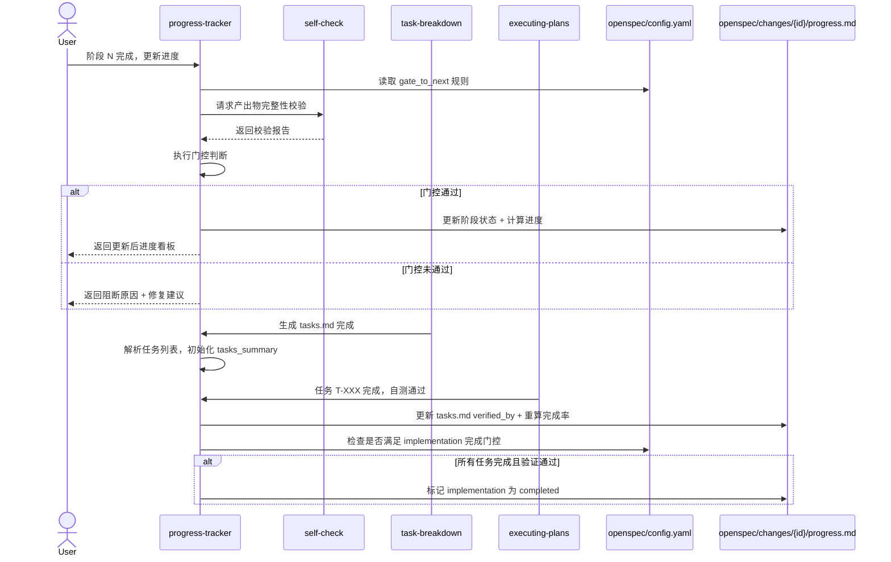

# Progress Tracker 使用手册

> **版本**：1.0.0  
> **适用范围**：Kimi Code + OpenSpec + Superpowers 工作流（从阶段 2 概要需求开始追踪，共 10 个产出物阶段）  
> **关联 Skill**：`task-breakdown`、`executing-plans`、`self-check`、`finish`

---

## 0. 依赖与前置条件

### 0.1 必依赖项

使用本 Skill 前，请确认以下条件已满足：

| 依赖类型 | 具体要求 | 说明 |
|----------|----------|------|
| **目录结构** | 项目已建立 `openspec/changes/{变更名}/` 目录 | 可通过 `opsx:propose` 或手动创建 |
| **`task-breakdown`** | 已安装并可用 | 生成初始 `tasks.md`，本 Skill 读取其 Checkbox 状态 |
| **`executing-plans`** | 已安装并可用 | 编码完成后发送任务完成信号，触发进度重算 |
| **`self-check`** | 已安装并可用 | 提供产出物完整性校验，作为阶段门控的输入条件 |
| **`finish`** | 已安装并可用 | 变更完成时触发归档联动 |
| **`opsx:propose / opsx:archive`** | OpenSpec 生命周期可用 | 本 Skill 深度依赖 OpenSpec 目录规范 |

### 0.2 可选推断源

本 Skill 初始化时会**自动扫描**以下文件来推断项目上下文，用户无需手动输入：

| 推断目标 | 扫描文件 | 说明 |
|----------|----------|------|
| 项目名 | 当前目录名 / `package.json` name / git repo name | 优先级依次递减 |
| 技术栈 | `package.json` / `pyproject.toml` / `Cargo.toml` / `go.mod` / `pom.xml` / `requirements.txt` | 识别关键依赖并映射为技术栈描述 |
| 数据库 | `docker-compose.yml` / `prisma/schema.prisma` / `application.yml` | 识别 PostgreSQL / MySQL / MongoDB / Redis 等 |
| 核心模块 | `src/` / `apps/` / `services/` / `packages/` 的一级子目录 | 过滤工具目录，取前 5 个业务模块 |
| 团队规模 | `git shortlog -sn` 的 contributor 数量 | 可选，推断失败时不阻断初始化 |

> **最小输入原则**：若项目根目录已有明确的构建文件或源码结构，用户只需发送一句"请初始化进度追踪系统"，Skill 会自动完成其余工作。

---

## 1. 快速开始（首次使用）

### Step 1：初始化项目进度追踪系统

向 AI 助手发送以下指令（无需填写任何项目信息）：

```kimi
💫  /skill:progress-tracker 请为当前项目初始化进度追踪系统
```

Skill 将自动执行：
1. **扫描推断**：读取项目根目录下的 `package.json`、`pyproject.toml`、`requirements.txt`、`Dockerfile` 等文件，推断技术栈与核心模块
2. **生成配置**：基于推断结果和 `config-template.yaml` 生成 `openspec/config.yaml`
3. **创建结构**：创建 `openspec/changes/{变更名}/` 目录结构
4. **生成 SSOT**：生成初始 `progress.md`（所有 10 个阶段状态为 `not_started`，总体进度 0%）
5. **确认输出**：向用户展示推断出的项目上下文（项目名、技术栈、核心模块），请用户确认或修正

---

## 2. 指令速查表

| 意图 | 指令模板 |
|------|----------|
| **查看进度** | `【查看进度 \| Skill：progress-tracker】请展示当前进度。` |
| **阶段完成** | `【阶段 N 完成 \| Skill：progress-tracker】阶段 N 已完成，请更新进度。` |
| **任务完成信号** | `【任务更新 \| Skill：progress-tracker】任务 T-XXX 已完成，自测通过。` |
| **登记风险** | `【风险登记 \| Skill：progress-tracker】新增风险：{描述}，影响{级别}，应对方案：{方案}` |
| **初始化项目** | `【初始化 \| Skill：progress-tracker】请为当前项目初始化进度追踪系统。` |

---

## 3. 详细使用场景

### 3.1 场景 A：阶段完成更新（以序号 1 / SDLC 阶段 2 为例）

**用户指令**：

```text
【序号 1 完成 | Skill：progress-tracker】

概要需求阶段（SDLC 阶段 2）已完成，产出物已保存到 specs/ 目录，请更新进度。
```

> **编号说明**：progress-tracker 内部使用"序号"（1-10）对应 SDLC 阶段 2-10。发送指令时使用序号， Skill 会自动映射到对应阶段。

**Skill 执行逻辑**：
1. 读取 `config.yaml` 中 `phases[0].gate_to_next`
2. 校验 `specs/01-product-overview.md` 和 `specs/02-requirements-list.md` 是否存在且章节完整
3. 检查 `progress.md` 中是否有"概要需求评审通过"签字记录
4. **若通过**：标记 `high-level-requirements` 为 `completed`，计算 `overall_progress = 10%`，更新 `progress.md`
5. **若未通过**：返回阻断原因清单（如"缺少 02-requirements-list.md"或"未找到评审签字"），要求修复

---

### 3.2 场景 B：编码阶段精确追踪（由 executing-plans 触发）

当 `executing-plans` 完成编码并自测通过后，自动发送：

```text
【任务更新 | Skill：progress-tracker】

任务 T-003 已完成，自测通过（verified_by: self-check-passed）。
```

**Skill 执行逻辑**：
1. 在 `tasks.md` 中将 `T-003` 标记为 `- [x]` 并追加 `verified_by: self-check-passed`
2. 重新计算 `implementation` 阶段完成率
3. 更新 `progress.md` 中的 `tasks_summary`
4. 若所有任务完成且验证通过，自动标记 `implementation` 为 `completed`，并触发向 `unit-test` 阶段的门控检查

---

### 3.3 场景 C：主动查看进度

**用户指令**：

```text
【查看进度 | Skill：progress-tracker】

请展示当前总体进度、阶段进度、任务列表及风险阻碍。
```

**Skill 输出示例**：

```markdown
# 总体进度：feature-role-factory

> 最后更新：2026-05-05 15:30  
> 整体进度：**35%** | 当前阶段：**详细需求（60%）**

## 阶段进度看板

| 阶段 | 状态 | 进度 | 计划 | 实际 | 完成日期 |
|------|------|------|------|------|----------|
| 概要需求 | ✅ 已完成 | 100% | 2天 | 2天 | 05-03 |
| 详细需求 | 🔄 进行中 | 60% | 3天 | 2天 | - |
| 概要设计 | ⏳ 未开始 | 0% | 2天 | - | - |

## 当前任务燃尽（P0 模块）

| 任务ID | 描述 | 状态 | 自测 | 优先级 |
|--------|------|------|------|--------|
| T-001 | 角色基础字段定义 | ✅ | ✅ 通过 | P0 |
| T-003 | 角色关系图谱 | 🔄 | ⏳ 待测 | P0 |

## 风险与阻碍

| ID | 风险描述 | 影响 | 概率 | 状态 | 应对方案 |
|----|---------|------|------|------|----------|
| R-001 | 角色数据模型字段可能变动 | 高 | 中 | 🟡 开放 | 接口驱动阶段增加 mock 验证 |
```

---

### 3.4 场景 D：风险登记

**用户指令**：

```text
【风险登记 | Skill：progress-tracker】

新增风险：数据库 Schema 可能随需求变动，影响接口契约。
影响级别：高。应对方案：在接口驱动阶段增加 mock 验证。
```

**Skill 执行逻辑**：
1. 生成风险 ID（如 `R-002`）
2. 追加到 `progress.md` YAML frontmatter 的 `risks` 数组
3. 同步更新 Markdown body 的风险表格

---

## 4. 配置文件说明

### 4.1 openspec/config.yaml

由本 Skill 初始化生成，包含以下核心段落：

- **`phases`**：10 个阶段的定义，每个阶段含 `id`、`name`、`weight`、`gate_to_next`
- **`red_flags`**：进度异常拦截规则（跳过阶段、无规格编码、未自测算完成等）
- **`artifact_specs`**：各阶段产出物的 `required_sections`，用于 `self-check` 完整性校验
- **`rules`**：自动保存路径、自查检查项等全局规则

### 4.2 项目定制方式

直接修改 `config.yaml` 中的 `weight`、`gate_to_next` 或新增 `red_flags`，**无需修改 Skill 本身**。例如：

```yaml
phases:
  - id: implementation
    name: 编码实现
    weight: 20        # 根据项目复杂度调整权重
    gate_to_next:
      - artifact: tasks.md
        check: all_tasks_completed_and_verified
      - action: user_review          # 增加额外的人工评审门控
        label: "代码走查通过"
```

---

## 5. 10 阶段定义与权重参考

> **注意**：progress-tracker 的序号 1-10 对应 SDLC 阶段 2-10（从概要需求开始追踪）。阶段 1（需求探索）和阶段 1.5（市场定位）由 `brainstorming` 和 `competitive-analysis` 完成，不纳入进度追踪体系。

| 序号 | 阶段 ID | 阶段名称 | 权重 | 进度粒度 |
|------|---------|----------|------|----------|
| 1 | high-level-requirements | 概要需求 | 10% | 粗粒度 |
| 2 | detailed-requirements | 详细需求 | 15% | 粗粒度 |
| 3 | high-level-design | 概要设计 | 15% | 粗粒度 |
| 4 | detailed-design | 详细设计 | 15% | 粗粒度 |
| 5 | interface-first-dev | 接口驱动开发 | 10% | 粗粒度 |
| 6 | task-breakdown | 任务拆解 | 5% | 粗粒度 |
| 7 | implementation | 编码实现 | 15% | 任务级精粒度 |
| 8 | unit-test | 单元测试 | 10% | 任务级精粒度 |
| 9 | integration-test | 集成测试 | 5% | 任务级精粒度 |
| 10 | finish | 收尾归档 | 0% | 粗粒度 |

> **提示**：前期阶段（1-6）的权重之和为 70%，后期阶段（7-10）的权重之和为 30%。开发阶段（implementation）的精粒度进度会动态替代其 15% 的权重占比。

---

## 6. 归档联动

当变更完成，执行 `opsx:archive` 时，本 Skill 自动：

1. 校验 `finish` 阶段是否为 `completed`
2. 将 `progress.md` 复制到 `openspec/archive/{变更名}/`
3. 在归档副本中追加归档摘要（归档时间、总体耗时、最终进度 100%）

---

## 5. 自动推断能力详解（进阶）

### 5.1 推断失败怎么办？

若 Skill 扫描后无法推断出项目信息（如空目录、纯文档项目、无构建文件），会执行以下降级策略：

1. 将 `context` 字段留空或使用占位符 `"待补充"`
2. 向用户展示扫描失败的文件清单（如"未找到 package.json / pyproject.toml / go.mod"）
3. 询问用户是否手动补充，或接受空值并在后续阶段再填充

**用户此时仅需回复**：
```text
技术栈改为：React + Node.js + MongoDB
核心模块：用户中心、订单系统、支付网关
```
Skill 会自动将修正内容写入 `config.yaml`。

### 5.2 推断结果不准确怎么办？

若自动推断的技术栈或模块不准确，用户无需重新初始化，直接修改 `openspec/config.yaml` 的 `context` 段落即可。本 Skill 在后续运行中只读取该文件，不强制要求与推断源保持一致。

---

## 6. 归档联动

当变更完成，执行 `opsx:archive` 时，本 Skill 自动：

1. 校验 `finish` 阶段是否为 `completed`
2. 将 `progress.md` 复制到 `openspec/archive/{变更名}/`
3. 在归档副本中追加归档摘要（归档时间、总体耗时、最终进度 100%）

---

## 7. 常见问题与排错

| 问题 | 原因 | 解决方法 |
|------|------|----------|
| 阶段更新被阻断 | 门控未通过（产物缺失 / 未评审） | 按阻断原因清单补齐产物或完成评审签字 |
| 任务已完成但进度未增加 | `verified_by` 为 `pending` | 执行 `self-check` 或通过指令补充 `verified_by` |
| 进度回滚到阶段 2 | 触发 `hl_requirement_change` Red Flag | 概要需求变更需走正式评审会，评审通过后重新标记阶段 2 完成 |
| 多变更并行时进度混淆 | `change_id` 未正确区分 | 确保每次初始化使用唯一变更名，`progress.md` 中 `meta.change_id` 与目录名一致 |
| 人工修改了 progress.md 导致解析失败 | 违反了"唯一写入口"约束 | 恢复备份或重新初始化，后续仅通过 Skill 指令更新 |
| 初始化时技术栈推断错误 | 项目使用了非标准目录结构或构建工具 | 直接向 Skill 回复修正信息，无需重新初始化 |
| 缺少依赖 Skill 导致进度不更新 | `task-breakdown` 或 `executing-plans` 未安装 | 确认相关 Skill 已放入 `.kimi/skills/` 或对应平台目录 |

---

## 8. 与上下游 Skill 的协作速查



---

## 9. 附录：进度异常拦截清单（Red Flags）

| Red Flag ID | 描述 | 严重级别 | 触发条件 |
|-------------|------|----------|----------|
| `skip_phase` | 禁止跳过当前阶段直接进入下一阶段 | blocker | 前一阶段未完成时更新后一阶段 |
| `code_without_spec` | 禁止在没有规格的情况下直接写代码 | blocker | `specs/` 为空但开发阶段进行中 |
| `unverified_completion` | 禁止未自测的代码进入测试阶段 | blocker | 存在未通过自测的任务但测试阶段已启动 |
| `hl_requirement_change` | 概要需求变更走正式变更流程 | warning | 阶段 2 完成后产物文件被修改 |
