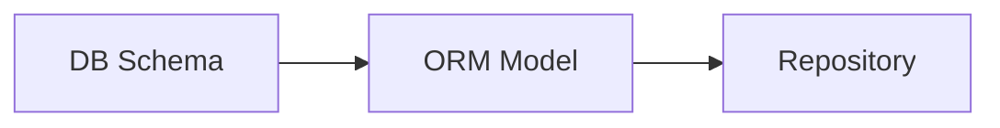
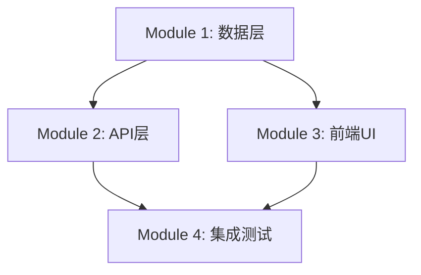

# Writing Plans Skill 使用手册

> 本文档面向 Skill 使用者，提供触发方式、使用步骤、输出解读与常见问题。
>
> 版本: 2.0.0

---

## 1. 快速开始

### 1.1 什么是 Writing Plans？

`writing-plans` 是设计到编码之间的**桥梁**。它将设计文档转化为设计文档级别的实现计划（plan.md），回答：
- "怎么实现"——模块实现顺序、技术路线、关键算法选型
- "做到什么算完成"——验收标准清单，作为后续 self-check 和 code-review 的依据

**与 Superpowers 原生的区别**：本方案将粒度从 2-5 分钟 micro-step 升级为**模块级计划**，并明确衔接 task-breakdown 进行微观拆解。

### 1.2 触发方式

| 方式 | 指令示例 |
|------|----------|
| 通用触发 | `/writing-plans` |
| 场景触发 | 【写计划】基于这个设计文档生成实现计划 |
| 阶段触发 | 【阶段 4 计划】基于 detailed-design 生成 plan.md |
| 自动触发 | brainstorming / detailed-design 完成后自动建议执行 |

---

## 2. 使用步骤

### Step 1: 确认前置条件

writing-plans 需要以下输入文档：
- ✅ `design/*.md` 或 `feature-*/design.md`（详细设计）
- ✅ `feature-*/api-spec.md` 或 `interface-contracts/openapi.yaml`（接口契约）
- ✅ （可选）`competitive-analysis.md`（竞争分析，用于技术选型参考）

**如果设计文档缺失**：writing-plans 会暂停并提示先完成设计。

### Step 2: 执行计划编写

发出触发指令后，writing-plans 将自动执行：

1. 读取所有输入文档
2. 识别模块与子系统
3. 按模块生成实现策略（顺序、算法、依赖注入、测试策略）
4. 确定技术路线与关键算法选型
5. 生成 Mermaid 依赖图
6. 编写验收标准清单
7. 执行 Self-Review 四检
8. 保存 plan.md
9. 输出 plan → task 转换建议
10. 提示用户下一步执行 task-breakdown

### Step 3: 确认产出物

检查生成的 `plan.md` 是否包含以下章节：
- [ ] Goal（一句话目标）
- [ ] Architecture（2-3 句话实现路径）
- [ ] Tech Stack（技术栈清单）
- [ ] Module Breakdown（每个模块的实现顺序、关键决策、依赖关系、验收标准、风险）
- [ ] 任务依赖总图（全局 Mermaid DAG）
- [ ] Plan → Task 转换建议（为 task-breakdown 提供输入）

---

## 3. 输出解读

### 3.1 plan.md 结构

```markdown
# User Auth Implementation Plan

> **For agentic workers:** 下一步 REQUIRED SUB-SKILL: `/skill:task-breakdown`
> **生成时间:** 2026-05-12 10:00
> **变更名:** feature-user-auth

## Goal
实现用户注册、登录、JWT 认证功能。

## Architecture
采用前后端分离架构。后端使用 FastAPI + SQLAlchemy，前端使用 React + Axios。
认证采用 JWT Bearer Token，刷新令牌存储于 httpOnly Cookie。

## Tech Stack
- 前端: React 18 + Vite
- 后端: FastAPI 0.110 + SQLAlchemy 2.0
- 数据库: PostgreSQL 15
- 关键库: pyjwt, bcrypt, pydantic

---

## Module 1: 用户数据层

### 实现顺序
1. 用户表 DDL（含索引）
2. SQLAlchemy ORM 模型
3. Repository 模式封装

### 关键决策
- **决策1:** 使用 SQLAlchemy 2.0 新声明式语法，原因: 类型提示更完善
- **决策2:** 密码使用 bcrypt 哈希（cost=12），原因: 安全性与性能平衡

### 依赖关系


### 验收标准
- [ ] 数据模型与 db-schema.md 完全一致
- [ ] 单元测试覆盖率 ≥ 70%

### 风险与缓解
| 风险 | 影响 | 缓解 |
|------|------|------|
| bcrypt 计算耗时导致注册慢 | 中 | 使用异步 bcrypt 或调整 cost 因子 |

## 任务依赖总图



## Plan → Task 转换建议

- 预估任务数: 12 个（建议 delegated 模式）
- 建议 Phase 数: 3 个
- 关键路径: Module 1 → Module 2（不可并行）
- 可并行轨道: 前端轨道 + 后端轨道（需接口契约先行）
```

### 3.2 关键章节说明

| 章节 | 作用 | 读者 |
|------|------|------|
| Goal | 一句话概括范围 | 所有参与者 |
| Architecture | 实现路径与技术选型依据 | 开发工程师、架构师 |
| Tech Stack | 明确版本号，避免"最新版"陷阱 | 开发工程师 |
| Module Breakdown | 每个模块的详细实现路径 | 开发工程师 |
| 关键决策 | 记录技术选型 rationale，便于后续追溯 | 架构师、 reviewer |
| 验收标准 | 定义"做到什么算完成" | 测试工程师、QA |
| 风险与缓解 | 提前暴露并制定对策 | 项目经理、技术负责人 |
| 转换建议 | 指导 task-breakdown 的 Phase 划分 | task-breakdown Skill |

---

## 4. Self-Review 四检说明

plan.md 保存前会自动执行四检：

| 检查项 | 说明 | 失败示例 |
|--------|------|----------|
| **Spec Coverage** | 每个设计点都有对应计划项 | design.md 中定义了"权限矩阵"，但 plan.md 无对应模块 |
| **Placeholder Scan** | 全文搜索 "TBD"/"TODO"/"appropriate" | 发现 "Add appropriate error handling" |
| **Type Consistency** | 跨模块函数名/签名一致 | Task 3 用 `clearLayers()`，Task 7 用 `clearFullLayers()` |
| **Design Alignment** | plan 与 design.md / api-spec 无矛盾 | plan 中 API 路径为 `/users`，但 api-spec 定义为 `/api/v1/users` |

**注意**：四检任一失败，writing-plans 会自动修复，无需用户手动干预。

---

## 5. No Placeholders 规则

plan.md 中**严禁**出现以下模式：

| ❌ 禁止 | ✅ 正确 |
|--------|--------|
| "TBD"、"TODO"、"implement later" | 填写实际内容或移除该条目 |
| "Add appropriate error handling" | `raise HTTPException(status_code=400, detail="Invalid email")` |
| "Write tests for the above" | 提供具体测试代码块 |
| "Similar to Task 3" | 重复展开 Task 3 的内容 |
| "Implement the service layer" | `src/services/user_service.py` + 类结构 + 方法签名 |

---

## 6. 常见问题

### Q1：writing-plans 和 task-breakdown 必须一起用吗？

**是的，推荐配套使用**。两者的关系是递进细化：

- writing-plans → plan.md（模块级，回答"做什么、按什么顺序"）
- task-breakdown → tasks.md（任务级，回答"拆多细、谁来做"）

plan.md 末尾的「Plan → Task 转换建议」直接指导 task-breakdown 的拆解。

### Q2：plan.md 可以跳过，直接写 tasks.md 吗？

**不建议**。plan.md 是设计文档级的实现路线，包含：
- 技术选型 rationale
- 模块间依赖关系
- 关键决策记录

这些信息在 tasks.md 的微观任务中会被稀释。跳过 plan.md 可能导致：
- 技术选型缺乏全局视角
- 模块间依赖未被识别
- 验收标准缺乏设计依据

### Q3：为什么 plan.md 不写 micro-step？

本方案采用**双轨制**：
- plan.md = 模块级（设计文档级）
- tasks.md = 任务级（≤30 分钟）

如果项目非常简单（< 5 个任务），可以在 plan.md 中适当细化，但通常建议保持 plan.md 的宏观性，让 task-breakdown 负责微观拆解。

### Q4：Self-Review 第四检 Design Alignment 是什么？

这是本方案新增的检查项，用于确保 plan 与上游设计文档一致：
- 技术栈是否与 design.md 一致
- 模块边界是否与 design.md 一致
- 接口定义是否与 api-spec.md / openapi.yaml 一致

发现不一致时，writing-plans 会自动修正 plan.md。

### Q5：plan.md 生成后可以手动修改吗？

**小修可以，大补建议重新执行**。如果：
- 只是修改错别字或补充少量注释 → 可以手动编辑
- 需要调整模块划分或技术选型 → 建议重新执行 writing-plans

**注意**：手动修改后，建议重新执行 Self-Review 四检。

### Q6：多个子系统时怎么组织 plan？

如果设计覆盖多个独立子系统，writing-plans 会建议拆分为**多个 plan.md**：
- `openspec/changes/{变更名}/plan-auth.md`
- `openspec/changes/{变更名}/plan-payment.md`

每个 plan 独立产出可工作、可测试的软件。

---

## 7. 速查卡

```text
触发：/writing-plans 或 【写计划】
输入：design.md + openapi.yaml +（可选）competitive-analysis.md
输出：openspec/changes/{变更名}/plan.md
原则：No Placeholders、精确文件路径、完整代码、DRY/YAGNI/TDD
流程：读取 → 识别模块 → 实现策略 → 技术路线 → 依赖图 → 验收标准 → 四检 → 保存
四检：Spec Coverage / Placeholder Scan / Type Consistency / Design Alignment
必含：Goal / Architecture / Tech Stack / Module Breakdown / 验收标准 / 转换建议
下一步：REQUIRED /skill:task-breakdown 转换为 tasks.md
注意：多子系统拆多个 plan；plan 保存后大补建议重新执行
```
