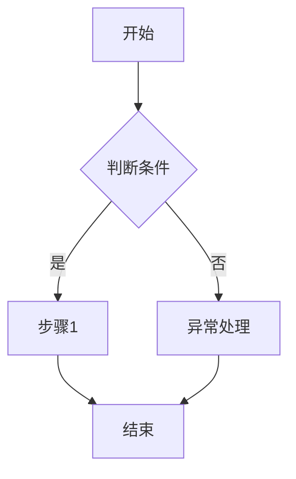

# PRD-00X 详细需求说明书模板

---

```markdown
# PRD-00X {模块名称} 详细需求

> 隶属概要：PRD-000 v{X.X}
> 关联详细：{PRD-00Y, PRD-00Z}
> 版本：v{主版本}.{次版本}
> 状态：草稿 / 已评审 / 已冻结
> 作者：{姓名}
> 日期：YYYY-MM-DD

---

## 1. 功能概述

> 引用 PRD-000 中本模块的定位，补充细化本模块的职责边界。

{模块一句话定位 + 本详细 PRD 覆盖的功能范围}

---

## 2. 用户故事与验收标准

### US-00X-01：{故事标题}

- **故事**：作为 <角色>，我希望 <目标>，以便 <价值>。
- **验收标准**：
  - [ ] AC1: Given <前置条件>, When <用户操作>, Then <预期结果>
  - [ ] AC2: ...
- **优先级**：P0 / P1 / P2
- **工作量估算**：{故事点 或 T 恤尺码}

---

## 3. 业务流程图

{用 Mermaid 或编号步骤描述本模块内的业务流程}



---

## 4. 业务逻辑

> 本章为开发直接可读的实现级规格。每个功能点必须包含：输入、处理逻辑、输出、异常分支。

### 4.1 {功能点名称}

#### 输入
| 字段 | 来源 | 类型 | 是否必填 | 校验规则 | 示例值 |
|------|------|------|----------|----------|--------|
| | | | | | |

#### 处理逻辑
{按步骤描述算法、状态机、业务规则、权限判断}

1. {步骤 1}
2. {步骤 2}
3. {关键判断节点}

#### 输出
| 字段 | 类型 | 说明 | 示例值 |
|------|------|------|--------|
| | | | |

#### 副作用
- {数据库更新}
- {消息发送}
- {日志记录}
- {下游触发}

#### 异常分支
| 异常编码 | 触发条件 | 处理规则 | 用户提示 |
|----------|----------|----------|----------|
| E1 | | | |
| E2 | | | |

---

## 5. 页面原型与交互

### 5.1 {页面名称}

{文字描述页面布局、核心元素、状态变化}

#### 元素清单
| 元素 | 类型 | 状态/规则 |
|------|------|-----------|
| | | |

#### 交互规则
- {点击、悬浮、输入验证等}

---

## 6. 数据需求

### 6.1 数据表/实体
| 字段名 | 类型 | 长度 | 是否必填 | 默认值 | 校验规则 | 索引 | 备注 |
|--------|------|------|----------|--------|----------|------|------|
| | | | | | | | |

### 6.2 枚举值
| 字段 | 枚举值 | 含义 |
|------|--------|------|
| | | |

---

## 7. 接口契约

### 7.1 内部模块间接口
| 接口名 | 入参 | 出参 | 错误码 | 调用方 |
|--------|------|------|--------|--------|
| | | | | |

### 7.2 外部 API 调用
| API | 方法 | 限流 | 超时 | 降级策略 |
|-----|------|------|------|----------|
| | | | | |

---

## 8. 异常与边界场景

| 场景 | 触发条件 | 预期行为 | 优先级 |
|------|----------|----------|--------|
| | | | |

---

## 9. 权限矩阵（RBAC）

| 功能点 | 角色A | 角色B | 角色C |
|--------|-------|-------|-------|
| | | | |

---

## 10. 性能与兼容性

> 继承 PRD-000 的全局 NFR，仅做细化或补充模块特有指标。

| NFR 项 | 全局要求 | 本模块细化 | 测试方法 |
|--------|----------|------------|----------|
| | | | |

---

## 11. 验收 Checklist（测试用例骨架）

| 用例 ID | 对应 US | 测试场景 | 预期结果 | 优先级 |
|---------|---------|----------|----------|--------|
| TC-00X-01 | US-00X-01 | | | P0 |

---

> ⚠️ **基线约束声明**：本文档的功能范围、数据实体和非功能指标受 PRD-000 v{X.X} 约束。不得引入 PRD-000 未定义的新实体，不得修改已冻结的 Out-of-Scope 和全局 NFR。
```
