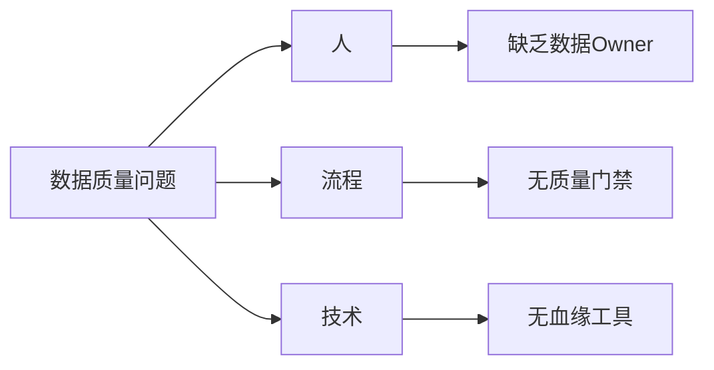
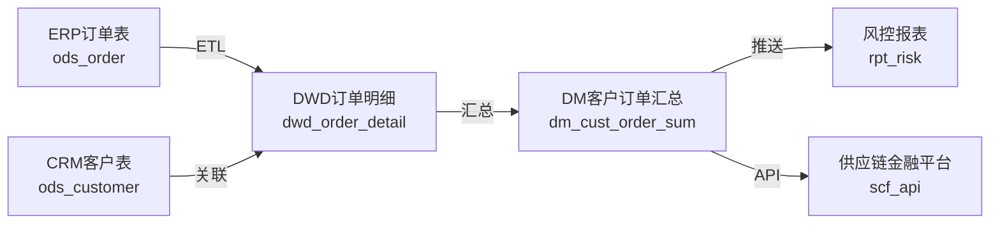
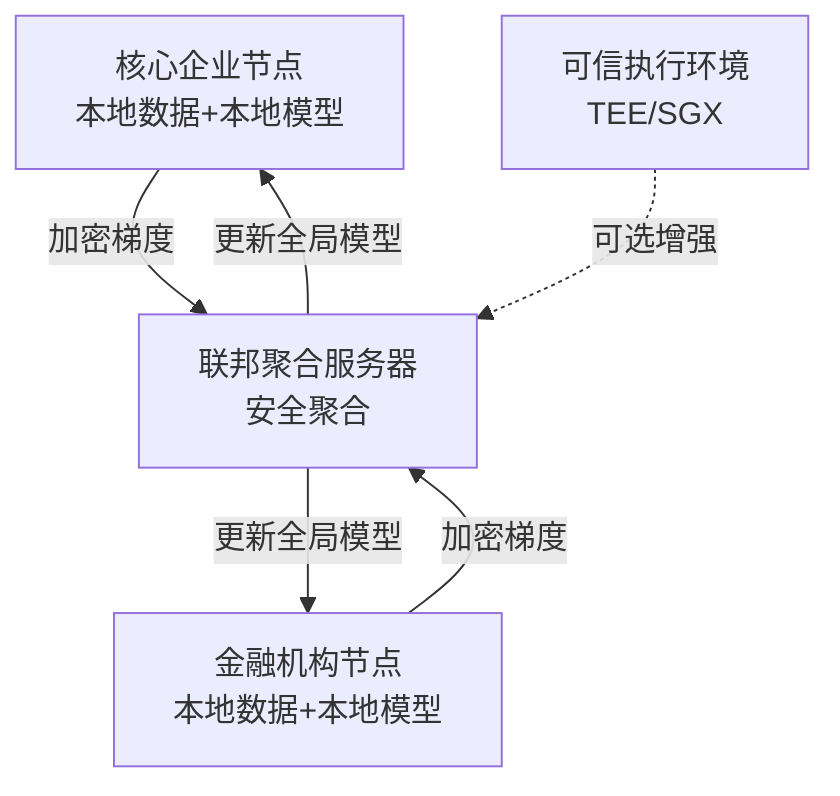
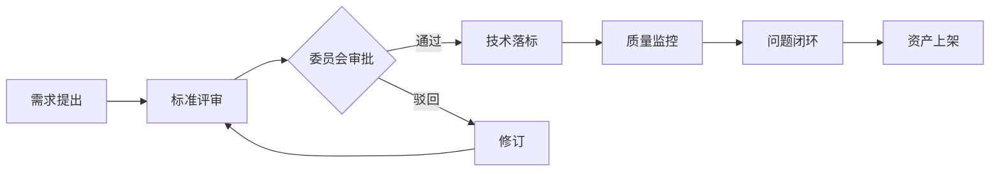

# data-governance

## 元信息
- **trigger_words**: 数据治理、数据质量、血缘分析、主数据、元数据、数据标准、数据安全、落标检查、数据分级、隐私计算、数据资产管理
- **category**: architecture / data
- **version**: 1.0.0
- **author**: skill-arsenal

## 核心能力矩阵

| 治理域 | 关键活动 | 输出物 | 适用场景 |
|---|---|---|---|
| **数据标准** | 命名规范、定义字典、值域约束、编码规则 | 数据标准规范书、落标检查脚本 | 多系统数据对齐、监管报送 |
| **数据质量** | 规则设计、质量监控、根因分析、清洗策略 | 质量规则库、评分卡、监控看板 | 风控模型喂数、财务报表 |
| **元数据管理** | 业务/技术/操作元数据采集、血缘解析 | 元数据目录、影响分析报告 | 系统改造、字段变更评估 |
| **数据血缘** | 字段级血缘追踪、ETL链路解析、端到端追溯 | 血缘图谱（Mermaid/JSON）、链路报告 | 数据问题定位、合规审计 |
| **主数据管理** | 黄金记录、匹配合并、分发同步、质量治理 | MDM架构方案、主数据模型、清洗策略 | 客户/供应商/物料统一视图 |
| **数据安全** | 分级分类、脱敏加密、隐私计算、访问控制 | 分级分类矩阵、脱敏策略、隐私计算方案 | 个人信息保护、跨境数据 |

---

## 工作模式

### 模式1: 数据治理成熟度评估（Assess）
**触发**: "评估数据治理现状" / "成熟度评估" / "数据治理诊断"

**输入**: 
- 企业数据现状描述（系统数量、数据量、团队规模）
- 已知数据问题清单（不一致、延迟、缺失、孤岛）
- 行业属性（金融/供应链/制造）

**处理流程**:
1. 基于 DAMA-DMBOK + DCAM 框架设计评估问卷（6大域 × 5级成熟度）
2. 识别痛点与根因（鱼骨图 / 5Why 分析）
3. 对标监管要求（银保监会《银行业金融机构数据治理指引》）
4. 制定分阶段路线图（速赢/中期/长期）

**输出模板**:
```markdown
## 数据治理成熟度评估报告

### 一、评估概览
| 治理域 | 当前等级 | 目标等级 | 差距 | 优先级 |
|---|---|---|---|---|
| 数据标准 | L2 | L4 | 2级 | P1 |
| 数据质量 | L3 | L4 | 1级 | P0 |
| ... | ... | ... | ... | ... |

### 二、根因分析（鱼骨图）


### 三、治理路线图
- **Phase 1（0-3月）**: 组织建立 + 数据标准制定 + 质量规则上线
- **Phase 2（3-6月）**: 元数据采集 + 血缘解析 + 主数据清洗
- **Phase 3（6-12月）**: 安全分级 + 隐私计算 + 自动化治理
```

---

### 模式2: 数据标准与质量体系建设（Design）
**触发**: "设计数据标准" / "数据质量规则" / "落标检查"

**输入**:
- 业务域清单（如：客户域、融资域、风控域、物流域）
- 监管合规要求（如：EAST 4.0、1104 报表、征信报送）
- 现有系统数据字典（可选）

**处理流程**:
1. 按主题域拆分，制定数据标准（命名、定义、类型、长度、值域）
2. 设计数据质量维度规则（六性：完整性、准确性、一致性、及时性、唯一性、合规性）
3. 编写落标检查 SQL/Python 脚本
4. 设计质量评分卡与监控看板指标

**输出模板**:
```markdown
## {业务域} 数据标准规范

### 1. 命名规范
- 表名：`{主题域}_{业务实体}_{周期标识}`，如 `fct_loan_apply_d`
- 字段名：蛇形命名，禁用保留字

### 2. 标准定义表
| 字段编码 | 字段名称 | 数据类型 | 长度 | 值域/枚举 | 定义说明 | 来源系统 |
|---|---|---|---|---|---|---|
| cust_id | 客户编号 | VARCHAR | 32 | 统一社会信用代码/身份证 | 主数据系统生成的唯一客户标识 | MDM |
| apply_amt | 申请金额 | DECIMAL | 18,2 | >0 | 融资申请金额，单位元 | CRM |

### 3. 质量规则库
| 规则ID | 维度 | 规则描述 | 检查逻辑 | 阈值 | 等级 |
|---|---|---|---|---|---|
| DQ001 | 完整性 | 客户编号不可为空 | `cust_id IS NULL` | 0条 | 阻断 |
| DQ002 | 准确性 | 申请金额必须大于0 | `apply_amt <= 0` | 0条 | 阻断 |
| DQ003 | 一致性 | 客户名称与主数据一致 | `LEFT JOIN MDM` | 差异率<0.1% | 警告 |
| DQ004 | 及时性 | 订单数据T+1到达 | `MAX(dt) = CURRENT_DATE - 1` | 延迟≤1天 | 警告 |
| DQ005 | 唯一性 | 同一业务单号唯一 | `COUNT(*) > 1` | 0条 | 阻断 |
| DQ006 | 合规性 | 身份证格式合法 | 正则校验 | 100% | 阻断 |
```

---

### 模式3: 元数据与血缘管理（Trace）
**触发**: "血缘分析" / "元数据目录" / "影响分析" / "字段血缘"

**输入**:
- 系统清单及数据库连接信息（或 DDL 脚本）
- ETL/ELT 脚本（SQL、Python、Spark）
- 报表/API 消费清单

**处理流程**:
1. 解析技术元数据（Schema、表、字段、类型、约束）
2. 解析 ETL 脚本，提取字段级血缘（Source → Transform → Target）
3. 补充业务元数据（业务定义、Owner、安全等级）
4. 生成影响分析（上游变更 → 下游影响范围）

**输出模板**:
```markdown
## 数据血缘图谱

### 1. 端到端血缘（Mermaid）


### 2. 字段级血缘示例
| 目标字段 | 目标表 | 来源字段 | 来源表 | 转换逻辑 | 链路深度 |
|---|---|---|---|---|---|
| cust_risk_score | dm_cust_risk | score | ml_model_output | 模型预测 | 3 |
| cust_risk_score | dm_cust_risk | cust_id | dwd_customer | 主键关联 | 2 |
| cust_risk_score | dm_cust_risk | register_date | ods_customer | DATEDIFF计算账龄 | 3 |

### 3. 影响分析报告
**变更场景**: `ods_customer.register_date` 字段类型由 DATE 改为 DATETIME
**影响范围**:
- 直接下游：dwd_customer（ETL脚本需适配）
- 间接下游：dm_cust_risk（账龄计算逻辑）、rpt_risk（报表展示格式）
- 消费方：供应链金融平台 API（需确认是否兼容）
**建议**: 采用灰度发布，先修改下游 DWD 适配，再切换源表。
```

---

### 模式4: 主数据管理实施（MDM）
**触发**: "主数据方案" / "黄金记录" / "客户主数据" / "供应商主数据"

**输入**:
- 主数据域（客户 / 供应商 / 物料 / 组织 / 科目）
- 源系统清单（CRM、ERP、SCM、财务系统）
- 匹配规则需求（如：企业客户按统一社会信用代码匹配）

**处理流程**:
1. 选择 MDM 架构模式（集中式 / 联邦式 / 注册式 / 混合式）
2. 设计主数据模型（黄金记录结构、属性分组、版本管理）
3. 制定匹配与合并规则（精确匹配 / 模糊匹配 /  survivorship 规则）
4. 设计数据清洗与分发流程

**输出模板**:
```markdown
## {主数据域} 管理方案

### 1. 架构选型
- **模式**: 联邦式（源系统保留主数据副本，MDM 维护黄金记录与映射关系）
- **理由**: 供应链系统异构性强，集中式改造成本高，联邦式平衡统一与自治

### 2. 黄金记录模型
```
Customer_Golden:
  - cust_master_id (PK, MDM生成)
  - unified_social_code (匹配键)
  - cust_name (survivorship: 以工商系统为准)
  - register_capital (survivorship: 取最新值)
  - source_systems (数组: [CRM, ERP, SCF])
  - match_score (匹配置信度)
  - last_verify_date
```

### 3. 匹配规则
| 优先级 | 匹配字段 | 匹配方式 | 权重 | 阈值 |
|---|---|---|---|---|
| 1 | 统一社会信用代码 | 精确匹配 | 40% | 100% |
| 2 | 企业名称 | 编辑距离<2 | 30% | 85% |
| 3 | 注册地址 | 相似度>90% | 20% | 90% |
| 4 | 法人姓名 | 精确匹配 | 10% | 100% |
| **合计** | | | **100%** | **综合得分≥90%视为同一主体** |

### 4. 分发策略
- 实时：客户信息变更通过 MQ 推送至下游（延迟<1s）
- 批量：每日全量同步至数据仓库（T+1）
- 按需：API 查询实时黄金记录
```

---

### 模式5: 数据安全与隐私计算（Secure）
**触发**: "数据分级分类" / "脱敏策略" / "隐私计算" / "差分隐私" / "数据安全"

**输入**:
- 数据资产清单（字段级）
- 监管要求（等保、数据安全法、个人信息保护法、银保监会规范）
- 业务场景（联合风控、跨境数据、共享建模）

**处理流程**:
1. 数据分级分类（公开/内部/敏感/机密；个人/企业/监管）
2. 制定脱敏/加密策略（静态脱敏、动态脱敏、全同态加密）
3. 设计隐私计算方案（联邦学习、多方安全计算、可信执行环境）
4. 输出访问控制矩阵与审计策略

**输出模板**:
```markdown
## 数据安全治理方案

### 1. 分级分类矩阵
| 数据类型 | 示例字段 | 安全等级 | 存储要求 | 传输要求 | 使用限制 |
|---|---|---|---|---|---|
| 个人身份信息 | 身份证号、手机号 | L4-机密 | 加密存储 | TLS1.3 | 需授权+审计 |
| 企业财务信息 | 财务报表、税务数据 | L3-敏感 | 加密存储 | TLS | 业务域内使用 |
| 交易流水 | 订单金额、时间 | L2-内部 | 脱敏存储 | TLS | 不可带出生产 |
| 公开信息 | 企业注册信息 | L1-公开 | 明文 | HTTP | 无限制 |

### 2. 脱敏策略
| 场景 | 脱敏方式 | 示例 |
|---|---|---|
| 测试环境搭建 | 静态脱敏（不可逆） | 身份证 → 110***********1234 |
| 分析师查询 | 动态脱敏（可逆） | 手机号 → 138****8888 |
| 模型训练 | 差分隐私（加噪） | 添加 Laplace 噪声 ε=1.0 |
| 联合建模 | 联邦学习（不出域） | 各方本地训练，交换加密梯度 |

### 3. 隐私计算架构（联邦学习场景）

**合规说明**: 原始数据不出域，仅交换加密参数，符合《数据安全法》"数据可用不可见"要求。
```

---

### 模式6: 数据治理组织与流程（Operate）
**触发**: "治理组织" / "数据Owner" / "治理流程" / "数据资产管理"

**输入**:
- 企业组织架构
- 数据资产规模
- 治理目标

**输出**:
```markdown
## 数据治理运营体系

### 1. 组织架构（RACI）
| 角色 | 职责 | 数据标准 | 数据质量 | 元数据 | 安全 |
|---|---|---|---|---|---|
| 数据治理委员会 | 决策、资源协调 | A | A | A | A |
| 数据Owner（业务） | 定义业务规则 | R | R | C | I |
| 数据管家（IT） | 技术落地、监控 | C | R | R | R |
| 数据分析师 | 使用反馈 | I | C | I | I |
| 安全合规官 | 审计、合规检查 | I | C | I | R |

*注：R=执行，A=负责，C=咨询，I=知情*

### 2. 核心流程


### 3. 考核指标（KPI）
| 指标 | 定义 | 目标值 |
|---|---|---|
| 数据资产覆盖率 | 已注册元数据的系统/全部系统 | 100% |
| 数据质量评分 | 六性加权平均分 | ≥95分 |
| 主数据一致率 | 黄金记录与源系统一致比例 | ≥99.9% |
| 血缘解析覆盖率 | 已解析字段/全部字段 | ≥80% |
| 安全事件数 | 年度数据泄露/违规事件 | 0 |
```

---

## 工具链映射

| 治理域 | 开源工具 | 商业工具 | 自研切入点 |
|---|---|---|---|
| 元数据/血缘 | Apache Atlas, DataHub, OpenMetadata | Informatica, Collibra | 基于 SQL 解析的血缘提取器 |
| 数据质量 | Great Expectations, Deequ, Apache Griffin | Informatica DQ, Talend | 规则引擎 + 评分卡 |
| MDM | 自研为主 | Informatica MDM, SAP MDG | 匹配引擎 + 黄金记录服务 |
| 数据安全 | Apache Ranger, Vault | Privacera, Immuta | 动态脱敏网关 |
| 隐私计算 | FATE, Primihub, SecretFlow | 蚂蚁链摩斯 | 联邦学习调度器 |

---

## 金融/供应链增强规则

当检测到用户输入包含以下关键词时，自动增强监管合规视角：
- **关键词**: 银保监会、EAST、1104、征信、反洗钱、供应链金融、保理、融资租赁、动产质押
- **增强内容**:
  1. 自动引用《银行业金融机构数据治理指引》五条基本原则（全覆盖、匹配性、持续性、有效性、独立性）
  2. 强调数据血缘在监管报送中的审计追踪要求
  3. 主数据管理需覆盖交易对手、担保物、合同三大核心实体
  4. 数据质量需满足风控模型 T+0/T+1 时效要求
  5. 隐私计算方案需论证担保物权在电子凭证场景下的法律效力

---

## 使用示例

**用户**: "帮我设计一个供应链金融客户主数据管理方案，源系统有 CRM、ERP、风控系统"
**Skill 响应**:
1. 识别主数据域：客户（含企业客户、个人客户、担保人）
2. 选择联邦式架构（理由：源系统异构，需保留业务自治）
3. 输出黄金记录模型（含统一社会信用代码、客户评级、额度信息）
4. 设计匹配规则（精确匹配 + 模糊匹配 + survivorship）
5. 输出分发策略（实时 MQ + 批量同步 + API 查询）
6. 附 Mermaid 架构图与 Markdown 表格
