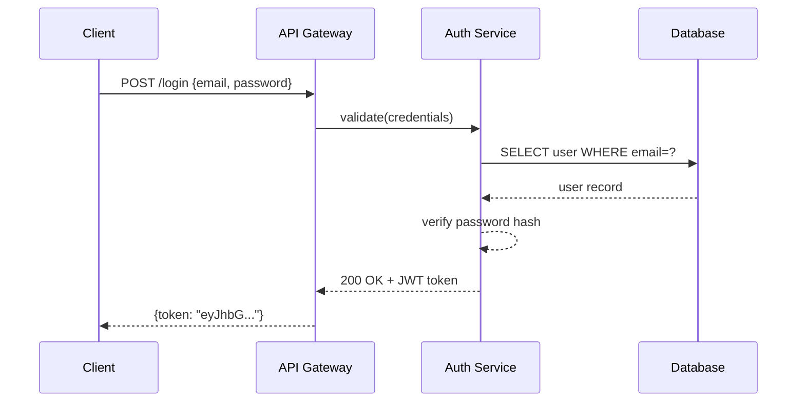
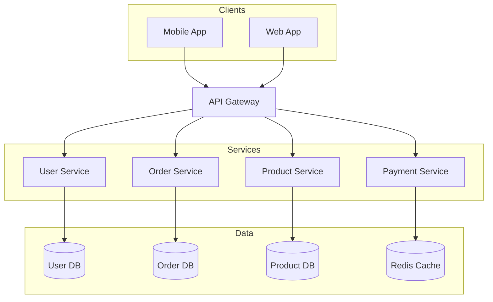
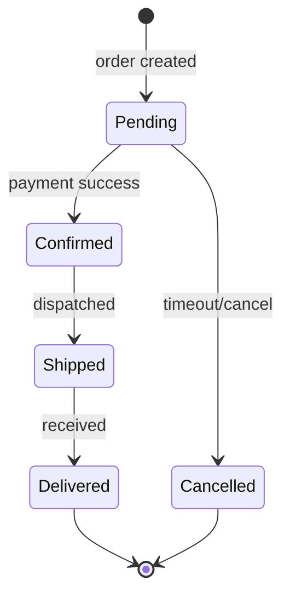

# Mermaid 图表绘制

生成 `.mmd` 文本文件，并通过 `mmdc`（本地）或 Kroki API（免安装）导出为 PNG/SVG/PDF。

**核心优势**：纯文本语法，**全自动布局**——无需手动设置 x/y 坐标。

## 适用场景
- 绘制系统架构图、流程图
- 生成时序图描述 API 调用
- 数据库 ER 图、类图
- 状态机、甘特图、Git 分支图等

## 前置条件

**选项 A：本地导出（推荐，质量最佳）**
```bash
npm install -g @mermaid-js/mermaid-cli
mmdc --version
```

**选项 B：Kroki API（无需安装，仅需 curl）**
```bash
curl --version
```

## 工作流程

1. **检查依赖** — 尝试 `mmdc --version`，不可用则回退到 Kroki
2. **选择图表类型** — 从下方表格选择
3. **生成** — 将 `.mmd` 文件写入磁盘
4. **校验（必填）** — 导出前必须验证语法
5. **导出** — 使用 `mmdc` 或 Kroki API 生成 PNG/SVG/PDF
6. **报告** — 向用户告知输出文件路径

## 校验（必填）

**禁止在未经校验的情况下直接导出图表。**

```bash
# 本地校验
mmdc -i diagram.mmd -o /tmp/test.png 2>&1

# Kroki 校验（mmdc 不可用时）
curl -s -X POST -H "Content-Type: text/plain" --data-binary @diagram.mmd https://kroki.io/mermaid/svg -o /tmp/test.svg && echo "Valid" || echo "Invalid"

# 若报错，修复 .mmd 文件后重新校验
# 仅在校验通过后继续导出
```

常见校验错误：
- 包含特殊字符的标签未加引号
- 箭头语法错误（时序图用 `->>`，流程图用 `-->`）
- 时序图中未声明的参与者

## 图表类型

| 类型 | 关键字 | 适用场景 |
|------|--------|----------|
| 流程图 | `flowchart TD/LR` | 流程、流水线、决策 |
| 时序图 | `sequenceDiagram` | API 调用、消息传递 |
| 类图 | `classDiagram` | 面向对象模型、数据结构 |
| ER 图 | `erDiagram` | 数据库模式 |
| 状态图 | `stateDiagram-v2` | 状态机、生命周期 |
| 甘特图 | `gantt` | 项目时间线 |
| 饼图 | `pie` | 比例分布 |
| Git 图 | `gitGraph` | 分支策略 |
| C4 上下文 | `C4Context` | 高层架构 |
| 思维导图 | `mindmap` | 主题拆解 |

## 语法参考

- **流程图**：见 [references/FLOWCHART.md](references/FLOWCHART.md)
- **时序图**：见 [references/SEQUENCE.md](references/SEQUENCE.md)
- **类图与 ER 图**：见 [references/CLASS-ER.md](references/CLASS-ER.md)
- **其他类型**：见 [references/OTHER-TYPES.md](references/OTHER-TYPES.md)
- **场景化模式速查（完整示例 + 约定 + 样式指南）**：见 [references/PATTERNS.md](references/PATTERNS.md)

## 示例

### 示例 1：API 认证流程

**用户提示：**
> 创建一个 JWT 认证的时序图

**生成的 `.mmd`：**


**输出文件：** `auth-flow.mmd` + `auth-flow.png`

---

### 示例 2：微服务架构

**用户提示：**
> 画一个电商微服务架构图

**生成的 `.mmd`：**


**输出文件：** `ecommerce-arch.mmd` + `ecommerce-arch.png`

---

### 示例 3：订单状态机

**用户提示：**
> 展示订单生命周期状态

**生成的 `.mmd`：**


**输出文件：** `order-states.mmd` + `order-states.png`

## 导出命令

### 选项 1：本地导出（mmdc）

需本地安装 `mmdc`，适合离线使用。

```bash
# PNG（推荐：2048px 宽，白色背景）
mmdc -i diagram.mmd -o diagram.png -w 2048 --backgroundColor white

# 带主题（default | dark | neutral | forest | base）
mmdc -i diagram.mmd -o diagram.png -w 2048 --backgroundColor white --theme neutral

# SVG
mmdc -i diagram.mmd -o diagram.svg

# PDF
mmdc -i diagram.mmd -o diagram.pdf
```

### 选项 2：Kroki API（无需安装）

当 `mmdc` 不可用时，使用 [Kroki](https://kroki.io)。仅需 `curl`。

```bash
# SVG
curl -X POST -H "Content-Type: text/plain" --data-binary @diagram.mmd https://kroki.io/mermaid/svg -o diagram.svg

# PNG
curl -X POST -H "Content-Type: text/plain" --data-binary @diagram.mmd https://kroki.io/mermaid/png -o diagram.png

# PDF
curl -X POST -H "Content-Type: text/plain" --data-binary @diagram.mmd https://kroki.io/mermaid/pdf -o diagram.pdf
```

**Kroki 优势：**
- 无需本地安装
- 任何带 `curl` 的系统均可使用
- 支持 20+ 图表类型（PlantUML、GraphViz、D2 等）

**使用 Kroki 的场景：**
- `mmdc` 安装失败
- 快速绘制一次性图表
- 无 Node.js 的 CI/CD 流水线

## 质量检查清单

在导出前，逐项确认：

- [ ] 为场景选择了正确的图表类型
- [ ] 标签清晰、描述性强，无无意义命名（如"模块1"）
- [ ] 箭头方向一致（TD=自上而下，LR=自左向右）
- [ ] ERD 中关系基数正确
- [ ] 时序图中长操作使用激活条（`+`/`-`）
- [ ] 流程图中决策点明确标记（菱形节点）
- [ ] 使用 subgraph 进行逻辑分组
- [ ] 复杂区域添加注释（`%%`）
- [ ] 样式对比度足够，确保打印时仍可辨识

## Gotchas / 常见陷阱

| 问题 | 解决 |
|------|------|
| `mmdc` 未找到 | `npm install -g @mermaid-js/mermaid-cli` |
| 时序图箭头错误 | 请求用 `->>`，响应用 `-->>` |
| 标签含特殊字符 | 加引号包裹：`A["Label: value"]` |
| 输出空白/过小 | 添加 `-w 2048` 参数 |
| 参与者顺序错误 | 在顶部显式声明 `participant` |
| 子图名称含空格 | 加引号包裹：`subgraph "My Layer"` |

- **校验先行**：永远不要跳过校验步骤直接导出，否则会生成损坏的图片文件。
- **路径安全**：生成 `.mmd` 文件时优先使用当前工作目录，避免写入 skill 目录内部。
- **网络依赖**：Kroki 需要外网访问，离线环境必须提前安装 `mmdc`。
