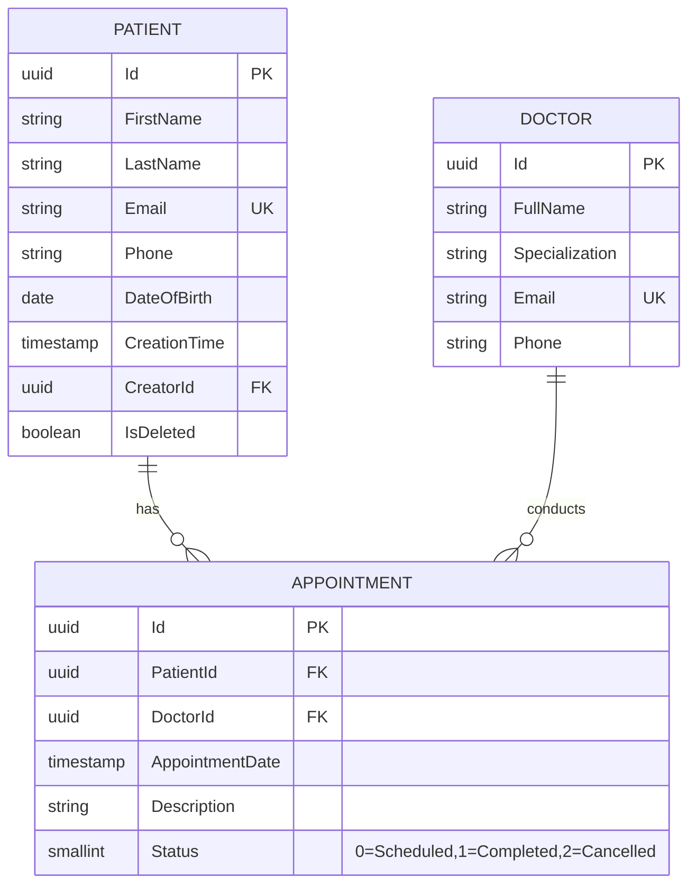
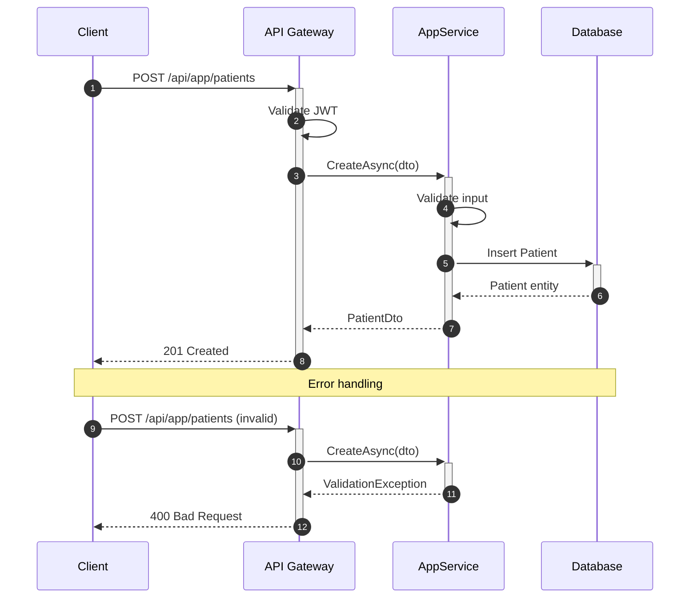
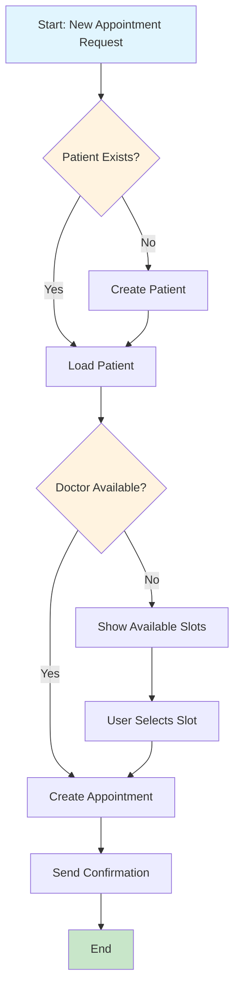
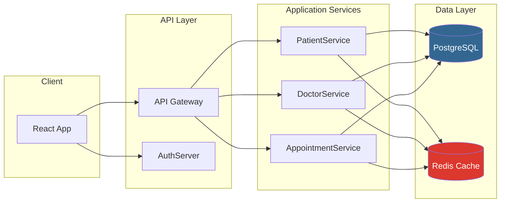
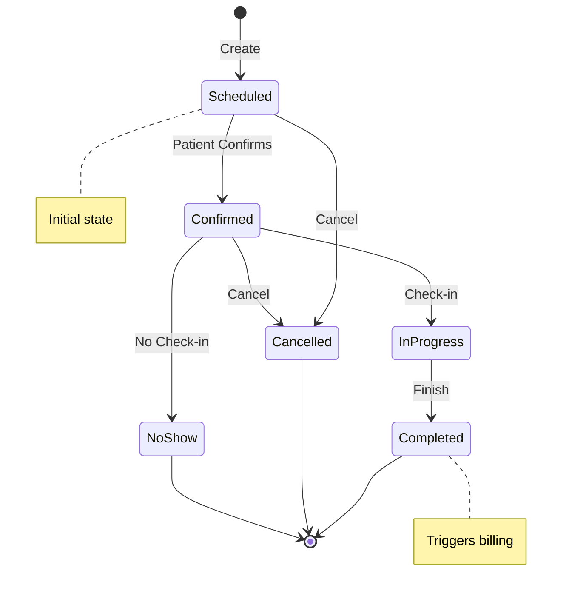

# Mermaid 场景化模式速查

按典型技术文档场景提供可直接复用的 Mermaid 模板与约定。

## 图表类型选择

| 场景 | 图表类型 | Mermaid 语法 |
|------|---------|-------------|
| 数据库 schema | ERD | `erDiagram` |
| API 调用 | 时序图 | `sequenceDiagram` |
| 业务流程 | 流程图 | `flowchart TD` |
| 组件架构 | 流程图 | `flowchart LR` |
| 状态转换 | 状态图 | `stateDiagram-v2` |
| 用户旅程 | 旅程图 | `journey` |
| 项目时间线 | 甘特图 | `gantt` |
| 类关系 | 类图 | `classDiagram` |

## ERD 模式（数据库设计文档）



### ERD 约定

| 标记 | 含义 |
|------|------|
| `PK` | 主键 |
| `FK` | 外键 |
| `UK` | 唯一键 |
| `||--o{` | 一对多 |
| `}o--o{` | 多对多 |

## 时序图模式（API 交互文档）



### 时序图约定

| 箭头 | 含义 |
|------|------|
| `->>` | 同步请求 |
| `-->>` | 同步响应 |
| `--)` | 异步消息 |
| `+` / `-` | 激活/取消激活 |

## 流程图模式（业务流程）



### 流程图形状约定

| 形状 | 语法 | 用途 |
|------|------|------|
| 矩形 | `[text]` | 处理/动作 |
| 菱形 | `{text}` | 决策 |
| 圆角矩形 | `([text])` | 开始/结束 |
| 平行四边形 | `[/text/]` | 输入/输出 |
| 圆形 | `((text))` | 连接符 |

## 架构图模式（系统组件可视化）



## 状态图模式（实体生命周期）



## 样式指南

### 全局主题初始化

```mermaid
%%{init: {'theme': 'base', 'themeVariables': {
    'primaryColor': '#1976d2',
    'primaryTextColor': '#fff',
    'primaryBorderColor': '#1565c0',
    'lineColor': '#424242',
    'secondaryColor': '#f5f5f5',
    'tertiaryColor': '#e3f2fd'
}}}%%
```

### 样式类定义

```mermaid
classDef className fill:#color,stroke:#color
class NodeId className
```

## Quality Checklist

- [ ] 为场景选择了正确的图表类型
- [ ] 标签清晰、描述性强
- [ ] 箭头方向一致（TD=自上而下，LR=自左向右）
- [ ] ERD 中关系基数正确
- [ ] 时序图中长操作使用激活条
- [ ] 流程图中决策点明确标记
- [ ] 使用 subgraph 进行逻辑分组
- [ ] 复杂区域添加注释（`%%`）
