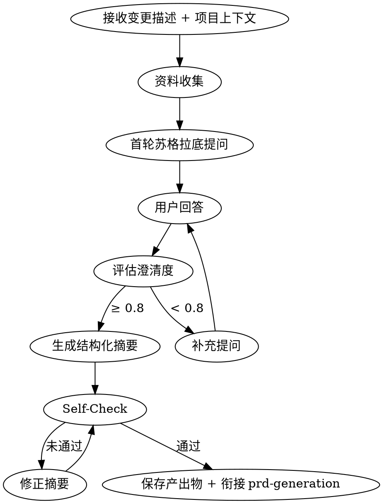

# Brainstorming - 需求探索与澄清

## 适用场景
- 用户提出新的产品功能或技术方案，但需求模糊、边界不清
- 用户说"帮我理一下思路"、"想听听你的建议"、"看看这样做行不行"
- 用户给出变更提案，但缺少业务规则、优先级或验收标准
- 用户提到"头脑风暴"、" brainstorm "、"先聊聊需求"
- 现有需求文档存在矛盾或缺失关键上下文，需要澄清后进入下游阶段

## 阶段定位
- **阶段**：阶段 1（概要需求之前）
- **上游触发**：用户主动提出变更需求或 `/opsx:propose "{变更描述}"`
- **下游衔接**：`prd-generation`（概要需求生成）
- **贯穿约束**：每轮输出后执行 self-check，产出物自动保存到 `openspec/changes/{变更名}/brainstorming/`

## 核心原则

### HARD-GATE
在需求未完全澄清（澄清度 < 0.8）且用户未书面确认前，**不得调用 `prd-generation` 或任何实现类 Skill**。这适用于所有变更，无论大小。

### 资料先行
先收集资料，再提问。禁止在零资料的情况下进行无依据的假设。

### 多轮迭代
最少 2 轮，最多 5 轮苏格拉底式提问，直至澄清度达标或用户明确终止。

## 执行流程



### Step 1: 接收输入
- **变更描述**：用户提供的原始需求描述
- **项目上下文**：读取 `openspec/config.yaml` 中的 `context` 字段
- **资料来源类型**：默认 `hybrid`（网络 + 本地）

### Step 2: 资料收集
根据配置执行资料收集，详见 `references/RESEARCH_GUIDE.md`。

| 来源 | 方式 | 输出 |
|------|------|------|
| 网络 | 调用 `web_search`，自动生成 1-3 个关键词，取 Top-5 结果 | 网络资料摘要 |
| 本地 | 解析用户提供的 `@路径`，读取 Markdown/TXT/YAML | 本地文档摘要 |
| 混合 | 并行执行网络 + 本地，交叉验证矛盾点 | 合并资料池 |

**混合模式冲突规则**：本地文档优先；发现冲突时向用户追加提问确认。

### Step 3: 苏格拉底式提问
基于资料池，从 6 个维度生成追问，**每次只问 1 个问题**：

1. **用户价值**：解决谁的什么问题？不做的代价？
2. **边界范围**：哪些明确不在本次范围？需兼容的历史功能？
3. **业务规则**：并发触发时的优先级？异常回退策略？
4. **数据假设**：核心实体字段？现有数据源？
5. **竞品差异**：与搜索到的竞品相比，差异化点？
6. **集成依赖**：是否对接现有模块？接口契约是否已存在？

详细模板与示例见 `references/SOCRATIC_TEMPLATES.md`。

### Step 4: 多轮迭代
- 记录用户每轮回答
- 每轮结束后评估澄清度（0-1）
- 识别回答间矛盾，立即追问确认
- 若检测到意图漂移（回答与原始变更描述方向偏离），提示用户确认范围

### Step 5: 生成结构化摘要
当澄清度 ≥ 0.8 或达到最大轮次时，生成 `requirement-draft.md`：

```markdown
# Requirement Draft - {变更名}

## 核心问题
## 边界范围
## 业务假设
## 模块初分
## 风险点
## 待确认项
```

完整格式规范见 `references/OUTPUT_SPEC.md`。

### Step 6: 自检查验 (Self-Check)
执行以下检查，未通过则返回修正：

- [ ] **内容一致性**：摘要与资料池、用户回答无矛盾
- [ ] **内容完整性**：6 个提问维度是否都有覆盖
- [ ] **无内部矛盾**：用户回答间无逻辑冲突
- [ ] **范围可控**：聚焦单一变更，无过度蔓延

### Step 7: 保存与衔接
自动保存以下文件到 `openspec/changes/{变更名}/brainstorming/`：

| 文件 | 说明 |
|------|------|
| `brainstorming-log.md` | 完整问答日志 |
| `research-report.md` | 资料收集报告（含来源 URL/文件、引用摘要） |
| `requirement-draft.md` | 结构化需求摘要 |

**衔接 prd-generation 时传递**：
- `requirement-draft.md` 路径
- `research-report.md` 路径
- 澄清度评分
- 未解决风险点列表

详细契约见 `references/DOWNSTREAM_CONTRACT.md`。

## 视觉伴侣
当问题涉及 UI 布局、架构图、视觉对比时，启动视觉伴侣。
使用方式：`./visual-companion.md`

## 输出格式速查

### brainstorming-log.md
记录每轮提问、用户回答、Skill 分析。用于追溯决策。

### research-report.md
```
## 网络资料
- [高相关] {标题} - {URL}：{摘要}

## 本地文档
- {文件名}(@{路径})：{摘要}（引用段落：{行号}）

## 交叉验证
- [冲突/一致] {描述}
```

### requirement-draft.md
见 `references/OUTPUT_SPEC.md`。

## Key Principles
- **资料先行**：零资料不得提问
- **一次一问**：每轮只问一个问题
- **选择题优先**：当可能时提供选项而非开放问题
- **YAGNI**：剔除未请求的功能
- **增量验证**：每轮获取确认后再继续
- **灵活回溯**：发现不一致时立即返回澄清

## Gotchas
- HARD-GATE：需求未澄清（澄清度 < 0.8）且用户未确认前，严禁进入 prd-generation
- 禁止在零资料情况下进行无依据假设；资料收集失败时必须标记并告知用户
- 每次只问 1 个问题，禁止一次抛出多个追问
- 若检测到意图漂移（回答与原始变更描述方向偏离），必须暂停并确认范围
- 本地文档与网络资料冲突时，默认以本地文档为准，不得擅自裁决
