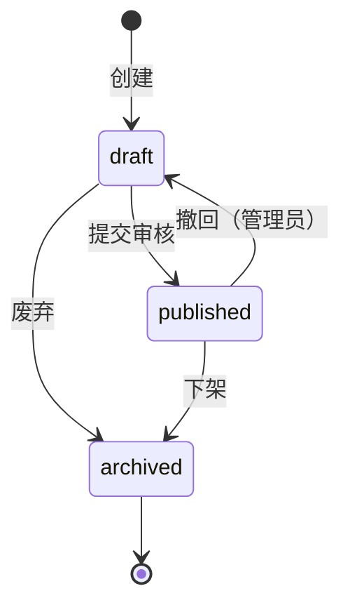

# Detailed Requirements

## 适用场景
- 概要需求（prd-generation）已冻结，需要进入模块级详细需求阶段
- 用户要求按功能模块批量拆解详细规格
- 需要生成模块间的接口契约、状态机定义或数据字段一致性校验
- 概要设计（high-level-design）前需要补齐模块详细需求作为输入

## 核心职责
1. 解析 `03-functional-structure.md` 提取模块清单，按优先级串行生成
2. 每个模块独立输出 4 个标准文件：`spec.md`、`prototype.md`、`io-table.md`、`logic.md`
3. 执行模块间一致性校验（字段、状态枚举、接口依赖、业务规则、需求覆盖）
4. 生成全局模块索引 `_modules-index.md` 与一致性校验报告 `_consistency-report.md`

## 输入依赖
执行前必须确认以下上游产物已就绪：
- `01-product-overview.md` — 产品全景
- `02-requirements-list.md` — 功能/非功能需求清单
- `03-functional-structure.md` — 功能结构模块列表（核心输入，决定拆分粒度）
- `04-business-rules.md` — 全局业务规则
- `05-non-functional.md` — 非功能性约束

## 处理逻辑

### Phase 1：模块识别
读取 `03-functional-structure.md`，按 `##` 标题层级提取模块，编号格式：
```
feature-{NN}-{kebab-case-name}
```
优先级映射：P0 → 01-09 / P1 → 10-19 / P2 → 20+

### Phase 2：逐模块生成（串行）
每模块必须包含 4 个文件：

| 文件 | 核心内容 |
|------|----------|
| `spec.md` | 需求追溯、功能范围（IN/OUT）、验收标准（AC Taxonomy）、假设注册表 |
| `prototype.md` | 页面/入口清单、文字化布局结构、交互流程、Mermaid 页面跳转图 |
| `io-table.md` | 用户输入/系统输入/页面回显/接口响应字段表、数据流转 Mermaid |
| `logic.md` | 核心业务流程 Mermaid、业务规则映射、状态机（stateDiagram-v2）、异常处理 |

**验收标准（AC）强制规则**：
- 5 类 AC 必须覆盖：Behavioral、Non-behavioral、Negative、Edge case、Dependency
- 所有 AC 质量分 ≥ 2，核心 DoD AC = 3
- 必须含 ≥1 个 Negative Criterion（防范围蔓延）
- 必须含 ≥1 个 Edge Case Criterion
- 需求描述强制使用 Given/When/Then 格式

**内容红线**：
- 禁止代码片段、伪代码、SQL、API 端点规格
- 禁止数据库表结构、类图、技术栈决策
- 只写 WHAT，不写 HOW

### Phase 3：模块间一致性校验
所有模块生成完毕后执行 Cross-Module Consistency Check：

| 维度 | 校验内容 | 错误等级 |
|------|----------|----------|
| 字段一致性 | 同名字段在不同模块 io-table 中类型/约束是否一致 | Error |
| 状态枚举一致性 | 同一业务实体状态值在多个模块 logic 中是否冲突 | Error |
| 接口依赖闭环 | 模块 A 依赖模块 B 的接口，模块 B 是否定义该接口 | Error |
| 业务规则冲突 | 同一规则在不同模块 logic 中逻辑是否矛盾 | Warning |
| 需求覆盖完整性 | `02-requirements-list.md` 是否被所有模块 spec 覆盖 | Warning |

Error 数量 > 0 时阻塞进入下游设计阶段，返回修复。

## 输出路径
```
openspec/changes/{变更名}/specs/
├── feature-XX-{模块A}/
│   ├── _index.md
│   ├── spec.md
│   ├── prototype.md
│   ├── io-table.md
│   └── logic.md
├── feature-XX-{模块B}/
│   └── ...
├── _modules-index.md
└── _consistency-report.md
```

## 示例

### 模块目录示例
```
feature-01-user-auth/
├── _index.md
├── spec.md
├── prototype.md
├── io-table.md
└── logic.md
```

### spec.md 验收标准片段
```markdown
| # | 类型 | 标准描述 | 质量分 |
|---|------|----------|:------:|
| AC-1 | Behavioral | Given 用户未登录 When 访问受保护页面 Then 跳转登录页 | 3 |
| AC-2 | Non-behavioral | 登录接口响应时间 < 200ms（P95） | 3 |
| AC-3 | Negative | 系统明确不支持第三方 OAuth 登录 | 3 |
| AC-4 | Edge case | 当连续输错密码 5 次，账户锁定 30 分钟 | 2 |
| AC-5 | Dependency | 用户服务 API v2 必须可用 | 3 |
```

### logic.md 状态机片段
```markdown

```

## Gotchas
- **触发前提**：必须等待 `prd-generation` 产出冻结且 `03-functional-structure.md` 已确认，不可跳过概要需求直接写详细需求
- **串行生成**：逐个模块输出，禁止批量并行生成，防止上下文丢失和编号混乱
- **模块边界**：严格遵循 `03-functional-structure.md` 的模块划分，不得擅自合并或拆分模块；若发现粒度不均，反馈用户调整概要而非自行处理
- **需求覆盖**：生成完毕后必须执行一致性校验，未覆盖的上游需求需用户确认是遗漏还是延期
- **状态机规范**：`logic.md` 中的状态流转必须使用 Mermaid `stateDiagram-v2` 语法，禁止纯文字描述
- **原型限制**：`prototype.md` 是文字化交互规格，不包含可视化线框图；如需 UI 设计稿，需人工补充或移交设计阶段
- **版本冲突**：若模块间检测到字段/状态冲突，必须标记 Error 并返回修复，不可静默忽略
- **与 prd-feature-detail 区分**：本 skill 面向批量模块拆解和标准化输出；若用户只需为单个模块做深度访谈和穷尽式细节挖掘，应使用 `prd-feature-detail`
