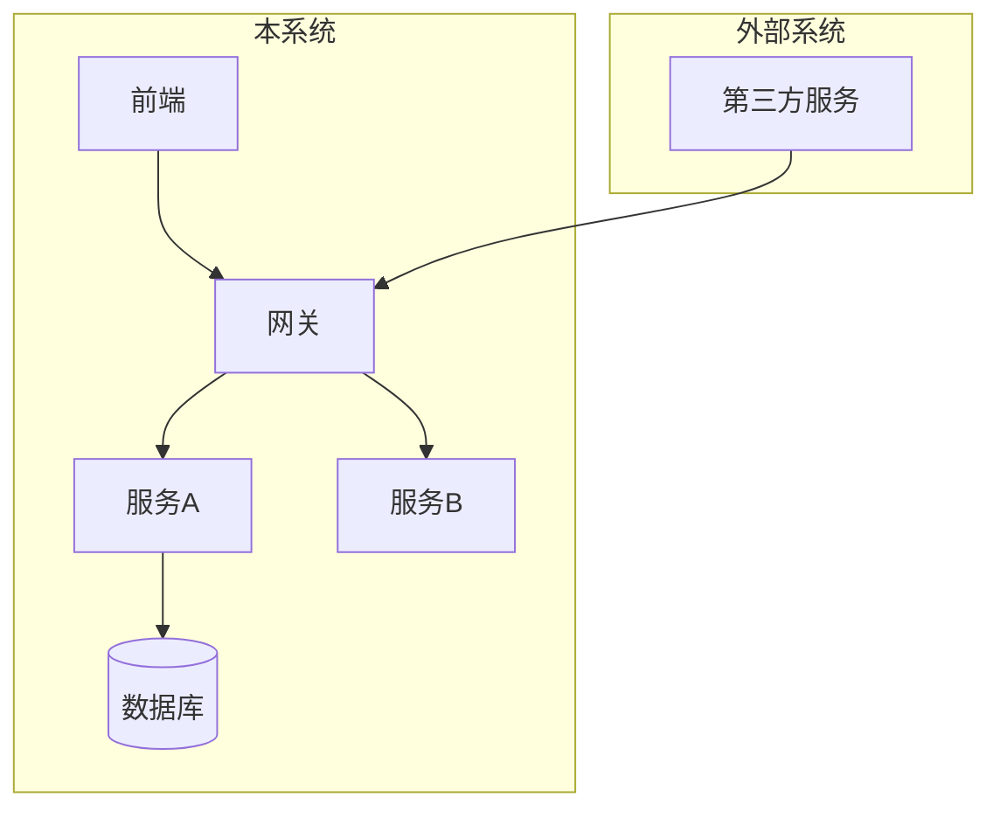
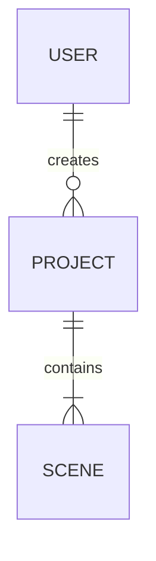
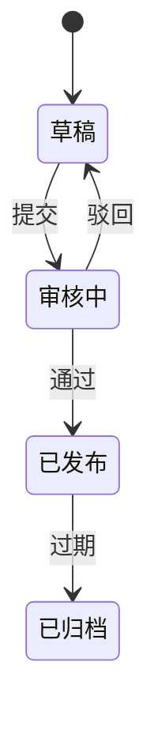
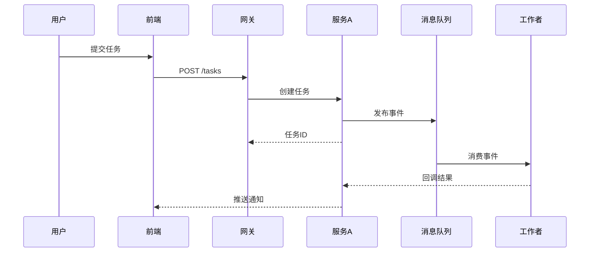
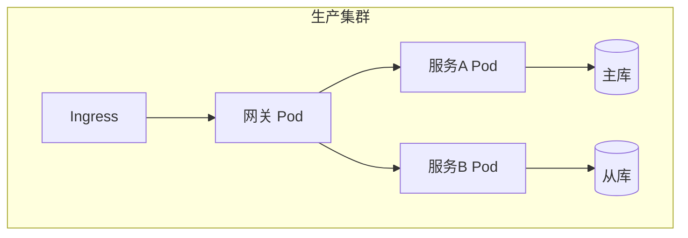

# 概要设计章节模板

本文档提供 `high-level-design` Skill 各章节的详细写作指南、输出模板与开源借鉴说明。

## 01-system-architecture.md

### 内容边界
- 系统整体分层（如表现层/应用层/领域层/基础设施层）
- 微服务/模块划分及边界
- 部署拓扑概览
- 与外部系统的集成关系

### 模板
```markdown
## 系统架构

### 架构概览
[一句话描述整体架构风格：如分层单体 / 微服务 / 事件驱动]

### 分层/服务划分
| 层级/服务 | 职责 | 技术约束 |
|-----------|------|----------|
| [名称] | [职责] | [约束] |

### 架构图


### 边界与 Enforcement 机制
[如何防止层间违规、循环依赖]
```

### 开源借鉴
引入 C4-Model 分层思想：Context → Container → Component。在 Mermaid 中通过 `subgraph` 区分层级。

---

## 02-tech-stack.md

### 内容边界
- 语言、框架、中间件、数据库类型、AI 模型基座
- 选型理由（必须关联竞品分析）
- 备选方案及排除原因（若 INCLUDES_DECISION_RECORDS=true）

### 模板
```markdown
## 技术栈

### 选型清单
| 类别 | 选型 | 版本约束 | 选型理由 | 竞品溯源 |
|------|------|----------|----------|----------|
| 前端框架 | React | ≥18 | [理由] | [competitive-analysis.md 结论] |
| 后端框架 | FastAPI | ≥0.100 | [理由] | ... |
| 数据库 | PostgreSQL | ≥15 | [理由] | ... |
| 缓存 | Redis | ≥7 | [理由] | ... |
| AI 模型基座 | GPT-4o | - | [理由] | ... |

### 排除的备选方案
| 备选方案 | 排除原因 |
|----------|----------|
| [方案] | [原因] |
```

---

## 03-data-architecture.md

### 内容边界（仅限逻辑层）
- 核心实体关系（ER 图）
- 主数据流向
- 存储策略选型（关系型/向量/对象存储）
- 分库分表策略
- 核心表清单（仅表名 + 职责，无字段）

### 禁止
- 字段类型、长度、索引
- DDL、ORM 配置
- 具体 SQL

### 模板
```markdown
## 数据架构

### 核心实体关系


### 数据流向


### 存储策略
| 数据类型 | 存储方案 | 理由 |
|----------|----------|------|
| 结构化业务数据 | PostgreSQL | ... |
| 向量数据 | pgvector / Milvus | ... |
| 文件/媒体 | MinIO / OSS | ... |
| 缓存/会话 | Redis | ... |

### 分库分表策略
[全局策略，如按租户分库、按时间分表]

### 核心表清单
| 表名 | 职责 | 归属模块 |
|------|------|----------|
| users | 用户基础信息 | 用户中心 |
```

---

## 04-interface-contracts.md

### 内容边界（模块间/服务间）
- 通信模式（REST / gRPC / MCP / 消息队列）
- 数据契约（DTO 语义，无字段列表）
- 版本策略
- 同步/异步选择理由

### 禁止
- 请求/响应 Schema、Header 定义
- 字段校验规则
- 幂等策略细节

### 模板
```markdown
## 接口契约

### 通信模式总览
| 调用方 | 被调用方 | 模式 | 协议 | 同步/异步 | 理由 |
|--------|----------|------|------|-----------|------|
| 前端 | 网关 | 请求-响应 | HTTPS/REST | 同步 | ... |
| 渲染服务 | 通知服务 | 事件驱动 | 消息队列 | 异步 | ... |

### 数据契约原则
- [契约原则，如幂等性要求、向后兼容规则]

### 版本策略
[URL 版本 / Header 版本 / 契约兼容性规则]
```

---

## 05-module-responsibilities.md

### 内容边界
- 每个模块的输入、输出、核心职责、对外依赖

### 禁止
- 内部类图
- 函数签名
- 实现细节

### 模板
```markdown
## 模块职责

### [模块A]
- **输入**: [来自哪些模块/外部系统的什么数据]
- **输出**: [向哪些模块/外部系统输出什么数据]
- **核心职责**: [1. ... 2. ...]
- **对外依赖**: [依赖的模块/服务/第三方]
- **P0 功能覆盖**: [对应 02-requirements-list.md 中的 REQ-XXX]
```

---

## 06-state-machine-global.md

### 内容边界（跨模块）
- 跨模块核心实体状态流转
- 状态间的合法转换路径

### 禁止
- 单模块内部状态转换规则
- 触发事件的具体参数
- 校验规则细节

### 模板
```markdown
## 全局状态机

### 实体：[实体名]


### 状态定义
| 状态 | 含义 | 归属模块 | 对应需求 |
|------|------|----------|----------|
| 草稿 | ... | 编辑器 | REQ-005 |
```

---

## 07-sequence-diagrams.md

### 内容边界（跨模块关键流程）
- 跨模块交互的时序关系
- 异常分支（如服务不可用）

### 禁止
- 模块内部调用链（Controller→Service→Repository）

### 模板
```markdown
## 核心链路时序图

### 流程：[流程名]

```

---

## 08-algorithm-selection.md

### 内容边界（AI 项目）
- 模型基座选择
- 选型理由
- 输入输出维度约定
- 与其他模块的耦合方式

### 禁止
- 算法流程、参数配置
- Prompt 模板
- 回退策略细节

### 模板
```markdown
## 算法/模型选型

### 功能：角色形象生成
| 维度 | 决策 |
|------|------|
| 模型基座 | Stable Diffusion XL + LoRA |
| 选型理由 | [理由，关联竞品分析] |
| 输入维度 | 文本描述 + 参考图（≤5MB） |
| 输出维度 | 1024×1024 PNG，透明背景可选 |
| 耦合方式 | 通过消息队列异步调用，结果回调 |
| 性能约束 | 单图生成 ≤30s，并发 10 |

### 功能：剧本生成
| 维度 | 决策 |
|------|------|
| 模型基座 | GPT-4o |
| ... | ... |
```

---

## 09-security-design.md

### 内容边界
- 认证授权方案（RBAC / OAuth2 / JWT）
- 数据加密（传输中 / 静态）
- 网络隔离与安全边界

### 开源借鉴（architecture-blueprint-generator 第 7 章）
参考横切关注点清单：身份管理、权限实施模式、安全边界模式。

### 模板
```markdown
## 安全设计

### 认证与授权
- **认证方案**: [OAuth2 + JWT / 自建账号体系]
- **授权模型**: [RBAC / ABAC]
- **权限实施模式**: [网关统一鉴权 / 服务自鉴权]

### 数据安全
- **传输加密**: TLS 1.3
- **静态加密**: [数据库透明加密 / 应用层加密]
- **敏感数据**: [脱敏规则、存储位置]

### 网络隔离
[安全区划分、DMZ、内网访问控制]
```

---

## 10-performance-design.md

### 内容边界
- QPS/TPS 预估与容量规划
- 缓存策略（层级、范围）
- 异步化方案
- 数据库扩展策略

### 禁止
- 缓存 Key 设计
- 过期策略细节
- 连接池具体配置

### 模板
```markdown
## 性能设计

### 容量预估
| 指标 | 预估峰值 | 策略 |
|------|----------|------|
| 日活用户 | ... | ... |
| 核心接口 QPS | ... | ... |

### 缓存策略
| 层级 | 范围 | 方案 |
|------|------|------|
| CDN | 静态资源 | ... |
| 分布式缓存 | 热点数据 | Redis Cluster |
| 本地缓存 | 配置/字典 | Caffeine |

### 异步化方案
[哪些流程改为异步，通过什么机制]

### 数据库扩展
[读写分离 / 分库分表触发条件]
```

---

## 11-exception-handling-global.md

### 内容边界
- 全局异常分类体系
- 降级策略
- 熔断规则
- 重试策略

### 禁止
- 单接口异常码
- 补偿事务流程
- 日志格式定义

### 开源借鉴（architecture-blueprint-generator 第 7 章）
参考 Error Handling & Resilience 框架。

### 模板
```markdown
## 全局异常与降级

### 异常分类
| 类别 | 场景 | 处理策略 |
|------|------|----------|
| 基础设施异常 | DB 连接失败 | 熔断 + 降级到缓存 |
| 依赖服务异常 | AI 服务超时 | 重试 3 次 + 兜底响应 |
| 业务异常 | 并发冲突 | 用户提示 + 重试 |

### 降级策略
[分级降级：功能降级 → 数据降级 → 页面降级]

### 熔断规则
[触发条件、半开策略、恢复条件]

### 重试策略
[指数退避 / 固定间隔 / 最大重试次数]
```

---

## 12-deployment-architecture.md

### 内容边界
- 容器化/K8s/Serverless 拓扑
- CI/CD 流程
- 环境策略（开发/测试/生产）

### 模板
```markdown
## 部署架构

### 部署拓扑


### CI/CD 流程
[代码提交 → 构建 → 单元测试 → 镜像打包 → 部署 → 冒烟测试]

### 环境策略
| 环境 | 用途 | 数据策略 |
|------|------|----------|
| dev | 开发联调 | 匿名化测试数据 |
| staging | 预发布验收 | 生产数据子集 |
| prod | 生产 | 生产数据 |
```

---

## 13-test-strategy.md

### 内容边界
- 测试金字塔分层
- 各层策略与覆盖率目标
- 自动化策略
- 测试边界定义

### 禁止
- 单测用例
- Mock 策略细节
- 数据构造方案

### 模板
```markdown
## 测试策略

### 测试金字塔
| 层级 | 类型 | 覆盖率目标 | 工具 |
|------|------|------------|------|
| 单元测试 | 函数/类级别 | ≥70% | pytest/jest |
| 集成测试 | 模块间接口 | 核心链路 100% | - |
| E2E 测试 | 用户旅程 | P0 流程覆盖 | Playwright |

### 自动化策略
[触发时机、失败处理、报告机制]

### 测试边界
[各层的测试范围、Mock 原则、外部依赖处理]
```

---

## 14-extensibility-design.md

### 内容边界（可选）
- Feature Addition Patterns
- Modification Patterns
- Integration Patterns

### 开源借鉴（architecture-blueprint-generator 第 13 章）
三段式框架：添加 / 修改 / 集成。

### 模板
```markdown
## 扩展性设计

### 功能添加模式
[新增功能时如何保持架构完整性：扩展点位置、依赖引入规范]

### 安全修改模式
[修改现有组件时保持向后兼容：版本策略、弃用流程]

### 集成模式
[接入新外部系统：适配器模式、防腐层、门面模式]

### 预留扩展点
| 扩展点 | 场景 | 接口形态 |
|--------|------|----------|
| 模型接入 | 新增 AI 模型 | 统一模型接口 |
| 存储接入 | 新增存储类型 | 仓库接口 |
```

---

## 15-decision-records.md

### 内容边界（可选）
关键架构决策的正向论证。

### 开源借鉴（architecture-blueprint-generator 第 15 章）
ADR 模板结构：Context / Factors Considered / Decision / Consequences / Future Flexibility。

### 模板
```markdown
## 架构决策记录

### ADR-001：[决策标题]

- **Context**: [决策背景]
- **Factors Considered**: [考虑的因素]
- **Decision**: [决策内容]
- **Consequences**: [正面 / 负面]
- **Future Flexibility**: [未来变更成本]
```

---

## 16-governance-rules.md

### 内容边界（可选）
- 架构一致性维护规则
- 自动化检查建议
- 架构评审流程

### 模板
```markdown
## 架构治理

### 一致性维护规则
[编码规范、命名约定、层间通信规则]

### 自动化检查建议
[静态分析工具、架构测试、循环依赖检测]

### 架构评审流程
[评审触发条件、参与者、通过标准]
```
