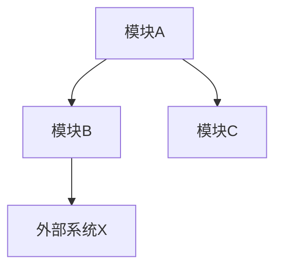
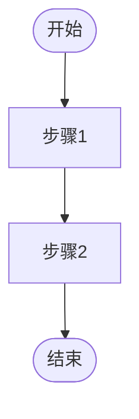
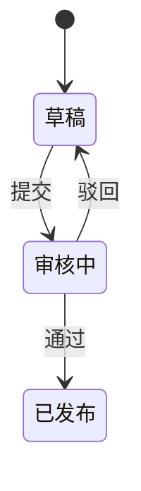

# PRD-000 概要需求说明书模板（五文件输出指南）

> 本模板定义 PRD-000 的 13 章逻辑结构，以及如何将 13 章映射到 OpenSpec 五文件物理输出。单文件快速模式可直接使用完整 13 章结构；标准模式按下方五文件拆分。

---

## 五文件映射表

| 逻辑章节 | 物理文件 | 文件名 |
|----------|----------|--------|
| 1. 文档控制 | 全部 | 每文件头部重复版本信息 |
| 2. 项目背景与目标 | 01-product-overview.md | 痛点、北极星指标、JTBD |
| 3. 竞品与差异化分析 | 01-product-overview.md | 竞品对标表、技术方案对比 |
| 4. 系统范围（Scope） | 02-requirements-list.md | In-Scope / Out-of-Scope、P0/P1/P2 |
| 5. 用户画像与角色矩阵 | 02-requirements-list.md / 04-business-rules.md | 角色定义、RBAC 矩阵 |
| 6. 系统功能架构图 | 03-functional-structure.md | 模块树、Component Inventory |
| 7. 核心业务流程 | 04-business-rules.md | Mermaid 流程图、状态机 |
| 8. 全局非功能需求（NFR） | 05-non-functional.md | 性能/并发/安全/兼容 |
| 9. 概要数据模型 | 03-functional-structure.md | 核心实体、ER 图 |
| 10. 系统集成与约束 | 05-non-functional.md | 外部依赖、技术栈约束 |
| 11. 里程碑与优先级 | 05-non-functional.md | Phase 1/2/3、交付物 |
| 12. 风险提示与待决策项 | 05-non-functional.md | 校验摘要、已知风险 |
| 13. 详细 PRD 清单 | 03-functional-structure.md | PRD-001~PRD-00N 映射 |

---

## 01-product-overview.md 模板

```markdown
# 01 - 产品概述

> 版本：v1.0
> 状态：草稿 / 已冻结
> 日期：YYYY-MM-DD

## 1. 项目背景与目标

### 1.1 业务痛点
{用具体场景和数据描述当前痛点，避免空泛词}

### 1.2 项目目标
{一句话目标 + 北极星指标}

### 1.3 成功标准
| 指标 | 当前值 | 目标值 | 测量周期 |
|------|--------|--------|----------|
| | | | |

## 2. Jobs to Be Done（JTBD）

| 优先级 | Job Statement |
|----------|---------------|
| 1 | When [场景], I want to [动机], so I can [结果]. |
| 2 | When [场景], I want to [动机], so I can [结果]. |
| 3 | When [场景], I want to [动机], so I can [结果]. |

## 3. 竞品与差异化分析

### 3.1 直接竞品对标
| 竞品名称 | 核心优势 | 本系统差异化策略 | 功能覆盖对比 |
|----------|----------|------------------|--------------|
| {竞品A} | | | 领先 / 持平 / 落后 |
| {竞品B} | | | 领先 / 持平 / 落后 |

### 3.2 间接替代方案
{用户当前使用的替代方式，以及本系统替代后的价值}

### 3.3 技术方案对比（如适用）
| 技术/架构方向 | 本系统选型 | 竞品主流方案 | 选型理由 | 风险 |
|---------------|------------|--------------|----------|------|
| | | | | |
```

---

## 02-requirements-list.md 模板

```markdown
# 02 - 需求清单

> 版本：v1.0
> 状态：草稿 / 已冻结
> 日期：YYYY-MM-DD

## 1. 系统范围（Scope）

### 1.1 In-Scope
- {功能域 1} — P0
- {功能域 2} — P0
- {功能域 3} — P1

### 1.2 Out-of-Scope
- {明确列出本次不做的功能，防止需求蔓延}
- {如果有"未来可能做"的功能，放入此处而非 In-Scope}

## 2. 用户画像与角色矩阵

| 角色 | 职责 | 使用模块 | 权限等级 |
|------|------|----------|----------|
| | | | |

## 3. 用户故事

| ID | 角色 | 动作 | 收益 | JTBD Ref | 优先级 |
|----|------|------|------|----------|--------|
| US-001 | [角色] | I want to [动作] | so that [收益] | J1 | P0 |
| US-002 | [角色] | I want to [动作] | so that [收益] | J2 | P0 |

## 4. 业务术语表

| 术语 | 定义 | 使用场景 |
|------|------|----------|
| | | |
```

---

## 03-functional-structure.md 模板

```markdown
# 03 - 功能结构

> 版本：v1.0
> 状态：草稿 / 已冻结
> 日期：YYYY-MM-DD

## 1. 系统功能架构图



{用文字描述各模块职责和交互关系}

## 2. 模块-功能点树状图

| 模块 | 功能点 | 优先级 | 关联用户故事 |
|------|--------|--------|-------------|
| {模块A} | {功能点1} | P0 | US-001 |
| {模块A} | {功能点2} | P1 | US-002 |
| {模块B} | {功能点3} | P0 | US-003 |

## 3. Component Inventory

| 组件 | 类型 | 描述 | 关联用户故事 | 所属模块 |
|------|------|------|-------------|----------|
| [Name] | Form / Layout / Action / Display / Navigation / Modal | 作用描述 | US1, US2 | 模块A |

## 4. 概要数据模型（ER图）

{仅定义核心实体：名称、主键、与其他实体的关系。不定义字段详情。}

| 实体 | 主键 | 关系 |
|------|------|------|
| | | |

## 5. 详细 PRD 清单（目录）

> 模块命名必须与下方目录名保持一致（kebab-case），直接影响 detailed-requirements Skill 的拆分。

| 编号 | 模块名称 | 对应目录 | 责任人 | 状态 | 计划版本 |
|------|----------|----------|--------|------|----------|
| PRD-001 | {模块A} | `feature-01-{模块a}/` | | 待编写 | |
| PRD-002 | {模块B} | `feature-02-{模块b}/` | | 待编写 | |

> ⚠️ **冻结声明**：本文档中定义的模块清单、Out-of-Scope、全局 NFR、核心实体主键在后续详细 PRD 中不可推翻。如需修改，必须升级本文档版本号并重新评审所有关联详细 PRD。
```

---

## 04-business-rules.md 模板

```markdown
# 04 - 业务规则

> 版本：v1.0
> 状态：草稿 / 已冻结
> 日期：YYYY-MM-DD

## 1. 核心业务流程（端到端）

{从用户视角描述端到端主流程，用 Mermaid 流程图}



## 2. 权限矩阵（RBAC）

| 角色 | 模块A | 模块B | 模块C | 管理员权限 |
|------|-------|-------|-------|-----------|
| 角色1 | 读/写 | 读 | - | 否 |
| 角色2 | 读 | 读/写 | 读/写 | 是 |

## 3. 全局业务规则

| 规则编号 | 规则描述 | 适用模块 | 触发条件 |
|----------|----------|----------|----------|
| BR-001 | | | |

## 4. 状态机定义（如适用）


```

---

## 05-non-functional.md 模板

```markdown
# 05 - 非功能性需求

> 版本：v1.0
> 状态：草稿 / 已冻结
> 日期：YYYY-MM-DD

## 1. 性能

- {量化指标，如：页面加载 < 2s，报表生成 < 30s}

## 2. 并发与容量

- {同时在线用户数，峰值 QPS，数据量预期}

## 3. 安全

- {合规要求，数据分级，加密策略}

## 4. 兼容性与可维护性

- {浏览器/设备支持，代码覆盖率，文档要求}

## 5. 行业对标档位

- {与同类型产品相比，本系统 NFR 处于高/中/低哪个档位}

## 6. 系统集成与约束

- **外部依赖**：{API、服务、SDK}
- **技术约束**：{既定技术栈、部署环境}
- **合规约束**：{等保、GDPR 等}

## 7. 里程碑与优先级

| 阶段 | 交付物 | 优先级 | 时间预期 |
|------|--------|--------|----------|
| Phase 1 | {最小可用闭环} | P0 | |
| Phase 2 | {核心功能完善} | P0 | |
| Phase 3 | {增强与优化} | P1 | |

## 8. 技术栈建议（AI Build Summary）

> 为后续 AI 编码工具（Cursor、v0、Lovable 等）提供快速读取的构建简报。

| 层级 | 选择 | 理由 |
|------|------|------|
| 前端 | | |
| 后端 / BaaS | | |
| 数据库 | | |
| 部署 | | |

## 9. 原型草图

{用文字描述关键界面的布局和信息架构，或引用外部设计稿链接}

## 10. 风险提示与待决策项

### 10.1 已确认风险（用户接受）
- {风险描述} → 用户确认：{接受 / 需缓解}

### 10.2 待决策项
| 编号 | 事项 | 建议方案 | 建议决策时间点 | 影响范围 |
|------|------|----------|----------------|----------|
| TBD-01 | | | | |

### 10.3 校验摘要
- 内部一致性校验：通过 / 发现 [N] 处矛盾（已修正 [X] 处，用户确认接受 [Y] 处）
- 竞品对标校验：通过 / 发现 [N] 项功能差异（已纳入 [X] 项，待决策 [Y] 项）
```
