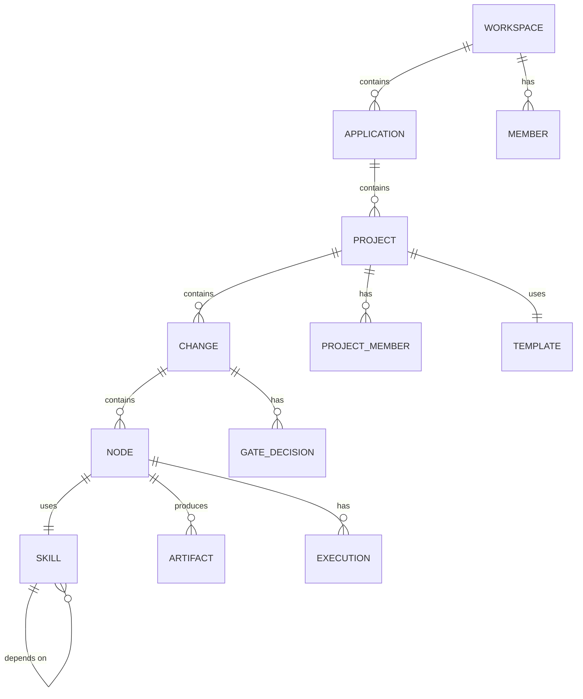
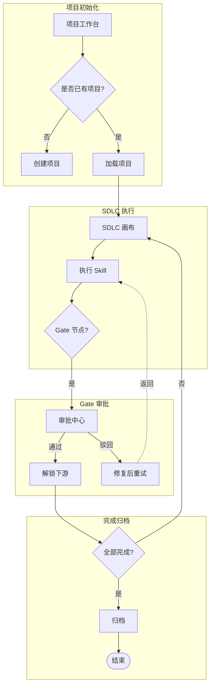
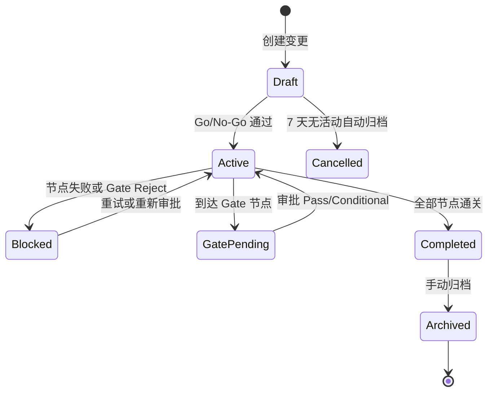

# PRD-000 概要需求说明书模板（三主题文件输出指南 V3.1）

> 本模板对齐 Amazon 6-pager、Google PRD、阿里 P8 等业界大厂规范。PRD 只回答"做什么"和"为什么"，技术实现细节（组件、路由、ACL、DDL）放到下游技术设计文档。

---

## 三主题文件映射表

| 逻辑章节 | 物理文件 | 核心内容 |
|----------|----------|----------|
| 1. 文档元信息 | 全部头部 | 版本、作者、评审记录、修改历史 |
| 2. 执行摘要（Executive Summary） | `00-requirements-overview.md` §2 | 一页纸：问题+方案+指标+资源 |
| 3. 背景与问题 | `00-requirements-overview.md` §3 | 量化痛点、竞品格局、机会窗口 |
| 4. 目标与成功指标 | `00-requirements-overview.md` §4 | SMART 指标 + 测量方法 + 数据来源 + 基线 |
| 5. 用户画像与场景 | `00-requirements-overview.md` §5 | Persona、JTBD、用户旅程地图 |
| 6. 范围与边界 | `01-requirements-list.md` §1 | In-Scope / Out-of-Scope / **Non-goals** |
| 7. 功能需求 | `01-requirements-list.md` §2 + `02-functional-requirements.md` §2 | 用户故事 + GWT 验收标准 + **RTM** + 业务规则 |
| 8. 非功能需求 | `00-requirements-overview.md` §6 | 性能/安全/兼容，含测试场景 |
| 9. 数据需求 | `00-requirements-overview.md` §7 | 指标体系、埋点事件、数据权限 |
| 10. 依赖、假设与风险 | `00-requirements-overview.md` §8 | 外部依赖、假设（含 Plan B）、风险（含缓解措施） |
| 11. 里程碑与发布标准 | `00-requirements-overview.md` §9 | Phase 1/2/3、Release Criteria |
| 12. 术语表 | `01-requirements-list.md` §3 | **前置或随文注释** |
| 13. 功能架构与业务流程 | `02-functional-requirements.md` §1+§3 | 模块树、端到端旅程（业务抽象）、角色职责 |

---

## 00-requirements-overview.md 模板

```markdown
# 00 - 需求总览

> 版本：PRD-000 v1.0-draft
> 状态：Draft / Reviewing / Frozen
> 作者：[你的名字]
> 评审人：[Tech Lead]、[产品经理]
> 日期：YYYY-MM-DD

### 修改记录

| 版本 | 日期 | 修改人 | 修改内容 |
|------|------|--------|----------|
| v0.1 | YYYY-MM-DD | [你] | 初稿完成 |
| v1.0-draft | YYYY-MM-DD | [你] | 补充模板选择与 Draft/Active 机制 |

### 冻结标准（Freeze Criteria）

| 检查项 | 通过标准 | 责任人 |
|--------|----------|--------|
| 需求完整性 | 所有 P0 需求配备 GWT 验收标准，RTM 无悬空需求 | PM |
| 数据一致性 | 全文 Skill 数量/用户容量/性能指标等口径统一，无跨文件矛盾 | PM |
| 技术可行性 | Tech Lead 确认所有 P0 需求在 MVP 资源内可交付，无技术约束越界 | TL |
| 业务规则闭环 | 全局业务规则通过冲突仲裁检查，无逻辑死锁 | TL |
| 评审签字 | 产品负责人、技术负责人、QA 三方书面确认 | 三方 |

**冻结后修改流程**：
1. 升级版本号（v1.0 → v1.1）
2. 在修改记录中标注影响范围（哪些下游文档需同步更新）
3. 重新执行 Freeze Criteria 评审

---

## 2. 执行摘要（Executive Summary）

| 项目 | 内容 |
|------|------|
| **产品名称** | {名称} |
| **问题** | {一句话量化痛点，如"研发团队在 AI 辅助开发中面临工具碎片化，导致端到端周期长达 30 天"} |
| **解决方案** | {一句话方案，如"项目级可视化驾驶舱 + AI 编排控制台"} |
| **关键指标** | {北极星指标 + MVP 目标值，如"端到端周期从 30 天降至 14 天"} |
| **目标用户** | {主要 Persona，如"项目经理、开发者、Tech Lead"} |
| **资源需求** | {预期周期/团队规模，如"2-3 个月 / 5 人团队"} |
| **关键风险** | {Top 1 风险及缓解方向} |

---

## 3. 背景与问题

### 3.1 业务痛点（量化）
{用具体场景和数据描述当前痛点，避免空泛词。如："当前 50 人研发团队使用 7 个独立工具管理 AI 辅助开发流程，每周平均花费 4 小时在工具间切换和进度同步。"}

### 3.2 竞品格局
| 竞品名称 | 核心优势 | 本系统差异化策略 | 功能覆盖对比 |
|----------|----------|------------------|--------------|
| {竞品A} | | | 领先 / 持平 / 落后 |
| {竞品B} | | | 领先 / 持平 / 落后 |

### 3.3 替代方案与决策

| 方案 | 描述 | 放弃原因 | 保留价值 |
|------|------|----------|----------|
| A. {现有工具整合路线} | {在现有工具中通过插件/脚本整合} | {无法解决核心痛点；生态封闭} | {作为 Plan B（假设推翻时启动）} |
| B. {第三方平台扩展路线} | {在 Dify/CrewAI 等平台上扩展} | {无 SDLC 语义；核心体系需从零构建} | {学习其 AI 编排引擎设计} |
| C. 现状维持 | {继续用 Notion/ChatGPT/CLI 手动管理} | {工具碎片化痛点持续；无审计追踪} | {验证痛点真实性的对照组} |
| **D. {选定方案（独立平台）}** | {项目级可视化驾驶舱 + AI 编排} | — | {唯一同时解决"可视化 + 编排 + 审批"的方案} |

### 3.4 机会窗口
{为什么现在做？市场/技术/组织窗口}

---

## 4. 目标与成功指标（SMART）

### 4.1 北极星指标

| 指标 | 当前基线 | MVP 目标 | 测量方法 | 数据来源 | 验证方式 |
|------|----------|----------|----------|----------|----------|
| {如：端到端周期} | {30 天} | {< 14 天} | {Draft -> 全部节点通关耗时} | {progress.md 的 start_time 与 complete_time} | {平台自动统计 + 人工抽样复核} |
| {如：Gate 审批响应} | {72 小时} | {< 48 小时} | {Gate 进入等待态到审批结论提交} | {human-decisions.md 的 gate_pending_at 与 decided_at} | {平台自动统计} |

### 4.2 OKR（可选）
{按 Objective + Key Results 格式列出}

### 4.3 非目标（Non-goals）
{与目标对称的排除项，解释"为什么本期不做"。如：}
- **NG-001**：本期不解决多 Workspace 并发性能，只保证单 Workspace 可用。原因：MVP 阶段单 Workspace 已覆盖 90% 场景，并发优化预计增加 3 周工作量。
- **NG-002**：本期不做移动端适配。原因：目标用户均为桌面端重度使用者，移动端需求在 Phase 3 评估。

---

## 5. 用户画像与场景

### 5.1 Persona 卡片

| 角色 | 职责 | 核心痛点 | 使用频率 | 技术熟练度 |
|------|------|----------|----------|-----------|
| {PM} | 项目统筹、进度跟踪 | 无法实时看到 AI 生成产物状态 | 每日 | 中 |
| {开发者} | 执行 Skill、提交代码 | 工具碎片化，上下文切换成本高 | 每日 | 高 |
| {Tech Lead} | 审批 Gate、技术决策 | 审批与执行脱节，无法追溯决策依据 | 每周 3-4 次 | 高 |

### 5.2 Jobs to Be Done（JTBD）

| 优先级 | Job Statement |
|--------|---------------|
| 1 | When [场景], I want to [动机], so I can [结果]. |
| 2 | When [场景], I want to [动机], so I can [结果]. |

---

## 6. 非功能需求（NFR）

### 6.1 性能（含测试场景）
- 页面加载 < 2s（P95），测试场景：首页冷启动，缓存未命中
- 报表生成 < 30s，测试场景：1000 条记录导出

### 6.2 安全
- {合规要求，数据分级，加密策略}

### 6.3 兼容性与可维护性
- {浏览器/设备支持，代码覆盖率，文档要求}

### 6.4 行业对标档位
- {与同类型产品相比，本系统 NFR 处于高/中/低哪个档位}

---

## 7. 数据需求

### 7.1 指标体系

| 指标名称 | 定义 | 数据来源 | 计算逻辑 | 更新频率 |
|----------|------|----------|----------|----------|
| 单变更端到端周期 | Draft -> 全部节点通关的耗时 | progress.md 的 `start_time` 与 `complete_time` | `complete_time - start_time` | 实时 |
| Gate 审批响应时间 | Gate 进入等待态到审批结论提交 | human-decisions.md 的 `gate_pending_at` 与 `decided_at` | `decided_at - gate_pending_at` | 实时 |

### 7.2 埋点需求

| 事件 | 触发时机 | 属性 | 用途 |
|------|----------|------|------|
| skill_execute | 用户点击"执行"按钮 | skill_id, project_id, change_id | 统计 Skill 执行成功率 |
| gate_approve | 审批人提交结论 | gate_id, conclusion, duration | 统计 Gate 审批响应时间 |

### 7.3 数据权限
- progress.md / human-decisions.md 按 Workspace 物理隔离；
- 访客角色仅可访问 `status=public` 的项目指标。

### 7.5 核心实体关系



> 使用自关联（SKILL ||--o{ SKILL）表示 Skill 依赖关系，避免引入非标准的关系实体。

| 实体 | 定义 | 主数据/事务数据 | 关键属性 |
|------|------|----------------|----------|
| Workspace | 组织隔离边界 | 主数据 | id, name, created_at |
| Application | 产品/系统边界 | 主数据 | id, workspace_id, name, tech_stack |
| Project | 一次迭代/发布 | 主数据 | id, application_id, status |
| Change | 项目下的变更 | 事务数据 | id, project_id, status, draft_active_state |
| Node | 拓扑图节点（Skill 实例） | 事务数据 | id, change_id, skill_id, status, execution_count |
| Skill | 元数据定义 | 主数据 | id, name, version, schema_version |
| Artifact | 产物文件 | 事务数据 | id, node_id, path, size, type, created_at |
| Execution | 执行记录 | 事务数据 | id, node_id, start_time, end_time, status, log_path |
| GateDecision | 审批记录 | 事务数据 | id, gate_id, approver_id, conclusion, reason, decided_at |

> 数据血缘说明：progress.md 的 `start_time` 与 `complete_time` 字段驱动 Dashboard 端到端周期计算；human-decisions.md 的 `gate_pending_at` 与 `decided_at` 驱动 Gate 审批响应时间统计。

---

## 8. 依赖、假设与风险

### 8.1 外部依赖
- {API、服务、SDK、第三方平台}

### 8.2 假设与决策日志

| 假设 ID | 假设内容 | 置信度 | 若推翻的 Plan B | 关联决策 |
|---------|----------|--------|-----------------|----------|
| A-001 | 研发团队愿使用独立平台 | M | 开发 Jira/Linear 插件做只读同步 | 产品定位：不做插件，聚焦深度 |
| A-002 | Skill 元数据兼容 skill-arsenal v1.0 | M | 投入 2 周开发适配层 | 技术约束：MVP 只支持 v1.0 |

### 8.3 风险与缓解措施

| 风险 ID | 描述 | 级别 | 缓解措施 | 触发条件 |
|---------|------|------|----------|----------|
| R-001 | Jira 推出 AI 编排 | 高 | 聚焦"Skill 语义 + 产物可视化"深度 | Jira 发布会后 48h 内评估 |

---

## 9. 里程碑与发布标准

### 9.1 里程碑

| 阶段 | 交付物 | 优先级 | 时间预期 |
|------|--------|--------|----------|
| Phase 1 | {最小可用闭环} | P0 | |
| Phase 2 | {核心功能完善} | P0 | |
| Phase 3 | {增强与优化} | P1 | |

### 9.2 发布检查清单（MVP Release Criteria）

| 检查项 | 验收方法 | 通过标准 | 责任人 |
|--------|----------|----------|--------|
| 端到端闭环 | 在 3 个真实项目中完成 Draft → Archive 全流程 | 至少 1 个项目周期 < 14 天 | PM |
| Gate 审批审计 | 模拟 5 次 Gate 审批（含 Pass/Reject/Conditional） | 100% 记录写入 human-decisions.md，不可篡改 | TL |
| Skill 执行成功率 | 连续执行 50 次标准全链路 Skill | 成功率 >= 70%，平均触发响应 < 500ms | Dev |
| 产物渲染正确性 | 测试 10 份真实 AI 产物（Markdown + Mermaid） | 100% 正确渲染，Mermaid 解析 < 2s | QA |
| 权限隔离 | 交叉测试 5 个角色的数据访问 | 访客/PO 无法访问非公开项目产物；Dev 无法审批 Gate | QA |
| 数据备份 | 执行数据库备份与恢复演练 | 备份恢复时间 < 30 分钟，数据完整性 100% | DevOps |
| 回滚方案 | 模拟发布失败后的版本回滚 | 回滚时间 < 15 分钟，用户无感知 | DevOps |

---

## 10. 技术约束（PRD 层）

1. **执行引擎绑定**：MVP 必须封装 Kimi CLI 命令，依赖本地预装 Kimi 客户端
2. **Skill 规范假设**：Skill 遵循 SKILL.md（YAML Frontmatter）+ meta.json 规范，或适配成本 < 2 周
3. **产物目录约定**：通过 `openspec/changes/{变更名}/` 管理产物，不强制外部系统配合
4. **部署模式**：MVP 为单实例私有化部署，不依赖外部 SaaS

> 具体技术栈（前端框架、后端语言、数据库版本）在 `LLD-001` 中定义。

---

## 11. 运营与合规

### 11.1 运营计划
- **MVP 内测**：招募 3 个种子团队（10+ 人规模），提供 1 对 1 上手培训
- **迁移工具**：提供 Notion/Jira 产物一键导入脚本，降低迁移成本
- **反馈闭环**：每周收集用户痛点，迭代周期为 2 周

### 11.2 合规声明
- **数据隐私**：产物数据存储于用户本地/私有化服务器，不上传至第三方云
- **审计要求**：Gate 审批记录保留不少于 2 年，符合企业内部审计规范
- **安全合规**：Skill 导入时扫描恶意路径，执行引擎禁止任意 Shell（白名单机制）

### 11.3 无障碍与兼容性
- **MVP 声明**：本期不满足 WCAG 2.1 AA 标准，仅支持桌面端 Chrome/Firefox/Safari
- **P1 目标**：支持键盘导航、高对比度模式、屏幕阅读器基础适配
```

---

## 01-requirements-list.md 模板

```markdown
# 01 - 需求清单

> 版本：PRD-000 v1.0-draft
> 状态：Draft / Reviewing / Frozen
> 日期：YYYY-MM-DD

## 1. 范围与边界

### 1.1 In-Scope
- {功能域 1} - P0
- {功能域 2} - P0
- {功能域 3} - P1

### 1.2 Out-of-Scope
- {明确列出本次不做的功能，防止需求蔓延}
- {如果有"未来可能做"的功能，放入此处而非 In-Scope}

### 1.3 Non-goals（非目标）
- **NG-001**：{本期不解决 X，原因 Y}
- **NG-002**：{本期不做 Z，原因 W}

## 2. 业务术语表

> 术语表前置到第 2 节，确保后文首次出现术语时读者已具备定义。或在术语首次出现时随文注释。

| 术语 | 定义 | 使用场景 |
|------|------|----------|
| {变更} | {一次独立的需求迭代，包含从 Draft 到 Archive 的完整生命周期} | 全文 |
| {Gate} | {人工审批节点，阻塞下游节点解锁} | 流程描述 |

## 3. 用户故事与验收标准

> 每个 P0 用户故事必须配备 Given-When-Then 验收标准。

### US-001：{用户故事标题}

**应用场景（Given/When）**：
Given {前置条件}，When {触发事件}

**完整操作路径**：
1. {用户动作 A}
2. {系统响应 X}
3. {用户动作 B}
4. {系统响应 Y}
5. ...

**用户目标（So That）**：
{业务结果，非功能输出}

**验收标准（Given-When-Then）**：
- **AC1（Happy Path）**：Given {条件}，When {动作}，Then {结果}。
- **AC2（Negative Path）**：Given {错误条件}，When {动作}，Then {错误处理}。
- **AC3（Edge Case）**：Given {边界条件}，When {动作}，Then {边界处理}。

**关联 JTBD**：J{编号}
**优先级**：P0

### US-002：...

## 4. 功能需求清单

> 编号规范：REQ-P0-001 顺序编号，禁止 a/b/c 后缀。每个功能需求必须追溯到一个用户故事。

| 编号 | 需求描述 | 优先级 | 关联用户故事 | 关联验收标准 | 状态 |
|------|----------|--------|-------------|-------------|------|
| REQ-P0-001 | {创建项目时选择开发流程模板} | P0 | US-001 | AC1, AC2 | Draft |
| REQ-P0-002 | {项目列表支持搜索与排序} | P0 | US-003 | AC1, AC2, AC3 | Draft |

## 5. 业务规则

| 规则编号 | 规则描述 | 适用模块 | 触发条件 |
|----------|----------|----------|----------|
| BR-001 | {只有 Admin/PM 可创建项目} | 项目初始化 | 用户点击"新建项目" |
| BR-002 | {Gate 审批通过前，下游节点不可执行} | SDLC 画布 | 节点依赖关系校验 |

### 5.1 规则优先级与冲突仲裁

| 优先级 | 规则类型 | 说明 | 冲突示例 |
|--------|----------|------|----------|
| P1 | 硬规则（Hard Rule） | 不可覆盖，违反则系统拒绝 | BR-010（AI 禁止自动发布）、BR-019（自我审批禁止） |
| P2 | 门控规则（Gate Rule） | 可通过人工审批有条件覆盖 | BR-001~BR-004（Gate 阻塞）、BR-007（覆盖率门控） |
| P3 | 软规则（Soft Rule） | 系统警告但不阻止，需人工确认 | BR-005（无规格编码进度 0%）、BR-006（未自测不计入） |

**冲突仲裁逻辑**：
- 硬规则 > 门控规则 > 软规则
- 当并行启动规则与 Gate 阻塞规则冲突时：以 Gate 节点为硬边界，Gate 未通过前，被阻塞阶段节点不可执行，但不受影响的阶段节点可正常推进。

## 6. 需求追溯矩阵（RTM）

> 打通用户故事 -> 功能需求 -> 验收标准。每个功能需求必须追溯到一个用户故事，否则视为伪需求。

| 用户故事 | 功能需求 | 需求描述 | 优先级 | 验收标准 | 状态 |
|----------|----------|----------|--------|----------|------|
| US-001 | REQ-P0-001 | 创建项目时选择开发流程模板 | P0 | AC1: 模板列表加载 < 1s；AC2: 选择后拓扑图预览正确渲染 | Draft |
| US-002 | REQ-P0-003 | SDLC 拓扑图展示 | P0 | AC1: 25 节点正确渲染；AC2: 状态文本与 progress.md 一致 | Draft |
```

---

## 02-functional-requirements.md 模板

```markdown
# 02 - 功能需求

> 版本：PRD-000 v1.0-draft
> 状态：Draft / Reviewing / Frozen
> 日期：YYYY-MM-DD

## 1. 系统功能架构图



{用文字描述各模块职责和交互关系。禁止写技术实现细节。}

## 2. 模块-功能点树状图

| 模块 | 功能点 | 优先级 | 关联用户故事 | 所属旅程阶段 |
|------|--------|--------|-------------|-------------|
| {项目初始化} | {创建项目} | P0 | US-001 | 认知 |
| {项目初始化} | {选择模板} | P0 | US-001 | 准备 |
| {SDLC 画布} | {执行 Skill} | P0 | US-002 | 执行 |
| {审批中心} | {提交审批结论} | P0 | US-005 | 验证 |

> 用户故事地图雏形：标明每个用户故事在端到端旅程中的所属阶段。

## 3. 端到端用户旅程

> 以用户视角描述完整旅程，禁止写成系统内部模块调用链。禁止出现路由路径、组件名、样式定义。

### 3.1 主旅程（Happy Path）

**旅程名称**：{如：新用户首次完成内容创作}
**目标用户**：{角色名称}
**总预期时长**：{如：15 分钟}

| 阶段 | 用户场景 | 用户完整操作 | 系统响应 | 情绪/痛点 | 出口条件 |
|------|----------|-------------|----------|-----------|----------|
| 认知 | 用户收到项目需求，意识到需要... | 打开系统首页 -> 浏览功能介绍 -> 点击"新建项目" | 展示引导页、高亮 CTA | 担心操作复杂 | 用户点击"新建项目" |
| 准备 | 用户进入项目配置页 | 填写项目名称 -> 选择模板类型 -> 确认参数 | 实时校验输入、显示模板预览 | 对模板选择犹豫 | 所有必填项通过校验 |
| 执行 | 用户进入核心处理环节 | 调整参数 -> 预览效果 -> 点击生成 | 实时渲染预览、显示进度条 | 等待焦虑 | 系统返回生成完成通知 |
| 验证 | 用户查看生成结果 | 浏览结果列表 -> 对比版本 -> 选择满意版本 | 提供对比视图 | 对多版本决策困难 | 用户明确选择 |
| 完成 | 用户确认交付 | 点击确认 -> 选择格式 -> 接收通知 | 生成最终文件、推送通知 | 担心格式兼容性 | 用户成功下载 |

### 3.2 关键替代路径

| 分支触发条件 | 与原路径的差异 | 用户额外操作 | 系统处理策略 |
|-------------|---------------|-------------|-------------|
| {如：权限不足} | 跳过某些功能 | 收到权限提示 -> 选择降级方案 | 提供降级预览 |

### 3.3 异常退出路径

| 异常场景 | 用户行为 | 系统挽留/处理策略 | 数据状态 |
|----------|----------|------------------|----------|
| 用户在准备阶段离开 | 关闭页面超过 10 分钟 | 自动保存草稿、推送提醒 | 项目状态：草稿 |

## 4. 角色职责描述

> PRD 只描述角色职责，不写具体 ACL 矩阵。ACL 放到安全设计文档。

| 角色 | 职责描述 | 可执行的操作 | 不可执行的操作 |
|------|----------|-------------|---------------|
| Tech Lead | 负责审批 Gate，技术决策 | 审批 Gate、查看产物、输入结论 | 创建项目、删除他人项目 |
| PM | 项目统筹、进度跟踪 | 创建项目、分配成员、查看进度 | 审批 Gate（非技术决策） |
| 开发者 | 执行 Skill、提交代码 | 执行节点、查看输入产物、重试失败节点 | 审批 Gate、创建项目 |

## 5. 全局业务规则

| 规则编号 | 规则描述 | 适用模块 | 触发条件 |
|----------|----------|----------|----------|
| BR-001 | {只有 Admin/PM 可创建项目} | 项目初始化 | 用户点击"新建项目" |

## 6. 状态机定义（业务视角）

### 6.1 变更（Change）状态机



### 6.2 节点（Node/Stage）状态机

| 当前状态 | 允许转移 | 触发事件 |
|----------|----------|----------|
| NOT_STARTED | IN_PROGRESS | 前置依赖全部满足 + 用户触发执行 |
| IN_PROGRESS | COMPLETED / BLOCKED / GATE_PENDING | 执行成功 / 执行失败 / 到达 Gate |
| COMPLETED | -- | 终态 |
| BLOCKED | IN_PROGRESS | 用户手动重试 |
| GATE_PENDING | COMPLETED / BLOCKED | 审批 PASS/CONDITIONAL / 审批 REJECT |

### 6.3 异常状态转移

| 异常场景 | 当前状态 | 恢复后状态 | 触发条件 | 系统处理 |
|----------|----------|------------|----------|----------|
| 执行进程崩溃 | IN_PROGRESS | BLOCKED | Kimi CLI 进程异常退出（exit code 非 0） | 自动重试 1 次，仍失败则标记 BLOCKED，通知用户 |
| 网络中断导致审批提交失败 | GATE_PENDING | GATE_PENDING | 审批提交 API 超时 | 保留审批表单数据，提示用户重新提交，状态不变 |
| 产物文件损坏 | COMPLETED | BLOCKED | 产物 MD5 校验失败 | 标记 BLOCKED，解锁重试，保留历史版本供对比 |
| 系统宕机恢复 | IN_PROGRESS | BLOCKED | 服务重启后检测到孤儿进程 | 扫描 Execution 表，将无心跳的 IN_PROGRESS 节点回退至 BLOCKED |
| 用户误删核心产物 | COMPLETED | BLOCKED | 产物文件被删除且回收站过期 | 从 Git 基线恢复，若恢复失败则标记 BLOCKED |

> 状态机只描述业务状态流转，不写技术实现（如具体的状态码、数据库字段、回调逻辑）。

## 7. 详细 PRD 清单（目录）

> 模块命名必须与下方目录名保持一致（kebab-case），直接影响 detailed-requirements Skill 的拆分。

| 编号 | 模块名称 | 对应目录 | 状态 |
|------|----------|----------|------|
| DR-001 | {模块A} | `feature-01-{模块a}/` | 待编写 |
| DR-002 | {模块B} | `feature-02-{模块b}/` | 待编写 |

> **冻结声明**：本文档中定义的模块清单、Out-of-Scope、Non-goals、全局 NFR、核心实体主键在后续详细 PRD 中不可推翻。如需修改，必须升级本文档版本号并重新评审所有关联详细 PRD。
```
